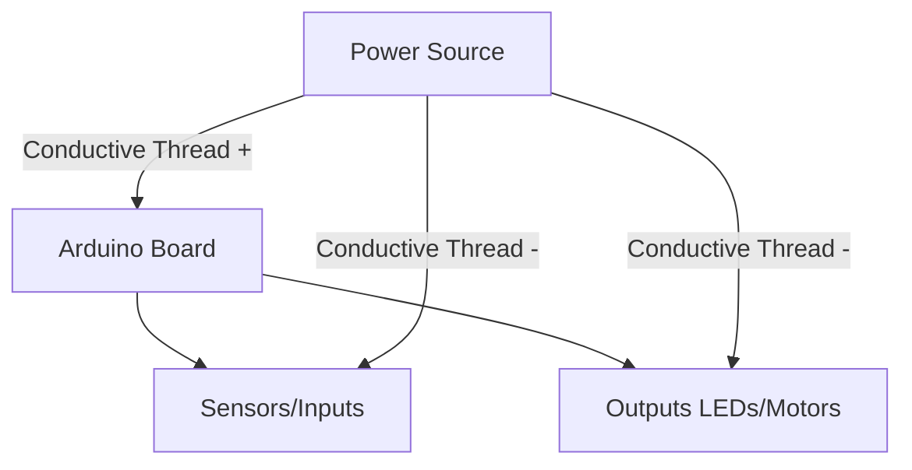
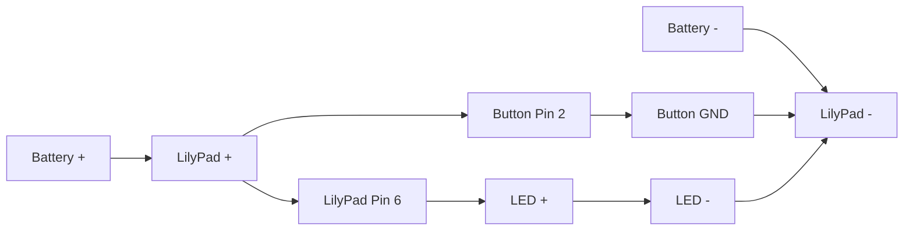

# Arduino Wearable Devices

## Introduction

Wearable technology represents one of the most exciting frontiers in the maker movement. By combining Arduino microcontrollers with fabric, sensors, and a bit of creativity, you can create interactive garments and accessories that respond to the environment or the wearer's movements. This tutorial will guide you through the basics of Arduino wearable devices, from selecting the right components to building your first projects.

## What Are Arduino Wearable Devices?

Arduino wearable devices are electronic projects that:
- Can be worn on the body
- Use Arduino or Arduino-compatible microcontrollers
- Usually incorporate sensors, outputs, and power supplies in a compact form
- Often involve conductive thread, fabric, or flexible circuits

## Getting Started with Wearable Electronics

### Required Materials

To begin creating wearable Arduino projects, you'll need:

1. **Arduino-compatible boards** designed for wearables:
   - LilyPad Arduino (specifically designed for e-textiles)
   - Adafruit Flora or Gemma
   - Arduino Nano or Micro (for smaller projects)

2. **Conductive materials**:
   - Conductive thread
   - Conductive fabric
   - Flexible wire

3. **Power sources**:
   - LiPo batteries
   - Coin cell battery holders

4. **Sensors**:
   - Accelerometers/gyroscopes (movement detection)
   - Temperature sensors
   - Light sensors
   - Pulse sensors
   - Flex sensors

5. **Outputs**:
   - LEDs (regular or sewable)
   - Vibration motors
   - Small speakers/buzzers

6. **Tools**:
   - Needle and scissors
   - Soldering iron (optional)
   - Multimeter
   - Fabric glue or tape

## Understanding Sewable Electronics

Before we dive into projects, let's understand how sewable electronics work:



The key difference between standard Arduino projects and wearable ones is the use of conductive thread or fabric instead of traditional wires. Conductive thread has resistance properties different from copper wire, so we need to account for voltage drop over longer distances.

## Your First Wearable Project: LED Bracelet

Let's start with a simple project - an LED bracelet that lights up when you press a button.

### Materials Needed:
- LilyPad Arduino or similar small Arduino
- 3-5 sewable LEDs
- Sewable button
- Conductive thread
- Felt or fabric for the bracelet
- 3.7V LiPo battery with JST connector
- LilyPad battery holder (optional)

### Circuit Diagram:



### Code:

```cpp
const int buttonPin = 2;  // the pin that the pushbutton is attached to
const int ledPin = 6;     // the pin that the LED is attached to

int buttonState = 0;      // current state of the button
int lastButtonState = 0;  // previous state of the button
boolean ledOn = false;    // LED state

void setup() {
  // initialize the button pin as a input:
  pinMode(buttonPin, INPUT_PULLUP);
  // initialize the LED as an output:
  pinMode(ledPin, OUTPUT);
}

void loop() {
  // read the pushbutton input pin:
  buttonState = digitalRead(buttonPin);

  // compare the buttonState to its previous state
  if (buttonState != lastButtonState) {
    // if the state has changed, and the current state is LOW (pressed)
    if (buttonState == LOW) {
      // toggle the LED state
      ledOn = !ledOn;
    }
    // delay a little bit to avoid debouncing
    delay(50);
  }
  
  // set the LED based on the ledOn variable
  if (ledOn) {
    digitalWrite(ledPin, HIGH);
  } else {
    digitalWrite(ledPin, LOW);
  }

  // save the current state as the last state for next time
  lastButtonState = buttonState;
}
```

### Step-by-Step Assembly:

1. **Prepare your materials**: Cut a piece of felt or fabric to the size of your wrist plus some overlap for fastening.

2. **Plan your layout**: Position the LilyPad, LEDs, and button on the fabric. Mark their positions.

3. **Sew the components**:
   - Start with the LilyPad Arduino in the center
   - Sew the button at one end of the bracelet
   - Sew the LEDs evenly spaced along the bracelet

4. **Create the connections**:
   - Use conductive thread to connect the positive pins of the LEDs to pin 6 on the LilyPad
   - Connect the negative pins of the LEDs to the GND pin on the LilyPad
   - Connect the button to pin 2 and GND

5. **Attach the battery**:
   - Connect the battery to the LilyPad
   - Secure it with fabric or a small pouch

6. **Program the LilyPad**:
   - Upload the code using an FTDI adapter or Arduino board

7. **Test and wear**:
   - Press the button to test the circuit
   - Add fasteners (velcro, snaps, etc.) to make it wearable

## Advanced Project: Motion-Activated Light-Up Shirt

Now let's create something more complex - a shirt that lights up LEDs based on your movement.

### Materials:
- LilyPad Arduino or Adafruit Flora
- ADXL335 accelerometer (sewable version if possible)
- 10-20 sewable LEDs
- Conductive thread
- T-shirt or other garment
- 3.7V LiPo battery with JST connector
- Small piece of fabric to create a pocket for the battery

### Code:

```cpp
#include <Wire.h>

// Pin definitions
const int xPin = A0;      // X-axis of accelerometer
const int yPin = A1;      // Y-axis of accelerometer
const int zPin = A2;      // Z-axis of accelerometer
const int ledPins[] = {5, 6, 9, 10, 11};  // LED pins (PWM pins for brightness control)
const int numLeds = 5;    // Number of LED pins we're using

// Variables for accelerometer readings
int xVal, yVal, zVal;
int movement = 0;

void setup() {
  // Initialize LED pins as outputs
  for (int i = 0; i < numLeds; i++) {
    pinMode(ledPins[i], OUTPUT);
  }
  
  // Optional: start serial for debugging
  Serial.begin(9600);
}

void loop() {
  // Read accelerometer values
  xVal = analogRead(xPin);
  yVal = analogRead(yPin);
  zVal = analogRead(zPin);
  
  // Calculate movement value based on change in acceleration
  static int prevX = 0, prevY = 0, prevZ = 0;
  int deltaX = abs(xVal - prevX);
  int deltaY = abs(yVal - prevY);
  int deltaZ = abs(zVal - prevZ);
  
  // Update previous values
  prevX = xVal;
  prevY = yVal;
  prevZ = zVal;
  
  // Calculate total movement (simple sum of changes)
  movement = (deltaX + deltaY + deltaZ) / 3;
  
  // Map movement to LED brightness levels
  int brightness = map(movement, 0, 100, 0, 255);
  brightness = constrain(brightness, 0, 255);
  
  // Debug output
  Serial.print("Movement: ");
  Serial.print(movement);
  Serial.print(" Brightness: ");
  Serial.println(brightness);
  
  // Light up LEDs based on movement
  for (int i = 0; i < numLeds; i++) {
    analogWrite(ledPins[i], brightness);
  }
  
  delay(50);  // Small delay for stability
}
```

### Assembly Instructions:

1. **Prepare the shirt**:
   - Turn the shirt inside out
   - Mark where you want the LEDs to be placed
   - Create a small pocket near the collar or waistband for the Arduino and battery

2. **Plan the conductive paths**:
   - Sketch the circuit layout directly on the fabric
   - Ensure positive and negative paths do not cross (they'll short circuit)

3. **Sew the main components**:
   - Attach the LilyPad/Flora to the inside of the shirt
   - Attach the accelerometer near the center of the chest or on a sleeve

4. **Sew the LEDs**:
   - Sew each LED in place according to your design (star pattern, spiral, etc.)
   - Connect all LED positive pins to their respective Arduino pins
   - Connect all LED negative pins to the Arduino GND

5. **Create power connections**:
   - Sew power connections to the battery holder
   - Ensure it can be disconnected for washing

6. **Program and test**:
   - Upload the code to the Arduino board
   - Test the movement response before finalizing all connections

7. **Finishing touches**:
   - Insulate any crossing paths with fabric glue or small fabric patches
   - Secure the battery in its pocket
   - Turn the shirt right-side out and test the final product

## Tips for Successful Wearable Projects

1. **Plan your circuit carefully** before sewing. Use chalk or fabric pencil to mark your paths.

2. **Keep connections short** to minimize resistance in the conductive thread.

3. **Isolate crossing threads** to prevent short circuits. Conductive thread should never cross unless insulated.

4. **Consider washability** - design your project so electronic components can be removed before washing.

5. **Secure knots with clear nail polish** to prevent them from coming undone.

6. **Test as you go** - check each connection before moving to the next.

7. **Choose the right power source** based on your project's needs and duration of use.

## Troubleshooting Common Issues

| Problem | Possible Cause | Solution |
|---------|----------------|----------|
| LEDs not lighting up | Broken thread connection | Check continuity with multimeter and reinforce connections |
| Inconsistent behavior | High resistance in thread | Shorten thread paths or double-thread for lower resistance |
| Short battery life | Current draw too high | Use fewer LEDs or optimize code for power saving |
| Arduino not responding | Poor power connection | Secure battery connections and check voltage |
| Sensor giving erratic readings | Interference or loose connections | Shield sensors and reinforce connections |

## Project Ideas to Explore

1. **Pulse-sensing wristband** - Use a pulse sensor to visualize your heartbeat with LEDs.

2. **Temperature-reactive scarf** - Change LED colors based on temperature readings.

3. **Sound-reactive costume** - Use a microphone sensor to make LEDs pulse with music.

4. **Bike turn-signal jacket** - Create LED arrows on a jacket that activate with buttons on the handlebars.

5. **Step-counting shoes** - Add an accelerometer to shoes to count steps and display activity level.

## Summary

Wearable Arduino projects combine fashion, technology, and creativity to create functional and expressive items. By understanding the basics of conductive materials, appropriate power sources, and integrating sensors and outputs, you can create a wide variety of wearable devices. 

Start with simple projects like LED bracelets to learn the fundamentals, then progress to more complex designs incorporating motion, light, or sound sensing. The possibilities are limited only by your imagination!

## Additional Resources

- **Books**:
  - "Wearable Electronics" by Kate Hartman
  - "Make: Wearable Electronics" by Syuzi Pakhchyan
  - "Fashion Geek" by Diana Eng

- **Online Tutorials**:
  - Adafruit's Wearable Electronics tutorials
  - SparkFun's E-Textile resources
  - Instructables' Wearable Technology section

## Exercises

1. **Modify the LED bracelet**: Change the code to create different light patterns when the button is pressed.

2. **Add more sensors**: Integrate a light sensor to make your LEDs automatically turn on in the dark.

3. **Design challenge**: Create a wearable device that solves a specific problem you encounter in daily life.

4. **Collaborative project**: Design a set of wearables that can communicate with each other using radio modules.

5. **Documentation**: Create a detailed guide for one of your wearable projects, including circuit diagrams, code, and assembly instructions.