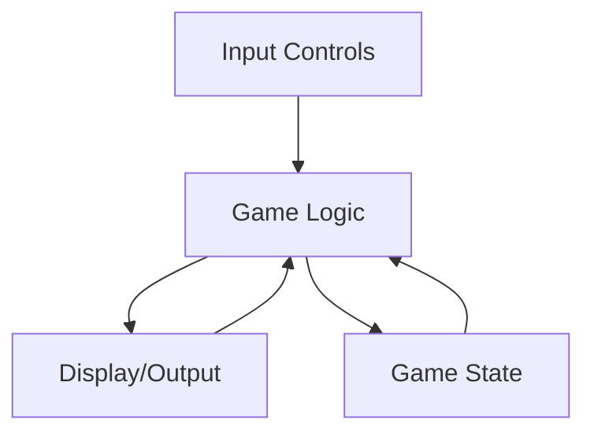

# Arduino Game Development

## Introduction

Arduino boards offer a fascinating platform for creating interactive games that blend programming and electronics. This guide will walk you through the process of developing games on Arduino, from simple LED-based games to more complex projects with displays and controls.

Game development on Arduino is not only fun but also educational - it reinforces programming concepts, introduces hardware interfacing, and encourages creative problem-solving. Whether you're looking to build a simple reaction timer or a fully-featured handheld console, Arduino provides an accessible entry point into the world of physical computing games.

## Getting Started with Arduino Game Development

### Required Components

To begin developing games on Arduino, you'll typically need:

- Arduino board (Uno, Nano, or similar)
- Breadboard and jumper wires
- LEDs and resistors
- Pushbuttons
- Buzzer or speaker
- Optional: LCD display, joystick, or other input devices

### Basic Game Components

Most Arduino games consist of these core elements:



- **Input Controls**: Buttons, joysticks, or sensors that allow player interaction
- **Display/Output**: LEDs, LCD screens, or speakers that provide feedback
- **Game Logic**: Code that handles game rules and mechanics
- **Game State**: Variables that track scores, lives, and other game conditions

## Your First Arduino Game: LED Reaction Timer

Let's start with a simple game that tests reaction time using an LED and a button.

### Circuit Setup

1. Connect an LED to pin 13 (with appropriate resistor)
2. Connect a pushbutton to pin 2 with a 10K pull-down resistor
3. Optional: Connect a buzzer to pin 8

### The Code

```cpp
const int LED_PIN = 13;
const int BUTTON_PIN = 2;
const int BUZZER_PIN = 8;

unsigned long startTime;
unsigned long reactionTime;
boolean gameStarted = false;
boolean gameEnded = false;

void setup() {
  pinMode(LED_PIN, OUTPUT);
  pinMode(BUTTON_PIN, INPUT);
  pinMode(BUZZER_PIN, OUTPUT);
  Serial.begin(9600);
  
  Serial.println("Reaction Timer Game");
  Serial.println("Press the button when the LED lights up!");
  
  // Random seed based on analog noise
  randomSeed(analogRead(0));
}

void loop() {
  // Start a new game if previous one ended
  if (gameEnded) {
    delay(3000);
    gameStarted = false;
    gameEnded = false;
    Serial.println("New game starting...");
  }
  
  // Start game
  if (!gameStarted) {
    digitalWrite(LED_PIN, LOW);
    
    // Random delay between 2-10 seconds before LED lights up
    delay(random(2000, 10000));
    
    digitalWrite(LED_PIN, HIGH);
    tone(BUZZER_PIN, 1000, 100); // Optional sound
    
    startTime = millis();
    gameStarted = true;
  }
  
  // Check for button press
  if (gameStarted && !gameEnded && digitalRead(BUTTON_PIN) == HIGH) {
    digitalWrite(LED_PIN, LOW);
    reactionTime = millis() - startTime;
    
    Serial.print("Your reaction time: ");
    Serial.print(reactionTime);
    Serial.println(" milliseconds");
    
    // Give feedback based on reaction time
    if (reactionTime < 200) {
      Serial.println("Incredible reflexes!");
      tone(BUZZER_PIN, 2000, 500);
    } else if (reactionTime < 400) {
      Serial.println("Great job!");
      tone(BUZZER_PIN, 1500, 500);
    } else {
      Serial.println("Keep practicing!");
      tone(BUZZER_PIN, 1000, 500);
    }
    
    gameEnded = true;
  }
}
```

### How It Works

1. The game waits a random amount of time, then lights up an LED
2. The player must press the button as quickly as possible
3. The Arduino measures the time between the LED lighting up and the button press
4. The reaction time is displayed on the Serial Monitor with feedback

## Creating a Simple Snake Game with Arduino

Now let's build a more complex game - a version of the classic Snake game using an 8×8 LED matrix and a joystick.

### Components Needed

- Arduino Uno or similar
- MAX7219 LED Matrix (8×8)
- Analog joystick
- Jumper wires
- Breadboard

### Circuit Connection

1. Connect the MAX7219 LED matrix:
   - VCC to 5V
   - GND to GND
   - DIN to pin 11
   - CS to pin 10
   - CLK to pin 13

2. Connect the joystick:
   - VCC to 5V
   - GND to GND
   - X-axis to A0
   - Y-axis to A1

### The Code

First, install the LedControl library through the Arduino Library Manager.

```cpp
#include <LedControl.h>

// LED Matrix pins
const int DIN_PIN = 11;
const int CS_PIN = 10;
const int CLK_PIN = 13;

// Joystick pins
const int X_PIN = A0;
const int Y_PIN = A1;

// Game constants
const unsigned long GAME_SPEED = 400; // milliseconds per move
const int MATRIX_SIZE = 8;

// Initialize the LED matrix
LedControl lc = LedControl(DIN_PIN, CLK_PIN, CS_PIN, 1);

// Snake variables
int snakeX[64];
int snakeY[64];
int snakeLength = 1;
int direction = 0; // 0=right, 1=down, 2=left, 3=up

// Food variables
int foodX;
int foodY;

// Game state
bool gameOver = false;
unsigned long lastMoveTime = 0;

void setup() {
  // Initialize the display
  lc.shutdown(0, false);
  lc.setIntensity(0, 8); // Set brightness (0-15)
  lc.clearDisplay(0);
  
  // Initialize snake position at center
  snakeX[0] = MATRIX_SIZE / 2;
  snakeY[0] = MATRIX_SIZE / 2;
  
  // First food
  placeFood();
  
  // Draw initial state
  updateDisplay();
}

void loop() {
  if (!gameOver) {
    // Read joystick
    readControls();
    
    // Move the snake at regular intervals
    unsigned long currentTime = millis();
    if (currentTime - lastMoveTime >= GAME_SPEED) {
      moveSnake();
      checkCollisions();
      checkFood();
      updateDisplay();
      lastMoveTime = currentTime;
    }
  } else {
    // Game over animation
    gameOverAnimation();
    
    // Reset game after animation
    resetGame();
  }
}

void readControls() {
  int xValue = analogRead(X_PIN);
  int yValue = analogRead(Y_PIN);
  
  // Avoid 180-degree turns
  if (xValue < 300 && direction != 0) direction = 2; // left
  if (xValue > 700 && direction != 2) direction = 0; // right
  if (yValue < 300 && direction != 1) direction = 3; // up
  if (yValue > 700 && direction != 3) direction = 1; // down
}

void moveSnake() {
  // Move body - start from tail
  for (int i = snakeLength - 1; i > 0; i--) {
    snakeX[i] = snakeX[i-1];
    snakeY[i] = snakeY[i-1];
  }
  
  // Move head
  switch (direction) {
    case 0: // Right
      snakeX[0]++;
      break;
    case 1: // Down
      snakeY[0]++;
      break;
    case 2: // Left
      snakeX[0]--;
      break;
    case 3: // Up
      snakeY[0]--;
      break;
  }
}

void checkCollisions() {
  // Wall collision
  if (snakeX[0] < 0 || snakeX[0] >= MATRIX_SIZE || 
      snakeY[0] < 0 || snakeY[0] >= MATRIX_SIZE) {
    gameOver = true;
    return;
  }
  
  // Self collision
  for (int i = 1; i < snakeLength; i++) {
    if (snakeX[0] == snakeX[i] && snakeY[0] == snakeY[i]) {
      gameOver = true;
      return;
    }
  }
}

void checkFood() {
  // Check if snake found food
  if (snakeX[0] == foodX && snakeY[0] == foodY) {
    // Increase snake length
    snakeLength++;
    
    // Place new food
    placeFood();
  }
}

void placeFood() {
  boolean validPosition;
  
  do {
    validPosition = true;
    foodX = random(MATRIX_SIZE);
    foodY = random(MATRIX_SIZE);
    
    // Check that food is not on snake
    for (int i = 0; i < snakeLength; i++) {
      if (snakeX[i] == foodX && snakeY[i] == foodY) {
        validPosition = false;
        break;
      }
    }
  } while (!validPosition);
}

void updateDisplay() {
  lc.clearDisplay(0);
  
  // Draw snake
  for (int i = 0; i < snakeLength; i++) {
    lc.setLed(0, snakeY[i], snakeX[i], true);
  }
  
  // Draw food - blink the LED
  if (millis() % 200 < 100) {
    lc.setLed(0, foodY, foodX, true);
  }
}

void gameOverAnimation() {
  // Flash the display a few times
  for (int i = 0; i < 5; i++) {
    fillDisplay();
    delay(300);
    lc.clearDisplay(0);
    delay(300);
  }
}

void fillDisplay() {
  for (int row = 0; row < MATRIX_SIZE; row++) {
    for (int col = 0; col < MATRIX_SIZE; col++) {
      lc.setLed(0, row, col, true);
    }
  }
}

void resetGame() {
  // Reset snake
  snakeLength = 1;
  snakeX[0] = MATRIX_SIZE / 2;
  snakeY[0] = MATRIX_SIZE / 2;
  direction = 0;
  
  // New food
  placeFood();
  
  // Reset game state
  gameOver = false;
  
  // Clear and update display
  lc.clearDisplay(0);
  updateDisplay();
}
```

### Game Mechanics Explained

1. **Snake Movement**: The snake moves in the direction controlled by the joystick
2. **Food Collection**: When the snake's head touches the food, the snake grows by one segment
3. **Collision Detection**: The game ends if the snake hits the wall or itself
4. **Display Updates**: The LED matrix refreshes after each move to show the current state
5. **Game Over**: When the game ends, it displays an animation and resets

## Building a Space Invaders Game

For our final example, let's create a version of Space Invaders using an Arduino and an OLED display.

### Components Needed

- Arduino Uno or Nano
- OLED Display (SSD1306, 128×64 pixels)
- Two pushbuttons
- Buzzer
- Jumper wires and breadboard

### Circuit Connection

1. Connect the OLED display (I2C):
   - VCC to 5V
   - GND to GND
   - SDA to A4
   - SCL to A5

2. Connect the control buttons:
   - Left button to pin 2
   - Right button to pin 3
   - Each with a 10K pull-down resistor

3. Connect a buzzer to pin 8

### The Code

First, install the Adafruit SSD1306 and Adafruit GFX libraries through the Arduino Library Manager.

```cpp
#include <Wire.h>
#include <Adafruit_GFX.h>
#include <Adafruit_SSD1306.h>

#define SCREEN_WIDTH 128
#define SCREEN_HEIGHT 64
#define OLED_RESET -1
Adafruit_SSD1306 display(SCREEN_WIDTH, SCREEN_HEIGHT, &Wire, OLED_RESET);

// Buttons
const int LEFT_BUTTON = 2;
const int RIGHT_BUTTON = 3;
const int BUZZER_PIN = 8;

// Game constants
const int PLAYER_WIDTH = 8;
const int PLAYER_HEIGHT = 4;
const int INVADER_WIDTH = 8;
const int INVADER_HEIGHT = 6;
const int INVADER_SPACING_H = 6;
const int INVADER_SPACING_V = 8;
const int BULLET_HEIGHT = 4;
const int NUM_INVADERS_ROW = 6;
const int NUM_INVADERS_COL = 3;
const int INVADER_DROP = 4;
const int GAME_SPEED = 50;  // milliseconds per frame

// Game objects
int playerX;
int invaders[NUM_INVADERS_ROW * NUM_INVADERS_COL][2];  // [x,y] coordinates
bool invaderAlive[NUM_INVADERS_ROW * NUM_INVADERS_COL];
int bulletX = -1;
int bulletY = -1;
bool bulletActive = false;
int invaderDirection = 1;  // 1=right, -1=left
int score = 0;
int lives = 3;
bool gameActive = true;
unsigned long lastMoveTime = 0;
unsigned long invaderMoveTime = 0;
const unsigned long INVADER_MOVE_DELAY = 800;  // Move every 800ms initially

void setup() {
  pinMode(LEFT_BUTTON, INPUT);
  pinMode(RIGHT_BUTTON, INPUT);
  pinMode(BUZZER_PIN, OUTPUT);
  
  // Initialize display
  if(!display.begin(SSD1306_SWITCHCAPVCC, 0x3C)) {
    for(;;); // Don't proceed if OLED fails to initialize
  }
  
  display.clearDisplay();
  display.setTextSize(1);
  display.setTextColor(SSD1306_WHITE);
  
  // Show title screen
  display.clearDisplay();
  display.setCursor(20, 20);
  display.println(F("SPACE INVADERS"));
  display.setCursor(25, 40);
  display.println(F("Press to start"));
  display.display();
  
  // Wait for button press
  while(digitalRead(LEFT_BUTTON) == LOW && digitalRead(RIGHT_BUTTON) == LOW) {
    delay(50);
  }
  tone(BUZZER_PIN, 1000, 100);
  
  // Initialize game
  initGame();
}

void loop() {
  unsigned long currentTime = millis();
  
  if (gameActive) {
    // Process game at regular intervals
    if (currentTime - lastMoveTime >= GAME_SPEED) {
      handleInput();
      updateGame();
      renderGame();
      lastMoveTime = currentTime;
    }
  } else {
    // Game over screen
    display.clearDisplay();
    display.setCursor(30, 20);
    display.println(F("GAME OVER"));
    display.setCursor(30, 30);
    display.print(F("Score: "));
    display.println(score);
    display.setCursor(20, 45);
    display.println(F("Press to restart"));
    display.display();
    
    // Wait for button press to restart
    if (digitalRead(LEFT_BUTTON) == HIGH || digitalRead(RIGHT_BUTTON) == HIGH) {
      tone(BUZZER_PIN, 1000, 100);
      delay(500);
      initGame();
    }
  }
}

void initGame() {
  // Initialize player
  playerX = SCREEN_WIDTH / 2 - PLAYER_WIDTH / 2;
  
  // Initialize invaders
  for (int row = 0; row < NUM_INVADERS_ROW; row++) {
    for (int col = 0; col < NUM_INVADERS_COL; col++) {
      int index = col * NUM_INVADERS_ROW + row;
      invaders[index][0] = 10 + row * (INVADER_WIDTH + INVADER_SPACING_H);
      invaders[index][1] = 10 + col * (INVADER_HEIGHT + INVADER_SPACING_V);
      invaderAlive[index] = true;
    }
  }
  
  bulletActive = false;
  score = 0;
  lives = 3;
  gameActive = true;
  invaderDirection = 1;
}

void handleInput() {
  // Move player left
  if (digitalRead(LEFT_BUTTON) == HIGH && playerX > 0) {
    playerX -= 2;
  }
  
  // Move player right
  if (digitalRead(RIGHT_BUTTON) == HIGH && playerX < SCREEN_WIDTH - PLAYER_WIDTH) {
    playerX += 2;
  }
  
  // Fire bullet
  if (!bulletActive && (digitalRead(LEFT_BUTTON) == HIGH && digitalRead(RIGHT_BUTTON) == HIGH)) {
    bulletX = playerX + PLAYER_WIDTH / 2;
    bulletY = SCREEN_HEIGHT - PLAYER_HEIGHT - 5;
    bulletActive = true;
    tone(BUZZER_PIN, 2000, 50);
  }
}

void updateGame() {
  unsigned long currentTime = millis();
  
  // Move bullet
  if (bulletActive) {
    bulletY -= 4;
    
    // Check if bullet is off screen
    if (bulletY < 0) {
      bulletActive = false;
    }
    
    // Check for collision with invaders
    for (int i = 0; i < NUM_INVADERS_ROW * NUM_INVADERS_COL; i++) {
      if (invaderAlive[i]) {
        if (bulletX >= invaders[i][0] && bulletX <= invaders[i][0] + INVADER_WIDTH &&
            bulletY >= invaders[i][1] && bulletY <= invaders[i][1] + INVADER_HEIGHT) {
          // Collision detected
          invaderAlive[i] = false;
          bulletActive = false;
          score += 10;
          tone(BUZZER_PIN, 1500, 100);
          
          // Check if all invaders are destroyed
          bool allDestroyed = true;
          for (int j = 0; j < NUM_INVADERS_ROW * NUM_INVADERS_COL; j++) {
            if (invaderAlive[j]) {
              allDestroyed = false;
              break;
            }
          }
          
          if (allDestroyed) {
            // Level completed - reset invaders
            for (int j = 0; j < NUM_INVADERS_ROW * NUM_INVADERS_COL; j++) {
              invaderAlive[j] = true;
            }
            // Speed up invaders for next level
            INVADER_MOVE_DELAY = max(100, INVADER_MOVE_DELAY - 100);
          }
          
          break;
        }
      }
    }
  }
  
  // Move invaders
  if (currentTime - invaderMoveTime >= INVADER_MOVE_DELAY) {
    bool needsToDropAndReverse = false;
    
    // Check if any active invader would hit the edge
    for (int i = 0; i < NUM_INVADERS_ROW * NUM_INVADERS_COL; i++) {
      if (invaderAlive[i]) {
        if ((invaderDirection > 0 && invaders[i][0] + INVADER_WIDTH + invaderDirection >= SCREEN_WIDTH) ||
            (invaderDirection < 0 && invaders[i][0] + invaderDirection <= 0)) {
          needsToDropAndReverse = true;
          break;
        }
      }
    }
    
    // Move all invaders
    for (int i = 0; i < NUM_INVADERS_ROW * NUM_INVADERS_COL; i++) {
      if (needsToDropAndReverse) {
        invaders[i][1] += INVADER_DROP;
      } else {
        invaders[i][0] += invaderDirection;
      }
      
      // Check if invader reached the player level
      if (invaderAlive[i] && invaders[i][1] + INVADER_HEIGHT >= SCREEN_HEIGHT - PLAYER_HEIGHT) {
        lives--;
        if (lives <= 0) {
          gameActive = false;
        } else {
          // Reset invader positions but keep score
          for (int j = 0; j < NUM_INVADERS_ROW * NUM_INVADERS_COL; j++) {
            invaders[j][1] -= 3 * (INVADER_HEIGHT + INVADER_SPACING_V);
          }
        }
        break;
      }
    }
    
    if (needsToDropAndReverse) {
      invaderDirection *= -1;
    }
    
    invaderMoveTime = currentTime;
  }
}

void renderGame() {
  display.clearDisplay();
  
  // Draw player
  display.fillRect(playerX, SCREEN_HEIGHT - PLAYER_HEIGHT, PLAYER_WIDTH, PLAYER_HEIGHT, SSD1306_WHITE);
  
  // Draw invaders
  for (int i = 0; i < NUM_INVADERS_ROW * NUM_INVADERS_COL; i++) {
    if (invaderAlive[i]) {
      display.drawRect(invaders[i][0], invaders[i][1], INVADER_WIDTH, INVADER_HEIGHT, SSD1306_WHITE);
    }
  }
  
  // Draw bullet
  if (bulletActive) {
    display.drawFastVLine(bulletX, bulletY, BULLET_HEIGHT, SSD1306_WHITE);
  }
  
  // Draw score
  display.setCursor(0, 0);
  display.print(F("Score:"));
  display.print(score);
  
  // Draw lives
  display.setCursor(80, 0);
  display.print(F("Lives:"));
  display.print(lives);
  
  display.display();
}
```

### Game Features

1. **Player Movement**: Control a spaceship at the bottom of the screen using two buttons
2. **Invaders**: Multiple rows of invaders move back and forth, descending when they reach the edge
3. **Shooting Mechanism**: Press both buttons simultaneously to fire bullets at the invaders
4. **Scoring System**: Earn points for each invader destroyed
5. **Lives**: The player has three lives before the game ends
6. **Level Progression**: When all invaders are defeated, a new wave appears that moves faster

## Advanced Game Development Concepts

As you become more comfortable with Arduino game development, consider exploring these advanced concepts:

### Sound Effects

For more engaging gameplay, add sound effects using a piezo buzzer:

```cpp
// Define musical notes
#define NOTE_C4 262
#define NOTE_G3 196
#define NOTE_A3 220
#define NOTE_B3 247

// Play a victory tune
void playVictorySound() {
  tone(BUZZER_PIN, NOTE_G3, 100);
  delay(100);
  tone(BUZZER_PIN, NOTE_C4, 100);
  delay(100);
  tone(BUZZER_PIN, NOTE_G3, 100);
  delay(100);
  tone(BUZZER_PIN, NOTE_C4, 300);
}
```

### Multiplayer Support

Add multiplayer functionality by connecting a second set of controls:

```cpp
// Player 2 controls
const int P2_LEFT_BUTTON = 4;
const int P2_RIGHT_BUTTON = 5;

void setupMultiplayer() {
  pinMode(P2_LEFT_BUTTON, INPUT);
  pinMode(P2_RIGHT_BUTTON, INPUT);
  
  // Initialize player 2 position
  player2X = SCREEN_WIDTH / 2 - PLAYER_WIDTH / 2;
}

void handleMultiplayerInput() {
  // Player 1 controls
  // [existing player 1 code]
  
  // Player 2 controls
  if (digitalRead(P2_LEFT_BUTTON) == HIGH && player2X > 0) {
    player2X -= 2;
  }
  
  if (digitalRead(P2_RIGHT_BUTTON) == HIGH && player2X < SCREEN_WIDTH - PLAYER_WIDTH) {
    player2X += 2;
  }
}
```

### Saving High Scores

Use EEPROM to store and retrieve high scores:

```cpp
#include <EEPROM.h>

// Memory address for high score
const int EEPROM_HIGH_SCORE = 0;

void saveHighScore(int score) {
  // Read current high score
  int highScore = EEPROM.read(EEPROM_HIGH_SCORE);
  
  // Update if current score is higher
  if (score > highScore) {
    EEPROM.write(EEPROM_HIGH_SCORE, score);
  }
}

int getHighScore() {
  return EEPROM.read(EEPROM_HIGH_SCORE);
}
```

## Troubleshooting Common Issues

When developing games on Arduino, you might encounter these common issues:

### Memory Limitations

Arduino Uno has only 2KB of RAM. If your game crashes unexpectedly, you might be running out of memory.

**Solutions:**
- Reduce global variables, especially arrays
- Use `const` variables when possible (stored in program memory)
- Use `PROGMEM` for large data like sprites or level designs

### Input Debouncing

Physical buttons can "bounce," causing multiple readings from a single press.

**Solution:**
```cpp
unsigned long lastDebounceTime = 0;
unsigned long debounceDelay = 50;
int lastButtonState = LOW;
int buttonState;

void readButtonWithDebounce() {
  int reading = digitalRead(BUTTON_PIN);
  
  if (reading != lastButtonState) {
    lastDebounceTime = millis();
  }
  
  if ((millis() - lastDebounceTime) > debounceDelay) {
    if (reading != buttonState) {
      buttonState = reading;
      
      if (buttonState == HIGH) {
        // Button is pressed (debounced)
        // Take action here
      }
    }
  }
  
  lastButtonState = reading;
}
```

### Display Refresh Rate

Slow display updates can make games less responsive.

**Solutions:**
- Update only changed portions of the display
- Optimize drawing routines
- Use hardware-specific libraries that offer faster performance

## Summary

In this guide, we've explored the exciting world of Arduino game development, starting with simple LED-based games and progressing to more complex projects with displays and controls. We've covered:

- Basic concepts of game development on Arduino
- Creating a simple reaction time game
- Building a classic Snake game with an LED matrix
- Developing a Space Invaders game with an OLED display
- Advanced concepts like sound effects, multiplayer, and score saving
- Troubleshooting common issues

Arduino game development combines programming skills with electronics knowledge, making it an excellent way to learn both disciplines while creating something fun and interactive.

## Additional Resources and Exercises

### Resources

- Arduino Game Development Library: Search for "Gamebuino" or "Arduboy" for dedicated Arduino gaming platforms
- Arduino Playground: Online resource for Arduino projects and examples
- Arduino Forums: Community support for troubleshooting and ideas

### Exercises

1. **Modify the Reaction Timer:**
   Add multiple LEDs and buttons to create a Simon Says-style memory game

2. **Enhance the Snake Game:**
   Add obstacles, different types of food, or a two-player mode

3. **Expand Space Invaders:**
   Add different types of enemies, power-ups, or boss battles

4. **Create Your Own Game:**
   Design and implement a unique game concept using the skills you've learned

5. **Port a Classic:**
   Try recreating classics like Pong, Tetris, or Breakout on your Arduino

Remember, game development is an iterative process. Start simple, test frequently, and gradually add features to build engaging interactive experiences with your Arduino.