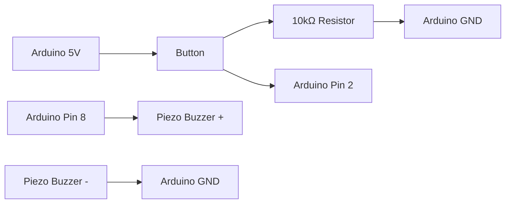
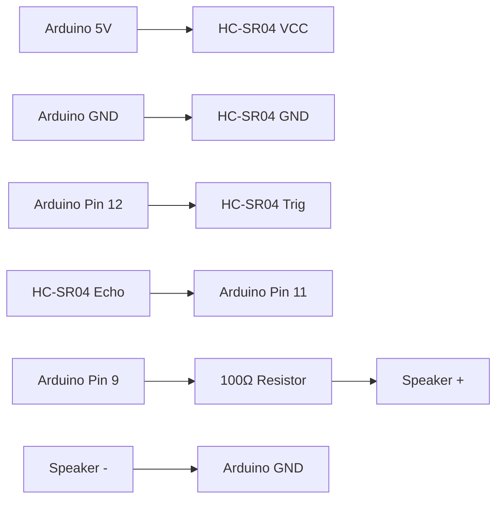

# Arduino Music Instruments

## Introduction

Creating musical instruments with Arduino opens up a fascinating world where electronics and music intersect. Whether you're a musician looking to experiment with technology or a programmer interested in audio applications, Arduino provides an accessible platform for building everything from simple noise-makers to sophisticated electronic instruments.

In this tutorial, we'll explore how to use Arduino to create various musical instruments, from basic piezo buzzers playing single notes to more complex setups that can control MIDI software. We'll cover the fundamental concepts of digital sound generation, the components you'll need, and provide step-by-step instructions for building several musical projects.

## Prerequisites

Before starting, you should have:

- Basic understanding of Arduino programming
- Arduino Uno or similar board
- Breadboard and jumper wires
- Piezo buzzer or speaker
- Various resistors and potentiometers (specifics noted in each project)

## Understanding Sound Generation on Arduino

Sound is created by vibrations that travel as waves through air. With Arduino, we can generate these vibrations electronically by rapidly toggling digital outputs.

### The `tone()` Function

Arduino provides a built-in `tone()` function that generates square waves of specified frequencies on digital pins. This function is the foundation for our simple musical instruments.

```cpp
tone(pin, frequency, duration);
```

- `pin`: The Arduino pin connected to the buzzer
- `frequency`: The tone frequency in Hertz (Hz)
- `duration`: How long the tone plays in milliseconds (optional)

To stop playing a tone before its duration completes, use:

```cpp
noTone(pin);
```

## Project 1: Simple One-Note Buzzer

Let's start with the most basic musical device: a simple buzzer that plays a single note when a button is pressed.

### Components Needed:
- Arduino Uno
- Piezo buzzer
- Pushbutton
- 10kΩ resistor
- Breadboard and jumper wires

### Circuit Diagram



### Code

```cpp
const int buttonPin = 2;  // Pin connected to pushbutton
const int buzzerPin = 8;  // Pin connected to piezo buzzer

// Define the note frequency (C4 = middle C = 262 Hz)
const int noteC4 = 262;

// Variables to track button state
int buttonState = 0;
int lastButtonState = 0;

void setup() {
  pinMode(buttonPin, INPUT);
  pinMode(buzzerPin, OUTPUT);
}

void loop() {
  // Read the state of the button
  buttonState = digitalRead(buttonPin);

  // Check if button is pressed
  if (buttonState == HIGH) {
    // Play the note
    tone(buzzerPin, noteC4);
  } else {
    // Stop the note
    noTone(buzzerPin);
  }
  
  // Save the current button state for next comparison
  lastButtonState = buttonState;
}
```

### How It Works

1. We define two pins: one for the button and one for the buzzer
2. The `tone()` function generates a square wave at 262 Hz (middle C)
3. When the button is pressed, the buzzer plays the note
4. When the button is released, the note stops

## Project 2: Musical Scale

Now let's expand our project to play a complete musical scale using multiple buttons.

### Components Needed:
- Arduino Uno
- Piezo buzzer
- 8 pushbuttons
- 8 10kΩ resistors
- Breadboard and jumper wires

### Musical Notes and Their Frequencies

Here's a table of musical notes in the fourth octave and their frequencies:

| Note | Frequency (Hz) |
|------|----------------|
| C4   | 262            |
| D4   | 294            |
| E4   | 330            |
| F4   | 349            |
| G4   | 392            |
| A4   | 440            |
| B4   | 494            |
| C5   | 523            |

### Code

```cpp
// Define pins for buttons and buzzer
const int buzzerPin = 9;
const int buttonC = 2;
const int buttonD = 3;
const int buttonE = 4;
const int buttonF = 5;
const int buttonG = 6;
const int buttonA = 7;
const int buttonB = 8;
const int buttonC5 = 10;

// Define frequencies for each note
const int noteC4 = 262;
const int noteD4 = 294;
const int noteE4 = 330;
const int noteF4 = 349;
const int noteG4 = 392;
const int noteA4 = 440;
const int noteB4 = 494;
const int noteC5 = 523;

void setup() {
  // Set buzzer pin as output
  pinMode(buzzerPin, OUTPUT);
  
  // Set button pins as inputs
  pinMode(buttonC, INPUT);
  pinMode(buttonD, INPUT);
  pinMode(buttonE, INPUT);
  pinMode(buttonF, INPUT);
  pinMode(buttonG, INPUT);
  pinMode(buttonA, INPUT);
  pinMode(buttonB, INPUT);
  pinMode(buttonC5, INPUT);
}

void loop() {
  // Check each button and play corresponding note if pressed
  if (digitalRead(buttonC) == HIGH) {
    tone(buzzerPin, noteC4);
  }
  else if (digitalRead(buttonD) == HIGH) {
    tone(buzzerPin, noteD4);
  }
  else if (digitalRead(buttonE) == HIGH) {
    tone(buzzerPin, noteE4);
  }
  else if (digitalRead(buttonF) == HIGH) {
    tone(buzzerPin, noteF4);
  }
  else if (digitalRead(buttonG) == HIGH) {
    tone(buzzerPin, noteG4);
  }
  else if (digitalRead(buttonA) == HIGH) {
    tone(buzzerPin, noteA4);
  }
  else if (digitalRead(buttonB) == HIGH) {
    tone(buzzerPin, noteB4);
  }
  else if (digitalRead(buttonC5) == HIGH) {
    tone(buzzerPin, noteC5);
  }
  else {
    // If no button is pressed, stop the tone
    noTone(buzzerPin);
  }
  
  // Small delay to prevent bouncing
  delay(10);
}
```

### Circuit Considerations

For this project, you'll need to connect each button to a separate digital pin and to ground through a 10kΩ resistor. The buzzer connects to pin 9 and ground.

## Project 3: Theremin-Like Instrument Using Ultrasonic Sensor

A theremin is an electronic instrument controlled without physical contact. We can create a simplified version using an ultrasonic distance sensor.

### Components Needed:
- Arduino Uno
- Piezo buzzer or small speaker
- HC-SR04 Ultrasonic distance sensor
- 100Ω resistor (if using a speaker)
- Breadboard and jumper wires

### Circuit Diagram



### Code

```cpp
// Define pins
const int trigPin = 12;
const int echoPin = 11;
const int buzzerPin = 9;

// Define range for notes
const int minDistance = 2;    // in cm
const int maxDistance = 30;   // in cm
const int minFreq = 100;      // in Hz
const int maxFreq = 2000;     // in Hz

void setup() {
  // Initialize Serial communication
  Serial.begin(9600);
  
  // Set pin modes
  pinMode(trigPin, OUTPUT);
  pinMode(echoPin, INPUT);
  pinMode(buzzerPin, OUTPUT);
}

void loop() {
  // Trigger the ultrasonic sensor
  digitalWrite(trigPin, LOW);
  delayMicroseconds(2);
  digitalWrite(trigPin, HIGH);
  delayMicroseconds(10);
  digitalWrite(trigPin, LOW);
  
  // Read the echo time
  long duration = pulseIn(echoPin, HIGH);
  
  // Calculate distance in cm
  float distance = duration * 0.034 / 2;
  
  // Display distance
  Serial.print("Distance: ");
  Serial.print(distance);
  Serial.println(" cm");
  
  // Check if distance is within range
  if (distance >= minDistance && distance <= maxDistance) {
    // Map distance to frequency
    int frequency = map(distance, minDistance, maxDistance, maxFreq, minFreq);
    
    // Play the tone
    tone(buzzerPin, frequency);
    
    // Display frequency
    Serial.print("Frequency: ");
    Serial.print(frequency);
    Serial.println(" Hz");
  } else {
    // If out of range, stop the tone
    noTone(buzzerPin);
  }
  
  // Short delay
  delay(100);
}
```

### How It Works

1. The ultrasonic sensor measures the distance to your hand
2. That distance is mapped to a frequency range (100Hz-2000Hz)
3. Moving your hand closer to the sensor produces higher pitches
4. Moving your hand away produces lower pitches

## Project 4: MIDI Controller

For more sophisticated musical projects, you can turn your Arduino into a MIDI controller that can interact with music software on your computer.

### Components Needed:
- Arduino Uno or Arduino Leonardo/Micro (preferred for native USB MIDI)
- 3-4 potentiometers (10kΩ)
- 3-4 pushbuttons
- 3-4 10kΩ resistors (for buttons)
- Breadboard and jumper wires

### Understanding MIDI Communication

MIDI (Musical Instrument Digital Interface) is a protocol that allows digital instruments to communicate. An Arduino can send MIDI messages through serial communication, which can then be interpreted by music software.

If you're using an Arduino Leonardo or Micro, you can use the MIDIUSB library to send MIDI directly over USB. For an Arduino Uno, you'll need to use the serial port and a MIDI software bridge like Hairless MIDI.

### Code for Arduino Leonardo/Micro (Using MIDIUSB)

```cpp
#include <MIDIUSB.h>

// Define pins
const int button1Pin = 2;
const int button2Pin = 3;
const int button3Pin = 4;
const int pot1Pin = A0;
const int pot2Pin = A1;
const int pot3Pin = A2;

// Store previous states
int prevButton1State = HIGH;
int prevButton2State = HIGH;
int prevButton3State = HIGH;
int prevPot1Value = 0;
int prevPot2Value = 0;
int prevPot3Value = 0;

// MIDI note numbers for buttons
const byte note1 = 60;  // C4
const byte note2 = 64;  // E4
const byte note3 = 67;  // G4

// MIDI channel
const byte midiChannel = 0;

// MIDI Control Change numbers for potentiometers
const byte cc1 = 1;  // Modulation
const byte cc2 = 7;  // Volume
const byte cc3 = 10; // Pan

void setup() {
  // Set pin modes
  pinMode(button1Pin, INPUT_PULLUP);
  pinMode(button2Pin, INPUT_PULLUP);
  pinMode(button3Pin, INPUT_PULLUP);
}

void loop() {
  // Read the current state of buttons and potentiometers
  int button1State = digitalRead(button1Pin);
  int button2State = digitalRead(button2Pin);
  int button3State = digitalRead(button3Pin);
  
  int pot1Value = analogRead(pot1Pin) / 8; // Convert from 0-1023 to 0-127
  int pot2Value = analogRead(pot2Pin) / 8;
  int pot3Value = analogRead(pot3Pin) / 8;
  
  // Check button 1
  if (button1State != prevButton1State) {
    if (button1State == LOW) {
      // Button pressed, send Note On
      noteOn(midiChannel, note1, 64);
    } else {
      // Button released, send Note Off
      noteOff(midiChannel, note1, 0);
    }
    prevButton1State = button1State;
  }
  
  // Check button 2
  if (button2State != prevButton2State) {
    if (button2State == LOW) {
      noteOn(midiChannel, note2, 64);
    } else {
      noteOff(midiChannel, note2, 0);
    }
    prevButton2State = button2State;
  }
  
  // Check button 3
  if (button3State != prevButton3State) {
    if (button3State == LOW) {
      noteOn(midiChannel, note3, 64);
    } else {
      noteOff(midiChannel, note3, 0);
    }
    prevButton3State = button3State;
  }
  
  // Check potentiometers (only send if value changed)
  if (abs(pot1Value - prevPot1Value) > 1) {
    controlChange(midiChannel, cc1, pot1Value);
    prevPot1Value = pot1Value;
  }
  
  if (abs(pot2Value - prevPot2Value) > 1) {
    controlChange(midiChannel, cc2, pot2Value);
    prevPot2Value = pot2Value;
  }
  
  if (abs(pot3Value - prevPot3Value) > 1) {
    controlChange(midiChannel, cc3, pot3Value);
    prevPot3Value = pot3Value;
  }
  
  // Small delay to prevent bouncing and too frequent updates
  delay(10);
}

// Function to send Note On message
void noteOn(byte channel, byte pitch, byte velocity) {
  midiEventPacket_t noteOn = {0x09, 0x90 | channel, pitch, velocity};
  MidiUSB.sendMIDI(noteOn);
  MidiUSB.flush();
}

// Function to send Note Off message
void noteOff(byte channel, byte pitch, byte velocity) {
  midiEventPacket_t noteOff = {0x08, 0x80 | channel, pitch, velocity};
  MidiUSB.sendMIDI(noteOff);
  MidiUSB.flush();
}

// Function to send Control Change message
void controlChange(byte channel, byte control, byte value) {
  midiEventPacket_t event = {0x0B, 0xB0 | channel, control, value};
  MidiUSB.sendMIDI(event);
  MidiUSB.flush();
}
```

### Alternative for Arduino Uno (Using Serial MIDI)

For Arduino Uno, you'll need to install the "MIDI Library" from the Arduino Library Manager. Then you'll use serial communication:

```cpp
#include <MIDI.h>

// Create and bind the MIDI interface to the default hardware Serial port
MIDI_CREATE_DEFAULT_INSTANCE();

// Define pins
const int button1Pin = 2;
const int button2Pin = 3;
const int button3Pin = 4;
const int pot1Pin = A0;
const int pot2Pin = A1;
const int pot3Pin = A2;

// Store previous states
int prevButton1State = HIGH;
int prevButton2State = HIGH;
int prevButton3State = HIGH;
int prevPot1Value = 0;
int prevPot2Value = 0;
int prevPot3Value = 0;

// MIDI note numbers for buttons
const byte note1 = 60;  // C4
const byte note2 = 64;  // E4
const byte note3 = 67;  // G4

// MIDI channel
const byte midiChannel = 1;  // MIDI channels are 1-16

// MIDI Control Change numbers for potentiometers
const byte cc1 = 1;  // Modulation
const byte cc2 = 7;  // Volume
const byte cc3 = 10; // Pan

void setup() {
  // Set pin modes
  pinMode(button1Pin, INPUT_PULLUP);
  pinMode(button2Pin, INPUT_PULLUP);
  pinMode(button3Pin, INPUT_PULLUP);
  
  // Initialize MIDI
  MIDI.begin(MIDI_CHANNEL_OMNI);  // Listen to all MIDI channels
}

void loop() {
  // Read buttons and potentiometers
  // (Code is similar to previous example)
  
  // Instead of using the custom MIDI functions, use the library functions:
  // MIDI.sendNoteOn(note, velocity, channel);
  // MIDI.sendNoteOff(note, velocity, channel);
  // MIDI.sendControlChange(control, value, channel);
}
```

### Connecting to MIDI Software

1. For Arduino Leonardo/Micro: Connect via USB and select "Arduino Leonardo" as a MIDI input in your music software
2. For Arduino Uno: Use Hairless MIDI (http://projectgus.github.io/hairless-midiserial/) to bridge Serial to MIDI, then select "Hairless MIDI" as an input in your music software

## Project 5: Sound Effects Module

This project creates a customizable sound effects box that can play different sounds with the press of a button.

### Components Needed:
- Arduino Uno
- Piezo buzzer or small speaker
- 4 pushbuttons
- 4 10kΩ resistors
- Breadboard and jumper wires

### Code

```cpp
// Define pin for buzzer
const int buzzerPin = 9;

// Define pins for buttons
const int button1Pin = 2;
const int button2Pin = 3;
const int button3Pin = 4;
const int button4Pin = 5;

// Function to play a rising tone (siren)
void playRisingTone() {
  for (int i = 200; i < 800; i++) {
    tone(buzzerPin, i);
    delay(1);
  }
  noTone(buzzerPin);
}

// Function to play a falling tone
void playFallingTone() {
  for (int i = 800; i > 200; i--) {
    tone(buzzerPin, i);
    delay(1);
  }
  noTone(buzzerPin);
}

// Function to play an alarm sound
void playAlarm() {
  for (int j = 0; j < 3; j++) {
    for (int i = 0; i < 5; i++) {
      tone(buzzerPin, 800);
      delay(100);
      noTone(buzzerPin);
      delay(100);
    }
    delay(300);
  }
}

// Function to play a melody
void playMelody() {
  // Notes in the melody (Super Mario theme snippet):
  int melody[] = {
    330, 330, 0, 330, 0, 262, 330, 0, 392
  };
  
  // Note durations (1 = quarter note, 2 = eighth note, etc.):
  int noteDurations[] = {
    8, 8, 8, 8, 8, 8, 8, 8, 8
  };
  
  for (int i = 0; i < 9; i++) {
    // Calculate note duration
    int noteDuration = 1000 / noteDurations[i];
    
    if (melody[i] == 0) {
      // This is a rest
      noTone(buzzerPin);
      delay(noteDuration);
    } else {
      // Play tone
      tone(buzzerPin, melody[i], noteDuration);
      delay(noteDuration * 1.1); // Add a little delay between notes
    }
    
    // Stop the tone
    noTone(buzzerPin);
  }
}

void setup() {
  // Set up pins
  pinMode(buzzerPin, OUTPUT);
  pinMode(button1Pin, INPUT_PULLUP);
  pinMode(button2Pin, INPUT_PULLUP);
  pinMode(button3Pin, INPUT_PULLUP);
  pinMode(button4Pin, INPUT_PULLUP);
}

void loop() {
  // Check each button and play the corresponding sound effect
  if (digitalRead(button1Pin) == LOW) {
    playRisingTone();
    delay(200); // Debounce delay
  }
  
  if (digitalRead(button2Pin) == LOW) {
    playFallingTone();
    delay(200);
  }
  
  if (digitalRead(button3Pin) == LOW) {
    playAlarm();
    delay(200);
  }
  
  if (digitalRead(button4Pin) == LOW) {
    playMelody();
    delay(200);
  }
}
```

### How It Works

1. Each button triggers a different sound effect function
2. The effects include rising tones, falling tones, alarm sounds, and a simple melody
3. You can easily modify the code to create your own custom sound effects

## Going Further: Advanced Musical Arduino Projects

Once you've mastered the basics, here are some more advanced projects to explore:

### 1. Multi-Octave Piano Keyboard

Create a piano with multiple octaves by arranging buttons in a keyboard layout and using octave shift buttons.

### 2. Sequencer

Build a step sequencer that plays a programmed sequence of notes. Add LEDs to indicate which step is playing and potentiometers to adjust the notes.

### 3. Audio Sampling and Playback

For more advanced users, try connecting an SD card module to store and play back audio samples.

### 4. Gesture-Controlled Instrument

Combine an accelerometer or gyroscope with your Arduino to create an instrument that responds to movement.

## Troubleshooting Common Issues

### No Sound From Buzzer
- Check that the buzzer is connected correctly (+ to Arduino pin, - to GND)
- Verify that you're using a active buzzer (passive buzzers require the `tone()` function)
- Make sure your code is calling `tone()` correctly

### Inconsistent Button Responses
- Add debounce code or a small capacitor across the button terminals
- Verify that pull-up resistors are correctly installed

### MIDI Not Working
- Check USB connection
- Verify that the correct MIDI device is selected in your software
- For Arduino Uno, ensure Hairless MIDI is configured correctly

## Summary

Arduino provides a versatile platform for creating musical instruments, from simple buzzers to complex MIDI controllers. By combining electronic components with code, you can build custom instruments tailored to your needs.

In this tutorial, we've covered:
- How to use the `tone()` function to generate musical notes
- Building a simple one-note buzzer
- Creating a multi-note musical scale
- Making a theremin-like instrument with an ultrasonic sensor
- Building a MIDI controller for computer music software
- Creating a sound effects module

The world of Arduino musical instruments is vast and limited only by your imagination. As you experiment with these projects, you'll develop skills in both electronics and music that can lead to increasingly sophisticated creations.

## Additional Resources

- Arduino Tone Library Documentation: [https://www.arduino.cc/reference/en/language/functions/advanced-io/tone/](https://www.arduino.cc/reference/en/language/functions/advanced-io/tone/)
- MIDI Protocol Specification: [https://www.midi.org/specifications](https://www.midi.org/specifications)
- Arduino MIDI Library: [https://github.com/FortySevenEffects/arduino_midi_library](https://github.com/FortySevenEffects/arduino_midi_library)
- Arduino MIDIUSB Library: [https://github.com/arduino-libraries/MIDIUSB](https://github.com/arduino-libraries/MIDIUSB)

## Exercises

1. Modify the musical scale project to add a potentiometer that controls the octave of all notes
2. Create a drum machine that plays different percussive sounds for each button
3. Add LED indicators to the projects that light up when notes are played
4. Build a touch-sensitive instrument using aluminum foil and resistors as capacitive touch sensors
5. Design a musical instrument that incorporates both buttons and distance sensors for expressive control