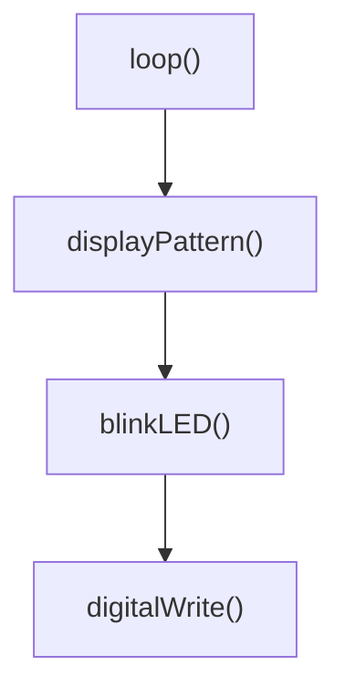

# Arduino Functions Basics

## Introduction

Functions are one of the most powerful concepts in programming. They allow you to organize your Arduino code into manageable, reusable blocks, making your projects cleaner and easier to understand. Think of functions as mini-programs within your main program – they perform specific tasks whenever you call them.

In this tutorial, you'll learn how to create and use functions in Arduino, understand their benefits, and see practical examples of how they can improve your projects.

## Why Use Functions?

Before diving into the syntax, let's understand why functions are essential:

- **Code Organization**: Break complex programs into smaller, manageable parts
- **Reusability**: Write code once and use it multiple times
- **Readability**: Make your code easier to understand
- **Maintenance**: Fix or modify code in one place instead of multiple places
- **Abstraction**: Focus on what a piece of code does rather than how it does it

## Function Basics

### Function Structure

An Arduino function has the following structure:

```cpp
returnType functionName(parameterType parameterName) {
  // Function code goes here
  
  return value; // Optional, depends on returnType
}
```

Let's break down each component:

- **returnType**: The type of data the function returns (int, float, void, etc.)
- **functionName**: A descriptive name for your function (following camelCase convention)
- **parameters**: Input values the function needs to perform its task (optional)
- **function body**: The code that executes when the function is called
- **return statement**: Sends a value back to where the function was called (optional)

### The `void` Return Type

Many Arduino functions use the `void` return type, which means the function doesn't return any value:

```cpp
void blinkLED() {
  digitalWrite(LED_BUILTIN, HIGH);
  delay(1000);
  digitalWrite(LED_BUILTIN, LOW);
  delay(1000);
}
```

### Functions with Return Values

Functions can also return values:

```cpp
int addNumbers(int a, int b) {
  int sum = a + b;
  return sum;
}
```

## Creating Your First Arduino Function

Let's create a simple function that blinks an LED a specified number of times:

```cpp
void setup() {
  pinMode(LED_BUILTIN, OUTPUT);
}

void loop() {
  blinkLED(3); // Blink LED 3 times
  delay(2000); // Wait 2 seconds
}

// Function to blink LED a specific number of times
void blinkLED(int times) {
  for (int i = 0; i < times; i++) {
    digitalWrite(LED_BUILTIN, HIGH);
    delay(200);
    digitalWrite(LED_BUILTIN, LOW);
    delay(200);
  }
}
```

### How This Works:

1. We define a function called `blinkLED` that takes one parameter: the number of times to blink
2. In our `loop()` function, we call `blinkLED(3)` to blink the LED 3 times
3. The function executes its code, then returns control to the `loop()`

## Function Declarations vs. Definitions

For larger programs, you might want to declare your functions at the top of your code and define them later:

```cpp
// Function declaration
void blinkLED(int times);
int readSensor(int sensorPin);

void setup() {
  // Setup code
}

void loop() {
  // Loop code
}

// Function definitions
void blinkLED(int times) {
  // Function code
}

int readSensor(int sensorPin) {
  // Function code
  return analogRead(sensorPin);
}
```

This approach is especially useful for larger projects with many functions.

## Advanced Function Concepts

### Parameters and Arguments

- **Parameters** are the variables listed in the function declaration
- **Arguments** are the values you pass to the function when calling it

Example:

```cpp
// temperature and humidity are parameters
void displayWeather(float temperature, int humidity) {
  Serial.print("Temperature: ");
  Serial.print(temperature);
  Serial.print("°C, Humidity: ");
  Serial.print(humidity);
  Serial.println("%");
}

void loop() {
  // 23.5 and 65 are arguments
  displayWeather(23.5, 65);
}
```

### Default Parameter Values

You can provide default values for parameters:

```cpp
void blinkLED(int pin = LED_BUILTIN, int times = 1, int duration = 500) {
  for (int i = 0; i < times; i++) {
    digitalWrite(pin, HIGH);
    delay(duration);
    digitalWrite(pin, LOW);
    delay(duration);
  }
}

// These all work:
blinkLED(); // Uses all defaults
blinkLED(10); // Custom pin, default times and duration
blinkLED(10, 5); // Custom pin and times, default duration
blinkLED(10, 5, 200); // All custom values
```

## Practical Examples

### Example 1: Temperature Monitoring

This example uses functions to read a temperature sensor and respond accordingly:

```cpp
const int sensorPin = A0;
const int ledPin = 13;

void setup() {
  Serial.begin(9600);
  pinMode(ledPin, OUTPUT);
}

void loop() {
  float temperature = readTemperature();
  displayTemperature(temperature);
  checkTemperatureAlert(temperature);
  delay(1000);
}

float readTemperature() {
  // Read the voltage from the TMP36 sensor
  int sensorValue = analogRead(sensorPin);
  // Convert the voltage to temperature in Celsius
  float voltage = sensorValue * (5.0 / 1023.0);
  float temperatureC = (voltage - 0.5) * 100;
  return temperatureC;
}

void displayTemperature(float temperature) {
  Serial.print("Temperature: ");
  Serial.print(temperature);
  Serial.println(" °C");
}

void checkTemperatureAlert(float temperature) {
  if (temperature > 30) {
    alertHighTemperature();
  } else {
    digitalWrite(ledPin, LOW);
  }
}

void alertHighTemperature() {
  digitalWrite(ledPin, HIGH);
  Serial.println("ALERT: Temperature too high!");
}
```

### Example 2: Interactive Light Display

This example uses functions to create an interactive light display with multiple modes:

```cpp
const int buttonPin = 2;
const int ledPins[] = {3, 4, 5, 6, 7};
const int numLeds = 5;
int displayMode = 0;

void setup() {
  pinMode(buttonPin, INPUT_PULLUP);
  for (int i = 0; i < numLeds; i++) {
    pinMode(ledPins[i], OUTPUT);
  }
}

void loop() {
  // Check if button is pressed to change mode
  if (isButtonPressed()) {
    displayMode = (displayMode + 1) % 3;
    clearAllLEDs();
    delay(300); // Debounce
  }
  
  // Run the selected light pattern
  switch (displayMode) {
    case 0:
      runChasePattern();
      break;
    case 1:
      runBlinkAllPattern();
      break;
    case 2:
      runFadePattern();
      break;
  }
}

boolean isButtonPressed() {
  return digitalRead(buttonPin) == LOW;
}

void clearAllLEDs() {
  for (int i = 0; i < numLeds; i++) {
    digitalWrite(ledPins[i], LOW);
  }
}

void runChasePattern() {
  for (int i = 0; i < numLeds; i++) {
    digitalWrite(ledPins[i], HIGH);
    delay(100);
    digitalWrite(ledPins[i], LOW);
  }
}

void runBlinkAllPattern() {
  for (int i = 0; i < numLeds; i++) {
    digitalWrite(ledPins[i], HIGH);
  }
  delay(500);
  clearAllLEDs();
  delay(500);
}

void runFadePattern() {
  // Simplified fade pattern (in real code, you would use analogWrite())
  for (int i = 0; i < numLeds; i++) {
    digitalWrite(ledPins[i], HIGH);
  }
  delay(100);
  clearAllLEDs();
  delay(900);
}
```

## Function Design Best Practices

To make your Arduino functions more effective:

1. **Use Descriptive Names**: Names like `readTemperature()` and `blinkLED()` clearly explain what the function does
2. **Single Responsibility**: Each function should do one thing and do it well
3. **Keep Functions Short**: Aim for 20-30 lines or less
4. **Consistent Level of Abstraction**: Don't mix high-level and low-level operations in the same function
5. **Limit Parameters**: Try to keep the number of parameters to 4 or fewer
6. **Document Your Functions**: Add comments explaining what your functions do

## The Function Call Stack

When you call a function, Arduino sets aside memory for its variables. When functions call other functions, this information is stored in a structure called the "stack":



Be careful with recursive functions (functions that call themselves) as they can cause a "stack overflow" if they don't have a proper exit condition.

## Summary

Functions are the building blocks of organized, reusable Arduino code. They allow you to:

- Break complex problems into smaller, manageable parts
- Reuse code instead of duplicating it
- Make your programs more readable and maintainable
- Create abstractions that hide complexity

As you develop more complex Arduino projects, functions will become an essential tool in your programming toolkit.

## Exercises

1. Create a function that fades an LED from off to on and back again
2. Write a function that converts a temperature from Celsius to Fahrenheit
3. Create a set of functions to control a traffic light sequence
4. Modify the temperature monitoring example to add a low-temperature alert
5. Create a function that plays a simple melody on a piezo buzzer

## Additional Resources

- [Arduino Reference - Functions](https://www.arduino.cc/reference/en/language/structure/further-syntax/functions/)
- [Arduino Programming Notebook](https://playground.arduino.cc/uploads/Main/arduino_notebook_v1-1.pdf)
- [C++ Function Documentation](https://en.cppreference.com/w/cpp/language/functions)