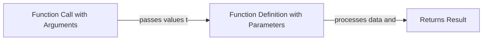

# Arduino Function Parameters

## Introduction

Function parameters are one of the most powerful features in programming that allow you to make your code more flexible, reusable, and organized. In Arduino programming, function parameters work just like they do in C/C++, enabling you to pass data to functions and create more versatile sketches.

In this tutorial, we'll explore how function parameters work in Arduino, why they're useful, and how to implement them effectively in your projects.

## What Are Function Parameters?

Function parameters are variables that are defined in the function declaration. They act as placeholders for values that will be passed to the function when it's called. These passed values are known as **arguments**.



Think of parameters as the function's "inputs" - they allow you to send different data to the same function, making your code more versatile and reducing repetition.

## Basic Syntax

Here's the basic syntax for defining a function with parameters in Arduino:

```cpp
returnType functionName(parameterType parameter1, parameterType parameter2, ...) {
  // Function body
  // Code that uses parameter1, parameter2, etc.
  
  return value; // Optional, only needed if returnType is not void
}
```

And here's how you call the function:

```cpp
functionName(argument1, argument2, ...);
```

## Simple Example: LED Blink with Parameters

Let's start with a simple example that makes the built-in LED blink for a specified duration and number of times:

```cpp
void setup() {
  pinMode(LED_BUILTIN, OUTPUT);
}

void loop() {
  // Blink the LED 5 times with 200ms on/off duration
  blinkLED(5, 200);
  
  // Wait for 2 seconds
  delay(2000);
  
  // Blink the LED 3 times with 500ms on/off duration
  blinkLED(3, 500);
  
  // Wait for 2 seconds
  delay(2000);
}

// Function with two parameters:
// - times: how many times to blink
// - duration: how long each blink lasts (in milliseconds)
void blinkLED(int times, int duration) {
  for (int i = 0; i < times; i++) {
    digitalWrite(LED_BUILTIN, HIGH);
    delay(duration);
    digitalWrite(LED_BUILTIN, LOW);
    delay(duration);
  }
}
```

In this example, the `blinkLED` function takes two parameters:
- `times`: Controls how many times the LED blinks
- `duration`: Controls how long each on/off state lasts

We can reuse this function with different arguments to create various blinking patterns without duplicating code.

## Parameter Types

In Arduino programming, parameters can have various data types:

- **Basic types**: `int`, `float`, `char`, `boolean`, etc.
- **Arrays**: You can pass arrays to functions
- **References**: Using `&` to pass variables by reference
- **Constants**: Using `const` for read-only parameters

### Example with Different Parameter Types

```cpp
void setup() {
  Serial.begin(9600);
  
  // Basic type parameters
  int sum = addNumbers(5, 7);
  Serial.print("Sum: ");
  Serial.println(sum);
  
  // Array parameter
  int sensorValues[] = {345, 678, 912, 467, 230};
  float average = calculateAverage(sensorValues, 5);
  Serial.print("Average: ");
  Serial.println(average);
  
  // Reference parameter
  int number = 10;
  Serial.print("Before doubling: ");
  Serial.println(number);
  doubleNumber(number);
  Serial.print("After doubling: ");
  Serial.println(number);
}

void loop() {
  // Empty loop
}

// Basic type parameters
int addNumbers(int a, int b) {
  return a + b;
}

// Array parameter with its size
float calculateAverage(int values[], int size) {
  int sum = 0;
  for (int i = 0; i < size; i++) {
    sum += values[i];
  }
  return (float)sum / size;
}

// Reference parameter (notice the &)
void doubleNumber(int &num) {
  num = num * 2;
}
```

Output:
```
Sum: 12
Average: 526.40
Before doubling: 10
After doubling: 20
```

## Default Parameter Values

Arduino (C++) allows you to specify default values for parameters. If a function is called without an argument for a parameter that has a default value, the default value is used.

```cpp
void setup() {
  Serial.begin(9600);
  
  // Using all parameters
  printInfo("Temperature Sensor", 3, true);
  
  // Using default value for the third parameter
  printInfo("Humidity Sensor", 2);
  
  // Using default values for the second and third parameters
  printInfo("Motion Detector");
}

void loop() {
  // Empty loop
}

// Function with default parameter values
void printInfo(String deviceName, int pinNumber = 1, boolean isActive = false) {
  Serial.print("Device: ");
  Serial.print(deviceName);
  Serial.print(", Pin: ");
  Serial.print(pinNumber);
  Serial.print(", Status: ");
  Serial.println(isActive ? "Active" : "Inactive");
}
```

Output:
```
Device: Temperature Sensor, Pin: 3, Status: Active
Device: Humidity Sensor, Pin: 2, Status: Inactive
Device: Motion Detector, Pin: 1, Status: Inactive
```

## Passing by Value vs. Passing by Reference

There are two ways to pass arguments to function parameters:

1. **Passing by Value**: Creates a copy of the variable (default)
2. **Passing by Reference**: Uses the `&` symbol to modify the original variable

```cpp
void setup() {
  Serial.begin(9600);
  
  int x = 10;
  int y = 20;
  
  Serial.println("--- Before function calls ---");
  Serial.print("x = ");
  Serial.println(x);
  Serial.print("y = ");
  Serial.println(y);
  
  // Pass by value - original variable won't change
  modifyByValue(x);
  
  // Pass by reference - original variable will change
  modifyByReference(y);
  
  Serial.println("--- After function calls ---");
  Serial.print("x = ");
  Serial.println(x);
  Serial.print("y = ");
  Serial.println(y);
}

void loop() {
  // Empty loop
}

// Pass by value (creates a copy)
void modifyByValue(int num) {
  num = num * 2;  // This modification only affects the local copy
}

// Pass by reference (works directly with original variable)
void modifyByReference(int &num) {
  num = num * 2;  // This modification affects the original variable
}
```

Output:
```
--- Before function calls ---
x = 10
y = 20
--- After function calls ---
x = 10
y = 40
```

## Real-world Application: RGB LED Controller

Let's build a more practical example: a function to control an RGB LED with parameters for colors and fading:

```cpp
const int RED_PIN = 9;    // PWM pin for red
const int GREEN_PIN = 10; // PWM pin for green
const int BLUE_PIN = 11;  // PWM pin for blue

void setup() {
  pinMode(RED_PIN, OUTPUT);
  pinMode(GREEN_PIN, OUTPUT);
  pinMode(BLUE_PIN, OUTPUT);
}

void loop() {
  // Red color, no fade
  setRGBColor(255, 0, 0, false);
  delay(1000);
  
  // Green color, with fade
  setRGBColor(0, 255, 0, true);
  delay(1000);
  
  // Blue color, with fade
  setRGBColor(0, 0, 255, true);
  delay(1000);
  
  // Purple color (red + blue), no fade
  setRGBColor(255, 0, 255, false);
  delay(1000);
}

// Function with multiple parameters to control an RGB LED
// Parameters:
// - red, green, blue: color intensity values (0-255)
// - fade: whether to fade to this color or change instantly
void setRGBColor(int red, int green, int blue, boolean fade) {
  // If fade is true, gradually transition to the new color
  if (fade) {
    // Get current values
    int currentRed = analogRead(RED_PIN) / 4; // Convert from 0-1023 to 0-255
    int currentGreen = analogRead(GREEN_PIN) / 4;
    int currentBlue = analogRead(BLUE_PIN) / 4;
    
    // Gradually change from current to target values
    for (int i = 0; i <= 100; i++) {
      int r = currentRed + (red - currentRed) * i / 100;
      int g = currentGreen + (green - currentGreen) * i / 100;
      int b = currentBlue + (blue - currentBlue) * i / 100;
      
      analogWrite(RED_PIN, r);
      analogWrite(GREEN_PIN, g);
      analogWrite(BLUE_PIN, b);
      
      delay(5);  // Small delay for smooth transition
    }
  } else {
    // Change instantly
    analogWrite(RED_PIN, red);
    analogWrite(GREEN_PIN, green);
    analogWrite(BLUE_PIN, blue);
  }
}
```

This RGB controller function demonstrates how parameters can make your code highly flexible and user-friendly.

## Advanced Example: Sensor Data Processing

Let's create a more complex example that shows how function parameters can help process sensor data with different thresholds and conditions:

```cpp
const int SENSOR_PIN = A0;

void setup() {
  Serial.begin(9600);
  pinMode(SENSOR_PIN, INPUT);
}

void loop() {
  int rawValue = analogRead(SENSOR_PIN);
  
  // Process the same sensor data in different ways using function parameters
  
  // Check if the sensor value exceeds a threshold
  if (isThresholdExceeded(rawValue, 500)) {
    Serial.println("Threshold exceeded!");
  }
  
  // Map the sensor value to a custom range
  int mappedValue = mapToRange(rawValue, 0, 1023, 0, 100);
  Serial.print("Mapped value (0-100): ");
  Serial.println(mappedValue);
  
  // Apply different filters to the same raw data
  float filteredValue1 = applyFilter(rawValue, 0.8, "avg");
  float filteredValue2 = applyFilter(rawValue, 0.5, "exp");
  
  Serial.print("Filtered value (average): ");
  Serial.println(filteredValue1);
  Serial.print("Filtered value (exponential): ");
  Serial.println(filteredValue2);
  
  delay(1000);
}

// Function to check if a value exceeds a threshold
boolean isThresholdExceeded(int value, int threshold) {
  return value > threshold;
}

// Function to map a value from one range to another
int mapToRange(int value, int fromLow, int fromHigh, int toLow, int toHigh) {
  return map(value, fromLow, fromHigh, toLow, toHigh);
}

// Function with multiple parameter types to apply different filters
float applyFilter(int newValue, float filterStrength, String filterType) {
  static float lastValue = 0;  // Keeps its value between function calls
  
  if (filterType == "avg") {
    // Weighted average filter
    lastValue = lastValue * filterStrength + newValue * (1 - filterStrength);
    return lastValue;
  } 
  else if (filterType == "exp") {
    // Exponential filter
    lastValue = lastValue + filterStrength * (newValue - lastValue);
    return lastValue;
  } 
  else {
    // No filter
    lastValue = newValue;
    return newValue;
  }
}
```

## Best Practices for Function Parameters

1. **Use clear parameter names**: Choose names that indicate what the parameter represents.
2. **Limit the number of parameters**: Functions with too many parameters become difficult to use. Consider grouping related parameters into structs if you need many.
3. **Be consistent with parameter order**: Keep the order of parameters consistent across similar functions.
4. **Use default values** for optional parameters when appropriate.
5. **Consider using references** (`&`) for large data structures to avoid copying.
6. **Use `const`** for parameters that shouldn't be modified within the function.

## Common Mistakes and How to Avoid Them

### 1. Forgetting to Pass Arguments

**Mistake:**
```cpp
void setup() {
  Serial.begin(9600);
  // Forgetting to pass the required argument
  printTemperature();
}

void printTemperature(float temp) {
  Serial.print("Temperature: ");
  Serial.print(temp);
  Serial.println(" °C");
}
```

**Fix:** Always provide all required arguments or use default values.

### 2. Type Mismatches

**Mistake:**
```cpp
void setup() {
  Serial.begin(9600);
  // Passing a string when the function expects an integer
  blinkLED("5", 500);
}

void blinkLED(int times, int duration) {
  // Code here
}
```

**Fix:** Ensure argument types match parameter types, or use appropriate type conversion.

### 3. Modifying Constants

**Mistake:**
```cpp
void processData(const int data[]) {
  // Attempting to modify a constant
  data[0] = 100; // This will cause an error
}
```

**Fix:** Don't try to modify parameters marked as `const`.

## Summary

Function parameters are essential tools for creating flexible, reusable code in Arduino programming. They allow you to:

- Pass data to functions to process
- Create versatile functions that can handle different inputs
- Reduce code duplication by creating reusable functions
- Make your code more modular and easier to maintain

By mastering function parameters, you'll write cleaner, more efficient Arduino sketches that are easier to understand and modify.

## Exercises

1. **Basic Exercise**: Create a function called `calculateArea` that takes two parameters, `width` and `height`, and returns the area.

2. **Intermediate Exercise**: Write a function called `fadeMultipleLEDs` that takes an array of LED pin numbers and fades them in sequence.

3. **Advanced Exercise**: Create a function called `readMultipleSensors` that takes an array of sensor pins, a delay time between readings, and the number of readings to average, then returns the average readings.

4. **Challenge**: Write a traffic light controller function that takes parameters for the duration of each light state and whether there's a pedestrian crossing signal.

## Additional Resources

- [Arduino Function Reference](https://www.arduino.cc/reference/en/language/structure/functions/)
- [Arduino Programming Language](https://www.arduino.cc/reference/en/)
- The official Arduino documentation on functions and parameters