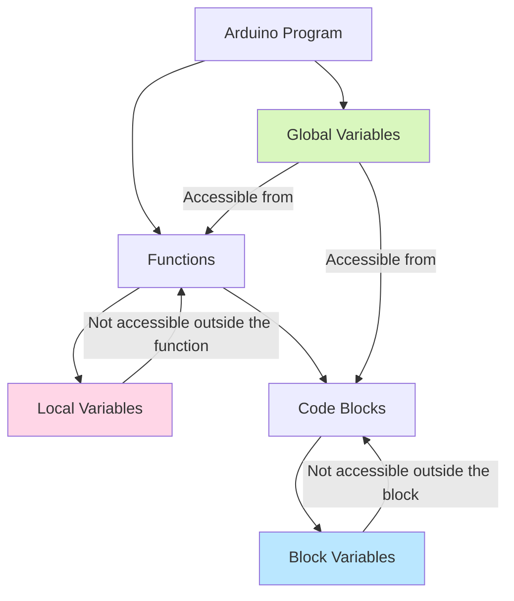

# Arduino Scope

## Introduction

When writing Arduino programs, understanding **scope** is essential for creating efficient and bug-free code. Scope defines where in your program a variable or function is accessible and where it's not. Think of scope as the "visibility" or "lifetime" of variables and functions within your code.

In this tutorial, we'll explore how scope works in Arduino programming, why it matters, and how to use it effectively in your projects.

## What is Scope?

Scope determines where a variable or function can be "seen" and used within your code. Arduino, which is programmed using C++, follows common C/C++ scoping rules:

- **Global scope**: Variables declared outside of any function
- **Local scope**: Variables declared inside a function or code block
- **Block scope**: Variables declared inside loops or conditional statements

Let's explore each of these in detail.

## Global Scope

Variables declared outside of any function have **global scope**, meaning they can be accessed from anywhere in your program.

```cpp
// Global variable declaration
int sensorPin = A0;
float temperatureC = 0.0;

void setup() {
  // sensorPin is accessible here
  pinMode(sensorPin, INPUT);
  Serial.begin(9600);
}

void loop() {
  // sensorPin and temperatureC are accessible here
  int sensorValue = analogRead(sensorPin);
  temperatureC = (sensorValue * 5.0 / 1024.0 - 0.5) * 100;
  Serial.println(temperatureC);
  delay(1000);
}
```

### Advantages of Global Variables

- They're accessible everywhere in your program
- They retain their values throughout the entire program execution

### Disadvantages of Global Variables

- They consume memory for the entire duration of your program
- They can lead to naming conflicts
- They make code harder to debug and maintain as your program grows
- They can be accidentally modified by any part of your program

## Local Scope

Variables declared inside a function have **local scope**, meaning they only exist within that function.

```cpp
void setup() {
  Serial.begin(9600);
  // Local variable
  int setupCounter = 0;
  setupCounter++;
  Serial.print("Setup counter: ");
  Serial.println(setupCounter);
}

void loop() {
  // This would cause an error - setupCounter is not accessible here
  // Serial.println(setupCounter);
  
  // Local variable in loop
  int loopCounter = 0;
  loopCounter++;
  Serial.print("Loop counter: ");
  Serial.println(loopCounter);
  delay(1000);
}
```

In this example, `loopCounter` will always print as 1 because it's recreated and reinitialized each time the `loop()` function runs.

### Advantages of Local Variables

- They exist only when needed, saving memory
- They're protected from modifications by other functions
- They make your code more modular and easier to understand

## Block Scope

Variables declared inside a block of code (within curly braces `{}`) have **block scope** and are only accessible within that block.

```cpp
void loop() {
  if (digitalRead(7) == HIGH) {
    // This variable only exists inside this if block
    int buttonPressCount = 0;
    buttonPressCount++;
    Serial.print("Button press: ");
    Serial.println(buttonPressCount);
  }
  
  // This would cause an error - buttonPressCount is not accessible here
  // Serial.println(buttonPressCount);
  
  for (int i = 0; i < 5; i++) {
    // Variable i only exists inside this for loop
    Serial.println(i);
  }
  
  // This would cause an error - i is not accessible here
  // Serial.println(i);
  
  delay(1000);
}
```

## Static Variables

Sometimes you need a variable that keeps its value between function calls (like a global variable) but is still protected within its local scope. This is where **static** variables come in.

```cpp
void loop() {
  // Static variable - initialized only once,
  // retains value between function calls
  static int loopCount = 0;
  loopCount++;
  
  Serial.print("Loop has run ");
  Serial.print(loopCount);
  Serial.println(" times");
  
  delay(1000);
}
```

In this example, `loopCount` will continue increasing with each loop cycle, unlike a regular local variable that would be reset to 0 each time.

## Real-World Example: Button Debounce

Understanding scope is critical for practical applications. Let's see a real-world example of using static variables for button debouncing:

```cpp
const int buttonPin = 2;
int ledState = HIGH;

void setup() {
  pinMode(buttonPin, INPUT_PULLUP);
  pinMode(LED_BUILTIN, OUTPUT);
  digitalWrite(LED_BUILTIN, ledState);
}

void loop() {
  if (checkButton()) {
    ledState = !ledState;
    digitalWrite(LED_BUILTIN, ledState);
  }
  delay(10);
}

bool checkButton() {
  // These static variables retain their values between function calls
  static bool buttonState = HIGH;
  static bool lastButtonState = HIGH;
  static unsigned long lastDebounceTime = 0;
  static const unsigned long debounceDelay = 50;
  
  bool reading = digitalRead(buttonPin);
  bool buttonPressed = false;
  
  if (reading != lastButtonState) {
    lastDebounceTime = millis();
  }
  
  if ((millis() - lastDebounceTime) > debounceDelay) {
    if (reading != buttonState) {
      buttonState = reading;
      if (buttonState == LOW) {
        buttonPressed = true;
      }
    }
  }
  
  lastButtonState = reading;
  return buttonPressed;
}
```

In this example:
- The static variables in `checkButton()` remember their values between function calls
- This allows us to track the button state over time to implement debouncing
- Without static variables, we'd need to use global variables, making our code less modular

## Visualizing Variable Scope



## Common Scope Mistakes and How to Avoid Them

### 1. Trying to access variables outside their scope

```cpp
void setup() {
  Serial.begin(9600);
}

void loop() {
  if (Serial.available() > 0) {
    int incomingByte = Serial.read();
    // Process the byte
  }
  
  // Error! incomingByte doesn't exist here
  // Serial.println(incomingByte);
  
  delay(100);
}
```

**Solution**: Declare the variable at a scope level where all code that needs it can access it.

```cpp
void setup() {
  Serial.begin(9600);
}

void loop() {
  // Declare variable outside the if block
  int incomingByte = -1;
  
  if (Serial.available() > 0) {
    incomingByte = Serial.read();
    // Process the byte
  }
  
  // Now this is valid
  if (incomingByte != -1) {
    Serial.println(incomingByte);
  }
  
  delay(100);
}
```

### 2. Redeclaring variables in nested scopes

```cpp
int sensorValue = 0; // Global variable

void loop() {
  int sensorValue = analogRead(A0); // Local variable "shadows" the global one
  Serial.println(sensorValue); // Uses the local variable
  
  updateGlobalSensorValue();
  delay(1000);
}

void updateGlobalSensorValue() {
  // This modifies the global variable, not the local one from loop()
  sensorValue = analogRead(A0);
}
```

This can lead to confusing behavior. When possible, use unique variable names to avoid "shadowing."

## Memory Considerations

The scope of variables affects not just their visibility but also their memory usage:

- **Global variables**: Allocated for the entire program execution
- **Local variables**: Allocated only when the function is called, then freed
- **Static local variables**: Allocated for the entire program execution but with limited scope

For Arduino's limited memory, particularly on boards like the UNO with only 2KB of RAM, proper variable scoping is crucial for efficient memory management.

## Best Practices

1. **Keep variables as local as possible**: Only make variables global if they truly need to be accessed across different functions

2. **Use static variables** when you need to remember values between function calls but want to keep them encapsulated

3. **Be mindful of memory limitations**: Remember that all global and static variables consume RAM for the entire duration of your program

4. **Use descriptive variable names**: This helps avoid confusion, especially with variables in different scopes

5. **Document your global variables**: Since they can be modified from anywhere, a brief comment helps understand their purpose

## Summary

Understanding scope in Arduino programming is essential for writing clean, maintainable, and memory-efficient code. By properly managing the scope of your variables and functions, you can:

- Reduce memory usage
- Prevent unintended modifications
- Create more modular and reusable code
- Make your programs easier to debug and maintain

With practice, managing scope becomes second nature, and you'll find yourself naturally choosing the right scope for your variables based on their intended use.

## Exercises

1. Modify the button debounce example to add a counter that tracks how many times the button has been pressed and displays it on the Serial Monitor.

2. Create a program using a photoresistor or potentiometer that shows how to use both global and local variables appropriately.

3. Implement a basic state machine using static variables to remember the current state between function calls.