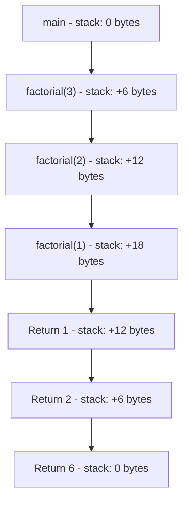

# Arduino Recursion

## Introduction

Recursion is a powerful programming concept where a function calls itself to solve a problem by breaking it down into smaller instances of the same problem. While recursion is common in traditional programming languages, it requires special consideration in the resource-constrained environment of Arduino microcontrollers.

In this tutorial, we'll explore how recursion works on Arduino, when to use it, when to avoid it, and practical examples that demonstrate its application in embedded systems programming.

## Understanding Recursion in Arduino

Recursion occurs when a function invokes itself during its execution. Every recursive function has two components:

1. **Base case(s)** - Condition(s) that stop the recursion
2. **Recursive case(s)** - Condition(s) where the function calls itself

Here's a simple example of recursion in Arduino code:

```cpp
int factorial(int n) {
  // Base case
  if (n <= 1) {
    return 1;
  }
  // Recursive case
  else {
    return n * factorial(n - 1);
  }
}
```

This function calculates the factorial of a number using recursion. When `n` reaches 1 (the base case), the recursion stops.

## Important Considerations for Arduino Recursion

Before implementing recursion on Arduino, you should understand these critical constraints:

### 1. Stack Limitations

Arduino has a limited stack size (typically a few hundred bytes). Each recursive call adds a stack frame containing:
- The return address
- Function parameters
- Local variables

Excessive recursive depth can cause a stack overflow, which will crash your Arduino.

### 2. Memory Usage

Arduino devices have limited SRAM (2KB on Arduino Uno, 8KB on Arduino Mega). Recursive functions can quickly consume this precious resource.

### 3. Execution Time

Recursive functions might execute slower than their iterative counterparts due to the overhead of multiple function calls.

## When to Use Recursion on Arduino

Despite the limitations, recursion can be appropriate in certain Arduino applications:

1. When the recursive algorithm is significantly clearer than its iterative alternative
2. When the recursion depth is guaranteed to be small
3. When memory usage is well understood and controlled
4. When dealing with inherently recursive structures (e.g., tree traversal)

## Practical Examples

Let's look at practical examples of recursion for Arduino applications.

### Example 1: LED Binary Counter

This example uses recursion to display binary numbers on a sequence of LEDs:

```cpp
const int NUM_LEDS = 4;
const int LED_PINS[NUM_LEDS] = {5, 6, 7, 8};

void setup() {
  for (int i = 0; i < NUM_LEDS; i++) {
    pinMode(LED_PINS[i], OUTPUT);
  }
  Serial.begin(9600);
}

void loop() {
  // Count from 0 to 15 (binary 0000 to 1111)
  for (int i = 0; i < 16; i++) {
    displayBinary(i, NUM_LEDS - 1);
    delay(1000);
  }
}

// Recursive function to display a number in binary using LEDs
void displayBinary(int num, int ledPosition) {
  // Base case
  if (ledPosition < 0) {
    return;
  }
  
  // Display current bit
  if (num % 2 == 1) {
    digitalWrite(LED_PINS[ledPosition], HIGH);
  } else {
    digitalWrite(LED_PINS[ledPosition], LOW);
  }
  
  // Recursive case - process remaining bits
  displayBinary(num / 2, ledPosition - 1);
}
```

In this example, the `displayBinary()` function recursively breaks down a number into its binary representation, lighting LEDs accordingly. The maximum recursion depth is equal to the number of LEDs (4 in this case), so it's safe from stack overflow.

### Example 2: Fibonacci Sequence with Serial Output

This example calculates Fibonacci numbers recursively and outputs them to the Serial monitor:

```cpp
void setup() {
  Serial.begin(9600);
  Serial.println("Fibonacci Sequence:");
  
  // Print first 10 Fibonacci numbers
  for (int i = 0; i < 10; i++) {
    Serial.print("Fib(");
    Serial.print(i);
    Serial.print(") = ");
    Serial.println(fibonacci(i));
    delay(500);
  }
}

void loop() {
  // Nothing in the loop
}

// Recursive Fibonacci function
int fibonacci(int n) {
  // Base cases
  if (n == 0) return 0;
  if (n == 1) return 1;
  
  // Recursive case
  return fibonacci(n - 1) + fibonacci(n - 2);
}
```

**Output:**
```
Fibonacci Sequence:
Fib(0) = 0
Fib(1) = 1
Fib(2) = 1
Fib(3) = 2
Fib(4) = 3
Fib(5) = 5
Fib(6) = 8
Fib(7) = 13
Fib(8) = 21
Fib(9) = 34
```

> ⚠️ **Warning**: This implementation of Fibonacci is inefficient as it recalculates the same values multiple times. For Arduino, an iterative approach would be much more efficient. This example is for demonstration purposes only.

### Example 3: Recursive Tone Generator

This example uses recursion to create a melody that changes in response to sensor input:

```cpp
const int BUZZER_PIN = 8;
const int SENSOR_PIN = A0;

void setup() {
  pinMode(BUZZER_PIN, OUTPUT);
  Serial.begin(9600);
}

void loop() {
  int sensorValue = analogRead(SENSOR_PIN);
  int maxDepth = map(sensorValue, 0, 1023, 1, 8);
  
  Serial.print("Generating tones with max depth: ");
  Serial.println(maxDepth);
  
  generateTones(440, maxDepth);
  delay(1000);
}

// Recursive function to generate tones
void generateTones(int frequency, int depth) {
  // Base case
  if (depth <= 0) {
    return;
  }
  
  // Play current tone
  tone(BUZZER_PIN, frequency, 200);
  delay(250);
  noTone(BUZZER_PIN);
  
  // Recursive cases with different frequency modifications
  generateTones(frequency + 100, depth - 1);  // Ascending tone
  delay(50);
  generateTones(frequency - 50, depth - 1);   // Descending tone
}
```

This example reads an analog sensor to determine the maximum recursion depth, then generates a series of tones recursively. This creates an interesting audio pattern that changes based on the sensor input.

## Optimizing Recursive Functions for Arduino

To use recursion effectively on Arduino, follow these optimization strategies:

### 1. Use Tail Recursion When Possible

Tail recursion occurs when the recursive call is the last operation in the function. Some compilers can optimize this into iteration:

```cpp
// Non-tail recursive factorial
int factorial(int n) {
  if (n <= 1) return 1;
  return n * factorial(n - 1);  // Must multiply after recursion returns
}

// Tail recursive factorial
int factorialTail(int n, int result = 1) {
  if (n <= 1) return result;
  return factorialTail(n - 1, n * result);  // Final action is the recursive call
}
```

### 2. Limit Recursion Depth

Always include an explicit maximum depth parameter to prevent stack overflow:

```cpp
void limitedRecursion(int depth, int maxDepth = 10) {
  if (depth >= maxDepth) {
    return;  // Safety limit reached
  }
  
  // Do something
  
  limitedRecursion(depth + 1, maxDepth);
}
```

### 3. Consider Iterative Alternatives

For many problems, an iterative solution may be more efficient on Arduino:

```cpp
// Recursive Fibonacci (inefficient on Arduino)
int fibonacci(int n) {
  if (n <= 1) return n;
  return fibonacci(n - 1) + fibonacci(n - 2);
}

// Iterative Fibonacci (better for Arduino)
int fibonacciIterative(int n) {
  if (n <= 1) return n;
  
  int prev = 0, current = 1, next;
  for (int i = 2; i <= n; i++) {
    next = prev + current;
    prev = current;
    current = next;
  }
  return current;
}
```

## Real-World Application: Recursive Menu System

Here's a practical example of a menu system for an Arduino project using recursion:

```cpp
#include <LiquidCrystal.h>

// Initialize the LCD
LiquidCrystal lcd(12, 11, 5, 4, 3, 2);

const int BTN_UP = 8;
const int BTN_DOWN = 9;
const int BTN_SELECT = 10;

// Menu structure
struct MenuItem {
  const char* name;
  void (*action)();
  MenuItem* subMenus;
  int subMenuCount;
};

void temperatureAction() {
  lcd.clear();
  lcd.print("Temp: 23.5 C");
  delay(2000);
}

void humidityAction() {
  lcd.clear();
  lcd.print("Humidity: 45%");
  delay(2000);
}

void ledOnAction() {
  lcd.clear();
  lcd.print("LED ON");
  digitalWrite(LED_BUILTIN, HIGH);
  delay(1000);
}

void ledOffAction() {
  lcd.clear();
  lcd.print("LED OFF");
  digitalWrite(LED_BUILTIN, LOW);
  delay(1000);
}

// Submenu for LED control
MenuItem ledSubMenu[] = {
  {"LED ON", ledOnAction, NULL, 0},
  {"LED OFF", ledOffAction, NULL, 0}
};

// Main menu items
MenuItem mainMenu[] = {
  {"Temperature", temperatureAction, NULL, 0},
  {"Humidity", humidityAction, NULL, 0},
  {"LED Control", NULL, ledSubMenu, 2}
};

void setup() {
  lcd.begin(16, 2);
  pinMode(BTN_UP, INPUT_PULLUP);
  pinMode(BTN_DOWN, INPUT_PULLUP);
  pinMode(BTN_SELECT, INPUT_PULLUP);
  pinMode(LED_BUILTIN, OUTPUT);
  
  // Display initial menu
  displayMenu(mainMenu, 3, 0);
}

void loop() {
  // Button handling would go here
}

// Recursive function to display and navigate menus
void displayMenu(MenuItem* menu, int menuSize, int currentPosition, int depth = 0) {
  // Base case - limit recursion depth
  if (depth > 5) return;
  
  lcd.clear();
  lcd.setCursor(0, 0);
  lcd.print("> ");
  lcd.print(menu[currentPosition].name);
  
  // Show next menu item if available
  if (currentPosition < menuSize - 1) {
    lcd.setCursor(0, 1);
    lcd.print("  ");
    lcd.print(menu[currentPosition + 1].name);
  }
  
  // Wait for button press
  while (true) {
    if (digitalRead(BTN_UP) == LOW) {
      delay(50);
      if (currentPosition > 0) {
        currentPosition--;
        displayMenu(menu, menuSize, currentPosition, depth);
        return;
      }
    }
    
    if (digitalRead(BTN_DOWN) == LOW) {
      delay(50);
      if (currentPosition < menuSize - 1) {
        currentPosition++;
        displayMenu(menu, menuSize, currentPosition, depth);
        return;
      }
    }
    
    if (digitalRead(BTN_SELECT) == LOW) {
      delay(50);
      // If this menu item has an action, execute it
      if (menu[currentPosition].action != NULL) {
        menu[currentPosition].action();
        displayMenu(menu, menuSize, currentPosition, depth);
        return;
      }
      // If this menu item has submenu, go to it
      else if (menu[currentPosition].subMenus != NULL) {
        displayMenu(menu[currentPosition].subMenus, 
                  menu[currentPosition].subMenuCount, 
                  0, depth + 1);
        return;
      }
    }
    
    delay(100);
  }
}
```

This example uses recursion to navigate through a nested menu system. When the user selects a menu item with a submenu, the function calls itself with the submenu structure. The depth parameter ensures the recursion doesn't go too deep.

## Memory Visualization with Recursion

Let's visualize what happens to the Arduino's stack memory during recursive calls:



Each recursive call adds to the stack until the base case is reached. Then, the results are returned back up the chain as the stack unwinds.

## Summary

Recursion can be a powerful technique in Arduino programming when used appropriately:

1. **Advantages**:
   - Elegant solutions for inherently recursive problems
   - More readable code for certain algorithms
   - Natural for hierarchical data structures

2. **Challenges**:
   - Limited stack space on Arduino
   - Memory consumption
   - Potential performance overhead

3. **Best Practices**:
   - Always include a base case to terminate recursion
   - Limit recursion depth explicitly
   - Consider tail recursion or iterative alternatives
   - Understand the memory implications

When implemented carefully with these considerations in mind, recursion can be a valuable tool in your Arduino programming toolkit.

## Exercises for Practice

1. **LED Pattern Generator**: Create a recursive function that generates increasingly complex blinking patterns for a set of LEDs.

2. **Recursive Sensor Reading**: Implement a function that recursively averages sensor readings at different time intervals.

3. **Binary Search for Calibration**: Develop a recursive binary search algorithm to calibrate a sensor to a specific value.

4. **Recursive State Machine**: Design a simple state machine using recursion for a home automation system.

5. **Convert Recursion to Iteration**: Take the Fibonacci example provided earlier and convert it to an efficient iterative solution, then compare performance on your Arduino.

By practicing these exercises, you'll gain a better understanding of when and how to apply recursion in your Arduino projects.

## Additional Resources

- [Arduino Reference - Functions](https://www.arduino.cc/reference/en/language/structure/further-syntax/recursion/)
- [Stack Overflow Discussion on Arduino Memory Management](https://arduino.stackexchange.com/questions/tagged/memory)
- [Efficient Programming Techniques for Arduino](https://www.arduino.cc/en/Tutorial/Foundations)