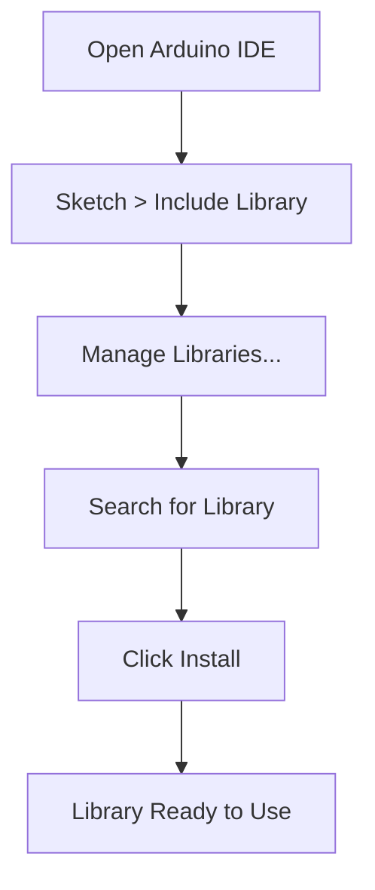

# Arduino Libraries

## Introduction

Arduino libraries are collections of pre-written code that extend the functionality of the Arduino platform. They allow you to easily add new capabilities to your projects without having to write complex code from scratch. Libraries essentially serve as building blocks that you can incorporate into your sketches to perform specific tasks.

Think of libraries like recipe books - instead of figuring out how to bake a cake from first principles every time, you can follow established recipes that are known to work well. Similarly, Arduino libraries provide tested, optimized code for interfacing with sensors, displays, motors, and many other components.

## Why Use Libraries?

Libraries offer several significant advantages:

- **Save development time** by using pre-written, tested code
- **Simplify complex tasks** into easy-to-use functions
- **Improve code readability** by abstracting complicated processes
- **Enable advanced functionality** that would be difficult to implement independently
- **Promote code reusability** across multiple projects

## Built-in vs. External Libraries

Arduino comes with several built-in libraries, but thousands more are available from the community. Let's explore both types:

### Built-in Libraries

These libraries come pre-installed with the Arduino IDE and provide core functionality:

- `Wire.h` - For I2C communication
- `SPI.h` - For SPI communication
- `EEPROM.h` - For reading/writing to Arduino's persistent memory
- `Servo.h` - For controlling servo motors
- `LiquidCrystal.h` - For interfacing with LCD displays

### External Libraries

These are created by the Arduino community and can be installed through the Library Manager:

- Display libraries (OLED, TFT, etc.)
- Sensor libraries (temperature, humidity, motion, etc.)
- Communication libraries (WiFi, Bluetooth, LoRa, etc.)
- Motor control libraries (stepper motors, DC motors, etc.)
- And many more specialized libraries

## Using Libraries in Your Sketches

### Including a Library

To use a library in your sketch, you need to include it at the top of your code using the `#include` directive:

```cpp
#include <LibraryName.h>
```

For example, to use the built-in Servo library:

```cpp
#include <Servo.h>
```

### Working with Library Objects

Most libraries require you to create an object to access their functionality:

```cpp
#include <Servo.h>

Servo myServo;  // Create a Servo object called myServo

void setup() {
  myServo.attach(9);  // Attach the servo to pin 9
}

void loop() {
  myServo.write(90);  // Move servo to 90 degrees
  delay(1000);
  myServo.write(180); // Move servo to 180 degrees
  delay(1000);
}
```

## Installing External Libraries

There are three main ways to install external libraries:

### 1. Using the Library Manager (Recommended)

The easiest method is through the Arduino IDE's Library Manager:

1. Open the Arduino IDE
2. Go to Sketch > Include Library > Manage Libraries...
3. Search for the library you want
4. Click Install



### 2. Installing from ZIP

If you've downloaded a library as a ZIP file:

1. Go to Sketch > Include Library > Add .ZIP Library...
2. Navigate to the downloaded ZIP file
3. Select it and click Open

### 3. Manual Installation

You can also install libraries manually:

1. Download the library
2. Extract it to your Arduino libraries folder:
   - Windows: Documents\Arduino\libraries
   - Mac: ~/Documents/Arduino/libraries
   - Linux: ~/Arduino/libraries
3. Restart the Arduino IDE

## Practical Example: DHT Sensor Library

Let's see a complete example using the DHT sensor library to read temperature and humidity:

### Step 1: Install the Library

First, install the "DHT sensor library" by Adafruit using the Library Manager.

### Step 2: Wire the DHT Sensor

Connect your DHT11 or DHT22 sensor to your Arduino:
- Connect VCC to 5V
- Connect GND to ground
- Connect DATA to digital pin 2
- Add a 10K ohm resistor between VCC and DATA (pull-up resistor)

### Step 3: Write the Code

```cpp
#include <DHT.h>

#define DHTPIN 2      // Digital pin connected to the DHT sensor
#define DHTTYPE DHT11 // DHT 11 or DHT22 depending on your sensor

DHT dht(DHTPIN, DHTTYPE); // Initialize DHT sensor

void setup() {
  Serial.begin(9600);
  dht.begin();
  Serial.println("DHT Sensor Test");
}

void loop() {
  // Wait a few seconds between measurements
  delay(2000);

  // Reading temperature and humidity takes about 250 milliseconds
  float humidity = dht.readHumidity();
  float temperature = dht.readTemperature();

  // Check if any reads failed and exit early (to try again)
  if (isnan(humidity) || isnan(temperature)) {
    Serial.println("Failed to read from DHT sensor!");
    return;
  }

  Serial.print("Humidity: ");
  Serial.print(humidity);
  Serial.print("%  Temperature: ");
  Serial.print(temperature);
  Serial.println("°C");
}
```

### Expected Output

When running this code with a connected DHT sensor, you'll see output in the Serial Monitor similar to:

```
DHT Sensor Test
Humidity: 45.20%  Temperature: 22.30°C
Humidity: 45.30%  Temperature: 22.40°C
Humidity: 45.20%  Temperature: 22.30°C
```

## Creating Your Own Library

As you become more experienced, you might want to create your own libraries to organize and reuse your code.

### Basic Library Structure

An Arduino library typically consists of at least two files:

1. Header file (`.h`) - Contains declarations and documentation
2. Source file (`.cpp`) - Contains the actual implementation

### Example: Creating a Simple LED Library

Let's create a simple library to control multiple LEDs with fade effects.

#### Step 1: Create the Header File (SimpleLED.h)

```cpp
#ifndef SimpleLED_h
#define SimpleLED_h

#include <Arduino.h>

class SimpleLED {
  public:
    SimpleLED(int pin);
    void on();
    void off();
    void blink(int duration);
    void fade(int duration);
  
  private:
    int _pin;
    int _state;
};

#endif
```

#### Step 2: Create the Source File (SimpleLED.cpp)

```cpp
#include "SimpleLED.h"

SimpleLED::SimpleLED(int pin) {
  _pin = pin;
  _state = LOW;
  pinMode(_pin, OUTPUT);
}

void SimpleLED::on() {
  digitalWrite(_pin, HIGH);
  _state = HIGH;
}

void SimpleLED::off() {
  digitalWrite(_pin, LOW);
  _state = LOW;
}

void SimpleLED::blink(int duration) {
  on();
  delay(duration);
  off();
  delay(duration);
}

void SimpleLED::fade(int duration) {
  // Fade in
  for (int brightness = 0; brightness <= 255; brightness++) {
    analogWrite(_pin, brightness);
    delay(duration / 255);
  }
  
  // Fade out
  for (int brightness = 255; brightness >= 0; brightness--) {
    analogWrite(_pin, brightness);
    delay(duration / 255);
  }
}
```

#### Step 3: Using Your Library

```cpp
#include <SimpleLED.h>

// Create three LED objects
SimpleLED led1(9);
SimpleLED led2(10);
SimpleLED led3(11);

void setup() {
  // No additional setup needed as it's handled in the constructor
}

void loop() {
  // Demonstrate different patterns
  led1.blink(500);
  led2.fade(1000);
  led3.on();
  delay(1000);
  led3.off();
  delay(1000);
}
```

## Popular Arduino Libraries

Here are some popular libraries worth exploring:

| Library | Purpose | Common Applications |
|---------|---------|---------------------|
| Adafruit GFX | Graphics library | Displays, screens |
| FastLED | LED control | RGB LED strips, matrices |
| PubSubClient | MQTT client | IoT projects |
| ESP8266WiFi | WiFi connectivity | ESP8266 projects |
| NewPing | Ultrasonic sensors | Distance measurement |
| OneWire | 1-Wire protocol | Temperature sensors |
| ArduinoJson | JSON parsing | API interaction, data storage |

## Best Practices

When using libraries, follow these best practices:

1. **Check library compatibility** with your Arduino board
2. **Read the documentation** to understand proper usage
3. **Look at example sketches** that come with the library
4. **Keep libraries updated** to benefit from bug fixes and new features
5. **Minimize the number of libraries** to save memory and reduce conflicts

## Common Issues and Troubleshooting

### Library Not Found

If you get errors like `Library not found`, ensure:
- The library is properly installed
- You've spelled the library name correctly in the `#include` statement
- You've restarted the Arduino IDE after installation

### Conflicting Libraries

If two libraries conflict:
- Check if libraries are using the same pins or resources
- Try using different pins for different components
- Look for alternative libraries that might work better together

### Memory Issues

Arduino has limited memory. If you're running out:
- Reduce the number of libraries
- Look for lightweight alternatives
- Optimize your code to use less memory

## Summary

Arduino libraries are powerful tools that extend the capabilities of your Arduino projects. They save time, simplify complex tasks, and allow you to focus on the creative aspects of your project rather than low-level implementation details.

Through this guide, you've learned:
- What Arduino libraries are and why they're useful
- How to include and use libraries in your sketches
- Different methods for installing external libraries
- How to create your own custom library
- Best practices and troubleshooting tips

## Exercises

1. **Basic Library Use**: Install the Servo library and write a program to sweep a servo motor back and forth.

2. **Multiple Libraries**: Create a weather station using both the DHT library for temperature/humidity and the LiquidCrystal library to display the values on an LCD.

3. **Library Exploration**: Find a library for a component you own (like an accelerometer or Bluetooth module) and implement a simple project using it.

4. **Custom Library**: Create your own library to manage a specific component or function you use frequently in your projects.

## Additional Resources

- [Arduino Official Library Documentation](https://www.arduino.cc/en/Reference/Libraries)
- [Arduino Library List](https://www.arduinolibraries.info/) - Database of available libraries
- [Writing a Library for Arduino](https://www.arduino.cc/en/Hacking/LibraryTutorial)
- Arduino forums for library-specific help and discussions