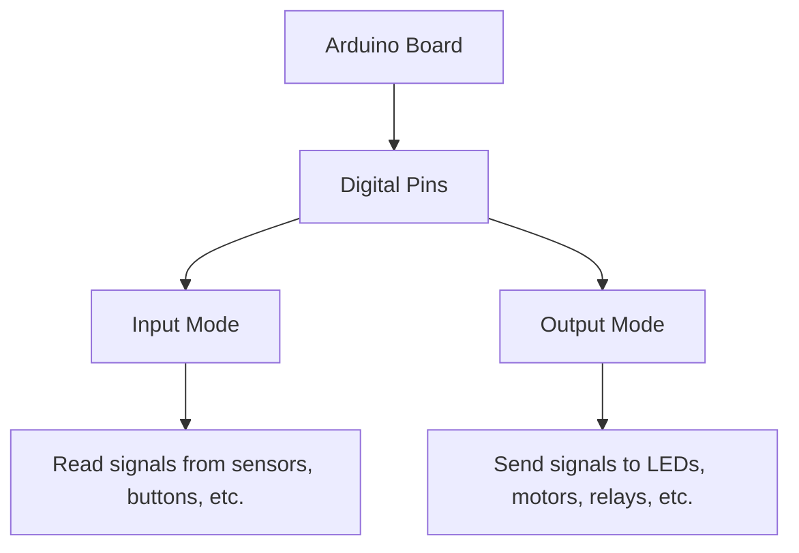

# Arduino Digital I/O

## Introduction

Digital Input/Output (I/O) is one of the most fundamental aspects of working with Arduino. Digital signals are binary in nature - they can only be in one of two states: HIGH (1) or LOW (0). In terms of voltage, HIGH typically represents 5V (or 3.3V on some boards), while LOW represents 0V (ground).

Arduino boards have multiple digital pins that can be configured either as inputs or outputs, allowing your Arduino to interact with the physical world. Whether you want to read the state of a button, turn on an LED, or control a motor, understanding digital I/O is essential.

## Digital Pins on Arduino

Most Arduino boards have several digital pins labeled with numbers. For instance, the Arduino Uno has 14 digital pins (numbered 0-13). 



Let's explore how to use these pins in both input and output configurations.

## Digital Output

When a pin is configured as an output, the Arduino can set it to either HIGH or LOW, effectively controlling external components connected to that pin.

### Setting Up a Digital Output

To use a digital pin as an output:

1. Declare the pin number as a constant
2. Configure the pin as an output in the `setup()` function using `pinMode()`
3. Control the pin state in the `loop()` function using `digitalWrite()`

Here's a basic example that blinks an LED connected to pin 13:

```cpp
// Define pin number
const int ledPin = 13;

void setup() {
  // Set the pin as output
  pinMode(ledPin, OUTPUT);
}

void loop() {
  // Turn LED on
  digitalWrite(ledPin, HIGH);
  delay(1000);  // Wait for 1 second
  
  // Turn LED off
  digitalWrite(ledPin, LOW);
  delay(1000);  // Wait for 1 second
}
```

In this example:
- We first define `ledPin` as pin 13
- In `setup()`, we configure that pin as an output
- In `loop()`, we alternate between HIGH and LOW states with a 1-second delay between changes

### Practical Output Example: Traffic Light Simulation

Let's create a more complex example - a traffic light simulation using three LEDs:

```cpp
// Define pin numbers
const int redPin = 10;
const int yellowPin = 9;
const int greenPin = 8;

void setup() {
  // Set all pins as OUTPUT
  pinMode(redPin, OUTPUT);
  pinMode(yellowPin, OUTPUT);
  pinMode(greenPin, OUTPUT);
}

void loop() {
  // Green light
  digitalWrite(redPin, LOW);
  digitalWrite(yellowPin, LOW);
  digitalWrite(greenPin, HIGH);
  delay(5000);  // Green light for 5 seconds
  
  // Yellow light
  digitalWrite(greenPin, LOW);
  digitalWrite(yellowPin, HIGH);
  delay(2000);  // Yellow light for 2 seconds
  
  // Red light
  digitalWrite(yellowPin, LOW);
  digitalWrite(redPin, HIGH);
  delay(5000);  // Red light for 5 seconds
}
```

Connect:
- A red LED to pin 10
- A yellow LED to pin 9
- A green LED to pin 8

Don't forget to include a current-limiting resistor (220-330 ohms) in series with each LED to prevent damage.

## Digital Input

When a pin is configured as an input, the Arduino can read the state of sensors, buttons, or other components connected to that pin.

### Setting Up a Digital Input

To use a digital pin as an input:

1. Declare the pin number as a constant
2. Configure the pin as an input in the `setup()` function using `pinMode()`
3. Read the pin state in the `loop()` function using `digitalRead()`

Here's a simple example that reads the state of a pushbutton and turns on an LED when the button is pressed:

```cpp
// Define pin numbers
const int buttonPin = 2;
const int ledPin = 13;

// Variable to store button state
int buttonState = 0;

void setup() {
  // Set button pin as input
  pinMode(buttonPin, INPUT);
  
  // Set LED pin as output
  pinMode(ledPin, OUTPUT);
}

void loop() {
  // Read the state of the button
  buttonState = digitalRead(buttonPin);
  
  // Check if button is pressed
  if (buttonState == HIGH) {
    // Turn LED on
    digitalWrite(ledPin, HIGH);
  } else {
    // Turn LED off
    digitalWrite(ledPin, LOW);
  }
}
```

In this example:
- The button is connected to pin 2
- The LED is connected to pin 13
- When the button is pressed (buttonState is HIGH), the LED turns on
- When the button is released (buttonState is LOW), the LED turns off

### Pull-up and Pull-down Resistors

When working with digital inputs, you'll often need pull-up or pull-down resistors to ensure stable readings. Without them, inputs can "float" between HIGH and LOW when not actively pressed.

Arduino provides internal pull-up resistors that can be enabled with:

```cpp
pinMode(buttonPin, INPUT_PULLUP);
```

When using INPUT_PULLUP:
- The pin reads LOW when connected to GND (button pressed)
- The pin reads HIGH when disconnected (button not pressed)

This inverts the logic compared to the previous example.

### Practical Input Example: Button Counter

Let's create an example that counts button presses and displays the count on the Serial Monitor:

```cpp
const int buttonPin = 2;  // Button connected to pin 2
int buttonState = 0;      // Current state of the button
int lastButtonState = 0;  // Previous state of the button
int counter = 0;          // Counter for button presses

void setup() {
  // Initialize the button pin as input with pull-up resistor
  pinMode(buttonPin, INPUT_PULLUP);
  
  // Initialize serial communication at 9600 bits per second
  Serial.begin(9600);
  
  Serial.println("Button Press Counter");
  Serial.println("Press the button to increment the counter");
}

void loop() {
  // Read the button state
  buttonState = digitalRead(buttonPin);
  
  // Check if the button state has changed
  if (buttonState != lastButtonState) {
    // If the button changed from HIGH to LOW (press)
    if (buttonState == LOW) {
      counter++;
      Serial.print("Button presses: ");
      Serial.println(counter);
    }
    
    // Small delay to debounce the button
    delay(50);
  }
  
  // Save the current button state for next comparison
  lastButtonState = buttonState;
}
```

This example introduces the concept of button debouncing. Physical buttons often "bounce" when pressed, causing multiple readings in quick succession. The small delay helps prevent this issue.

## Digital I/O Speed and Performance

The Arduino's digital I/O operations are quite fast. Some key performance details:

- `digitalWrite()` takes about 4.5 microseconds to execute on an Arduino Uno
- `digitalRead()` takes about 4.5 microseconds to execute on an Arduino Uno
- If you need faster I/O operations, you can directly manipulate the port registers

### Direct Port Manipulation

For advanced users needing extremely fast I/O, you can use direct port manipulation. This method bypasses the Arduino functions and directly accesses the microcontroller's registers:

```cpp
// Set pin 13 HIGH using direct port manipulation
PORTB |= (1 << 5);

// Set pin 13 LOW using direct port manipulation
PORTB &= ~(1 << 5);
```

This approach is much faster but requires understanding the specific microcontroller architecture and can vary between different Arduino boards.

## Combining Input and Output

Many projects combine both input and output functionalities. Let's create a more complex example that uses a button to control the speed of an LED blinking:

```cpp
const int buttonPin = 2;  // Button connected to pin 2
const int ledPin = 13;    // LED connected to pin 13

int buttonState = 0;      // Current button state
int blinkRate = 500;      // Current blink rate in milliseconds
int buttonPresses = 0;    // Number of button presses

void setup() {
  pinMode(ledPin, OUTPUT);
  pinMode(buttonPin, INPUT_PULLUP);
  Serial.begin(9600);
  
  Serial.println("Press the button to change the blink rate");
}

void loop() {
  // Read the button state
  buttonState = digitalRead(buttonPin);
  
  // If button is pressed (LOW with INPUT_PULLUP)
  if (buttonState == LOW) {
    buttonPresses++;
    
    // Change blink rate based on number of presses
    if (buttonPresses > 3) {
      buttonPresses = 0;  // Reset counter after 3 presses
    }
    
    // Set blink rate based on button press count
    switch (buttonPresses) {
      case 1:
        blinkRate = 1000;  // Slow - 1 second
        Serial.println("Slow blinking");
        break;
      case 2:
        blinkRate = 500;   // Medium - 0.5 seconds
        Serial.println("Medium blinking");
        break;
      case 3:
        blinkRate = 100;   // Fast - 0.1 seconds
        Serial.println("Fast blinking");
        break;
      default:
        blinkRate = 500;   // Default - 0.5 seconds
        break;
    }
    
    // Wait until button is released to avoid multiple counts
    while (digitalRead(buttonPin) == LOW) {
      delay(10);
    }
    
    // Additional debounce delay
    delay(100);
  }
  
  // Blink LED at the current rate
  digitalWrite(ledPin, HIGH);
  delay(blinkRate / 2);
  digitalWrite(ledPin, LOW);
  delay(blinkRate / 2);
}
```

This example demonstrates how to:
- Read a button state
- Change program behavior based on input
- Implement basic button debouncing
- Control an output with varying timing

## Summary

Digital I/O is the foundation of most Arduino projects. In this tutorial, you've learned:

- How to configure pins as digital inputs or outputs using `pinMode()`
- How to set output states using `digitalWrite()`
- How to read input states using `digitalRead()`
- How to use internal pull-up resistors with `INPUT_PULLUP`
- How to implement button debouncing to avoid multiple readings
- How to combine inputs and outputs in more complex projects

With these fundamental skills, you can now build a wide range of projects, from simple LED controllers to more complex interactive systems.

## Exercises

1. **Simple Alarm**: Create a circuit with a button and a buzzer. When the button is pressed, activate the buzzer for 3 seconds.

2. **Binary Counter**: Set up 4 LEDs in a row and make them count in binary from 0 to 15 when a button is pressed.

3. **Reaction Timer**: Create a game that turns on an LED after a random delay, then measures how quickly the user presses a button in response.

4. **Password Lock**: Use 4 buttons to create a simple password system. If the buttons are pressed in the correct sequence, light a green LED; otherwise, light a red LED.

5. **Traffic Light Controller**: Extend the traffic light example to include a pedestrian button that, when pressed, interrupts the normal sequence to allow safe pedestrian crossing.

## Additional Resources

- [Arduino Reference for Digital I/O](https://www.arduino.cc/reference/en/language/functions/digital-io/)
- [Arduino Input Pullup Tutorial](https://www.arduino.cc/reference/en/language/functions/digital-io/pinmode/)
- [Button Debouncing Techniques](https://www.arduino.cc/en/Tutorial/BuiltInExamples/Debounce)