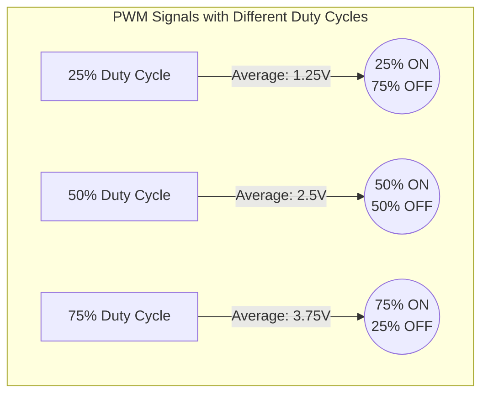

# Arduino PWM

## Introduction

Pulse Width Modulation (PWM) is a powerful technique that allows your Arduino to create analog-like output using digital means. While Arduino's digital pins can only output either 0V (LOW) or 5V (HIGH), PWM enables you to simulate voltages in between by rapidly switching the pin on and off at different duty cycles. This is particularly useful for controlling the brightness of LEDs, the speed of motors, or creating audio tones.

## What is PWM?

PWM stands for **Pulse Width Modulation**. It's a technique that generates analog-like signals using digital pulses by varying the amount of time the signal is ON versus OFF.

Here's how it works:

- The signal switches between ON (5V) and OFF (0V) very rapidly
- The **duty cycle** represents the percentage of time the signal is ON during one period
- By varying the duty cycle, we can change the average voltage of the signal



## PWM on Arduino

Arduino boards have specific pins that support PWM functionality. On most Arduino boards (like the Uno), these pins are marked with a `~` symbol (pins 3, 5, 6, 9, 10, and 11 on the Uno).

Arduino provides the `analogWrite()` function to control PWM output:

```cpp
analogWrite(pin, value);
```

Where:
- `pin` is the PWM pin number
- `value` is a number between 0 (always off) and 255 (always on)

For example, `analogWrite(9, 127)` would set pin 9 to a 50% duty cycle (approximately 2.5V average).

## PWM Frequency

The default PWM frequency on most Arduino pins is approximately:
- 490 Hz for pins 3, 5, 6, 9, 10, and 11 on the Arduino Uno
- 980 Hz for pins 5 and 6 on the Arduino Uno when using certain timer settings

This frequency is fast enough for most applications like LED brightness control or motor speed regulation.

## Basic Example: Controlling LED Brightness

Let's create a simple example to demonstrate PWM by controlling an LED's brightness:

```cpp
// LED brightness control with PWM
const int ledPin = 9;  // PWM pin with LED connected

void setup() {
  pinMode(ledPin, OUTPUT);  // Set the pin as output
}

void loop() {
  // Gradually increase brightness
  for (int brightness = 0; brightness <= 255; brightness++) {
    analogWrite(ledPin, brightness);
    delay(10);  // Small delay to see the effect
  }
  
  // Stay at full brightness for a moment
  delay(500);
  
  // Gradually decrease brightness
  for (int brightness = 255; brightness >= 0; brightness--) {
    analogWrite(ledPin, brightness);
    delay(10);  // Small delay to see the effect
  }
  
  // Stay off for a moment
  delay(500);
}
```

This code will make an LED repeatedly fade in and out by gradually changing the PWM duty cycle.

## Practical Application: Motor Speed Control

Another common application of PWM is controlling the speed of DC motors. Here's an example using a transistor to control a motor:

```cpp
// Motor speed control with PWM
const int motorPin = 3;  // PWM pin connected to transistor base

void setup() {
  pinMode(motorPin, OUTPUT);
  Serial.begin(9600);
  Serial.println("Enter a value between 0-255 to control motor speed:");
}

void loop() {
  // Check if data is available to read
  if (Serial.available() > 0) {
    // Read the incoming byte
    int speed = Serial.parseInt();
    
    // Constrain the value to 0-255
    speed = constrain(speed, 0, 255);
    
    // Control the motor
    analogWrite(motorPin, speed);
    
    // Print the speed value
    Serial.print("Motor speed set to: ");
    Serial.println(speed);
  }
}
```

In this example, the user can type a number between 0 and 255 in the Serial Monitor to control the motor's speed.

## Creating Audio Tones with PWM

PWM can also be used to generate simple audio tones by setting the appropriate frequency:

```cpp
// Generate a simple tone using PWM
const int speakerPin = 11;  // PWM pin connected to a speaker

void setup() {
  pinMode(speakerPin, OUTPUT);
}

void loop() {
  // Play a tone for 1 second
  tone(speakerPin, 440);  // 440 Hz (A4 note)
  delay(1000);
  
  // Play a different tone for 1 second
  tone(speakerPin, 523);  // 523 Hz (C5 note)
  delay(1000);
  
  // Silence for 1 second
  noTone(speakerPin);
  delay(1000);
}
```

The `tone()` function uses PWM internally to generate the specified frequency.

## Advanced Concept: Changing PWM Resolution and Frequency

While the default PWM resolution on Arduino is 8-bit (values from 0-255), some applications might require finer control. On more advanced Arduino boards like the Due or Zero, you can use higher resolution PWM.

Additionally, you can modify the PWM frequency by directly manipulating the timer registers, but this is an advanced topic that requires understanding the microcontroller architecture.

Here's a simplified example for changing PWM frequency on pins 9 and 10 of an Arduino Uno:

```cpp
// Change PWM frequency for pins 9 and 10
void setup() {
  pinMode(9, OUTPUT);
  pinMode(10, OUTPUT);
  
  // Clear Timer1 control registers
  TCCR1A = 0;
  TCCR1B = 0;
  
  // Set non-inverting mode for OCR1A (pin 9) and OCR1B (pin 10)
  TCCR1A |= (1 << COM1A1) | (1 << COM1B1);
  
  // Set fast PWM mode using ICR1 as TOP
  TCCR1A |= (1 << WGM11);
  TCCR1B |= (1 << WGM12) | (1 << WGM13);
  
  // Set prescaler to 1 for maximum resolution
  TCCR1B |= (1 << CS10);
  
  // Set PWM frequency to about 2kHz (16MHz / 8000 = 2kHz)
  ICR1 = 8000;
  
  // Set 50% duty cycle for both pins
  OCR1A = 4000;  // Pin 9
  OCR1B = 4000;  // Pin 10
}

void loop() {
  // Nothing needed in the loop for this example
}
```

This is an advanced example and is provided for educational purposes. For most beginner applications, the standard `analogWrite()` function is sufficient.

## Common Issues and Troubleshooting

When working with PWM, you might encounter some common issues:

1. **LED flickering**: If using PWM at too low a frequency, LEDs might visibly flicker. Increase the PWM frequency or use the default settings.

2. **Motor not starting at low values**: Many motors require a minimum PWM value to overcome inertia. You might need to provide an initial "kick" with a higher PWM value.

3. **Interference**: PWM signals can sometimes cause interference with other electronics. Using proper filtering or isolation can help.

4. **Resource conflicts**: If using libraries that also use timers (like Servo), there might be conflicts with PWM pins. Check library documentation for compatibility.

## Summary

Pulse Width Modulation is a fundamental technique in Arduino programming that allows you to:

- Create analog-like output using digital pins
- Control the brightness of LEDs
- Regulate the speed of motors
- Generate simple audio tones
- Simulate analog voltages between 0V and 5V

PWM works by rapidly switching a pin between HIGH and LOW states, with the duty cycle determining the average voltage. Arduino provides the simple `analogWrite()` function to control PWM output with values from 0 to 255.

## Exercises

1. **LED Fade Pattern**: Modify the LED brightness example to create a pattern where three LEDs fade in sequence.

2. **Interactive Brightness Control**: Use a potentiometer (connected to an analog input) to control the brightness of an LED using PWM.

3. **Musical Scale**: Create a program that plays a musical scale using the `tone()` function.

4. **Motor Speed Patterns**: Program a motor to run at different speeds in a pattern (slow, medium, fast, medium, slow).

5. **PWM Measurement**: Use the `pulseIn()` function to measure the duty cycle of a PWM signal and display it on the Serial Monitor.

## Additional Resources

- [Arduino PWM Tutorial](https://www.arduino.cc/en/Tutorial/PWM)
- [Arduino Reference: analogWrite()](https://www.arduino.cc/reference/en/language/functions/analog-io/analogwrite/)
- [Arduino Reference: tone()](https://www.arduino.cc/reference/en/language/functions/advanced-io/tone/)