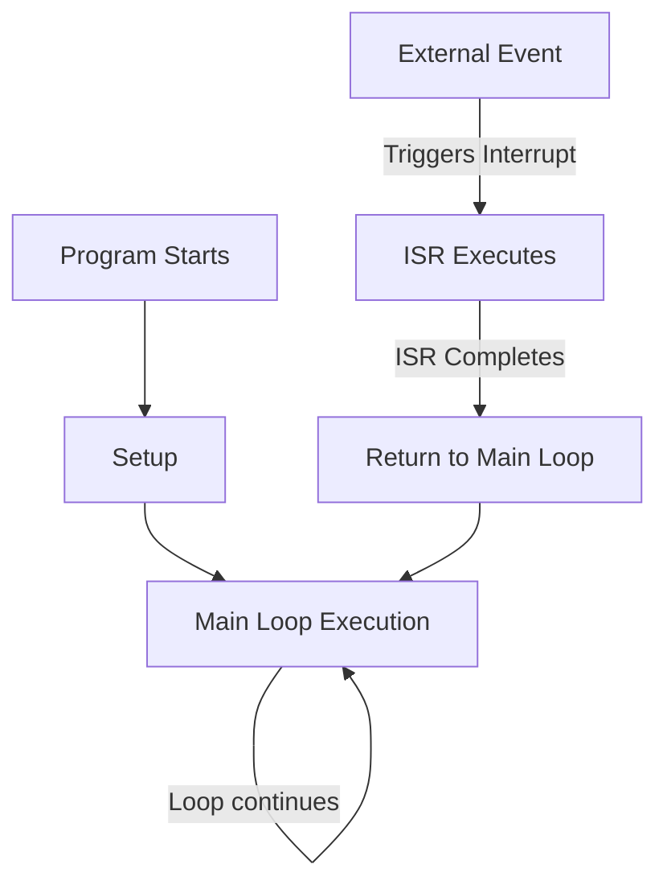

# Arduino Interrupts

## Introduction

Have you ever needed your Arduino to respond immediately to a button press, even while it's busy doing something else? Or wanted to precisely time an event without using `delay()` which stops your entire program? This is where **interrupts** come into play.

Interrupts are special signals that temporarily pause the normal execution of your code to handle urgent events. Think of them like a doorbell - no matter what you're doing inside your house, when someone rings the doorbell, you pause your activity to answer the door.

In this tutorial, we'll explore how to use interrupts in Arduino to create more responsive and efficient projects.

## Why Use Interrupts?

Before diving into implementation, let's understand why interrupts are valuable:

1. **Responsiveness**: Interrupts allow your Arduino to react immediately to events
2. **Efficiency**: No need to constantly check (poll) for an input change
3. **Precision**: Interrupts can capture exact timing of events
4. **Multitasking**: Handle multiple tasks without one blocking another

Consider this scenario: you're building a project that displays temperature on an LCD while also needing to respond to a button press. Without interrupts, you'd need to check the button state repeatedly, potentially missing quick presses or causing display updates to stutter.

## Interrupt Basics

Arduino supports two main types of interrupts:

1. **External interrupts**: Triggered by external events on specific pins
2. **Timer interrupts**: Generated by internal timers at precise intervals

Let's start with external interrupts, which are easier to understand for beginners.

## External Interrupts

External interrupts respond to changes on specific Arduino pins. On the Arduino Uno, pins 2 and 3 support interrupts.

### Available Pins for External Interrupts

| Arduino Board | Available Interrupt Pins |
|---------------|--------------------------|
| Uno, Nano, Mini | 2, 3 |
| Mega, Mega2560 | 2, 3, 18, 19, 20, 21 |
| Leonardo | 0, 1, 2, 3, 7 |
| ESP8266 | All GPIO pins |
| ESP32 | All GPIO pins |

### Interrupt Trigger Modes

Interrupts can be triggered in several ways:

- `LOW`: Trigger when the pin is low
- `CHANGE`: Trigger when the pin changes value
- `RISING`: Trigger when the pin goes from low to high
- `FALLING`: Trigger when the pin goes from high to low
- `HIGH`: Trigger when the pin is high (only on ESP8266/ESP32)

## Your First Interrupt Example

Let's create a simple example where an LED blinks continuously, but when a button is pressed, we change the blinking pattern immediately.

```cpp
const int ledPin = 13;      // Built-in LED
const int buttonPin = 2;    // Interrupt pin
volatile boolean pattern = false;  // Volatile is important!

void setup() {
  pinMode(ledPin, OUTPUT);
  pinMode(buttonPin, INPUT_PULLUP);
  
  // Attach interrupt to button pin
  attachInterrupt(digitalPinToInterrupt(buttonPin), changePattern, FALLING);
  
  Serial.begin(9600);
  Serial.println("Program started. Press button to change pattern.");
}

void loop() {
  if (pattern) {
    // Fast blink
    digitalWrite(ledPin, HIGH);
    delay(100);
    digitalWrite(ledPin, LOW);
    delay(100);
  } else {
    // Slow blink
    digitalWrite(ledPin, HIGH);
    delay(500);
    digitalWrite(ledPin, LOW);
    delay(500);
  }
}

// Interrupt Service Routine (ISR)
void changePattern() {
  pattern = !pattern;
  Serial.println("Pattern changed!");
}
```

### How This Example Works

1. We set up a button on pin 2 (an interrupt-capable pin)
2. We attach an interrupt to that pin using `attachInterrupt()`
3. When the button is pressed (FALLING edge), the `changePattern()` function is called
4. This function toggles the `pattern` variable, changing the LED blinking speed

### Important Note: `volatile` Keyword

Notice the `volatile` keyword before our `pattern` variable. This tells the compiler that this variable can change unexpectedly (from interrupts). Without this keyword, the Arduino might optimize the code in ways that break interrupt functionality.

## Interrupt Service Routines (ISRs)

The function that executes when an interrupt occurs is called an **Interrupt Service Routine** or ISR. There are important restrictions for ISRs:

1. They should be as short and fast as possible
2. They cannot use `delay()`
3. They cannot use `millis()`
4. They don't return values
5. They should avoid complex calculations
6. Variables shared with the main program should be declared as `volatile`

## Debouncing in Interrupts

Physical buttons often "bounce" - rapidly switching between on and off states when pressed. This can trigger multiple interrupts for a single press. Let's add debouncing to our example:

```cpp
const int ledPin = 13;
const int buttonPin = 2;
volatile boolean pattern = false;
volatile unsigned long lastInterruptTime = 0;  // For debounce

void setup() {
  pinMode(ledPin, OUTPUT);
  pinMode(buttonPin, INPUT_PULLUP);
  
  attachInterrupt(digitalPinToInterrupt(buttonPin), changePattern, FALLING);
  
  Serial.begin(9600);
  Serial.println("Program started. Press button to change pattern.");
}

void loop() {
  if (pattern) {
    digitalWrite(ledPin, HIGH);
    delay(100);
    digitalWrite(ledPin, LOW);
    delay(100);
  } else {
    digitalWrite(ledPin, HIGH);
    delay(500);
    digitalWrite(ledPin, LOW);
    delay(500);
  }
}

void changePattern() {
  unsigned long interruptTime = millis();
  
  // If interrupts come faster than 200ms, assume it's a bounce and ignore
  if (interruptTime - lastInterruptTime > 200) {
    pattern = !pattern;
    Serial.println("Pattern changed!");
  }
  
  lastInterruptTime = interruptTime;
}
```

This code ignores button presses that happen within 200ms of each other, preventing bounce issues.

## Timer Interrupts

Besides external interrupts, Arduino can also generate interrupts based on internal timers. This allows executing code at precise intervals without using `delay()`.

Here's a simple example that toggles an LED every second using timer interrupts:

```cpp
#include <TimerOne.h>

const int ledPin = 13;
volatile boolean ledState = false;

void setup() {
  pinMode(ledPin, OUTPUT);
  
  // Initialize TimerOne
  Timer1.initialize(1000000);  // 1 second in microseconds
  Timer1.attachInterrupt(blinkLED);
  
  Serial.begin(9600);
  Serial.println("Timer interrupt example started");
}

void loop() {
  // Main program can do other things here without being blocked
  Serial.println("Main loop running...");
  delay(2000);
}

// Timer ISR
void blinkLED() {
  ledState = !ledState;
  digitalWrite(ledPin, ledState);
}
```

For this example, you'll need to install the TimerOne library through the Arduino Library Manager.

## Real-World Applications

### Example 1: Emergency Stop System

Imagine you're building a robot. You want a kill switch that immediately stops all motors if pressed, regardless of what the robot is doing:

```cpp
const int motorPin = 9;
const int emergencyStopPin = 2;
volatile boolean emergencyStop = false;

void setup() {
  pinMode(motorPin, OUTPUT);
  pinMode(emergencyStopPin, INPUT_PULLUP);
  
  attachInterrupt(digitalPinToInterrupt(emergencyStopPin), stopEverything, FALLING);
  
  Serial.begin(9600);
  Serial.println("Robot starting. Press emergency button to stop.");
}

void loop() {
  if (!emergencyStop) {
    // Normal robot operation
    analogWrite(motorPin, 200);  // Run motor
    Serial.println("Robot running...");
  } else {
    // Emergency stop condition
    analogWrite(motorPin, 0);    // Stop motor
    Serial.println("EMERGENCY STOP ACTIVATED");
  }
  delay(1000);
}

void stopEverything() {
  emergencyStop = true;
}
```

### Example 2: Precise Pulse Counting

Interrupts are perfect for counting pulses from sensors like rotary encoders or flow meters:

```cpp
const int sensorPin = 2;    // Interrupt pin
volatile unsigned int pulseCount = 0;
unsigned int lastReportedCount = 0;
unsigned long lastReportTime = 0;

void setup() {
  pinMode(sensorPin, INPUT_PULLUP);
  
  attachInterrupt(digitalPinToInterrupt(sensorPin), countPulse, RISING);
  
  Serial.begin(9600);
  Serial.println("Pulse counter started");
}

void loop() {
  // Check if 1 second has passed
  if (millis() - lastReportTime >= 1000) {
    // Calculate pulses per second
    unsigned int currentCount = pulseCount;
    unsigned int pulsesPerSecond = currentCount - lastReportedCount;
    
    Serial.print("Pulses per second: ");
    Serial.println(pulsesPerSecond);
    
    lastReportedCount = currentCount;
    lastReportTime = millis();
  }
  
  // Main program can do other things here
}

void countPulse() {
  pulseCount++;
}
```

This could be used to measure RPM, flow rate, or other frequency-based measurements.

## Common Pitfalls and Solutions

### 1. ISR Taking Too Long

If your ISR takes too long to execute, it can cause your main program to behave unpredictably.

**Solution**: Keep ISRs as short as possible. Set flags in the ISR and handle the actual work in the main loop:

```cpp
volatile boolean eventFlag = false;

void setup() {
  // Setup code
  attachInterrupt(digitalPinToInterrupt(2), flagEvent, RISING);
}

void loop() {
  if (eventFlag) {
    // Handle the event
    handleEvent();
    eventFlag = false;
  }
  
  // Regular program continues
}

void flagEvent() {
  eventFlag = true;  // Simply set a flag, don't do actual work here
}

void handleEvent() {
  // Complex handling code goes here, not in the ISR
}
```

### 2. Missing Interrupts

If interrupts occur faster than your Arduino can process them, you might miss some events.

**Solution**: Use hardware techniques like RC filters for noisy signals, or implement a circular buffer to queue events.

### 3. Race Conditions

When both the ISR and main loop access the same variables, race conditions can occur.

**Solution**: Use the `volatile` keyword for shared variables and consider using atomic operations for multi-byte variables.

## More Advanced Concepts

### Port Register Interrupts

For more advanced projects, you can use direct port manipulation to handle interrupts more efficiently:

```cpp
// Set up Pin Change Interrupt on Arduino Uno
void setup() {
  pinMode(8, INPUT_PULLUP);
  
  // Enable Pin Change Interrupt on Port B
  PCICR |= 0b00000001;    // Enable PCINT0
  PCMSK0 |= 0b00000001;   // Enable PCINT0 for PB0 (Arduino pin 8)
  
  Serial.begin(9600);
}

// Pin Change Interrupt Service Routine
ISR(PCINT0_vect) {
  // This ISR will run whenever any enabled pin on Port B changes state
  if (digitalRead(8) == LOW) {
    // Button was pressed
    Serial.println("Button pressed!");
  }
}

void loop() {
  // Main program continues...
}
```

This approach allows using more pins for interrupts but requires understanding the Arduino's hardware at a deeper level.

## Visualizing Interrupt Flow

Here's a diagram showing how program flow works with interrupts:



## Summary

Interrupts are a powerful tool in the Arduino programming toolkit that allow you to:

- Respond immediately to external events
- Execute code at precise time intervals
- Handle time-critical tasks efficiently
- Build more responsive projects

Remember these key points when working with interrupts:

1. Not all pins support interrupts - check your Arduino model
2. Keep ISRs short and fast
3. Use the `volatile` keyword for variables shared between ISRs and main code
4. Handle debouncing for button-triggered interrupts
5. Consider timer interrupts for regular tasks
6. For complex processing, set flags in ISRs and handle details in the main loop

## Exercises to Try

1. **Reaction Timer**: Create a game that measures how quickly a player can press a button after an LED lights up. Use interrupts to capture the exact moment the button is pressed.

2. **Interrupt-Based Drum Machine**: Connect multiple buttons to interrupt pins and make different sounds when each button is pressed.

3. **Energy-Efficient Weather Station**: Use a timer interrupt to wake an Arduino from sleep mode every 10 minutes to take sensor readings, then go back to sleep.

## Additional Resources

Here are some helpful resources to further explore Arduino interrupts:

- [Arduino Reference - attachInterrupt()](https://www.arduino.cc/reference/en/language/functions/external-interrupts/attachinterrupt/)
- [Arduino Reference - detachInterrupt()](https://www.arduino.cc/reference/en/language/functions/external-interrupts/detachinterrupt/)
- [TimerOne Library](https://www.arduino.cc/reference/en/libraries/timerone/)

Remember that interrupts are a more advanced concept, so don't worry if it takes some practice to fully understand them. Start with simple examples and gradually work your way up to more complex applications.

Happy tinkering!