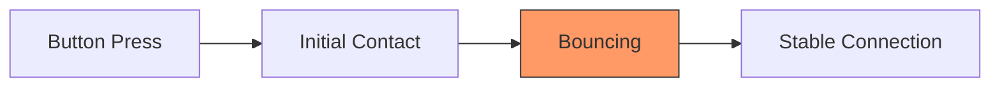
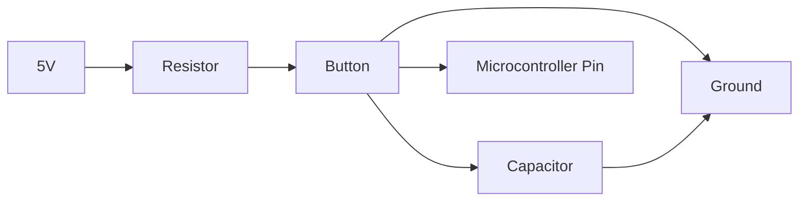

# Arduino Debouncing

## Introduction

Have you ever noticed your Arduino project registering multiple button presses when you only pressed the button once? Or perhaps your project seems to behave erratically when you interact with buttons or switches? This common issue is caused by a phenomenon called "bouncing," and in this tutorial, we'll learn how to solve it using a technique called "debouncing."

## What is Bouncing?

When you press a mechanical button or switch, the metal contacts inside don't make a perfect connection instantly. Instead, they bounce against each other for a short period (typically a few milliseconds) before settling into a stable state.



To your Arduino, which can execute millions of instructions per second, these bounces look like multiple button presses happening in rapid succession. This can cause:

- Multiple triggers from a single button press
- Incorrect counting in counter applications
- Unpredictable behavior in state machines
- False triggers in interrupt-driven applications

## Understanding the Problem with Code

Let's look at a simple example that demonstrates the bouncing problem:

```cpp
const int buttonPin = 2;    // Pin connected to the button
int buttonState;            // Current state of the button
int lastButtonState = LOW;  // Previous state of the button
int buttonPressCount = 0;   // Counter for button presses

void setup() {
  pinMode(buttonPin, INPUT_PULLUP);  // Set button pin as input with internal pull-up resistor
  Serial.begin(9600);                // Initialize serial communication
  Serial.println("Button Press Counter");
}

void loop() {
  // Read the current button state
  buttonState = digitalRead(buttonPin);
  
  // Check if the button state has changed from HIGH to LOW (button press)
  if (buttonState == LOW && lastButtonState == HIGH) {
    // Increment the button press counter
    buttonPressCount++;
    Serial.print("Button presses: ");
    Serial.println(buttonPressCount);
  }
  
  // Save the current button state for comparison in the next loop
  lastButtonState = buttonState;
}
```

If you upload this code and press the button once, you might see multiple counts registered. This happens because the Arduino detects the bouncing of the button contacts as separate button presses.

## Debouncing Solutions

There are several ways to address the bouncing problem:

### 1. Software Debouncing with Delay

The simplest approach is to add a small delay after detecting a button press:

```cpp
const int buttonPin = 2;    // Pin connected to the button
int buttonState;            // Current state of the button
int lastButtonState = LOW;  // Previous state of the button
int buttonPressCount = 0;   // Counter for button presses

void setup() {
  pinMode(buttonPin, INPUT_PULLUP);  // Set button pin as input with internal pull-up resistor
  Serial.begin(9600);                // Initialize serial communication
  Serial.println("Button Press Counter with Delay Debouncing");
}

void loop() {
  // Read the current button state
  buttonState = digitalRead(buttonPin);
  
  // Check if the button state has changed from HIGH to LOW (button press)
  if (buttonState == LOW && lastButtonState == HIGH) {
    // Debounce by adding a delay
    delay(50);  // 50 milliseconds delay to ignore bounces
    
    // Increment the button press counter
    buttonPressCount++;
    Serial.print("Button presses: ");
    Serial.println(buttonPressCount);
  }
  
  // Save the current button state for comparison in the next loop
  lastButtonState = buttonState;
}
```

While this approach works for simple applications, it has a significant drawback: `delay()` blocks the execution of other code, meaning your Arduino can't do anything else during that debouncing period.

### 2. Software Debouncing with millis()

A better approach uses the `millis()` function to track time without blocking code execution:

```cpp
const int buttonPin = 2;          // Pin connected to the button
int buttonState;                  // Current state of the button
int lastButtonState = LOW;        // Previous state of the button
int buttonPressCount = 0;         // Counter for button presses
unsigned long lastDebounceTime = 0;  // Last time the button state changed
unsigned long debounceDelay = 50;    // Debounce time in milliseconds

void setup() {
  pinMode(buttonPin, INPUT_PULLUP);  // Set button pin as input with internal pull-up resistor
  Serial.begin(9600);                // Initialize serial communication
  Serial.println("Button Press Counter with millis() Debouncing");
}

void loop() {
  // Read the current button state
  int reading = digitalRead(buttonPin);
  
  // Check if the button state has changed
  if (reading != lastButtonState) {
    // Reset the debounce timer
    lastDebounceTime = millis();
  }
  
  // Check if enough time has passed since the last state change
  if ((millis() - lastDebounceTime) > debounceDelay) {
    // If the button state has changed and is stable
    if (reading != buttonState) {
      buttonState = reading;
      
      // If the button is pressed (LOW when using INPUT_PULLUP)
      if (buttonState == LOW) {
        buttonPressCount++;
        Serial.print("Button presses: ");
        Serial.println(buttonPressCount);
      }
    }
  }
  
  // Save the current reading for the next loop
  lastButtonState = reading;
}
```

This approach has several advantages:
- It doesn't block code execution
- It can handle multiple buttons efficiently
- It works well for most real-world applications

### 3. Using the Bounce2 Library

For even more convenience, you can use the popular Bounce2 library, which handles all the debouncing logic for you:

First, install the Bounce2 library through the Arduino Library Manager (Sketch > Include Library > Manage Libraries).

```cpp
#include <Bounce2.h>

const int buttonPin = 2;    // Pin connected to the button
int buttonPressCount = 0;   // Counter for button presses

// Create a Bounce object
Bounce button = Bounce();

void setup() {
  // Setup the button with an internal pull-up
  pinMode(buttonPin, INPUT_PULLUP);
  
  // Attach the debouncer to the button pin
  button.attach(buttonPin);
  
  // Set the debounce interval (in milliseconds)
  button.interval(50);
  
  // Initialize serial communication
  Serial.begin(9600);
  Serial.println("Button Press Counter with Bounce2 Library");
}

void loop() {
  // Update the Bounce instance (must be called every loop)
  button.update();
  
  // Check if the button was pressed (fell)
  if (button.fell()) {
    buttonPressCount++;
    Serial.print("Button presses: ");
    Serial.println(buttonPressCount);
  }
}
```

This approach is clean, efficient, and easy to use for multiple buttons.

## Real-World Application: Toggle LED with Debounced Button

Here's a practical example that toggles an LED state with each button press:

```cpp
const int buttonPin = 2;          // Pin connected to the button
const int ledPin = 13;            // Pin connected to the LED
int ledState = LOW;               // Current state of the LED
int buttonState;                  // Current state of the button
int lastButtonState = HIGH;       // Previous state of the button
unsigned long lastDebounceTime = 0;  // Last time the button state changed
unsigned long debounceDelay = 50;    // Debounce time in milliseconds

void setup() {
  pinMode(buttonPin, INPUT_PULLUP);  // Set button pin as input with internal pull-up resistor
  pinMode(ledPin, OUTPUT);           // Set LED pin as output
  
  // Set the initial LED state
  digitalWrite(ledPin, ledState);
}

void loop() {
  // Read the current button state
  int reading = digitalRead(buttonPin);
  
  // Check if the button state has changed
  if (reading != lastButtonState) {
    // Reset the debounce timer
    lastDebounceTime = millis();
  }
  
  // Check if enough time has passed since the last state change
  if ((millis() - lastDebounceTime) > debounceDelay) {
    // If the button state has changed and is stable
    if (reading != buttonState) {
      buttonState = reading;
      
      // Toggle the LED state when the button is pressed (LOW when using INPUT_PULLUP)
      if (buttonState == LOW) {
        ledState = !ledState;
        digitalWrite(ledPin, ledState);
      }
    }
  }
  
  // Save the current reading for the next loop
  lastButtonState = reading;
}
```

## Hardware Debouncing

While software debouncing is often sufficient, hardware debouncing can also be implemented using capacitors and resistors:



A simple RC circuit with values like:
- Resistor: 10kΩ
- Capacitor: 0.1μF (100nF)

This creates a low-pass filter that smooths out the rapid transitions caused by bouncing.

## Common Debouncing Issues and Solutions

| Issue | Solution |
|-------|----------|
| Missed button presses | Decrease debounce delay |
| Multiple triggers | Increase debounce delay |
| Button release not detected | Use both rise and fall detection |
| High CPU usage | Use a library or hardware debouncing |

## Summary

Debouncing is a critical technique for creating reliable button interfaces in Arduino projects. We've covered:

1. The problem of contact bouncing in mechanical switches
2. Simple debouncing with delays (not recommended for most applications)
3. Non-blocking debouncing with `millis()`
4. Using the Bounce2 library for convenient debouncing
5. A practical example of a debounced toggle switch
6. Basic hardware debouncing techniques

By implementing proper debouncing in your projects, you'll create more reliable, professional, and user-friendly interfaces.

## Further Exercises

1. Modify the toggle LED example to control multiple LEDs with different buttons
2. Create a counter that increments on button press and decrements on button release
3. Build a simple state machine that changes between different LED patterns with each button press
4. Compare the performance of different debouncing methods by counting the number of false triggers
5. Implement hardware debouncing and compare its effectiveness to software methods

Happy coding!