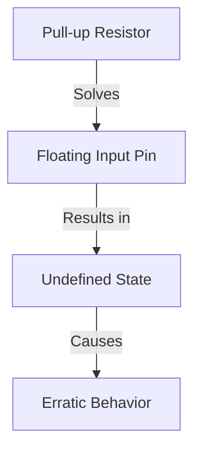
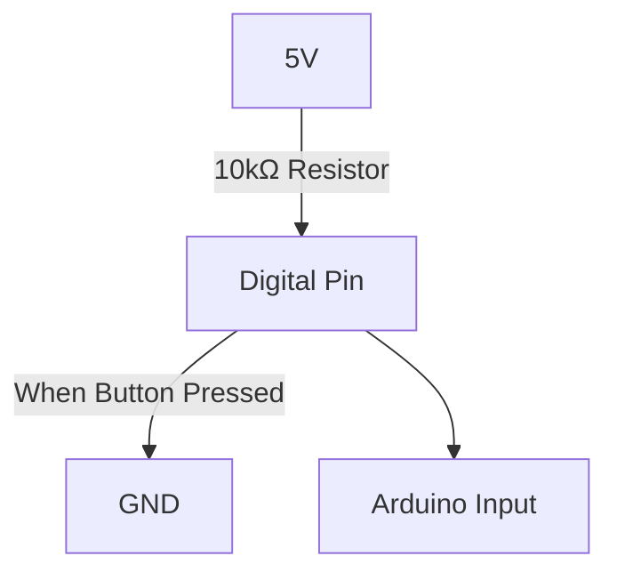
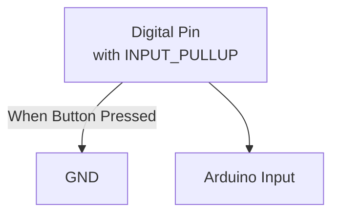

# Arduino Pull-up Resistors

## Introduction

When working with Arduino boards, you'll often need to connect buttons, switches, or other input devices. In these situations, you'll encounter a fundamental concept in electronics: pull-up resistors. These components play a crucial role in ensuring your digital inputs work reliably and predictably.

In this tutorial, you'll learn:
- What pull-up resistors are and why they're necessary
- How to implement external pull-up resistors
- How to use Arduino's built-in internal pull-up resistors
- Practical applications and troubleshooting tips

## What are Pull-up Resistors?

A pull-up resistor is a resistor connected between a digital input pin and the power supply (VCC). Its purpose is to ensure that the input pin reads a definite logical state (HIGH) when the input device (like a button or switch) is not actively connecting the pin to ground.

### The Floating Pin Problem

Without a pull-up resistor, an input pin that isn't connected to anything is called a "floating" pin. The state of a floating pin is undefined – it might read HIGH or LOW unpredictably due to electrical noise, creating erratic behavior in your program.



### How Pull-up Resistors Work

A pull-up resistor creates a default HIGH state on an input pin. When you press a button or close a switch that connects the pin to ground (GND), the pin is pulled LOW, creating a clear state change that your Arduino can detect.

## External Pull-up Resistors

Let's look at how to implement external pull-up resistors in your Arduino circuits.

### Components You'll Need

- Arduino board
- Breadboard
- Push button or switch
- 10kΩ resistor (common value for pull-ups)
- Jumper wires

### Circuit Diagram



### Wiring Steps

1. Connect one end of the 10kΩ resistor to 5V (VCC)
2. Connect the other end of the resistor to your digital input pin
3. Connect the same digital pin to one terminal of your button/switch
4. Connect the other terminal of the button/switch to GND

### Example Code

```cpp
const int buttonPin = 2;  // Button connected to digital pin 2
int buttonState = 0;      // Variable to store button state

void setup() {
  pinMode(buttonPin, INPUT);  // Set the button pin as input
  Serial.begin(9600);         // Initialize serial communication
}

void loop() {
  // Read the state of the button
  buttonState = digitalRead(buttonPin);
  
  // Check if the button is pressed
  // When the button is pressed, the pin will be LOW
  if (buttonState == LOW) {
    Serial.println("Button is pressed!");
  } else {
    Serial.println("Button is not pressed");
  }
  
  delay(100);  // Short delay for stability
}
```

### Expected Output

When running this code with the external pull-up circuit:
- "Button is not pressed" when the button is released
- "Button is pressed!" when the button is pressed

## Internal Pull-up Resistors

Most Arduino boards have built-in pull-up resistors that can be enabled in software, eliminating the need for external resistors.

### Advantages of Internal Pull-ups

- Simplifies circuit design
- Reduces component count
- Saves space on your breadboard or PCB
- Convenient for prototyping

### How to Enable Internal Pull-ups

To enable the internal pull-up resistor, use `INPUT_PULLUP` when setting the pin mode:

```cpp
pinMode(buttonPin, INPUT_PULLUP);
```

### Example Circuit with Internal Pull-up



### Complete Example with Internal Pull-up

```cpp
const int buttonPin = 2;  // Button connected to digital pin 2
int buttonState = 0;      // Variable to store button state

void setup() {
  pinMode(buttonPin, INPUT_PULLUP);  // Enable internal pull-up resistor
  Serial.begin(9600);                // Initialize serial communication
}

void loop() {
  // Read the state of the button
  buttonState = digitalRead(buttonPin);
  
  // Check if the button is pressed
  // When using pull-up resistors, the pin is LOW when button is pressed
  if (buttonState == LOW) {
    Serial.println("Button is pressed!");
  } else {
    Serial.println("Button is not pressed");
  }
  
  delay(100);  // Short delay for stability
}
```

### Logic Inversion with Pull-ups

It's important to note that when using pull-up resistors (either external or internal):
- The pin reads HIGH when the button is NOT pressed
- The pin reads LOW when the button is pressed

This is the opposite of what many beginners expect, so keep this in mind when writing your code!

## Real-world Applications

### 1. Button Debouncing

Physical buttons often "bounce" when pressed, creating multiple signals. A pull-up resistor combined with a capacitor can help create a simple debouncing circuit.

```cpp
const int buttonPin = 2;
int buttonState;
int lastButtonState = HIGH;  // Last state of the button
unsigned long lastDebounceTime = 0;
unsigned long debounceDelay = 50;  // Debounce time in milliseconds

void setup() {
  pinMode(buttonPin, INPUT_PULLUP);
  Serial.begin(9600);
}

void loop() {
  // Read the current state of the button
  int reading = digitalRead(buttonPin);
  
  // If the button state changed, reset the debounce timer
  if (reading != lastButtonState) {
    lastDebounceTime = millis();
  }
  
  // Check if the debounce delay has passed
  if ((millis() - lastDebounceTime) > debounceDelay) {
    // If the button state has changed
    if (reading != buttonState) {
      buttonState = reading;
      
      // Only print when the button is pressed (LOW)
      if (buttonState == LOW) {
        Serial.println("Button pressed!");
      }
    }
  }
  
  lastButtonState = reading;
}
```

### 2. Reading Multiple Buttons

Pull-up resistors are essential when reading multiple buttons with a limited number of pins:

```cpp
const int numButtons = 3;
const int buttonPins[numButtons] = {2, 3, 4};

void setup() {
  Serial.begin(9600);
  
  // Enable pull-up resistors for all buttons
  for (int i = 0; i < numButtons; i++) {
    pinMode(buttonPins[i], INPUT_PULLUP);
  }
}

void loop() {
  // Check each button
  for (int i = 0; i < numButtons; i++) {
    if (digitalRead(buttonPins[i]) == LOW) {
      Serial.print("Button ");
      Serial.print(i + 1);
      Serial.println(" pressed!");
    }
  }
  delay(100);
}
```

### 3. Connecting Sensors

Many digital sensors (like PIR motion sensors or tilt switches) work best with pull-up resistors:

```cpp
const int tiltSensorPin = 7;

void setup() {
  pinMode(tiltSensorPin, INPUT_PULLUP);
  Serial.begin(9600);
}

void loop() {
  if (digitalRead(tiltSensorPin) == LOW) {
    Serial.println("Tilt detected!");
  } else {
    Serial.println("Sensor in normal position");
  }
  delay(500);
}
```

## Pull-up vs. Pull-down Resistors

While this tutorial focuses on pull-up resistors, it's worth mentioning pull-down resistors as an alternative approach:

| Pull-up Resistors | Pull-down Resistors |
|-------------------|---------------------|
| Connect to VCC (5V) | Connect to GND |
| Default state is HIGH | Default state is LOW |
| Button press reads LOW | Button press reads HIGH |
| Built into Arduino (`INPUT_PULLUP`) | Not built into Arduino |

Most Arduino projects use pull-up resistors because of the convenience of the built-in `INPUT_PULLUP` functionality.

## Choosing the Right Resistor Value

The value of a pull-up resistor affects the circuit's behavior:

- **Too low** (e.g., 100Ω): Wastes power, may overload the button/switch when pressed
- **Too high** (e.g., 1MΩ): Makes the input susceptible to noise and interference
- **Just right** (typically 10kΩ): Provides reliable operation without wasting power

For most Arduino projects, **10kΩ** is a good default value. The internal pull-up resistors in Arduino boards are typically around 20kΩ to 50kΩ.

## Troubleshooting Pull-up Circuits

If your pull-up circuit isn't working correctly, check these common issues:

1. **Inconsistent readings**: Add a small capacitor (0.1μF) between the input pin and ground to filter noise
2. **Always reading HIGH**: Check your wiring; the button might not be connecting to ground properly
3. **Always reading LOW**: The pin might be shorted to ground, or you might have the wrong pin in your code
4. **Erratic behavior**: Implement software debouncing as shown in the examples

## Summary

Pull-up resistors are essential components in Arduino projects that involve digital inputs like buttons and switches. They solve the floating pin problem by establishing a default state, making your inputs reliable and predictable.

Key points to remember:
- Pull-up resistors connect between an input pin and VCC (5V)
- They create a default HIGH state when a button/switch is not pressed
- When the button is pressed, it connects the pin to GND, changing the state to LOW
- Arduino has built-in pull-up resistors that can be enabled with `INPUT_PULLUP`
- 10kΩ is a common value for external pull-up resistors

## Exercises

1. Create a circuit with three buttons using internal pull-up resistors to control three LEDs (toggle them on/off)
2. Build a simple digital piano with four buttons and a piezo buzzer, using pull-up resistors
3. Implement a combination lock system where a specific sequence of button presses unlocks an LED
4. Compare the behavior of external pull-up resistors of different values (1kΩ, 10kΩ, 100kΩ) to see how they affect input reliability

## Further Resources

- [Arduino Reference: INPUT_PULLUP](https://www.arduino.cc/reference/en/language/variables/constants/constants/)
- [Arduino Button Tutorial](https://www.arduino.cc/en/Tutorial/Button)
- [Sparkfun: Pull-up Resistors](https://learn.sparkfun.com/tutorials/pull-up-resistors)