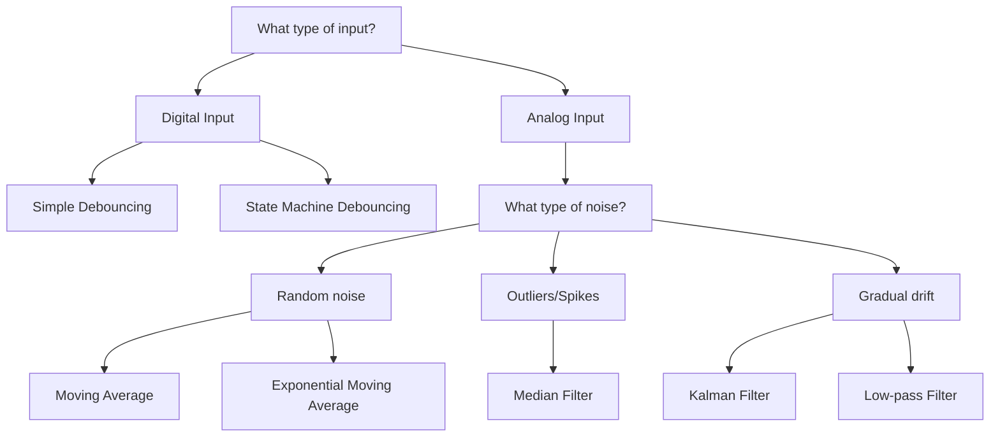

# Arduino Input Filtering

## Introduction

When working with Arduino projects, one of the most common challenges is dealing with noisy or unstable input signals. Whether you're reading values from sensors, buttons, or other input devices, raw input data often contains noise, fluctuations, or unwanted artifacts that can affect your project's reliability.

Input filtering is the process of cleaning up these signals to extract meaningful data. In this tutorial, we'll explore different techniques to filter and process input signals on Arduino, helping you build more robust and reliable projects.

## Why Filter Input Signals?

Before diving into implementation, let's understand why input filtering is crucial:

1. **Noise Reduction**: Electronic components and environmental factors introduce noise to sensor readings.
2. **Debouncing**: Mechanical switches and buttons "bounce" when pressed, causing multiple false triggers.
3. **Smoothing Data**: Even in relatively clean signals, small variations might need to be averaged out.
4. **Removing Outliers**: Occasional erroneous readings can throw off calculations.
5. **Improving Response**: Properly filtered inputs allow for more accurate decision-making in your code.

## Basic Filtering Techniques

### 1. Debouncing Buttons and Switches

When you press a mechanical button, the metal contacts inside often "bounce" before settling, causing multiple rapid on/off signals instead of a clean transition.

Here's a simple debouncing technique using time delays:

```cpp
const int buttonPin = 2;    // Button connected to pin 2
int buttonState;            // Current state of the button
int lastButtonState = LOW;  // Previous state of the button
unsigned long lastDebounceTime = 0;  // Last time the button state changed
unsigned long debounceDelay = 50;    // Debounce time in milliseconds

void setup() {
  pinMode(buttonPin, INPUT_PULLUP);
  Serial.begin(9600);
}

void loop() {
  // Read the current state of the button
  int reading = digitalRead(buttonPin);

  // If the button state changed, due to noise or pressing
  if (reading != lastButtonState) {
    // Reset the debouncing timer
    lastDebounceTime = millis();
  }

  // Check if enough time has passed since the last state change
  if ((millis() - lastDebounceTime) > debounceDelay) {
    // If the button state has changed
    if (reading != buttonState) {
      buttonState = reading;
      
      // Only print when the button is pressed (LOW because of INPUT_PULLUP)
      if (buttonState == LOW) {
        Serial.println("Button Pressed!");
      }
    }
  }

  // Save the current reading for the next loop
  lastButtonState = reading;
}
```

This code only registers a button press after the signal has remained stable for the specified debounce period (50ms in this example).

### 2. Moving Average for Analog Sensors

For analog sensors like potentiometers, temperature sensors, or light sensors, a moving average filter can smooth out noisy readings:

```cpp
const int sensorPin = A0;    // Analog sensor connected to pin A0
const int numReadings = 10;  // Number of readings to average

int readings[numReadings];   // Array to store readings
int readIndex = 0;           // Current position in the array
int total = 0;               // Running total of readings
int average = 0;             // The moving average

void setup() {
  Serial.begin(9600);
  
  // Initialize all readings to 0
  for (int i = 0; i < numReadings; i++) {
    readings[i] = 0;
  }
}

void loop() {
  // Subtract the last reading
  total = total - readings[readIndex];
  
  // Read the sensor
  readings[readIndex] = analogRead(sensorPin);
  
  // Add the new reading to the total
  total = total + readings[readIndex];
  
  // Advance to the next position in the array
  readIndex = (readIndex + 1) % numReadings;
  
  // Calculate the average
  average = total / numReadings;
  
  // Print the average value
  Serial.println(average);
  
  // Small delay between readings
  delay(50);
}
```

This code maintains a "sliding window" of the last 10 readings and calculates their average, which helps smooth out random fluctuations.

## Advanced Filtering Techniques

### 1. Exponential Moving Average

A more efficient way to implement a moving average is using an exponential moving average (EMA), which requires less memory and computation:

```cpp
const int sensorPin = A0;
float emaValue = 0;          // Exponential moving average value
float alpha = 0.1;           // Smoothing factor (0-1)
                            // Lower values = more smoothing

void setup() {
  Serial.begin(9600);
  // Initialize EMA with the first reading
  emaValue = analogRead(sensorPin);
}

void loop() {
  int sensorValue = analogRead(sensorPin);
  
  // Update EMA: new_average = alpha * current_value + (1 - alpha) * previous_average
  emaValue = (alpha * sensorValue) + ((1 - alpha) * emaValue);
  
  Serial.print("Raw: ");
  Serial.print(sensorValue);
  Serial.print("\tFiltered: ");
  Serial.println(emaValue);
  
  delay(50);
}
```

The `alpha` value determines how responsive the filter is to changes:
- Lower alpha (closer to 0): More smoothing, slower response
- Higher alpha (closer to 1): Less smoothing, faster response

### 2. Median Filtering

Median filtering is excellent for removing "spikes" or outliers in the data:

```cpp
const int sensorPin = A0;
const int filterSize = 5;    // Size of the median filter (odd number works best)
int readings[filterSize];    // Array to store readings

void setup() {
  Serial.begin(9600);
}

void loop() {
  // Shift previous readings
  for (int i = filterSize - 1; i > 0; i--) {
    readings[i] = readings[i - 1];
  }
  
  // Add new reading
  readings[0] = analogRead(sensorPin);
  
  // Create a temporary array for sorting
  int temp[filterSize];
  for (int i = 0; i < filterSize; i++) {
    temp[i] = readings[i];
  }
  
  // Simple bubble sort to find median
  for (int i = 0; i < filterSize - 1; i++) {
    for (int j = 0; j < filterSize - i - 1; j++) {
      if (temp[j] > temp[j + 1]) {
        // Swap
        int swap = temp[j];
        temp[j] = temp[j + 1];
        temp[j + 1] = swap;
      }
    }
  }
  
  // The median is the middle value
  int medianValue = temp[filterSize / 2];
  
  Serial.print("Raw: ");
  Serial.print(readings[0]);
  Serial.print("\tMedian: ");
  Serial.println(medianValue);
  
  delay(50);
}
```

Median filtering is particularly useful when dealing with occasional extreme values that would throw off an averaging filter.

### 3. Kalman Filter

For more complex applications, a Kalman filter provides optimal noise reduction. Here's a simplified implementation:

```cpp
const int sensorPin = A0;

// Kalman filter variables
float kalmanEstimate = 0;     // Estimated value
float kalmanError = 1;        // Estimation error
float kalmanGain = 0;         // Kalman gain
float kalmanQ = 0.01;         // Process noise
float kalmanR = 0.1;          // Measurement noise

void setup() {
  Serial.begin(9600);
  // Initialize with first reading
  kalmanEstimate = analogRead(sensorPin);
}

void loop() {
  int sensorValue = analogRead(sensorPin);
  
  // Prediction step
  // (No prediction model in this simple example)
  kalmanError = kalmanError + kalmanQ;
  
  // Update step
  kalmanGain = kalmanError / (kalmanError + kalmanR);
  kalmanEstimate = kalmanEstimate + kalmanGain * (sensorValue - kalmanEstimate);
  kalmanError = (1 - kalmanGain) * kalmanError;
  
  Serial.print("Raw: ");
  Serial.print(sensorValue);
  Serial.print("\tKalman: ");
  Serial.println(kalmanEstimate);
  
  delay(50);
}
```

The Kalman filter parameters:
- **Q (Process Noise)**: How much we expect our system to change between measurements
- **R (Measurement Noise)**: How noisy we expect our measurements to be

## Practical Application: Temperature Sensor With Filtering

Let's apply these concepts to a real-world example with a temperature sensor (like LM35 or TMP36):

```cpp
const int tempSensorPin = A0;
const float referenceVoltage = 5.0;  // 5V for most Arduinos, 3.3V for some boards

// Filter variables
const int numReadings = 10;
int readings[numReadings];
int readIndex = 0;
int total = 0;
float avgTemperature = 0;

void setup() {
  Serial.begin(9600);
  
  // Initialize all readings to 0
  for (int i = 0; i < numReadings; i++) {
    readings[i] = 0;
  }
  
  Serial.println("Temperature Monitoring System");
  Serial.println("-----------------------------");
  delay(1000);
}

void loop() {
  // Subtract the last reading
  total = total - readings[readIndex];
  
  // Read the sensor
  readings[readIndex] = analogRead(tempSensorPin);
  
  // Add the new reading to the total
  total = total + readings[readIndex];
  
  // Advance to the next position in the array
  readIndex = (readIndex + 1) % numReadings;
  
  // Calculate the average
  int averageReading = total / numReadings;
  
  // Convert to voltage
  float voltage = averageReading * (referenceVoltage / 1023.0);
  
  // Convert to temperature (for TMP36 sensor)
  // TMP36: 10mV per degree with a 500mV offset at 0°C
  float temperature = (voltage - 0.5) * 100.0;
  
  // Print the temperature
  Serial.print("Temperature: ");
  Serial.print(temperature);
  Serial.println(" °C");
  
  delay(1000);  // Update once per second
}
```

## Filter Selection Guide

Here's a guide to help you choose the right filtering technique:



## Tips for Effective Input Filtering

1. **Choose the Right Filter**: Different applications require different filtering approaches.
2. **Tune Parameters Carefully**: Filter parameters like window size or smoothing factor greatly affect performance.
3. **Balance Responsiveness vs. Smoothness**: More aggressive filtering means smoother data but slower response to real changes.
4. **Combine Techniques**: For challenging inputs, consider using multiple filters in sequence.
5. **Test Thoroughly**: Always test your filtering under real-world conditions.

## Summary

Input filtering is essential for creating reliable Arduino projects that can operate in noisy real-world environments. In this tutorial, we've covered:

- Basic debouncing for buttons and switches
- Moving average filters for analog sensors
- Advanced techniques like exponential moving average, median filtering, and Kalman filters
- A practical application with a temperature sensor
- Guidelines for selecting the appropriate filter for your needs

By implementing these techniques, you can significantly improve the reliability and accuracy of your Arduino projects, making them more robust in real-world applications.

## Exercises

1. Implement button debouncing and display the number of button presses on an LCD.
2. Compare the different filtering techniques on the same sensor input and visualize the differences using the Serial Plotter.
3. Create a project that measures ambient light using an LDR and uses filtering to detect significant changes while ignoring brief fluctuations.
4. Implement a digital low-pass filter for an audio input and observe how different cutoff frequencies affect the output.
5. Design a moisture sensing system for plants that uses filtered readings to decide when to activate a water pump.

## Additional Resources

- [Arduino Reference: Smoothing](https://www.arduino.cc/en/Tutorial/BuiltInExamples/Smoothing)
- [Arduino Reference: Debounce](https://www.arduino.cc/en/Tutorial/BuiltInExamples/Debounce)
- Search for "digital signal processing basics" for more advanced filtering techniques
- Explore libraries like [`RunningMedian`](https://github.com/RobTillaart/RunningMedian) for ready-to-use filtering implementations