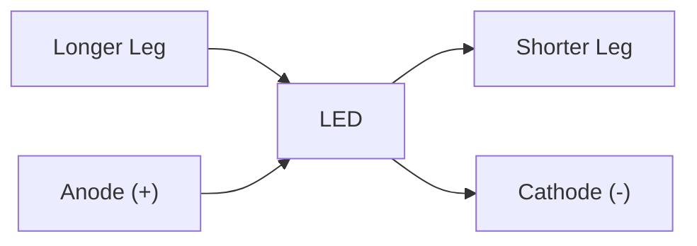
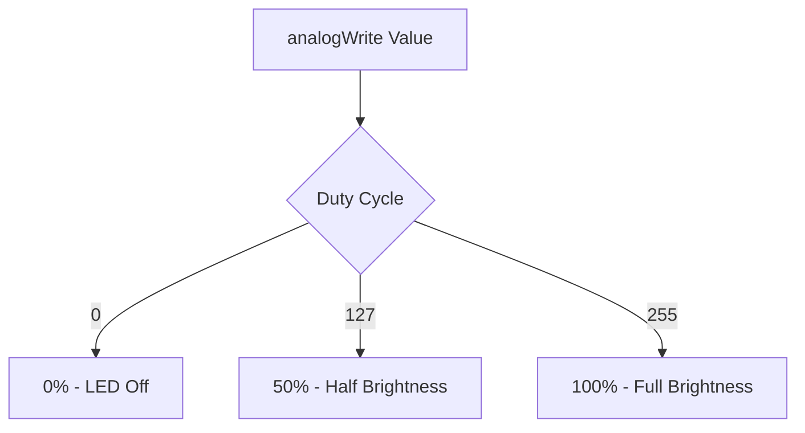

# Arduino LED Control

## Introduction

Controlling LEDs (Light Emitting Diodes) is often the first step in any Arduino journey. It's the "Hello World" of hardware programming! In this tutorial, we'll explore various techniques to control LEDs using Arduino, from simple blinking to complex patterns and RGB color mixing.

LEDs are perfect for beginners because they:
- Provide immediate visual feedback
- Require minimal components
- Teach fundamental concepts of digital and analog outputs
- Form the building blocks for more complex display projects

## Getting Started with LEDs

### Basic Components Needed

To follow along with this tutorial, you'll need:

- Arduino board (Uno, Nano, or similar)
- LEDs (various colors)
- Resistors (220Ω or 330Ω)
- Breadboard
- Jumper wires

### Understanding LED Polarity

LEDs are diodes, which means they only allow current to flow in one direction. Each LED has:

- **Anode (positive leg)**: Typically longer
- **Cathode (negative leg)**: Typically shorter and often has a flat edge on the plastic casing



## Basic LED Control

### Connecting an LED to Arduino

The most basic LED circuit connects to Arduino as follows:

1. Connect the Arduino's GND pin to the breadboard's negative rail
2. Connect the LED's cathode (shorter leg) to the negative rail
3. Connect the LED's anode (longer leg) to a resistor
4. Connect the other end of the resistor to an Arduino digital pin (e.g., pin 13)

The resistor is crucial for limiting current and protecting both the LED and Arduino.

### Blinking an LED - The Classic First Project

Let's start with the classic "Blink" example:

```cpp
const int ledPin = 13;  // Most Arduinos have an on-board LED at pin 13

void setup() {
  pinMode(ledPin, OUTPUT);  // Initialize the LED pin as an output
}

void loop() {
  digitalWrite(ledPin, HIGH);   // Turn the LED on
  delay(1000);                  // Wait for one second
  digitalWrite(ledPin, LOW);    // Turn the LED off
  delay(1000);                  // Wait for one second
}
```

**What's happening:**
- `pinMode()` configures the digital pin as an output
- `digitalWrite(HIGH)` applies 5V to the pin, turning the LED on
- `digitalWrite(LOW)` applies 0V to the pin, turning the LED off
- `delay()` pauses execution for the specified milliseconds

## Controlling Multiple LEDs

### Sequential Lighting

Let's create a simple sequence with multiple LEDs:

```cpp
const int ledPins[] = {2, 3, 4, 5, 6};  // Array of LED pins
const int numLeds = 5;                  // Number of LEDs

void setup() {
  // Initialize all LED pins as outputs
  for (int i = 0; i < numLeds; i++) {
    pinMode(ledPins[i], OUTPUT);
  }
}

void loop() {
  // Light each LED sequentially
  for (int i = 0; i < numLeds; i++) {
    digitalWrite(ledPins[i], HIGH);  // Turn on current LED
    delay(200);                      // Keep it on for 200ms
    digitalWrite(ledPins[i], LOW);   // Turn it off
  }
}
```

### LED Patterns

We can create more complex patterns by manipulating the sequence:

```cpp
const int ledPins[] = {2, 3, 4, 5, 6};
const int numLeds = 5;

void setup() {
  for (int i = 0; i < numLeds; i++) {
    pinMode(ledPins[i], OUTPUT);
  }
}

void loop() {
  // Pattern 1: All on then all off
  allLedsOn();
  delay(500);
  allLedsOff();
  delay(500);
  
  // Pattern 2: Back and forth
  backAndForth(3);  // Repeat 3 times
  
  // Pattern 3: Random blinking
  randomBlink(10);  // Blink 10 times
}

// Function to turn all LEDs on
void allLedsOn() {
  for (int i = 0; i < numLeds; i++) {
    digitalWrite(ledPins[i], HIGH);
  }
}

// Function to turn all LEDs off
void allLedsOff() {
  for (int i = 0; i < numLeds; i++) {
    digitalWrite(ledPins[i], LOW);
  }
}

// Function to create back and forth pattern
void backAndForth(int repeats) {
  for (int r = 0; r < repeats; r++) {
    // Forward
    for (int i = 0; i < numLeds; i++) {
      digitalWrite(ledPins[i], HIGH);
      delay(100);
      digitalWrite(ledPins[i], LOW);
    }
    // Backward
    for (int i = numLeds - 2; i >= 0; i--) {
      digitalWrite(ledPins[i], HIGH);
      delay(100);
      digitalWrite(ledPins[i], LOW);
    }
  }
}

// Function to blink LEDs randomly
void randomBlink(int numBlinks) {
  for (int i = 0; i < numBlinks; i++) {
    int randomLed = random(numLeds);  // Choose a random LED
    digitalWrite(ledPins[randomLed], HIGH);
    delay(50);
    digitalWrite(ledPins[randomLed], LOW);
    delay(50);
  }
}
```

## Controlling LED Brightness

### Using PWM for Dimming

Arduino's `analogWrite()` function uses Pulse Width Modulation (PWM) to control the average voltage supplied to an LED, which changes its brightness. Only pins marked with a `~` support PWM.

```cpp
const int ledPin = 9;  // Must be a PWM pin (marked with ~)

void setup() {
  pinMode(ledPin, OUTPUT);
}

void loop() {
  // Fade from off to bright
  for (int brightness = 0; brightness <= 255; brightness++) {
    analogWrite(ledPin, brightness);
    delay(5);
  }
  
  // Fade from bright to off
  for (int brightness = 255; brightness >= 0; brightness--) {
    analogWrite(ledPin, brightness);
    delay(5);
  }
}
```

**How PWM works:**
- The function accepts values from 0 (always off) to 255 (always on)
- Arduino rapidly switches the pin on and off to create an "average" voltage
- The duty cycle (ratio of on-time to total time) determines brightness



## RGB LED Control

### Connecting an RGB LED

RGB LEDs contain three LEDs (Red, Green, and Blue) in one package. They come in two types:
- Common Cathode: Negative leg is shared
- Common Anode: Positive leg is shared

For a common cathode RGB LED:

1. Connect the common cathode to GND
2. Connect each colored anode through a resistor (220Ω) to a PWM pin

```cpp
const int redPin = 9;
const int greenPin = 10;
const int bluePin = 11;

void setup() {
  pinMode(redPin, OUTPUT);
  pinMode(greenPin, OUTPUT);
  pinMode(bluePin, OUTPUT);
}

void loop() {
  // Red
  setColor(255, 0, 0);
  delay(1000);
  
  // Green
  setColor(0, 255, 0);
  delay(1000);
  
  // Blue
  setColor(0, 0, 255);
  delay(1000);
  
  // Yellow (Red + Green)
  setColor(255, 255, 0);
  delay(1000);
  
  // Purple (Red + Blue)
  setColor(255, 0, 255);
  delay(1000);
  
  // Cyan (Green + Blue)
  setColor(0, 255, 255);
  delay(1000);
  
  // White (All colors)
  setColor(255, 255, 255);
  delay(1000);
}

void setColor(int red, int green, int blue) {
  analogWrite(redPin, red);
  analogWrite(greenPin, green);
  analogWrite(bluePin, blue);
}
```

### Creating Color Transitions

We can create smooth transitions between colors:

```cpp
const int redPin = 9;
const int greenPin = 10;
const int bluePin = 11;

void setup() {
  pinMode(redPin, OUTPUT);
  pinMode(greenPin, OUTPUT);
  pinMode(bluePin, OUTPUT);
}

void loop() {
  // Transition through the color spectrum
  // Red to Yellow
  for (int g = 0; g <= 255; g++) {
    setColor(255, g, 0);
    delay(5);
  }
  
  // Yellow to Green
  for (int r = 255; r >= 0; r--) {
    setColor(r, 255, 0);
    delay(5);
  }
  
  // Green to Cyan
  for (int b = 0; b <= 255; b++) {
    setColor(0, 255, b);
    delay(5);
  }
  
  // Cyan to Blue
  for (int g = 255; g >= 0; g--) {
    setColor(0, g, 255);
    delay(5);
  }
  
  // Blue to Purple
  for (int r = 0; r <= 255; r++) {
    setColor(r, 0, 255);
    delay(5);
  }
  
  // Purple to Red
  for (int b = 255; b >= 0; b--) {
    setColor(255, 0, b);
    delay(5);
  }
}

void setColor(int red, int green, int blue) {
  analogWrite(redPin, red);
  analogWrite(greenPin, green);
  analogWrite(bluePin, blue);
}
```

## Real-World Applications

### LED as Status Indicator

LEDs are commonly used to indicate status. Here's an example using an LED to indicate temperature ranges from a sensor:

```cpp
#include <DHT.h>

#define DHTPIN 2         // Pin connected to DHT sensor
#define DHTTYPE DHT11    // DHT sensor type
#define RED_LED 9        // Red LED pin
#define YELLOW_LED 10    // Yellow LED pin
#define GREEN_LED 11     // Green LED pin

DHT dht(DHTPIN, DHTTYPE);

void setup() {
  Serial.begin(9600);
  dht.begin();
  pinMode(RED_LED, OUTPUT);
  pinMode(YELLOW_LED, OUTPUT);
  pinMode(GREEN_LED, OUTPUT);
}

void loop() {
  // Read temperature
  float temperature = dht.readTemperature();
  
  // Check if reading is valid
  if (isnan(temperature)) {
    Serial.println("Failed to read from DHT sensor!");
    blinkAllLeds(3);  // Error indication
    return;
  }
  
  // Display temperature
  Serial.print("Temperature: ");
  Serial.print(temperature);
  Serial.println(" °C");
  
  // Set LED based on temperature range
  if (temperature < 18) {
    // Too cold - blue
    setLeds(LOW, LOW, HIGH);
  } else if (temperature >= 18 && temperature <= 25) {
    // Comfortable - green
    setLeds(LOW, HIGH, LOW);
  } else {
    // Too hot - red
    setLeds(HIGH, LOW, LOW);
  }
  
  delay(2000);  // Wait before next reading
}

void setLeds(int red, int yellow, int green) {
  digitalWrite(RED_LED, red);
  digitalWrite(YELLOW_LED, yellow);
  digitalWrite(GREEN_LED, green);
}

void blinkAllLeds(int times) {
  for (int i = 0; i < times; i++) {
    digitalWrite(RED_LED, HIGH);
    digitalWrite(YELLOW_LED, HIGH);
    digitalWrite(GREEN_LED, HIGH);
    delay(200);
    digitalWrite(RED_LED, LOW);
    digitalWrite(YELLOW_LED, LOW);
    digitalWrite(GREEN_LED, LOW);
    delay(200);
  }
}
```

### Mood Lighting with RGB LEDs

Create ambient lighting that responds to sound:

```cpp
const int soundSensorPin = A0;  // Sound sensor on analog pin 0
const int redPin = 9;
const int greenPin = 10;
const int bluePin = 11;

void setup() {
  pinMode(redPin, OUTPUT);
  pinMode(greenPin, OUTPUT);
  pinMode(bluePin, OUTPUT);
  Serial.begin(9600);
}

void loop() {
  // Read the sound level
  int soundLevel = analogRead(soundSensorPin);
  Serial.println(soundLevel);
  
  // Map sound levels to colors and intensity
  int red = map(soundLevel, 0, 300, 0, 255);
  int green = map(soundLevel, 300, 600, 0, 255);
  int blue = map(soundLevel, 600, 1023, 0, 255);
  
  // Constrain values to valid range
  red = constrain(red, 0, 255);
  green = constrain(green, 0, 255);
  blue = constrain(blue, 0, 255);
  
  // Set LED color
  setColor(red, green, blue);
  delay(10);
}

void setColor(int red, int green, int blue) {
  analogWrite(redPin, red);
  analogWrite(greenPin, green);
  analogWrite(bluePin, blue);
}
```

## Working with LED Matrices and Strips

For more advanced displays, you can use LED matrices and strips. A brief introduction:

### LED Matrix Basics

LED matrices consist of LEDs arranged in rows and columns. You can control them using libraries like `LedControl` for MAX7219/MAX7221 based displays:

```cpp
#include <LedControl.h>

// Parameters: DIN pin, CLK pin, CS pin, number of devices
LedControl lc = LedControl(12, 11, 10, 1);

void setup() {
  // Wake up the MAX72XX from power-saving mode
  lc.shutdown(0, false);
  
  // Set medium brightness
  lc.setIntensity(0, 8);
  
  // Clear the display
  lc.clearDisplay(0);
}

void loop() {
  // Draw a smiling face
  byte smile[8] = {
    B00111100,
    B01000010,
    B10100101,
    B10000001,
    B10100101,
    B10011001,
    B01000010,
    B00111100
  };
  
  // Display the pattern
  for (int i = 0; i < 8; i++) {
    lc.setRow(0, i, smile[i]);
  }
  
  delay(1000);
  lc.clearDisplay(0);
  delay(500);
}
```

### Addressable LED Strips (NeoPixels)

Addressable LED strips like NeoPixels (WS2812B) let you control each LED individually:

```cpp
#include <Adafruit_NeoPixel.h>

#define PIN        6  // Data pin
#define NUMPIXELS 30  // Number of LEDs in your strip

Adafruit_NeoPixel pixels(NUMPIXELS, PIN, NEO_GRB + NEO_KHZ800);

void setup() {
  pixels.begin();  // Initialize NeoPixel strip
}

void loop() {
  // Rainbow cycle along whole strip
  rainbowCycle(20);
}

void rainbowCycle(int speedDelay) {
  byte *c;
  uint16_t i, j;
  
  for (j = 0; j < 256 * 5; j++) {  // 5 cycles of all colors on wheel
    for (i = 0; i < pixels.numPixels(); i++) {
      c = wheel(((i * 256 / pixels.numPixels()) + j) & 255);
      pixels.setPixelColor(i, pixels.Color(*c, *(c+1), *(c+2)));
    }
    pixels.show();
    delay(speedDelay);
  }
}

byte* wheel(byte WheelPos) {
  static byte c[3];
  
  if (WheelPos < 85) {
    c[0] = WheelPos * 3;
    c[1] = 255 - WheelPos * 3;
    c[2] = 0;
  } else if (WheelPos < 170) {
    WheelPos -= 85;
    c[0] = 255 - WheelPos * 3;
    c[1] = 0;
    c[2] = WheelPos * 3;
  } else {
    WheelPos -= 170;
    c[0] = 0;
    c[1] = WheelPos * 3;
    c[2] = 255 - WheelPos * 3;
  }
  
  return c;
}
```

## Troubleshooting LED Projects

### Common Issues and Solutions

| Problem | Possible Cause | Solution |
|---------|---------------|----------|
| LED doesn't light up | Incorrect polarity | Flip the LED |
| LED doesn't light up | Missing resistor | Add appropriate resistor |
| LED very dim | Resistor value too high | Use lower value resistor |
| LED burns out quickly | Missing or wrong resistor | Use correct resistor |
| Inconsistent behavior | Loose connections | Check wiring |
| Inconsistent brightness | Using non-PWM pin for analogWrite | Switch to PWM pin (~) |

## Summary

In this tutorial, we've explored:

- Basic LED connections and the importance of current-limiting resistors
- Controlling single LEDs with digital outputs
- Creating patterns with multiple LEDs
- Using PWM to control LED brightness
- Working with RGB LEDs to create custom colors
- Real-world applications for LED control
- Introduction to more advanced LED displays

LEDs are the gateway to the world of electronics and display technology. They're simple enough for beginners but versatile enough to create complex and beautiful projects. As you continue your Arduino journey, these skills will form the foundation for more advanced display projects.

## Exercises

1. **Beginner**: Modify the basic blink sketch to create an SOS signal (three short blinks, three long blinks, three short blinks).
2. **Intermediate**: Create a "traffic light" simulation with red, yellow, and green LEDs.
3. **Advanced**: Build a "Simon Says" memory game using four LEDs and buttons.
4. **Challenge**: Create a VU meter that displays sound levels using a row of LEDs.

## Additional Resources

- [Arduino Reference for digitalRead/Write](https://www.arduino.cc/reference/en/language/functions/digital-io/digitalwrite/)
- [Arduino PWM Tutorial](https://www.arduino.cc/en/Tutorial/PWM)
- [Adafruit NeoPixel Guide](https://learn.adafruit.com/adafruit-neopixel-uberguide)
- [Arduino LED Projects for Beginners](https://create.arduino.cc/projecthub/projects/tags/led)