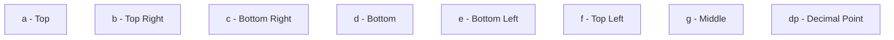

# Arduino 7-Segment Display

## Introduction

Seven-segment displays are one of the most common electronic display components used to show numerical information. Despite their simple appearance, they're incredibly useful for projects that need to display numbers such as digital clocks, counters, or basic measurement equipment.

In this tutorial, you'll learn how to connect and program 7-segment displays with an Arduino. We'll cover both single-digit and multi-digit displays, explore different connection types, and build practical projects you can adapt for your own creations.

## What is a 7-Segment Display?

A 7-segment display consists of seven LEDs (segments) arranged in the shape of the number "8". Each segment is labeled with letters from 'a' to 'g', plus an additional segment for the decimal point (dp).



By turning specific segments on or off, we can form any numeral from 0 to 9 and even some letters:

| Number | Segments Lit |
|--------|--------------|
| 0 | a, b, c, d, e, f |
| 1 | b, c |
| 2 | a, b, d, e, g |
| 3 | a, b, c, d, g |
| 4 | b, c, f, g |
| 5 | a, c, d, f, g |
| 6 | a, c, d, e, f, g |
| 7 | a, b, c |
| 8 | a, b, c, d, e, f, g |
| 9 | a, b, c, d, f, g |

## Types of 7-Segment Displays

There are two main types of 7-segment displays:

### Common Cathode

In a common cathode display, all the cathodes (negative terminals) of the LED segments are connected together. To light a segment, you need to apply a HIGH signal (5V) to its corresponding pin.

### Common Anode

In a common anode display, all the anodes (positive terminals) of the LED segments are connected together. To light a segment, you need to apply a LOW signal (0V) to its corresponding pin.

## Hardware Requirements

For this tutorial, you'll need:

- Arduino board (Uno, Nano, or similar)
- 7-segment display (common cathode or common anode)
- 220Ω resistors (8 pieces - one for each segment including decimal point)
- Breadboard
- Jumper wires

## Wiring a 7-Segment Display

Let's connect a single common cathode 7-segment display to an Arduino:

1. Connect the common cathode pin to Arduino's GND
2. Connect each segment (a-g and dp) to a digital pin on the Arduino through a 220Ω resistor

For a common cathode display, a typical connection might be:

| 7-Segment Pin | Arduino Pin |
|---------------|-------------|
| Common Cathode | GND |
| a | 2 |
| b | 3 |
| c | 4 |
| d | 5 |
| e | 6 |
| f | 7 |
| g | 8 |
| dp | 9 |

For a common anode display, connect the common anode pin to 5V instead of GND.

## Programming a 7-Segment Display

Let's start with a simple example that counts from 0 to 9:

```cpp
// Define the Arduino pins connected to each segment
const int a = 2;
const int b = 3;
const int c = 4;
const int d = 5;
const int e = 6;
const int f = 7;
const int g = 8;
const int dp = 9;

// For a common cathode display: 1 = ON, 0 = OFF
// For a common anode display, swap these values
byte digits[10][8] = {
  //a, b, c, d, e, f, g, dp
  {1, 1, 1, 1, 1, 1, 0, 0}, // 0
  {0, 1, 1, 0, 0, 0, 0, 0}, // 1
  {1, 1, 0, 1, 1, 0, 1, 0}, // 2
  {1, 1, 1, 1, 0, 0, 1, 0}, // 3
  {0, 1, 1, 0, 0, 1, 1, 0}, // 4
  {1, 0, 1, 1, 0, 1, 1, 0}, // 5
  {1, 0, 1, 1, 1, 1, 1, 0}, // 6
  {1, 1, 1, 0, 0, 0, 0, 0}, // 7
  {1, 1, 1, 1, 1, 1, 1, 0}, // 8
  {1, 1, 1, 1, 0, 1, 1, 0}  // 9
};

void setup() {
  // Set all pins as OUTPUT
  for (int i = 2; i <= 9; i++) {
    pinMode(i, OUTPUT);
  }
}

void loop() {
  // Count from 0 to 9
  for (int digit = 0; digit <= 9; digit++) {
    displayDigit(digit);
    delay(1000); // Wait 1 second between numbers
  }
}

void displayDigit(int digit) {
  // Display a digit on the 7-segment display
  digitalWrite(a, digits[digit][0]);
  digitalWrite(b, digits[digit][1]);
  digitalWrite(c, digits[digit][2]);
  digitalWrite(d, digits[digit][3]);
  digitalWrite(e, digits[digit][4]);
  digitalWrite(f, digits[digit][5]);
  digitalWrite(g, digits[digit][6]);
  digitalWrite(dp, digits[digit][7]);
}
```

**Note:** If you're using a common anode display, you need to invert the values in the `digits` array (change 1s to 0s and 0s to 1s).

## Using a Multiple-Digit Display

For displays with multiple digits, we typically use a technique called "multiplexing" where we rapidly switch between digits to create the illusion that all digits are displayed simultaneously.

Here's how to connect a 4-digit display:

1. Connect segment pins (a-g, dp) to Arduino pins through resistors
2. Connect each digit's common pin (D1, D2, D3, D4) to separate Arduino pins

### 4-Digit Display Example

Let's create a simple 4-digit counter:

```cpp
// Segment pins (a-g and dp)
const int segmentPins[8] = {2, 3, 4, 5, 6, 7, 8, 9}; // a to g, then dp

// Digit control pins (common pins for each digit)
const int digitPins[4] = {10, 11, 12, 13}; // D1, D2, D3, D4

// For a common cathode display: 1 = ON, 0 = OFF
// For a common anode display, swap these values
byte digits[10][8] = {
  //a, b, c, d, e, f, g, dp
  {1, 1, 1, 1, 1, 1, 0, 0}, // 0
  {0, 1, 1, 0, 0, 0, 0, 0}, // 1
  {1, 1, 0, 1, 1, 0, 1, 0}, // 2
  {1, 1, 1, 1, 0, 0, 1, 0}, // 3
  {0, 1, 1, 0, 0, 1, 1, 0}, // 4
  {1, 0, 1, 1, 0, 1, 1, 0}, // 5
  {1, 0, 1, 1, 1, 1, 1, 0}, // 6
  {1, 1, 1, 0, 0, 0, 0, 0}, // 7
  {1, 1, 1, 1, 1, 1, 1, 0}, // 8
  {1, 1, 1, 1, 0, 1, 1, 0}  // 9
};

// Counter variables
int counter = 0;
unsigned long lastIncrement = 0;
const int incrementDelay = 1000; // Increment every 1 second

void setup() {
  // Set all segment pins as OUTPUT
  for (int i = 0; i < 8; i++) {
    pinMode(segmentPins[i], OUTPUT);
  }
  
  // Set all digit pins as OUTPUT
  for (int i = 0; i < 4; i++) {
    pinMode(digitPins[i], OUTPUT);
    digitalWrite(digitPins[i], LOW); // Turn off all digits initially
  }
}

void loop() {
  // Increment counter every second
  if (millis() - lastIncrement >= incrementDelay) {
    counter++;
    if (counter > 9999) counter = 0; // Reset after 9999
    lastIncrement = millis();
  }
  
  // Display the counter using multiplexing
  displayNumber(counter);
}

void displayNumber(int number) {
  // Extract individual digits
  int digit1 = number / 1000;         // Thousands
  int digit2 = (number / 100) % 10;   // Hundreds
  int digit3 = (number / 10) % 10;    // Tens
  int digit4 = number % 10;           // Ones
  
  // Array of extracted digits
  int displayDigits[4] = {digit1, digit2, digit3, digit4};
  
  // Display each digit for a short time
  for (int digitPosition = 0; digitPosition < 4; digitPosition++) {
    // Turn off all digits
    for (int i = 0; i < 4; i++) {
      digitalWrite(digitPins[i], HIGH); // For common cathode, HIGH = OFF
    }
    
    // Set segments for current digit
    for (int segment = 0; segment < 8; segment++) {
      digitalWrite(segmentPins[segment], digits[displayDigits[digitPosition]][segment]);
    }
    
    // Turn on the current digit
    digitalWrite(digitPins[digitPosition], LOW); // For common cathode, LOW = ON
    
    // Small delay to make it visible but fast enough for multiplexing
    delay(2);
  }
}
```

**Note:** For a common anode display, you would need to invert the control logic.

## Using a Shift Register (74HC595)

When you need many digital pins for your project, you can use a shift register like the 74HC595 to control the 7-segment display while using only 3 Arduino pins.

### Shift Register Connection

```cpp
// Define shift register pins
const int dataPin = 2;   // DS (Serial Data)
const int latchPin = 3;  // ST_CP (Storage Register Clock)
const int clockPin = 4;  // SH_CP (Shift Register Clock)

// For a common cathode display: 1 = ON, 0 = OFF
byte digits[10] = {
  B11111100, // 0
  B01100000, // 1
  B11011010, // 2
  B11110010, // 3
  B01100110, // 4
  B10110110, // 5
  B10111110, // 6
  B11100000, // 7
  B11111110, // 8
  B11110110  // 9
};

void setup() {
  pinMode(latchPin, OUTPUT);
  pinMode(clockPin, OUTPUT);
  pinMode(dataPin, OUTPUT);
}

void loop() {
  // Count from 0 to 9
  for (int digit = 0; digit <= 9; digit++) {
    digitalWrite(latchPin, LOW);
    shiftOut(dataPin, clockPin, MSBFIRST, digits[digit]);
    digitalWrite(latchPin, HIGH);
    delay(1000);
  }
}
```

## Real-World Applications

### 1. Digital Clock

A digital clock is one of the most common applications for 7-segment displays. By using a real-time clock (RTC) module like the DS3231, you can create an accurate timekeeper:

```cpp
#include <Wire.h>
#include <RTClib.h>

RTC_DS3231 rtc;

// Define pins as in the 4-digit display example...

void setup() {
  // Initialize pins...
  
  if (!rtc.begin()) {
    while (1);  // Hang if RTC isn't found
  }
  
  // Uncomment to set the RTC to the date & time this sketch was compiled
  // rtc.adjust(DateTime(F(__DATE__), F(__TIME__)));
}

void loop() {
  DateTime now = rtc.now();
  
  // Format: HH:MM (hours and minutes)
  int displayTime = (now.hour() * 100) + now.minute();
  
  // Display the time with multiplexing
  displayNumberWithColon(displayTime);
}

void displayNumberWithColon(int number) {
  // Similar to displayNumber() but with a colon between hours and minutes
  // ...
}
```

### 2. Temperature Display

With a temperature sensor, you can create a simple thermometer:

```cpp
#include <OneWire.h>
#include <DallasTemperature.h>

// Data wire is connected to Arduino pin 12
#define ONE_WIRE_BUS 12

// Setup a oneWire instance and pass it to DallasTemperature
OneWire oneWire(ONE_WIRE_BUS);
DallasTemperature sensors(&oneWire);

// Define pins as in the 4-digit display example...

void setup() {
  // Initialize pins...
  sensors.begin();
}

void loop() {
  sensors.requestTemperatures(); 
  float tempC = sensors.getTempCByIndex(0);
  
  // Convert to integer with 1 decimal place precision
  int displayTemp = (int)(tempC * 10);
  
  // Display temperature with decimal point
  displayTemperature(displayTemp);
}

void displayTemperature(int temp) {
  // Similar to displayNumber() but with a decimal point
  // ...
}
```

### 3. Digital Counter/Timer

A digital counter is useful for many applications, like counting people entering a room or timing events:

```cpp
const int buttonPin = A0;  // Button connected to analog pin A0
int count = 0;
int lastButtonState = HIGH;  // Assuming pull-up resistor
unsigned long lastDebounceTime = 0;
unsigned long debounceDelay = 50;  // Debounce time in ms

// Define pins as in the 4-digit display example...

void setup() {
  // Initialize pins...
  pinMode(buttonPin, INPUT_PULLUP);
}

void loop() {
  // Read button with debouncing
  int reading = digitalRead(buttonPin);
  
  if (reading != lastButtonState) {
    lastDebounceTime = millis();
  }
  
  if ((millis() - lastDebounceTime) > debounceDelay) {
    if (reading == LOW) {  // Button pressed (LOW when using INPUT_PULLUP)
      count++;
      if (count > 9999) count = 0;  // Reset after 9999
    }
  }
  
  lastButtonState = reading;
  
  // Display the counter
  displayNumber(count);
}
```

## Troubleshooting

Here are some common issues you might encounter when working with 7-segment displays:

1. **Segments not lighting up**: Check your connections and resistors. Make sure you're using the correct common pin (anode or cathode).

2. **Faint or dim digits**: Your resistors might be too high in value. Try using lower resistance values (but not less than 150Ω to protect the LEDs).

3. **Incorrect digits displayed**: Double-check your segment mapping in the code. Different displays might have different pin assignments.

4. **Flickering display**: For multiplexed displays, try increasing the refresh rate by reducing the delay between digits or using interrupts for more precise timing.

5. **Uneven brightness**: When multiplexing, you might need to adjust the duty cycle for each digit to achieve even brightness.

## Summary

In this tutorial, you've learned:

- How 7-segment displays work and how they're structured
- The difference between common anode and common cathode displays
- How to connect a single-digit display to an Arduino
- How to program an Arduino to display numbers
- How to use multiplexing for multi-digit displays
- How to use a shift register to save Arduino pins
- Real-world applications including a clock, thermometer, and counter

7-segment displays are a fantastic way to add numerical output to your Arduino projects. While they may seem simple compared to graphical displays, they're energy-efficient, easy to read from a distance, and perfect for applications where you only need to display numbers.

## Exercises

1. Modify the counter example to create a stopwatch that counts seconds and tenths of seconds.
2. Create a dice simulator that displays a random number from 1 to 6 when a button is pressed.
3. Build a reaction time tester: the display shows "0", then after a random delay, it starts counting in milliseconds. The player must press a button to stop the counter as quickly as possible.
4. Expand the temperature display to toggle between Celsius and Fahrenheit with a button press.
5. Create a simple calculator that can add two single-digit numbers and display the result.

## Additional Resources

- [Arduino Reference Documentation](https://www.arduino.cc/reference/en/)
- [74HC595 Shift Register Datasheet](https://www.ti.com/lit/ds/symlink/sn74hc595.pdf)
- [SparkFun 7-Segment Display Tutorial](https://learn.sparkfun.com/tutorials/using-the-serial-7-segment-display/all)
- [Adafruit 7-Segment Backpack Tutorial](https://learn.adafruit.com/adafruit-led-backpack/0-dot-56-seven-segment-backpack)