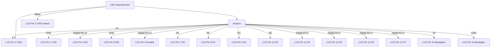
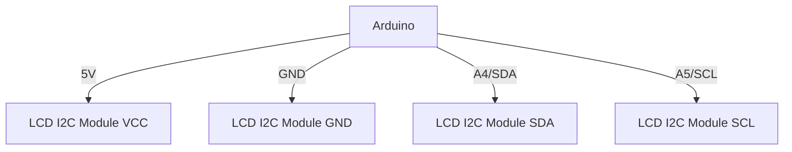

# Arduino LCD Display

LCD (Liquid Crystal Display) screens are a popular output method for Arduino projects. They allow you to display text, numbers, and create interactive interfaces without requiring a computer connection. In this tutorial, you'll learn how to connect, program, and use various LCD displays with Arduino.

## Introduction

LCD displays are essential components in many Arduino projects, from simple status displays to complex user interfaces. They provide visual feedback and can display a wide range of information such as:

- Sensor readings
- System status
- Menu options
- Custom messages
- Debugging information

In this tutorial, we'll focus on the most common type - character LCD displays (particularly the 16x2 and 20x4 models), which are affordable, easy to connect, and perfect for beginners.

## What You'll Need

- Arduino board (Uno, Nano, or similar)
- 16x2 or 20x4 LCD display (HD44780 compatible)
- Potentiometer (10kΩ) for contrast adjustment
- Breadboard and jumper wires
- Arduino IDE with LiquidCrystal library (included by default)

## Understanding LCD Displays

LCD displays compatible with Arduino typically use the HD44780 controller or equivalent. Here's what the numbers like "16x2" or "20x4" mean:

- First number (16 or 20): Characters per line
- Second number (2 or 4): Number of lines

Therefore, a 16x2 display can show 16 characters on each of its 2 lines, for a total of 32 characters.

## Connecting Your LCD to Arduino

LCD displays can be connected in two ways:

1. **4-bit mode** - Uses fewer pins but requires more complex code
2. **8-bit mode** - Faster but uses more pins

For most beginner projects, 4-bit mode is recommended as it saves Arduino pins for other components.

### Standard Connection Diagram (4-bit mode)

Here's how to connect a standard 16x2 LCD display to your Arduino:



### Connection Table

| LCD Pin | LCD Function | Arduino Connection |
|---------|--------------|-------------------|
| 1       | VSS/GND      | GND               |
| 2       | VDD/5V       | 5V                |
| 3       | V0/Contrast  | Potentiometer wiper |
| 4       | RS           | Digital Pin 12    |
| 5       | RW           | GND (Write mode)  |
| 6       | Enable       | Digital Pin 11    |
| 7-10    | D0-D3        | Not connected (4-bit mode) |
| 11      | D4           | Digital Pin 5     |
| 12      | D5           | Digital Pin 4     |
| 13      | D6           | Digital Pin 3     |
| 14      | D7           | Digital Pin 2     |
| 15      | A/Backlight+ | 5V (with resistor for some models) |
| 16      | K/Backlight- | GND               |

## Programming Your LCD Display

To communicate with the LCD, we'll use the built-in `LiquidCrystal` library that comes with the Arduino IDE. Let's start with a basic example:

### Basic "Hello World" Example

```cpp
#include <LiquidCrystal.h>

// Initialize the library with the interface pins
// (RS, E, D4, D5, D6, D7)
LiquidCrystal lcd(12, 11, 5, 4, 3, 2);

void setup() {
  // Set up the LCD's number of columns and rows
  lcd.begin(16, 2);
  
  // Print a message to the LCD
  lcd.print("Hello, World!");
}

void loop() {
  // Set the cursor to column 0, line 1
  // (Note: line 1 is the second row, since counting begins with 0)
  lcd.setCursor(0, 1);
  
  // Print the number of seconds since reset
  lcd.print(millis() / 1000);
}
```

**Output:**
```
Hello, World!
[increasing number of seconds]
```

### Understanding the Code

Let's break down the key parts:

1. **Library Import**: `#include <LiquidCrystal.h>` includes the library for controlling the LCD.

2. **Initialization**: `LiquidCrystal lcd(12, 11, 5, 4, 3, 2)` creates an instance of the LiquidCrystal library and defines which pins to use.

3. **Setup**: `lcd.begin(16, 2)` tells the library the dimensions of your LCD (16 columns, 2 rows).

4. **Displaying Text**: `lcd.print("Hello, World!")` shows text on the display.

5. **Setting Cursor Position**: `lcd.setCursor(0, 1)` positions the cursor at the start of the second line.

## Essential LCD Functions

Here are the most commonly used functions for controlling your LCD:

### Text Manipulation

```cpp
lcd.print("Text");              // Print text at current cursor position
lcd.setCursor(column, row);     // Move cursor to specific position (0-based)
lcd.clear();                    // Clear the display
lcd.home();                     // Move cursor to home position (0,0)
```

### Display Control

```cpp
lcd.display();                  // Turn on the display
lcd.noDisplay();                // Turn off the display
lcd.cursor();                   // Show the cursor
lcd.noCursor();                 // Hide the cursor
lcd.blink();                    // Make the cursor blink
lcd.noBlink();                  // Stop the cursor from blinking
```

### Scrolling

```cpp
lcd.scrollDisplayLeft();        // Scroll content one position left
lcd.scrollDisplayRight();       // Scroll content one position right
lcd.autoscroll();               // Enable auto-scrolling
lcd.noAutoscroll();             // Disable auto-scrolling
```

### Creating Custom Characters

LCDs allow you to create up to 8 custom characters. Here's how to define and use a custom character:

```cpp
#include <LiquidCrystal.h>

LiquidCrystal lcd(12, 11, 5, 4, 3, 2);

// Define a custom character (a heart)
byte heart[8] = {
  0b00000,
  0b01010,
  0b11111,
  0b11111,
  0b11111,
  0b01110,
  0b00100,
  0b00000
};

void setup() {
  lcd.begin(16, 2);
  
  // Create the custom character at position 0
  lcd.createChar(0, heart);
  
  lcd.print("Custom char: ");
  
  // Use the custom character
  lcd.write(byte(0));
}

void loop() {
  // Nothing in the loop
}
```

**Output:**
```
Custom char: ♥
```

## Practical Examples

Now let's explore some practical applications for LCD displays in real projects.

### Example 1: Temperature and Humidity Display

This example uses a DHT11 or DHT22 sensor to display temperature and humidity readings.

```cpp
#include <LiquidCrystal.h>
#include <DHT.h>

#define DHTPIN 7       // DHT sensor connected to digital pin 7
#define DHTTYPE DHT11  // DHT11 sensor type (change to DHT22 if using that model)

LiquidCrystal lcd(12, 11, 5, 4, 3, 2);
DHT dht(DHTPIN, DHTTYPE);

void setup() {
  lcd.begin(16, 2);
  dht.begin();
  
  // Create degree symbol as custom character
  byte degreeSymbol[8] = {
    0b00110,
    0b01001,
    0b01001,
    0b00110,
    0b00000,
    0b00000,
    0b00000,
    0b00000
  };
  lcd.createChar(0, degreeSymbol);
}

void loop() {
  // Wait a few seconds between measurements
  delay(2000);
  
  // Read humidity and temperature
  float h = dht.readHumidity();
  float t = dht.readTemperature();
  
  // Check if readings failed
  if (isnan(h) || isnan(t)) {
    lcd.clear();
    lcd.print("Sensor error!");
    return;
  }
  
  // Display temperature
  lcd.clear();
  lcd.print("Temp: ");
  lcd.print(t);
  lcd.write(byte(0)); // Degree symbol
  lcd.print("C");
  
  // Display humidity on second line
  lcd.setCursor(0, 1);
  lcd.print("Humidity: ");
  lcd.print(h);
  lcd.print("%");
}
```

### Example 2: Simple Menu System

This example shows how to create a basic menu system using an LCD and buttons.

```cpp
#include <LiquidCrystal.h>

LiquidCrystal lcd(12, 11, 5, 4, 3, 2);

// Button pins
const int btnUp = 8;
const int btnDown = 9;
const int btnSelect = 10;

// Menu variables
int menuItem = 0;
const int menuItems = 4;
String menuOptions[menuItems] = {
  "1. LED Control",
  "2. Sensor Data",
  "3. Settings",
  "4. About"
};

void setup() {
  lcd.begin(16, 2);
  
  // Initialize buttons as inputs with pull-up resistors
  pinMode(btnUp, INPUT_PULLUP);
  pinMode(btnDown, INPUT_PULLUP);
  pinMode(btnSelect, INPUT_PULLUP);
  
  displayMenu();
}

void loop() {
  // Check for button presses (active LOW with pull-up resistors)
  if (digitalRead(btnUp) == LOW) {
    menuItem--;
    if (menuItem < 0) menuItem = menuItems - 1;
    displayMenu();
    delay(200); // Debounce
  }
  
  if (digitalRead(btnDown) == LOW) {
    menuItem++;
    if (menuItem >= menuItems) menuItem = 0;
    displayMenu();
    delay(200); // Debounce
  }
  
  if (digitalRead(btnSelect) == LOW) {
    selectMenuItem();
    delay(200); // Debounce
  }
}

void displayMenu() {
  lcd.clear();
  lcd.setCursor(0, 0);
  lcd.print(">");
  lcd.print(menuOptions[menuItem]);
  
  // Display next menu item on second line
  lcd.setCursor(0, 1);
  int nextItem = (menuItem + 1) % menuItems;
  lcd.print(" ");
  lcd.print(menuOptions[nextItem]);
}

void selectMenuItem() {
  lcd.clear();
  lcd.print("Selected:");
  lcd.setCursor(0, 1);
  lcd.print(menuOptions[menuItem]);
  delay(1000);
  displayMenu();
}
```

### Example 3: Countdown Timer

A simple countdown timer with LCD display:

```cpp
#include <LiquidCrystal.h>

LiquidCrystal lcd(12, 11, 5, 4, 3, 2);

int seconds = 60;  // Starting time: 60 seconds
bool timerRunning = false;
unsigned long previousMillis = 0;

void setup() {
  lcd.begin(16, 2);
  displayTimer();
  
  lcd.setCursor(0, 1);
  lcd.print("Press to start");
}

void loop() {
  // Check if button is pressed to start/stop timer
  if (digitalRead(10) == LOW) {
    timerRunning = !timerRunning;
    delay(200); // Debounce
    
    // Update instruction text
    lcd.setCursor(0, 1);
    if (timerRunning) {
      lcd.print("Timer running   ");
    } else {
      lcd.print("Timer paused    ");
    }
  }
  
  // If reset button is pressed
  if (digitalRead(9) == LOW) {
    seconds = 60;
    timerRunning = false;
    displayTimer();
    lcd.setCursor(0, 1);
    lcd.print("Timer reset     ");
    delay(200); // Debounce
  }
  
  // Update timer if running
  if (timerRunning) {
    unsigned long currentMillis = millis();
    
    // Check if 1 second has passed
    if (currentMillis - previousMillis >= 1000) {
      previousMillis = currentMillis;
      
      // Decrease timer
      if (seconds > 0) {
        seconds--;
        displayTimer();
      }
      
      // When timer reaches zero
      if (seconds == 0 && timerRunning) {
        timerRunning = false;
        lcd.setCursor(0, 1);
        lcd.print("Time's up!      ");
      }
    }
  }
}

void displayTimer() {
  // Format minutes and seconds
  int minutes = seconds / 60;
  int secs = seconds % 60;
  
  // Display timer
  lcd.setCursor(0, 0);
  lcd.print("Timer: ");
  
  // Add leading zeros
  if (minutes < 10) lcd.print("0");
  lcd.print(minutes);
  lcd.print(":");
  if (secs < 10) lcd.print("0");
  lcd.print(secs);
  lcd.print("    ");
}
```

## Troubleshooting LCD Displays

Here are solutions to common LCD display issues:

1. **Display is blank or very dim**
   - Adjust the contrast using the potentiometer
   - Check power connections
   - Verify backlight connections

2. **Display shows garbled text or strange symbols**
   - Check wiring connections
   - Reset the Arduino
   - Make sure your code initializes the display correctly

3. **Only one line works**
   - Verify you've set the correct LCD dimensions in `lcd.begin()`
   - Check all data line connections

4. **Display works but doesn't update**
   - Make sure you're calling `lcd.clear()` when needed
   - Check your `loop()` function logic

## Using I2C LCD Displays

For projects where you want to save pins, I2C LCD adapters (like the PCF8574) are extremely useful. They allow you to control an LCD using just 2 pins (SDA and SCL) instead of 6 or more.

### Connecting an I2C LCD



### I2C LCD Code Example

```cpp
#include <Wire.h>
#include <LiquidCrystal_I2C.h>

// Set the LCD address to 0x27 (or your specific address)
// Set the LCD dimensions (16x2)
LiquidCrystal_I2C lcd(0x27, 16, 2);

void setup() {
  // Initialize the LCD
  lcd.init();
  
  // Turn on the backlight
  lcd.backlight();
  
  // Print a message
  lcd.setCursor(0, 0);
  lcd.print("I2C LCD Display");
  lcd.setCursor(0, 1);
  lcd.print("Only 2 wires!");
}

void loop() {
  // No action needed in the loop for this example
}
```

## Advanced LCD Techniques

### Creating Animations

You can create simple animations by rapidly changing custom characters:

```cpp
#include <LiquidCrystal.h>

LiquidCrystal lcd(12, 11, 5, 4, 3, 2);

// Define animation frames using custom characters
byte frame1[8] = {
  0b00000,
  0b00000,
  0b00000,
  0b11111,
  0b11111,
  0b00000,
  0b00000,
  0b00000
};

byte frame2[8] = {
  0b00000,
  0b00000,
  0b11111,
  0b11111,
  0b00000,
  0b00000,
  0b00000,
  0b00000
};

byte frame3[8] = {
  0b00000,
  0b11111,
  0b11111,
  0b00000,
  0b00000,
  0b00000,
  0b00000,
  0b00000
};

byte frame4[8] = {
  0b11111,
  0b11111,
  0b00000,
  0b00000,
  0b00000,
  0b00000,
  0b00000,
  0b00000
};

void setup() {
  lcd.begin(16, 2);
  
  // Create custom characters for animation frames
  lcd.createChar(0, frame1);
  lcd.createChar(1, frame2);
  lcd.createChar(2, frame3);
  lcd.createChar(3, frame4);
  
  lcd.setCursor(0, 0);
  lcd.print("Bouncing ball:");
}

void loop() {
  // Animation loop
  for (int i = 0; i < 4; i++) {
    lcd.setCursor(5, 1);
    lcd.write(byte(i));
    delay(150);
  }
  
  // Reverse animation
  for (int i = 2; i >= 0; i--) {
    lcd.setCursor(5, 1);
    lcd.write(byte(i));
    delay(150);
  }
}
```

### Progress Bar

Create a useful progress bar for your projects:

```cpp
#include <LiquidCrystal.h>

LiquidCrystal lcd(12, 11, 5, 4, 3, 2);

// Custom characters for progress bar
byte p0[8] = { 0x00, 0x00, 0x00, 0x00, 0x00, 0x00, 0x00, 0x00 };
byte p1[8] = { 0x10, 0x10, 0x10, 0x10, 0x10, 0x10, 0x10, 0x10 };
byte p2[8] = { 0x18, 0x18, 0x18, 0x18, 0x18, 0x18, 0x18, 0x18 };
byte p3[8] = { 0x1C, 0x1C, 0x1C, 0x1C, 0x1C, 0x1C, 0x1C, 0x1C };
byte p4[8] = { 0x1E, 0x1E, 0x1E, 0x1E, 0x1E, 0x1E, 0x1E, 0x1E };
byte p5[8] = { 0x1F, 0x1F, 0x1F, 0x1F, 0x1F, 0x1F, 0x1F, 0x1F };

void setup() {
  lcd.begin(16, 2);
  
  // Create custom characters for progress bar
  lcd.createChar(0, p0);
  lcd.createChar(1, p1);
  lcd.createChar(2, p2);
  lcd.createChar(3, p3);
  lcd.createChar(4, p4);
  lcd.createChar(5, p5);
  
  lcd.setCursor(0, 0);
  lcd.print("Progress Bar:");
}

void loop() {
  // Simulate a process with progress from 0% to 100%
  for (int i = 0; i <= 100; i++) {
    drawProgressBar(i);
    delay(100);
  }
  
  delay(1000);
  
  // Reset and start again
  drawProgressBar(0);
  delay(1000);
}

void drawProgressBar(int percent) {
  // Map the percentage to 16 characters on the display
  int numChars = map(percent, 0, 100, 0, 16);
  
  // Calculate the number of completely filled blocks
  int numCompleteBlocks = numChars / 1;
  
  // Calculate the remainder for partial block
  int remainder = numChars % 1 * 5;
  
  lcd.setCursor(0, 1);
  
  // Draw complete blocks
  for (int i = 0; i < numCompleteBlocks; i++) {
    lcd.write(byte(5));
  }
  
  // Draw partial block if there is a remainder
  if (remainder > 0) {
    lcd.write(byte(remainder));
  }
  
  // Fill the rest of the line with empty blocks
  for (int i = numCompleteBlocks + (remainder > 0 ? 1 : 0); i < 16; i++) {
    lcd.write(byte(0));
  }
  
  // Display percentage
  lcd.setCursor(0, 0);
  lcd.print("Progress: ");
  lcd.print(percent);
  lcd.print("%   ");
}
```

## Optimizing LCD Performance

LCD displays can be relatively slow to update. Here are some tips to optimize performance:

1. **Minimize Updates**: Only update parts of the display that change
2. **Avoid `lcd.clear()`**: Instead of clearing the entire display, overwrite specific characters
3. **Use Efficient Text**: Display shorter messages when possible
4. **Pre-calculate Values**: Calculate values before sending to the display
5. **Use Custom Characters**: They're more efficient than scrolling text

## Summary

LCD displays are versatile output devices for Arduino projects that allow you to show text, numbers, and create simple user interfaces. In this tutorial, you've learned:

- How to connect an LCD display to Arduino
- Basic LCD programming using the LiquidCrystal library
- Essential LCD functions for text display and manipulation
- How to create custom characters
- Practical examples including sensor displays and menu systems
- Advanced techniques like animations and progress bars
- How to optimize LCD performance

With these skills, you can add professional-looking displays to your Arduino projects, making them more interactive and user-friendly.

## Exercises

1. **Temperature Display**: Modify the temperature/humidity example to add custom icons for hot and cold temperatures.
2. **Scrolling Text**: Create a program that scrolls a long message across the display.
3. **Game**: Build a simple game (like Pong or Space Invaders) using custom characters.
4. **Data Logger**: Create a system that displays sensor readings and logs them to an SD card, showing the status on the LCD.
5. **Clock**: Build a digital clock using an RTC (Real-Time Clock) module and display the time and date on the LCD.

## Additional Resources

- [Arduino LCD Library Reference](https://www.arduino.cc/reference/en/libraries/liquidcrystal/)
- [HD44780 LCD Controller Datasheet](https://www.sparkfun.com/datasheets/LCD/HD44780.pdf)
- [Arduino Character LCD Tutorial](https://www.arduino.cc/en/Tutorial/LibraryExamples/HelloWorld)
- [I2C LCD Tutorial](https://www.makerguides.com/character-i2c-lcd-arduino-tutorial/)