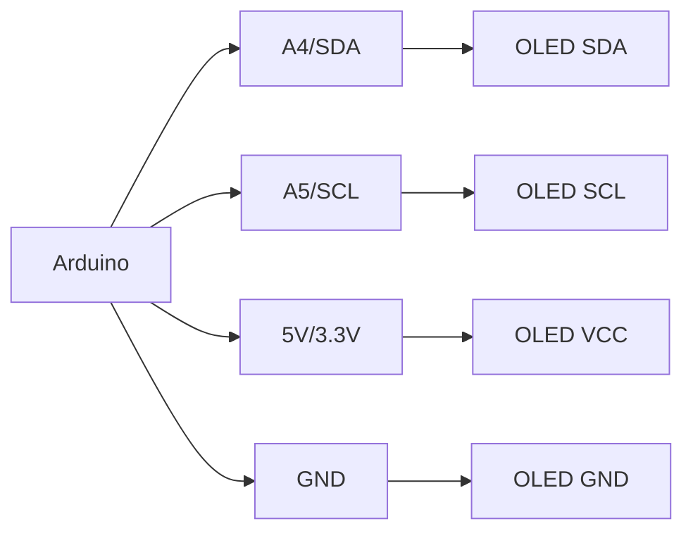

# Arduino OLED Display

## Introduction

OLED (Organic Light Emitting Diode) displays are popular components in Arduino projects due to their high contrast, wide viewing angles, and energy efficiency. Unlike traditional LCD displays, OLEDs generate their own light without requiring a backlight, resulting in deeper blacks and more vibrant colors while consuming less power.

In this tutorial, we'll explore how to connect OLED displays to Arduino, understand the necessary libraries, and create various graphics and text displays. By the end, you'll be able to incorporate these versatile displays into your Arduino projects.

## What You'll Need

- Arduino board (Uno, Nano, Mega, etc.)
- OLED display module (common sizes: 0.96" or 1.3")
- Jumper wires
- Breadboard
- USB cable for Arduino

## Understanding OLED Displays

OLED displays commonly used with Arduino typically come in the following configurations:

- **Resolution**: Usually 128×64 or 128×32 pixels
- **Color**: Monochrome (white, blue, or yellow pixels on a black background)
- **Interface**: I²C or SPI
- **Controller**: SSD1306, SH1106, or similar

The most common OLED modules feature the SSD1306 controller chip and communicate via I²C, which requires only two data pins (plus power and ground).

## Wiring an I²C OLED Display to Arduino

The I²C interface makes wiring very simple:

| OLED Pin | Arduino Pin |
|----------|-------------|
| GND      | GND         |
| VCC      | 5V or 3.3V (check your display's specifications) |
| SCL      | A5 (Uno/Nano) or pin 21 (Mega) |
| SDA      | A4 (Uno/Nano) or pin 20 (Mega) |

Here's a diagram of the connections:



## Required Libraries

We'll use the Adafruit SSD1306 and Adafruit GFX libraries to control the OLED display. These libraries provide simple functions for drawing shapes, text, and images.

To install them:

1. Open the Arduino IDE
2. Go to **Sketch > Include Library > Manage Libraries**
3. Search for "Adafruit SSD1306" and install it
4. Search for "Adafruit GFX" and install it (it might be installed automatically with SSD1306)

## Basic OLED Display Example

Let's start with a simple example that displays text on the OLED screen:

```cpp
#include <Wire.h>
#include <Adafruit_GFX.h>
#include <Adafruit_SSD1306.h>

#define SCREEN_WIDTH 128 // OLED display width, in pixels
#define SCREEN_HEIGHT 64 // OLED display height, in pixels

// Declaration for an SSD1306 display connected to I2C (SDA, SCL pins)
#define OLED_RESET     -1 // Reset pin # (or -1 if sharing Arduino reset pin)
Adafruit_SSD1306 display(SCREEN_WIDTH, SCREEN_HEIGHT, &Wire, OLED_RESET);

void setup() {
  Serial.begin(9600);
  
  // Initialize the OLED display
  if(!display.begin(SSD1306_SWITCHCAPVCC, 0x3C)) { // Address 0x3C for 128x64
    Serial.println(F("SSD1306 allocation failed"));
    for(;;); // Don't proceed, loop forever
  }

  // Clear the display buffer
  display.clearDisplay();
  
  // Set text properties
  display.setTextSize(1);
  display.setTextColor(WHITE);
  display.setCursor(0, 0);
  
  // Display text
  display.println(F("Hello, Arduino!"));
  display.println(F("OLED Display Test"));
  display.println();
  display.print(F("Countdown: "));
  
  // Update the display with all the data we've written
  display.display();
  
  delay(2000); // Pause for 2 seconds
}

void loop() {
  // Count down from 10 to 1
  for(int i = 10; i > 0; i--) {
    display.fillRect(70, 16, 20, 8, BLACK); // Clear previous number
    display.setCursor(70, 16);
    display.print(F(i));
    display.display();
    delay(1000); // Wait 1 second
  }
  
  // Display "Done!"
  display.fillRect(70, 16, 58, 8, BLACK); // Clear previous text
  display.setCursor(70, 16);
  display.print(F("Done!"));
  display.display();
  delay(2000); // Wait 2 seconds
  
  // Reset for next countdown
  display.fillRect(70, 16, 58, 8, BLACK);
  display.setCursor(70, 16);
  display.display();
}
```

### Output

When you upload this code to your Arduino, you'll see:
1. "Hello, Arduino!" and "OLED Display Test" displayed on the screen
2. A countdown from 10 to 1, updating every second
3. "Done!" displayed when the countdown finishes
4. The countdown repeats

## Understanding the Code

Let's break down the key components of the code:

1. **Include Libraries**: We include the necessary libraries for I²C communication and OLED display control.

2. **Define Display Parameters**: We specify the display dimensions and reset pin.

3. **Initialize Display**: In the `setup()` function, we initialize the display with `display.begin()`.

4. **Display Text**: We use functions like `setCursor()`, `setTextSize()`, `setTextColor()`, and `println()` to format and display text.

5. **Update Display**: The `display.display()` function is crucial—it sends the buffer to the actual display. Without this call, nothing would appear on the screen.

6. **Clear Areas**: We use `fillRect()` to clear specific areas of the screen before updating them.

## Drawing Shapes and Graphics

OLED displays can do much more than just show text. Let's explore some graphical capabilities:

```cpp
#include <Wire.h>
#include <Adafruit_GFX.h>
#include <Adafruit_SSD1306.h>

#define SCREEN_WIDTH 128
#define SCREEN_HEIGHT 64
#define OLED_RESET     -1
Adafruit_SSD1306 display(SCREEN_WIDTH, SCREEN_HEIGHT, &Wire, OLED_RESET);

void setup() {
  Serial.begin(9600);
  
  if(!display.begin(SSD1306_SWITCHCAPVCC, 0x3C)) {
    Serial.println(F("SSD1306 allocation failed"));
    for(;;);
  }
  
  display.clearDisplay();
  
  // Draw a single pixel
  display.drawPixel(64, 32, WHITE);
  
  // Draw a line
  display.drawLine(0, 0, 127, 63, WHITE);
  
  // Draw a rectangle
  display.drawRect(10, 10, 50, 30, WHITE);
  
  // Draw a filled rectangle
  display.fillRect(70, 10, 50, 30, WHITE);
  
  // Draw a circle
  display.drawCircle(32, 48, 10, WHITE);
  
  // Draw a filled circle
  display.fillCircle(96, 48, 10, WHITE);
  
  // Draw a rounded rectangle
  display.drawRoundRect(25, 25, 78, 15, 5, WHITE);
  
  display.display();
}

void loop() {
  // Nothing to do in the loop for this example
}
```

### Available Drawing Functions

The Adafruit GFX library provides many drawing functions:

- `drawPixel(x, y, color)`: Draw a single pixel
- `drawLine(x0, y0, x1, y1, color)`: Draw a line
- `drawRect(x, y, w, h, color)`: Draw a rectangle outline
- `fillRect(x, y, w, h, color)`: Draw a filled rectangle
- `drawCircle(x, y, r, color)`: Draw a circle outline
- `fillCircle(x, y, r, color)`: Draw a filled circle
- `drawTriangle(x0, y0, x1, y1, x2, y2, color)`: Draw a triangle outline
- `fillTriangle(x0, y0, x1, y1, x2, y2, color)`: Draw a filled triangle
- `drawRoundRect(x, y, w, h, radius, color)`: Draw a rounded rectangle outline
- `fillRoundRect(x, y, w, h, radius, color)`: Draw a filled rounded rectangle

## Creating a Simple Menu System

OLED displays are great for creating interactive menus. Here's an example using buttons to navigate through menu options:

```cpp
#include <Wire.h>
#include <Adafruit_GFX.h>
#include <Adafruit_SSD1306.h>

#define SCREEN_WIDTH 128
#define SCREEN_HEIGHT 64
#define OLED_RESET     -1
Adafruit_SSD1306 display(SCREEN_WIDTH, SCREEN_HEIGHT, &Wire, OLED_RESET);

// Button pins
const int upButton = 2;
const int downButton = 3;
const int selectButton = 4;

// Menu variables
const int menuItems = 4;
const char* menuOptions[menuItems] = {
  "Option 1",
  "Option 2",
  "Option 3",
  "Settings"
};
int selectedOption = 0;

void setup() {
  // Initialize button pins as inputs with internal pull-up resistors
  pinMode(upButton, INPUT_PULLUP);
  pinMode(downButton, INPUT_PULLUP);
  pinMode(selectButton, INPUT_PULLUP);
  
  // Initialize display
  if(!display.begin(SSD1306_SWITCHCAPVCC, 0x3C)) {
    for(;;);  // Don't proceed if it failed
  }
  
  display.clearDisplay();
  display.setTextSize(1);
  display.setTextColor(WHITE);
  displayMenu();
}

void loop() {
  // Check for button presses
  if (digitalRead(upButton) == LOW) {
    selectedOption = (selectedOption > 0) ? selectedOption - 1 : menuItems - 1;
    displayMenu();
    delay(200);  // Debounce
  }
  
  if (digitalRead(downButton) == LOW) {
    selectedOption = (selectedOption < menuItems - 1) ? selectedOption + 1 : 0;
    displayMenu();
    delay(200);  // Debounce
  }
  
  if (digitalRead(selectButton) == LOW) {
    executeMenuOption();
    delay(200);  // Debounce
  }
}

void displayMenu() {
  display.clearDisplay();
  display.setCursor(0, 0);
  display.println(F("MENU:"));
  
  for (int i = 0; i < menuItems; i++) {
    if (i == selectedOption) {
      display.setTextColor(BLACK, WHITE); // Inverted text for selected option
    } else {
      display.setTextColor(WHITE);
    }
    
    display.setCursor(10, 10 + i * 10);
    display.println(menuOptions[i]);
  }
  
  display.display();
}

void executeMenuOption() {
  display.clearDisplay();
  display.setTextColor(WHITE);
  display.setCursor(0, 0);
  display.print(F("Selected: "));
  display.println(menuOptions[selectedOption]);
  display.println();
  display.println(F("Press any button"));
  display.println(F("to return to menu"));
  display.display();
  
  // Wait for any button press
  while (digitalRead(upButton) == HIGH && 
         digitalRead(downButton) == HIGH && 
         digitalRead(selectButton) == HIGH) {
    // Wait for a button press
  }
  
  displayMenu();
  delay(200);  // Debounce
}
```

## Creating Custom Graphics and Icons

For more advanced applications, you might want to display custom graphics or icons. Here's how to create and display a simple bitmap:

```cpp
#include <Wire.h>
#include <Adafruit_GFX.h>
#include <Adafruit_SSD1306.h>

#define SCREEN_WIDTH 128
#define SCREEN_HEIGHT 64
#define OLED_RESET     -1
Adafruit_SSD1306 display(SCREEN_WIDTH, SCREEN_HEIGHT, &Wire, OLED_RESET);

// Define a small 16x16 bitmap for an Arduino logo
static const unsigned char PROGMEM arduino_logo[] = {
  0x00, 0x00, 0x00, 0x00, 0x00, 0x00, 0x01, 0x80, 
  0x02, 0x40, 0x04, 0x20, 0x08, 0x10, 0x10, 0x08, 
  0x20, 0x04, 0x40, 0x02, 0x80, 0x01, 0x80, 0x01, 
  0x40, 0x02, 0x20, 0x04, 0x10, 0x08, 0x00, 0x00
};

void setup() {
  if(!display.begin(SSD1306_SWITCHCAPVCC, 0x3C)) {
    for(;;);
  }
  
  display.clearDisplay();
  
  // Draw the bitmap
  display.drawBitmap(
    (SCREEN_WIDTH - 16) / 2,   // x position
    (SCREEN_HEIGHT - 16) / 2,  // y position
    arduino_logo,              // bitmap data
    16,                        // bitmap width
    16,                        // bitmap height
    WHITE                      // color
  );
  
  // Add some text below the logo
  display.setTextSize(1);
  display.setTextColor(WHITE);
  display.setCursor((SCREEN_WIDTH - 54) / 2, (SCREEN_HEIGHT - 16) / 2 + 20);
  display.print(F("Arduino OLED"));
  
  display.display();
}

void loop() {
  // Nothing to do in the loop for this example
}
```

## Real-World Project: Temperature and Humidity Monitor

Let's create a practical project that uses an OLED display to show temperature and humidity readings from a DHT11 or DHT22 sensor:

```cpp
#include <Wire.h>
#include <Adafruit_GFX.h>
#include <Adafruit_SSD1306.h>
#include <DHT.h>

#define SCREEN_WIDTH 128
#define SCREEN_HEIGHT 64
#define OLED_RESET     -1
Adafruit_SSD1306 display(SCREEN_WIDTH, SCREEN_HEIGHT, &Wire, OLED_RESET);

#define DHTPIN 7       // Pin connected to the DHT sensor
#define DHTTYPE DHT11  // DHT 11 or DHT22
DHT dht(DHTPIN, DHTTYPE);

// Variables for tracking min/max values
float minTemp = 100.0;
float maxTemp = -40.0;
float minHum = 100.0;
float maxHum = 0.0;

void setup() {
  Serial.begin(9600);
  
  // Initialize the OLED display
  if(!display.begin(SSD1306_SWITCHCAPVCC, 0x3C)) {
    Serial.println(F("SSD1306 allocation failed"));
    for(;;);
  }
  
  // Initialize the DHT sensor
  dht.begin();
  
  // Initial display setup
  display.clearDisplay();
  display.setTextSize(1);
  display.setTextColor(WHITE);
  display.setCursor(0, 0);
  display.println(F("Temperature & Humidity"));
  display.println(F("Monitor"));
  display.display();
  delay(2000);
}

void loop() {
  // Read temperature and humidity
  float temperature = dht.readTemperature();
  float humidity = dht.readHumidity();
  
  // Check if readings are valid
  if (isnan(temperature) || isnan(humidity)) {
    display.clearDisplay();
    display.setCursor(0, 0);
    display.println(F("Failed to read from DHT sensor!"));
    display.display();
    delay(2000);
    return;
  }
  
  // Update min/max values
  if (temperature < minTemp) minTemp = temperature;
  if (temperature > maxTemp) maxTemp = temperature;
  if (humidity < minHum) minHum = humidity;
  if (humidity > maxHum) maxHum = humidity;
  
  // Clear the display
  display.clearDisplay();
  
  // Display current readings
  display.setTextSize(1);
  display.setCursor(0, 0);
  display.println(F("Current Readings:"));
  
  display.setTextSize(2);
  display.setCursor(0, 10);
  display.print(temperature, 1);
  display.print(F(" C"));
  
  display.setCursor(0, 30);
  display.print(humidity, 1);
  display.print(F(" %"));
  
  // Display min/max in smaller text
  display.setTextSize(1);
  display.setCursor(0, 50);
  display.print(F("Min:"));
  display.print(minTemp, 1);
  display.print(F("C "));
  display.print(minHum, 0);
  display.print(F("%"));
  
  display.setCursor(0, 56);
  display.print(F("Max:"));
  display.print(maxTemp, 1);
  display.print(F("C "));
  display.print(maxHum, 0);
  display.print(F("%"));
  
  // Update display
  display.display();
  
  // Wait before next reading
  delay(2000);
}
```

## Performance Considerations

When using OLED displays with Arduino, keep these tips in mind:

1. **Memory Usage**: The display buffer consumes RAM (128×64 pixels = 1KB). This can be significant for Arduino Uno or Nano, which have only 2KB of RAM.

2. **Update Frequency**: Avoid updating the entire display too frequently. Update only the parts that change.

3. **Text Size**: Larger text consumes more processing power to render.

4. **I²C Speed**: The default I²C speed might be too slow for complex animations. You can increase it with `Wire.setClock(400000)` for 400kHz operation if your wiring is short and well-connected.

## Troubleshooting

### Common Issues and Solutions

1. **Display shows nothing**:
   - Check wiring connections
   - Verify I²C address (common addresses are 0x3C or 0x3D)
   - Run an I²C scanner sketch to find the correct address

2. **Garbled display**:
   - Make sure you're using the correct controller type (SSD1306, SH1106, etc.)
   - Verify display dimensions in code match your actual display

3. **Flickering display**:
   - Check power supply stability
   - Add a capacitor (100µF) between VCC and GND

4. **Dim display**:
   - Some displays have a contrast setting that can be adjusted in code
   - Check if your display is designed for 3.3V but running at 5V (or vice versa)

## Summary

OLED displays are versatile components that can greatly enhance Arduino projects by providing visual feedback, creating interfaces, and displaying data. In this tutorial, we've covered:

- Basic setup and wiring for I²C OLED displays
- Displaying text and graphics
- Creating interactive menus
- Implementing custom bitmaps
- Building a practical temperature and humidity monitor

With these foundations, you can incorporate OLED displays into your own projects, from weather stations to game consoles, interactive controls, and data visualization tools.

## Exercises for Practice

1. **Scrolling Text**: Modify the basic text example to create a message that scrolls across the screen.

2. **Analog Meter**: Create a visual representation of an analog input (like a potentiometer) as a bar graph or dial on the OLED.

3. **Animation**: Create a simple animation by displaying a sequence of frames.

4. **Data Logger**: Extend the temperature monitor to log and graph data over time.

5. **Game Development**: Try creating a simple game like Pong or Snake using the OLED display and buttons.

## Further Resources

- [Adafruit GFX Library Documentation](https://learn.adafruit.com/adafruit-gfx-graphics-library)
- [Adafruit SSD1306 Library GitHub Repository](https://github.com/adafruit/Adafruit_SSD1306)
- [SSD1306 Datasheet](https://cdn-shop.adafruit.com/datasheets/SSD1306.pdf)
- [Adafruit's OLED Tutorials](https://learn.adafruit.com/monochrome-oled-breakouts)