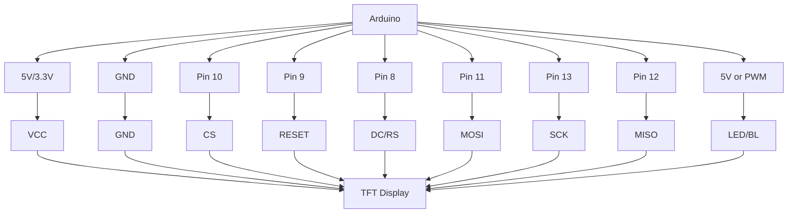

# Arduino TFT Display

## Introduction

TFT (Thin-Film Transistor) displays are colorful LCD screens that can significantly enhance your Arduino projects with vibrant visuals and touch interaction capabilities. These displays allow you to create graphical user interfaces, show sensor data through charts, display images, and much more. Unlike simple character LCDs, TFT displays can show full-color graphics with high resolution, making your projects more interactive and visually appealing.

In this tutorial, we'll explore how to connect, configure, and program TFT displays with your Arduino. We'll start with the basics and gradually move to more advanced techniques and practical applications.

## What is a TFT Display?

A TFT display is a special type of LCD (Liquid Crystal Display) that uses thin-film transistor technology to improve image quality and contrast. Each pixel on a TFT screen is controlled by one to four transistors, allowing for precise control over the display's content.

Key features of TFT displays include:

- **Full color** - Typically 65K or 262K colors
- **Various resolutions** - Common sizes for Arduino range from 1.8" (128×160) to 3.5" (320×480)
- **Optional touch functionality** - Many TFT displays include resistive or capacitive touch sensors
- **Graphical capabilities** - Can display text, shapes, images, and animations
- **SPI interface** - Most Arduino-compatible TFT displays use SPI for communication

## Hardware Requirements

To follow along with this tutorial, you'll need:

1. An Arduino board (Uno, Mega, Nano, etc.)
2. A TFT display compatible with Arduino (1.8", 2.4", or 3.5" are common)
3. Jumper wires
4. Breadboard (optional)
5. 5V power supply (if your display requires separate power)

## Common TFT Display Modules

Some popular TFT display modules used with Arduino include:

1. **1.8" ST7735 TFT Display** - Small, affordable display with 128×160 resolution
2. **2.4" ILI9341 TFT Display** - Medium-sized display with 240×320 resolution
3. **3.5" HX8357 TFT Display** - Larger display with 320×480 resolution

Most of these displays communicate with the Arduino using the SPI (Serial Peripheral Interface) protocol, which requires fewer pins compared to parallel interfaces.

## Required Libraries

Before we start coding, we need to install the appropriate libraries. The most commonly used libraries for TFT displays are:

1. **Adafruit GFX Library** - A core graphics library that provides common drawing functions
2. **Adafruit TFT Library** - Hardware-specific library for your display controller (e.g., ST7735, ILI9341)

To install these libraries:

1. Open the Arduino IDE
2. Go to **Sketch > Include Library > Manage Libraries**
3. Search for "Adafruit GFX"
4. Install the "Adafruit GFX Library"
5. Search for your specific display controller (e.g., "Adafruit ST7735")
6. Install the corresponding library

## Connecting Your TFT Display

The wiring connections vary depending on your specific TFT display, but most SPI-based displays use the following pins:

| TFT Pin | Arduino Pin | Description |
|---------|-------------|-------------|
| VCC     | 5V or 3.3V  | Power supply |
| GND     | GND         | Ground |
| CS      | 10          | Chip Select |
| RESET   | 9           | Reset |
| DC/RS   | 8           | Data/Command |
| MOSI    | 11          | SPI data out |
| SCK     | 13          | SPI clock |
| MISO    | 12          | SPI data in (may not be used) |
| LED/BL  | 5V or PWM   | Backlight control |

For displays with touch functionality, additional pins will be needed.

### Connection Diagram



## Basic TFT Display Example

Let's start with a simple example to initialize the display and draw some basic shapes and text.

```cpp
#include <Adafruit_GFX.h>    // Core graphics library
#include <Adafruit_ST7735.h> // Hardware-specific library for ST7735
#include <SPI.h>

// Pin definitions for display
#define TFT_CS     10
#define TFT_RST    9
#define TFT_DC     8

// Initialize the display
Adafruit_ST7735 tft = Adafruit_ST7735(TFT_CS, TFT_DC, TFT_RST);

void setup() {
  Serial.begin(9600);
  Serial.println("TFT Display Test");
  
  // Initialize the display
  tft.initR(INITR_BLACKTAB); // For 1.8" TFT SPI display (ST7735)
  
  // Fill screen with black
  tft.fillScreen(ST7735_BLACK);
  
  // Print welcome message
  tft.setCursor(0, 0);
  tft.setTextColor(ST7735_WHITE);
  tft.setTextSize(1);
  tft.println("Hello, Arduino!");
  
  // Draw a red circle
  tft.drawCircle(60, 80, 20, ST7735_RED);
  
  // Draw a blue rectangle
  tft.drawRect(20, 40, 80, 40, ST7735_BLUE);
  
  // Draw a green line
  tft.drawLine(0, 120, 128, 120, ST7735_GREEN);
}

void loop() {
  // Nothing in the loop for this example
}
```

When you upload this code, you should see:
- A black background
- "Hello, Arduino!" text in white at the top-left corner
- A red circle in the middle
- A blue rectangle around the circle
- A green line at the bottom

## Understanding Color Formats

TFT displays typically use a 16-bit color format (65K colors). The Adafruit GFX library provides predefined color constants, such as:

```cpp
// Common colors
ST7735_BLACK
ST7735_WHITE
ST7735_RED
ST7735_GREEN
ST7735_BLUE
ST7735_CYAN
ST7735_MAGENTA
ST7735_YELLOW
```

You can also create your own colors using the `tft.color565()` function, which takes RGB values (0-255) and converts them to the 16-bit format:

```cpp
// Creating a custom color (orange)
uint16_t orange = tft.color565(255, 165, 0);
```

## Drawing Text and Graphics

The Adafruit GFX library provides various functions for drawing on the display:

### Text Functions

```cpp
// Set cursor position (x, y)
tft.setCursor(0, 0);

// Set text color
tft.setTextColor(ST7735_WHITE);

// Set text size (1-5)
tft.setTextSize(2);

// Print text
tft.println("Hello, world!");

// Print formatted text
tft.print("Value: ");
tft.println(sensorValue);

// Set text wrap (true/false)
tft.setTextWrap(false);
```

### Shape Functions

```cpp
// Draw a pixel
tft.drawPixel(x, y, color);

// Draw a line
tft.drawLine(x0, y0, x1, y1, color);

// Draw a rectangle
tft.drawRect(x, y, width, height, color);

// Fill a rectangle
tft.fillRect(x, y, width, height, color);

// Draw a rounded rectangle
tft.drawRoundRect(x, y, width, height, radius, color);

// Fill a rounded rectangle
tft.fillRoundRect(x, y, width, height, radius, color);

// Draw a circle
tft.drawCircle(x, y, radius, color);

// Fill a circle
tft.fillCircle(x, y, radius, color);

// Draw a triangle
tft.drawTriangle(x0, y0, x1, y1, x2, y2, color);

// Fill a triangle
tft.fillTriangle(x0, y0, x1, y1, x2, y2, color);
```

## Displaying Images

TFT displays can also show bitmap images. This process involves converting an image to a C array and then drawing it on the display. Here's how to do it:

1. Convert your image using the [LCD Image Converter](http://www.riuson.com/lcd-image-converter) or similar tool
2. Save the output as a C header file
3. Include the file in your sketch and draw the image

Here's an example of displaying a small 32x32 logo:

```cpp
#include <Adafruit_GFX.h>
#include <Adafruit_ST7735.h>
#include <SPI.h>
#include "logo.h" // Include the converted image header file

#define TFT_CS     10
#define TFT_RST    9
#define TFT_DC     8

Adafruit_ST7735 tft = Adafruit_ST7735(TFT_CS, TFT_DC, TFT_RST);

void setup() {
  // Initialize the display
  tft.initR(INITR_BLACKTAB);
  tft.fillScreen(ST7735_BLACK);
  
  // Draw the logo at position (48, 64)
  tft.drawRGBBitmap(48, 64, logo, 32, 32);
}

void loop() {
  // Nothing in the loop
}
```

## Creating a Simple Data Visualization

Let's create a more practical example: a real-time temperature and humidity monitor using a DHT11 sensor and TFT display.

```cpp
#include <Adafruit_GFX.h>
#include <Adafruit_ST7735.h>
#include <SPI.h>
#include <DHT.h>

#define TFT_CS     10
#define TFT_RST    9
#define TFT_DC     8
#define DHT_PIN    7
#define DHT_TYPE   DHT11

Adafruit_ST7735 tft = Adafruit_ST7735(TFT_CS, TFT_DC, TFT_RST);
DHT dht(DHT_PIN, DHT_TYPE);

// Variables to store previous readings for clearing
float lastTemp = 0;
float lastHum = 0;

void setup() {
  // Initialize the display
  tft.initR(INITR_BLACKTAB);
  tft.fillScreen(ST7735_BLACK);
  
  // Initialize the DHT sensor
  dht.begin();
  
  // Draw static text and elements
  tft.setTextSize(1);
  tft.setTextColor(ST7735_WHITE);
  tft.setCursor(0, 0);
  tft.println("Temperature & Humidity");
  tft.drawLine(0, 10, tft.width(), 10, ST7735_YELLOW);
  
  tft.setCursor(0, 20);
  tft.println("Temperature:");
  
  tft.setCursor(0, 60);
  tft.println("Humidity:");
}

void loop() {
  // Wait a few seconds between measurements
  delay(2000);
  
  // Read temperature and humidity
  float temp = dht.readTemperature();
  float hum = dht.readHumidity();
  
  // Check if any reads failed
  if (isnan(temp) || isnan(hum)) {
    tft.setCursor(0, 100);
    tft.setTextColor(ST7735_RED);
    tft.println("Failed to read sensor!");
    return;
  }
  
  // Clear previous temperature value
  tft.fillRect(0, 30, tft.width(), 20, ST7735_BLACK);
  
  // Display new temperature
  tft.setCursor(0, 30);
  tft.setTextColor(ST7735_CYAN);
  tft.setTextSize(2);
  tft.print(temp);
  tft.println(" C");
  
  // Clear previous humidity value
  tft.fillRect(0, 70, tft.width(), 20, ST7735_BLACK);
  
  // Display new humidity
  tft.setCursor(0, 70);
  tft.setTextColor(ST7735_GREEN);
  tft.setTextSize(2);
  tft.print(hum);
  tft.println(" %");
  
  // Update the temperature bar graph
  int tempBarWidth = map(temp, 0, 50, 0, tft.width());
  tft.fillRect(0, 50, lastTemp, 5, ST7735_BLACK); // Clear previous bar
  tft.fillRect(0, 50, tempBarWidth, 5, ST7735_RED); // Draw new bar
  lastTemp = tempBarWidth;
  
  // Update the humidity bar graph
  int humBarWidth = map(hum, 0, 100, 0, tft.width());
  tft.fillRect(0, 90, lastHum, 5, ST7735_BLACK); // Clear previous bar
  tft.fillRect(0, 90, humBarWidth, 5, ST7735_BLUE); // Draw new bar
  lastHum = humBarWidth;
}
```

## Creating a Menu System

For more complex projects, you might want to create a menu system. Here's a simple example of a two-option menu:

```cpp
#include <Adafruit_GFX.h>
#include <Adafruit_ST7735.h>
#include <SPI.h>

#define TFT_CS     10
#define TFT_RST    9
#define TFT_DC     8
#define BUTTON_UP   2
#define BUTTON_DOWN 3
#define BUTTON_SELECT 4

Adafruit_ST7735 tft = Adafruit_ST7735(TFT_CS, TFT_DC, TFT_RST);

// Menu variables
int menuItem = 0;
int menuItems = 2;
String menuOptions[] = {"Temperature", "Humidity"};
bool needsRedraw = true;

void setup() {
  // Initialize the display
  tft.initR(INITR_BLACKTAB);
  tft.fillScreen(ST7735_BLACK);
  
  // Set up buttons
  pinMode(BUTTON_UP, INPUT_PULLUP);
  pinMode(BUTTON_DOWN, INPUT_PULLUP);
  pinMode(BUTTON_SELECT, INPUT_PULLUP);
  
  // Draw menu title
  tft.setTextSize(1);
  tft.setTextColor(ST7735_WHITE);
  tft.setCursor(30, 10);
  tft.println("MAIN MENU");
  tft.drawLine(0, 20, tft.width(), 20, ST7735_YELLOW);
}

void loop() {
  // Check for button presses
  if (digitalRead(BUTTON_UP) == LOW) {
    menuItem--;
    if (menuItem < 0) menuItem = menuItems - 1;
    needsRedraw = true;
    delay(200); // Debounce
  }
  
  if (digitalRead(BUTTON_DOWN) == LOW) {
    menuItem++;
    if (menuItem >= menuItems) menuItem = 0;
    needsRedraw = true;
    delay(200); // Debounce
  }
  
  if (digitalRead(BUTTON_SELECT) == LOW) {
    selectMenuItem(menuItem);
    delay(200); // Debounce
  }
  
  // Redraw menu if needed
  if (needsRedraw) {
    drawMenu();
    needsRedraw = false;
  }
}

void drawMenu() {
  // Clear menu area
  tft.fillRect(0, 21, tft.width(), tft.height() - 21, ST7735_BLACK);
  
  // Draw menu items
  for (int i = 0; i < menuItems; i++) {
    if (i == menuItem) {
      // Selected item
      tft.fillRect(0, 30 + (i * 20), tft.width(), 20, ST7735_BLUE);
      tft.setTextColor(ST7735_WHITE);
    } else {
      // Unselected item
      tft.setTextColor(ST7735_WHITE);
    }
    
    tft.setCursor(10, 35 + (i * 20));
    tft.println(menuOptions[i]);
  }
}

void selectMenuItem(int item) {
  tft.fillScreen(ST7735_BLACK);
  
  tft.setCursor(10, 10);
  tft.setTextSize(1);
  tft.setTextColor(ST7735_YELLOW);
  tft.print("Selected: ");
  tft.println(menuOptions[item]);
  
  // Do something based on the selected menu item
  if (item == 0) {
    // Temperature selected
    tft.setCursor(10, 40);
    tft.setTextSize(2);
    tft.setTextColor(ST7735_CYAN);
    tft.println("25.5 C");
    // Add your code here
  } else if (item == 1) {
    // Humidity selected
    tft.setCursor(10, 40);
    tft.setTextSize(2);
    tft.setTextColor(ST7735_GREEN);
    tft.println("45 %");
    // Add your code here
  }
  
  delay(3000); // Show the selected screen for 3 seconds
  
  // Return to menu
  tft.fillScreen(ST7735_BLACK);
  tft.setTextSize(1);
  tft.setTextColor(ST7735_WHITE);
  tft.setCursor(30, 10);
  tft.println("MAIN MENU");
  tft.drawLine(0, 20, tft.width(), 20, ST7735_YELLOW);
  needsRedraw = true;
}
```

## Touch Screen Functionality

If your TFT display has touch capability, you can use it for input. Here's a simple example using the Adafruit Touch Screen library with a resistive touch screen:

```cpp
#include <Adafruit_GFX.h>
#include <Adafruit_ST7735.h>
#include <SPI.h>
#include <TouchScreen.h>

// TFT display pins
#define TFT_CS     10
#define TFT_RST    9
#define TFT_DC     8

// Touch screen pins
#define YP A2  // must be an analog pin
#define XM A3  // must be an analog pin
#define YM 7   // can be a digital pin
#define XP 6   // can be a digital pin

// Touch screen parameters
#define TS_MINX 150
#define TS_MINY 120
#define TS_MAXX 920
#define TS_MAXY 940
#define MINPRESSURE 10
#define MAXPRESSURE 1000

// Create display and touch screen objects
Adafruit_ST7735 tft = Adafruit_ST7735(TFT_CS, TFT_DC, TFT_RST);
TouchScreen ts = TouchScreen(XP, YP, XM, YM, 300); // 300 is the resistance between X+ and X-

// Button coordinates
#define BUTTON1_X 20
#define BUTTON1_Y 50
#define BUTTON1_W 80
#define BUTTON1_H 30

#define BUTTON2_X 20
#define BUTTON2_Y 100
#define BUTTON2_W 80
#define BUTTON2_H 30

void setup() {
  Serial.begin(9600);
  
  // Initialize the display
  tft.initR(INITR_BLACKTAB);
  tft.fillScreen(ST7735_BLACK);
  
  // Draw title
  tft.setTextSize(1);
  tft.setTextColor(ST7735_WHITE);
  tft.setCursor(20, 10);
  tft.println("Touch Example");
  tft.drawLine(0, 20, tft.width(), 20, ST7735_YELLOW);
  
  // Draw buttons
  drawButton(BUTTON1_X, BUTTON1_Y, BUTTON1_W, BUTTON1_H, ST7735_BLUE, "Button 1");
  drawButton(BUTTON2_X, BUTTON2_Y, BUTTON2_W, BUTTON2_H, ST7735_RED, "Button 2");
}

void loop() {
  // Get touch point
  TSPoint p = ts.getPoint();
  
  // Need to set pins back to output after reading touch
  pinMode(XM, OUTPUT);
  pinMode(YP, OUTPUT);
  
  // Check if the screen was touched
  if (p.z > MINPRESSURE && p.z < MAXPRESSURE) {
    // Map touch coordinates to screen coordinates
    int x = map(p.y, TS_MINX, TS_MAXX, 0, tft.width());
    int y = map(p.x, TS_MINY, TS_MAXY, 0, tft.height());
    
    Serial.print("Touch at (");
    Serial.print(x);
    Serial.print(", ");
    Serial.print(y);
    Serial.println(")");
    
    // Check if button 1 was pressed
    if (x > BUTTON1_X && x < (BUTTON1_X + BUTTON1_W) && 
        y > BUTTON1_Y && y < (BUTTON1_Y + BUTTON1_H)) {
      // Button 1 action
      buttonAction(1);
    }
    
    // Check if button 2 was pressed
    if (x > BUTTON2_X && x < (BUTTON2_X + BUTTON2_W) && 
        y > BUTTON2_Y && y < (BUTTON2_Y + BUTTON2_H)) {
      // Button 2 action
      buttonAction(2);
    }
    
    delay(200); // Debounce touch
  }
}

void drawButton(int x, int y, int w, int h, uint16_t color, String label) {
  tft.fillRoundRect(x, y, w, h, 5, color);
  tft.drawRoundRect(x, y, w, h, 5, ST7735_WHITE);
  tft.setCursor(x + 10, y + (h / 2) - 4);
  tft.setTextColor(ST7735_WHITE);
  tft.setTextSize(1);
  tft.print(label);
}

void buttonAction(int button) {
  tft.fillRect(0, 140, tft.width(), 20, ST7735_BLACK);
  tft.setCursor(20, 140);
  tft.setTextSize(1);
  tft.setTextColor(ST7735_GREEN);
  
  if (button == 1) {
    tft.print("Button 1 Pressed!");
    // Add your code for button 1 action here
  } else if (button == 2) {
    tft.print("Button 2 Pressed!");
    // Add your code for button 2 action here
  }
}
```

## Optimizing TFT Display Performance

TFT displays can be relatively slow, especially when drawing many elements. Here are some tips to optimize performance:

1. **Minimize screen updates**: Only update parts of the screen that need changing
2. **Use `fillRect()` to clear specific areas** instead of `fillScreen()`
3. **Buffer complex graphics** before sending to the display
4. **Reduce text size** when possible
5. **Use hardware acceleration** when available (some displays support accelerated line drawing)
6. **Optimize your code** to reduce unnecessary calculations

## Real-World Project: Weather Station

Let's combine everything we've learned to create a weather station that displays temperature, humidity, and pressure readings:

```cpp
#include <Adafruit_GFX.h>
#include <Adafruit_ST7735.h>
#include <SPI.h>
#include <DHT.h>
#include <Adafruit_BMP280.h>
#include <Wire.h>

// TFT display pins
#define TFT_CS     10
#define TFT_RST    9
#define TFT_DC     8

// Sensor pins
#define DHT_PIN    7
#define DHT_TYPE   DHT11

// Create objects
Adafruit_ST7735 tft = Adafruit_ST7735(TFT_CS, TFT_DC, TFT_RST);
DHT dht(DHT_PIN, DHT_TYPE);
Adafruit_BMP280 bmp;

// Global variables
unsigned long lastUpdate = 0;
const unsigned long updateInterval = 5000; // 5 seconds
float temperature, humidity, pressure;
float minTemp = 100, maxTemp = -100;

void setup() {
  Serial.begin(9600);
  
  // Initialize the display
  tft.initR(INITR_BLACKTAB);
  tft.setRotation(1); // Landscape mode
  tft.fillScreen(ST7735_BLACK);
  
  // Initialize sensors
  dht.begin();
  
  if (!bmp.begin()) {
    tft.setCursor(0, 0);
    tft.setTextColor(ST7735_RED);
    tft.println("BMP280 not found!");
    while (1);
  }
  
  // Draw static elements
  drawStaticElements();
}

void loop() {
  unsigned long currentMillis = millis();
  
  // Update readings every 5 seconds
  if (currentMillis - lastUpdate >= updateInterval) {
    lastUpdate = currentMillis;
    
    // Read sensors
    temperature = dht.readTemperature();
    humidity = dht.readHumidity();
    pressure = bmp.readPressure() / 100.0F; // Convert to hPa
    
    // Update min/max temperature
    if (temperature < minTemp) minTemp = temperature;
    if (temperature > maxTemp) maxTemp = temperature;
    
    // Update display
    updateDisplay();
  }
}

void drawStaticElements() {
  // Title
  tft.setTextSize(1);
  tft.setTextColor(ST7735_WHITE);
  tft.setCursor(35, 5);
  tft.println("Weather Station");
  tft.drawLine(0, 15, tft.width(), 15, ST7735_YELLOW);
  
  // Labels
  tft.setTextColor(ST7735_CYAN);
  tft.setCursor(5, 25);
  tft.println("Temperature:");
  
  tft.setTextColor(ST7735_GREEN);
  tft.setCursor(5, 55);
  tft.println("Humidity:");
  
  tft.setTextColor(ST7735_MAGENTA);
  tft.setCursor(5, 85);
  tft.println("Pressure:");
  
  tft.setTextColor(ST7735_YELLOW);
  tft.setCursor(5, 115);
  tft.println("Min/Max Temp:");
  
  // Draw borders for the values
  tft.drawRect(100, 20, 60, 25, ST7735_WHITE);
  tft.drawRect(100, 50, 60, 25, ST7735_WHITE);
  tft.drawRect(100, 80, 60, 25, ST7735_WHITE);
}

void updateDisplay() {
  // Clear previous values
  tft.fillRect(101, 21, 58, 23, ST7735_BLACK);
  tft.fillRect(101, 51, 58, 23, ST7735_BLACK);
  tft.fillRect(101, 81, 58, 23, ST7735_BLACK);
  tft.fillRect(101, 111, 58, 23, ST7735_BLACK);
  
  // Display new values
  // Temperature
  tft.setCursor(105, 25);
  tft.setTextColor(ST7735_WHITE);
  tft.setTextSize(2);
  if (!isnan(temperature)) {
    tft.print(temperature, 1);
    tft.print((char)247); // Degree symbol
    tft.print("C");
  } else {
    tft.print("--.-");
  }
  
  // Humidity
  tft.setCursor(105, 55);
  if (!isnan(humidity)) {
    tft.print(humidity, 1);
    tft.print("%");
  } else {
    tft.print("--.-");
  }
  
  // Pressure
  tft.setCursor(105, 85);
  if (!isnan(pressure)) {
    tft.print(pressure, 0);
    tft.print("hPa");
  } else {
    tft.print("---");
  }
  
  // Min/Max Temperature
  tft.setTextSize(1);
  tft.setCursor(105, 115);
  tft.print(minTemp, 1);
  tft.print("/");
  tft.print(maxTemp, 1);
  tft.print((char)247);
  tft.print("C");
  
  // Update temperature indicator
  int barWidth = map(temperature, 0, 40, 0, 160);
  tft.fillRect(0, 140, tft.width(), 10, ST7735_BLACK);
  tft.fillRect(0, 140, barWidth, 10, temperatureColor(temperature));
}

uint16_t temperatureColor(float temp) {
  // Color gradient based on temperature
  if (temp < 10) {
    return ST7735_BLUE; // Cold
  } else if (temp < 20) {
    return ST7735_CYAN; // Cool
  } else if (temp < 30) {
    return ST7735_GREEN; // Moderate
  } else if (temp < 35) {
    return ST7735_YELLOW; // Warm
  } else {
    return ST7735_RED; // Hot
  }
}
```

## Troubleshooting Common Issues

When working with TFT displays, you might encounter these common issues:

1. **Display shows nothing**
   - Check power connections
   - Verify the CS, DC, and RESET pins are correctly connected
   - Ensure the correct display initialization command is used (e.g., `initR()` for ST7735)

2. **Display shows garbled or incorrect graphics**
   - Check SPI connections (MOSI, SCK