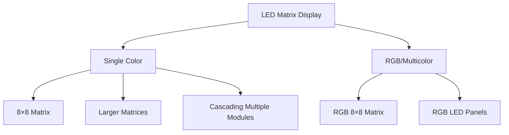
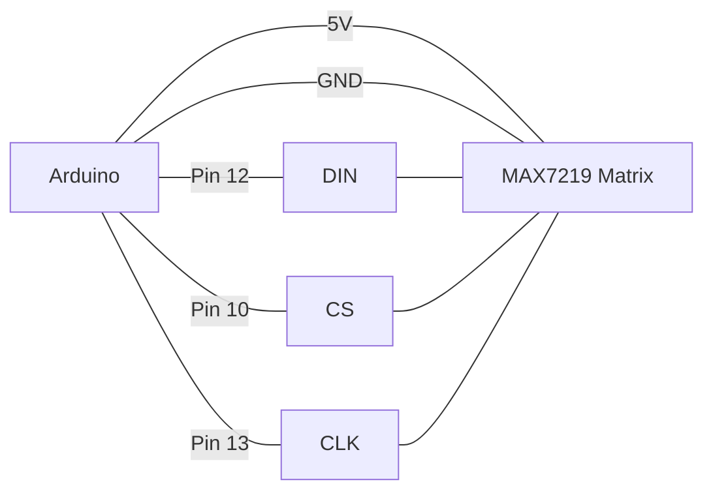

# Arduino Matrix Displays

## Introduction

LED matrix displays are versatile components that allow you to display text, graphics, and animations in a compact form factor. They consist of LEDs arranged in rows and columns, which can be individually controlled to create various patterns and displays. Matrix displays are perfect for Arduino projects where you need to display simple information or create eye-catching visual effects.

In this tutorial, we'll explore how to connect and program LED matrix displays with Arduino, from basic setup to creating scrolling text and simple animations.

## What You'll Learn

- Understanding how LED matrix displays work
- Connecting an LED matrix display to your Arduino
- Creating patterns and animations
- Displaying scrolling text
- Building practical projects with matrix displays

## Required Components

- Arduino board (Uno, Nano, or similar)
- LED matrix display (common options: 8×8 MAX7219 based module or 32×8 modules)
- Jumper wires
- Breadboard
- 10kΩ potentiometer (optional, for brightness control)
- USB cable for Arduino

## Understanding LED Matrix Displays

Matrix displays come in various sizes, with 8×8 being the most common for beginners. These displays work by arranging LEDs in a grid pattern where each LED can be addressed by its row and column position.



### How They Work

Matrix displays reduce the number of required pins through a technique called **multiplexing**. Instead of needing one pin for each LED (which would be 64 pins for an 8×8 matrix!), they use row and column addressing to control individual LEDs with far fewer pins.

For example, an 8×8 matrix would need only 16 pins (8 for rows + 8 for columns) to control 64 LEDs. Driver chips like the MAX7219 reduce this further to just 3 pins by handling the multiplexing internally.

## Connecting a MAX7219 LED Matrix to Arduino

The MAX7219 is a popular driver chip for LED matrices that handles all the multiplexing details. Here's how to connect an 8×8 MAX7219 LED matrix to an Arduino:

| MAX7219 Matrix Pin | Arduino Pin |
|--------------------|-------------|
| VCC                | 5V          |
| GND                | GND         |
| DIN                | 12 (MOSI)   |
| CS                 | 10 (SS)     |
| CLK                | 13 (SCK)    |

### Basic Wiring Diagram



## Setting Up the Software

To control the LED matrix, we'll use the LedControl library, which provides easy functions for working with MAX7219-based displays.

### Installing the Library

1. In the Arduino IDE, go to **Sketch > Include Library > Manage Libraries**
2. Search for "LedControl"
3. Install the library by Francisco Malpartida

### Basic Code Example

Let's start with a simple example that lights up individual LEDs in sequence:

```cpp
#include <LedControl.h>

// Define pins
const int DIN_PIN = 12;
const int CS_PIN = 10;
const int CLK_PIN = 13;

// Create a LedControl object
// Parameters: DIN, CLK, CS, number of devices
LedControl lc = LedControl(DIN_PIN, CLK_PIN, CS_PIN, 1);

void setup() {
  // Wake up the MAX7219 from power-saving mode
  lc.shutdown(0, false);
  
  // Set brightness (0-15)
  lc.setIntensity(0, 8);
  
  // Clear the display
  lc.clearDisplay(0);
}

void loop() {
  // Light up each LED one by one
  for (int row = 0; row < 8; row++) {
    for (int col = 0; col < 8; col++) {
      lc.setLed(0, row, col, true); // Turn on LED at row, col
      delay(100);
      lc.setLed(0, row, col, false); // Turn off LED
    }
  }
}
```

### Understanding the Code

- `LedControl(DIN_PIN, CLK_PIN, CS_PIN, 1)` creates a controller for one matrix device
- `shutdown(0, false)` wakes up the display (device 0)
- `setIntensity(0, 8)` sets medium brightness (range is 0-15)
- `clearDisplay(0)` turns off all LEDs
- `setLed(device, row, column, state)` controls individual LEDs

## Displaying Patterns

You can create patterns by controlling which LEDs are on or off. Here's how to display a simple smiley face:

```cpp
#include <LedControl.h>

const int DIN_PIN = 12;
const int CS_PIN = 10;
const int CLK_PIN = 13;

LedControl lc = LedControl(DIN_PIN, CLK_PIN, CS_PIN, 1);

// Define a smiley face pattern
byte smiley[8] = {
  B00111100,
  B01000010,
  B10100101,
  B10000001,
  B10100101,
  B10011001,
  B01000010,
  B00111100
};

void setup() {
  lc.shutdown(0, false);
  lc.setIntensity(0, 8);
  lc.clearDisplay(0);
}

void loop() {
  // Display the smiley face
  displayPattern(smiley);
  delay(2000);
  
  // Clear the display
  lc.clearDisplay(0);
  delay(1000);
}

void displayPattern(byte pattern[]) {
  for (int row = 0; row < 8; row++) {
    lc.setRow(0, row, pattern[row]);
  }
}
```

The `B00111100` notation represents a binary pattern for each row, where 1 means the LED is on and 0 means it's off.

## Creating Scrolling Text

Scrolling text is a popular use for matrix displays. Here's an example that scrolls "HELLO WORLD" across the display:

```cpp
#include <LedControl.h>

const int DIN_PIN = 12;
const int CS_PIN = 10;
const int CLK_PIN = 13;

LedControl lc = LedControl(DIN_PIN, CLK_PIN, CS_PIN, 1);

// Font definition - each number represents a column of 8 LEDs
const byte charSet[][8] = {
  {B00000000, B00000000, B00000000, B00000000, B00000000}, // Space
  {B01111110, B10001001, B10001001, B10001001, B01111110}, // O
  {B11111111, B10001000, B10001000, B10001000, B01110000}, // H
  {B11111111, B00010001, B00010001, B00010001, B00001110}, // E
  {B11111111, B00000001, B00000001, B00000001, B00000001}, // L
  {B00000000, B11111111, B00000001, B00000000, B00000000}, // r
  {B11111111, B00100001, B01000001, B10000001, B00000000}, // W
  {B11111111, B10000000, B10000000, B10000000, B11111111}, // D
};

// Define the indices for each character
#define SPACE 0
#define O_CHAR 1
#define H_CHAR 2
#define E_CHAR 3
#define L_CHAR 4
#define R_CHAR 5
#define W_CHAR 6
#define D_CHAR 7

// Message to scroll - each entry is an index into the charSet array
const byte message[] = {
  H_CHAR, E_CHAR, L_CHAR, L_CHAR, O_CHAR, SPACE, 
  W_CHAR, O_CHAR, R_CHAR, L_CHAR, D_CHAR
};

void setup() {
  lc.shutdown(0, false);
  lc.setIntensity(0, 8);
  lc.clearDisplay(0);
}

void loop() {
  scrollMessage();
}

void scrollMessage() {
  // Get the total number of columns we need to scroll
  int totalColumns = 0;
  for (int i = 0; i < sizeof(message)/sizeof(message[0]); i++) {
    totalColumns += sizeof(charSet[message[i]])/sizeof(charSet[message[i]][0]);
    // Add a column of space between characters
    totalColumns += 1;
  }
  
  // Scroll the message
  for (int position = 0; position < totalColumns + 8; position++) {
    lc.clearDisplay(0);
    
    int messagePos = 0;
    int charPos = 0;
    int currentColumn = 0;
    
    // Calculate which part of the message is visible
    while (currentColumn < position && messagePos < sizeof(message)/sizeof(message[0])) {
      byte currentChar = message[messagePos];
      int charWidth = sizeof(charSet[currentChar])/sizeof(charSet[currentChar][0]);
      
      if (charPos < charWidth) {
        charPos++;
        currentColumn++;
      } else {
        // Move to next character
        messagePos++;
        charPos = 0;
        // Add a space between characters
        currentColumn++;
      }
    }
    
    // Display the visible part of the message
    for (int col = 0; col < 8; col++) {
      if (position + col >= currentColumn) {
        int colInView = position + col - currentColumn;
        
        if (messagePos < sizeof(message)/sizeof(message[0])) {
          byte currentChar = message[messagePos];
          int charWidth = sizeof(charSet[currentChar])/sizeof(charSet[currentChar][0]);
          
          if (charPos + colInView < charWidth) {
            byte columnBits = charSet[currentChar][charPos + colInView];
            lc.setColumn(0, 7 - col, columnBits);
          } else if (charPos + colInView == charWidth) {
            // Space between characters
            lc.setColumn(0, 7 - col, 0);
          } else {
            messagePos++;
            charPos = 0;
            colInView -= (charWidth + 1);
            
            if (messagePos < sizeof(message)/sizeof(message[0])) {
              currentChar = message[messagePos];
              if (colInView < sizeof(charSet[currentChar])/sizeof(charSet[currentChar][0])) {
                byte columnBits = charSet[currentChar][colInView];
                lc.setColumn(0, 7 - col, columnBits);
              }
            }
          }
        }
      }
    }
    
    delay(150); // Scroll speed
  }
}
```

This is a more complex example and demonstrates:
- Defining custom characters using column data
- Scrolling logic to move characters across the display
- Handling spaces between characters

## Creating Animations

You can create animations by displaying a sequence of patterns. Here's an example of a simple animation:

```cpp
#include <LedControl.h>

const int DIN_PIN = 12;
const int CS_PIN = 10;
const int CLK_PIN = 13;

LedControl lc = LedControl(DIN_PIN, CLK_PIN, CS_PIN, 1);

// Define animation frames
byte frames[][8] = {
  // Frame 1 - Arrow pointing right
  {
    B00000000,
    B00001000,
    B00001100,
    B11111110,
    B11111110,
    B00001100,
    B00001000,
    B00000000
  },
  // Frame 2 - Arrow pointing down
  {
    B00000000,
    B00011000,
    B00011000,
    B00011000,
    B11111111,
    B01111110,
    B00111100,
    B00011000
  },
  // Frame 3 - Arrow pointing left
  {
    B00000000,
    B00010000,
    B00110000,
    B01111111,
    B01111111,
    B00110000,
    B00010000,
    B00000000
  },
  // Frame 4 - Arrow pointing up
  {
    B00011000,
    B00111100,
    B01111110,
    B11111111,
    B00011000,
    B00011000,
    B00011000,
    B00000000
  }
};

void setup() {
  lc.shutdown(0, false);
  lc.setIntensity(0, 8);
  lc.clearDisplay(0);
}

void loop() {
  // Display each frame of the animation
  for (int i = 0; i < 4; i++) {
    displayFrame(frames[i]);
    delay(300); // Frame duration
  }
}

void displayFrame(byte frame[]) {
  for (int row = 0; row < 8; row++) {
    lc.setRow(0, row, frame[row]);
  }
}
```

## Using Multiple Matrix Displays

You can chain multiple LED matrix displays together to create larger displays. The MAX7219 supports daisy-chaining up to 8 displays using the same 3 pins.

```cpp
#include <LedControl.h>

const int DIN_PIN = 12;
const int CS_PIN = 10;
const int CLK_PIN = 13;
const int NUM_DEVICES = 2; // Using 2 connected matrices

LedControl lc = LedControl(DIN_PIN, CLK_PIN, CS_PIN, NUM_DEVICES);

void setup() {
  // Initialize all devices
  for (int i = 0; i < NUM_DEVICES; i++) {
    lc.shutdown(i, false);
    lc.setIntensity(i, 8);
    lc.clearDisplay(i);
  }
}

void loop() {
  // Create a pattern moving across both displays
  for (int i = 0; i < NUM_DEVICES * 8; i++) {
    lc.clearDisplay(i / 8);
    lc.setLed(i / 8, i % 8, 0, true);
    lc.setLed(i / 8, i % 8, 1, true);
    lc.setLed(i / 8, i % 8, 2, true);
    delay(200);
  }
}
```

## Practical Project Example: Digital Clock

Let's create a simple digital clock using a matrix display:

```cpp
#include <LedControl.h>
#include <TimeLib.h>

const int DIN_PIN = 12;
const int CS_PIN = 10;
const int CLK_PIN = 13;
const int NUM_DEVICES = 4; // Four 8×8 matrices for a 32×8 display

LedControl lc = LedControl(DIN_PIN, CLK_PIN, CS_PIN, NUM_DEVICES);

// Define digit patterns (0-9)
byte digits[10][8] = {
  // 0
  {
    B00111100,
    B01000010,
    B01000010,
    B01000010,
    B01000010,
    B01000010,
    B01000010,
    B00111100
  },
  // 1
  {
    B00010000,
    B00110000,
    B00010000,
    B00010000,
    B00010000,
    B00010000,
    B00010000,
    B00111000
  },
  // ... remaining digits 2-9 would be defined here
};

void setup() {
  // Initialize all devices
  for (int i = 0; i < NUM_DEVICES; i++) {
    lc.shutdown(i, false);
    lc.setIntensity(i, 2); // Lower brightness for a clock
    lc.clearDisplay(i);
  }
  
  // Set the time (replace with RTC if available)
  setTime(12, 30, 0, 1, 1, 2023);
}

void loop() {
  displayTime(hour(), minute());
  delay(1000);
}

void displayTime(int hours, int minutes) {
  // First digit (tens of hours)
  int digit1 = hours / 10;
  // Second digit (ones of hours)
  int digit2 = hours % 10;
  // Third digit (tens of minutes)
  int digit3 = minutes / 10;
  // Fourth digit (ones of minutes)
  int digit4 = minutes % 10;
  
  // Display each digit on its corresponding matrix
  displayDigit(0, digit1);
  displayDigit(1, digit2);
  displayDigit(2, digit3);
  displayDigit(3, digit4);
  
  // Add blinking colon between hours and minutes
  if (second() % 2 == 0) {
    // Display colon on matrix 1 (rightmost column)
    lc.setLed(1, 2, 7, true);
    lc.setLed(1, 5, 7, true);
    // Display colon on matrix 2 (leftmost column)
    lc.setLed(2, 2, 0, true);
    lc.setLed(2, 5, 0, true);
  } else {
    // Clear colon
    lc.setLed(1, 2, 7, false);
    lc.setLed(1, 5, 7, false);
    lc.setLed(2, 2, 0, false);
    lc.setLed(2, 5, 0, false);
  }
}

void displayDigit(int deviceIndex, int digit) {
  // Display the digit pattern on the specified device
  for (int row = 0; row < 8; row++) {
    lc.setRow(deviceIndex, row, digits[digit][row]);
  }
}
```

## Using Other Matrix Display Libraries

While the LedControl library is excellent for MAX7219 devices, there are other libraries for different types of matrix displays:

1. **MD_MAX72XX** - A more feature-rich alternative to LedControl
2. **Adafruit GFX Library + Adafruit LED Backpack** - For I2C-based matrices
3. **FastLED** - For addressable RGB LED matrices

## Troubleshooting Common Issues

### Display Shows Nothing

- Check your wiring connections
- Verify that the MAX7219 is receiving power (5V and GND)
- Ensure you've called `shutdown(0, false)` to wake up the display

### Display Shows Random Patterns

- Verify the data (DIN), clock (CLK), and chip select (CS) connections
- Check if the library is properly initialized
- Try reducing the data transfer rate by adding small delays

### Not All LEDs Work

- Some displays have different row/column orientations - try using `setColumn()` instead of `setRow()`
- You might need to rotate your patterns if the display is mounted in a different orientation

## Summary

LED matrix displays are versatile components that can add visual feedback to your Arduino projects. In this tutorial, you've learned:

- How matrix displays work through multiplexing
- Connecting and programming MAX7219-based LED matrices
- Creating patterns, animations, and scrolling text
- Building a practical digital clock project

With these fundamentals, you can create informative displays, eye-catching animations, or interactive game interfaces in your Arduino projects.

## Exercises

1. Modify the smiley face pattern to create different emoticons (sad face, surprised face, etc.)
2. Create a "snake" game where an LED moves around the matrix based on button inputs
3. Build a simple VU meter that responds to audio input through an analog pin
4. Combine multiple matrix displays to create a longer scrolling text display
5. Create a custom animation that transitions between at least 5 different patterns

## Additional Resources

- [Arduino Matrix Display Examples](https://www.arduino.cc/reference/en/libraries/ledcontrol/)
- [MAX7219 Datasheet](https://www.sparkfun.com/datasheets/Components/General/COM-09622-MAX7219-MAX7221.pdf)
- [LedControl Library Documentation](https://playground.arduino.cc/Main/LedControl/)

## Next Steps

Now that you understand matrix displays, consider exploring:

- RGB LED matrices for color displays
- Larger LED panels using shift registers
- Creating interactive games with matrix displays and buttons
- Building data visualization tools that display sensor readings