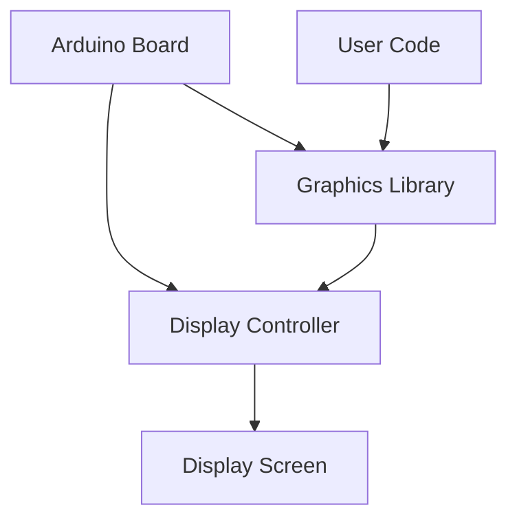

# Arduino Graphics

## Introduction

Graphics capabilities add a powerful dimension to Arduino projects, allowing you to create visual interfaces, data visualizations, and interactive elements. This guide explores how to generate and display graphics on various Arduino-compatible displays, from simple shapes and text to more complex animations and images.

Working with graphics on Arduino involves understanding how displays communicate with your microcontroller and how to leverage libraries that simplify the process of drawing on screen. By the end of this tutorial, you'll be able to create visually engaging projects that combine the computational power of Arduino with graphical output.

## Display Options for Arduino Graphics

Before diving into graphics programming, it's important to understand the types of displays available for Arduino:

### Common Display Technologies

- **LCD Displays**: Character-based or graphical LCDs
- **OLED Displays**: High-contrast displays with excellent visibility
- **TFT Displays**: Color displays with various resolutions
- **E-Paper/E-Ink**: Low power displays that retain images without power

Let's visualize the relationship between Arduino and these display types:



## Setting Up Your First Graphics Display

Let's start with a popular and beginner-friendly option: the SSD1306 OLED display. This small monochrome display communicates via I2C or SPI and is perfect for learning graphics concepts.

### Hardware Connection

For an I2C OLED display (most common):

- VCC → 3.3V or 5V (check your display specifications)
- GND → GND
- SCL → A5 (or SCL pin on newer boards)
- SDA → A4 (or SDA pin on newer boards)

### Software Setup

First, install the required libraries using the Arduino Library Manager:

1. Open Arduino IDE
2. Go to Sketch → Include Library → Manage Libraries
3. Search for "Adafruit SSD1306" and install it
4. Also install "Adafruit GFX Library" which is required for graphics functions

Now let's create a basic sketch to initialize the display:

```cpp
#include <Wire.h>
#include <Adafruit_GFX.h>
#include <Adafruit_SSD1306.h>

#define SCREEN_WIDTH 128 // OLED display width, in pixels
#define SCREEN_HEIGHT 64 // OLED display height, in pixels

// Declaration for an SSD1306 display connected to I2C (SDA, SCL pins)
#define OLED_RESET     -1 // Reset pin # (or -1 if sharing Arduino reset pin)
Adafruit_SSD1306 display(SCREEN_WIDTH, SCREEN_HEIGHT, &Wire, OLED_RESET);

void setup() {
  Serial.begin(9600);

  // Initialize the OLED display
  if(!display.begin(SSD1306_SWITCHCAPVCC, 0x3C)) { // Address 0x3C for 128x64
    Serial.println(F("SSD1306 allocation failed"));
    for(;;); // Don't proceed, loop forever
  }

  display.clearDisplay(); // Clear the buffer
  display.display();      // Update display with empty buffer
  
  // Show initial display buffer contents on the screen
  display.display();
  delay(2000); // Pause for 2 seconds
}

void loop() {
  // We'll add graphics code here
}
```

## Drawing Basic Shapes

Now that our display is initialized, let's draw some basic shapes. The Adafruit GFX library provides several functions for this purpose.

### Drawing Pixels, Lines, and Rectangles

```cpp
void loop() {
  display.clearDisplay(); // Clear previous content

  // Draw a single pixel
  display.drawPixel(64, 32, SSD1306_WHITE); // Center of 128x64 display
  display.display();
  delay(1000);
  
  // Draw a line
  display.clearDisplay();
  display.drawLine(0, 0, 127, 63, SSD1306_WHITE); // Diagonal line across screen
  display.display();
  delay(1000);
  
  // Draw a rectangle
  display.clearDisplay();
  display.drawRect(20, 10, 80, 40, SSD1306_WHITE); // x, y, width, height
  display.display();
  delay(1000);
  
  // Draw a filled rectangle
  display.clearDisplay();
  display.fillRect(30, 15, 60, 30, SSD1306_WHITE);
  display.display();
  delay(1000);
}
```

### Drawing Circles and Triangles

```cpp
void loop() {
  display.clearDisplay();

  // Draw a circle
  display.drawCircle(64, 32, 20, SSD1306_WHITE); // x, y, radius
  display.display();
  delay(1000);
  
  // Draw a filled circle
  display.clearDisplay();
  display.fillCircle(64, 32, 15, SSD1306_WHITE);
  display.display();
  delay(1000);
  
  // Draw a triangle
  display.clearDisplay();
  display.drawTriangle(
    64, 10,     // top
    44, 50,     // bottom left
    84, 50,     // bottom right
    SSD1306_WHITE);
  display.display();
  delay(1000);
  
  // Draw a filled triangle
  display.clearDisplay();
  display.fillTriangle(
    64, 15,     // top
    34, 55,     // bottom left
    94, 55,     // bottom right
    SSD1306_WHITE);
  display.display();
  delay(1000);
}
```

## Displaying Text

Text is an essential part of creating informative displays. The Adafruit GFX library supports different text sizes and positioning.

```cpp
void loop() {
  display.clearDisplay();

  display.setTextSize(1);      // Normal 1:1 pixel scale
  display.setTextColor(SSD1306_WHITE); // Draw white text
  display.setCursor(0, 0);     // Start at top-left corner
  display.println(F("Hello, Arduino!"));

  display.setTextSize(2);      // Draw 2X-scale text
  display.setTextColor(SSD1306_WHITE);
  display.setCursor(0, 20);
  display.println(F("Graphics"));
  
  display.setTextSize(1);
  display.setCursor(0, 45);
  display.println(F("Temperature: 25.5C"));
  display.println(F("Humidity: 48%"));
  
  display.display();
  delay(2000);
}
```

## Creating a Simple GUI (Graphical User Interface)

Let's combine shapes and text to create a simple progress bar interface:

```cpp
void loop() {
  // Simulate a variable changing over time
  for (int progress = 0; progress <= 100; progress += 5) {
    display.clearDisplay();
    
    // Draw title
    display.setTextSize(1);
    display.setTextColor(SSD1306_WHITE);
    display.setCursor(0, 0);
    display.println(F("Download Progress:"));
    
    // Draw progress bar outline
    display.drawRect(0, 15, 128, 10, SSD1306_WHITE);
    
    // Draw progress bar fill
    int fillWidth = map(progress, 0, 100, 0, 128);
    display.fillRect(0, 15, fillWidth, 10, SSD1306_WHITE);
    
    // Draw percentage text
    display.setCursor(0, 30);
    display.print(progress);
    display.println(F("%"));
    
    display.display();
    delay(200); // Adjust speed of animation
  }
  
  // Show completion message
  display.clearDisplay();
  display.setTextSize(1);
  display.setCursor(0, 20);
  display.println(F("Download Complete!"));
  display.display();
  delay(2000);
}
```

## Drawing Bitmaps

You can also display bitmap images on your Arduino display. First, you need to convert your image to a format that Arduino can handle.

### Converting an Image to a Bitmap Array

1. Find or create a small monochrome image
2. Use an online tool like [image2cpp](http://javl.github.io/image2cpp/) to convert it to a C/C++ array
3. Paste the generated array into your sketch

Here's an example of displaying a small Arduino logo bitmap:

```cpp
#define LOGO_WIDTH 128
#define LOGO_HEIGHT 64

static const unsigned char PROGMEM arduino_logo[] = {
  // Your bitmap data here - this is just a placeholder example
  0x00, 0x00, 0x00, 0x00, 0x00, 0x00, 0x00, 0x00, 0x00, 0x00, 0x00, 0x00, 0x00, 0x00, 0x00, 0x00,
  0x00, 0x00, 0x00, 0x00, 0x00, 0x00, 0x00, 0x00, 0x00, 0x00, 0x00, 0x00, 0x00, 0x00, 0x00, 0x00,
  // ... many more bytes defining your image ...
};

void displayLogo() {
  display.clearDisplay();
  display.drawBitmap(
    0,
    0,
    arduino_logo, LOGO_WIDTH, LOGO_HEIGHT, 1);
  display.display();
  delay(2000);
}
```

## Creating Animations

Animations can make your projects more engaging. Here's how to create a simple bouncing ball animation:

```cpp
void loop() {
  // Parameters for the bouncing ball
  int ballRadius = 5;
  int posX = ballRadius;
  int posY = ballRadius;
  int dirX = 1;
  int dirY = 1;
  int speed = 1;
  
  // Animation loop
  for (int i = 0; i < 200; i++) {
    display.clearDisplay();
    
    // Draw a border
    display.drawRect(0, 0, display.width(), display.height(), SSD1306_WHITE);
    
    // Update ball position
    posX += dirX * speed;
    posY += dirY * speed;
    
    // Check for collisions with edges
    if (posX <= ballRadius || posX >= display.width() - ballRadius) {
      dirX = -dirX; // Reverse X direction
    }
    if (posY <= ballRadius || posY >= display.height() - ballRadius) {
      dirY = -dirY; // Reverse Y direction
    }
    
    // Draw the ball
    display.fillCircle(posX, posY, ballRadius, SSD1306_WHITE);
    display.display();
    delay(10); // Controls animation speed
  }
}
```

## Displaying Data Visualizations

Arduino graphics are perfect for visualizing sensor data. Let's create a simple bar graph for temperature readings:

```cpp
void displayTemperatureGraph() {
  // Simulate temperature readings (replace with actual sensor data)
  int temperatures[] = {22, 23, 25, 24, 26, 27, 25, 24, 23, 22};
  int numReadings = sizeof(temperatures) / sizeof(temperatures[0]);
  
  display.clearDisplay();
  
  // Draw title
  display.setTextSize(1);
  display.setTextColor(SSD1306_WHITE);
  display.setCursor(0, 0);
  display.println(F("Temperature (C):"));
  
  // Draw axes
  display.drawLine(20, 16, 20, 63, SSD1306_WHITE); // Y-axis
  display.drawLine(20, 63, 127, 63, SSD1306_WHITE); // X-axis
  
  // Calculate bar width based on number of readings
  int barWidth = (107) / numReadings;
  
  // Draw temperature bars
  for (int i = 0; i < numReadings; i++) {
    int barHeight = map(temperatures[i], 20, 30, 0, 45); // Map 20-30°C to 0-45 pixels
    display.fillRect(20 + i * barWidth + 1, 63 - barHeight, barWidth - 1, barHeight, SSD1306_WHITE);
    
    // Add time labels on X axis (abbreviated to save space)
    if (i % 2 == 0) { // Label every other bar
      display.setCursor(20 + i * barWidth, 55);
      display.setTextSize(1);
      display.print(i);
    }
  }
  
  // Add temperature scale on Y axis
  display.setCursor(0, 16);
  display.print(F("30"));
  display.setCursor(0, 40);
  display.print(F("25"));
  display.setCursor(0, 63 - 7);
  display.print(F("20"));
  
  display.display();
  delay(4000);
}
```

## Working with Color Displays (TFT)

If you're using a color TFT display (like the popular 2.8" or 1.8" displays), you can create even more visually appealing graphics. Here's a basic example using the Adafruit ST7735 TFT display:

```cpp
#include <Adafruit_GFX.h>    // Core graphics library
#include <Adafruit_ST7735.h> // Hardware-specific library for ST7735
#include <SPI.h>

// For the breakout board, you can use any 2 or 3 pins
#define TFT_CS    10  // Chip select line for TFT display
#define TFT_RST   9   // Reset line for TFT (or connect to Arduino reset)
#define TFT_DC    8   // Data/command line for TFT

// Initialize the display
Adafruit_ST7735 tft = Adafruit_ST7735(TFT_CS, TFT_DC, TFT_RST);

void setup() {
  Serial.begin(9600);
  
  // Initialize the TFT display
  tft.initR(INITR_BLACKTAB); // Initialize a ST7735S chip, black tab
  
  tft.fillScreen(ST7735_BLACK);
}

void loop() {
  // Drawing with colors
  tft.fillScreen(ST7735_BLACK);
  delay(500);
  
  // Draw a blue circle
  tft.fillCircle(tft.width()/2, tft.height()/2, 30, ST7735_BLUE);
  delay(1000);
  
  // Add some text
  tft.setCursor(15, 20);
  tft.setTextColor(ST7735_WHITE);
  tft.setTextSize(1);
  tft.println("Color Graphics");
  
  tft.setCursor(30, 40);
  tft.setTextColor(ST7735_YELLOW);
  tft.setTextSize(2);
  tft.println("Arduino");
  delay(2000);
  
  // Draw a rainbow pattern
  drawRainbow();
  delay(2000);
}

// Function to draw a rainbow pattern
void drawRainbow() {
  tft.fillScreen(ST7735_BLACK);
  
  // Define rainbow colors
  uint16_t colors[] = {
    ST7735_RED, ST7735_ORANGE, ST7735_YELLOW, 
    ST7735_GREEN, ST7735_BLUE, ST7735_MAGENTA
  };
  
  int numColors = sizeof(colors) / sizeof(colors[0]);
  int barHeight = tft.height() / numColors;
  
  // Draw the rainbow bars
  for (int i = 0; i < numColors; i++) {
    tft.fillRect(0, i * barHeight, tft.width(), barHeight, colors[i]);
  }
  
  // Add overlay text
  tft.setCursor(30, tft.height()/2 - 5);
  tft.setTextColor(ST7735_WHITE);
  tft.setTextSize(1);
  tft.println("RAINBOW");
}
```

## Real-World Project: Weather Station Display

Let's combine what we've learned to create a weather station display. This example simulates sensor data, but you could easily connect real sensors.

```cpp
// With OLED SSD1306 display
void weatherStation() {
  // Simulate sensor readings (replace with actual sensors)
  float temperature = 24.5;
  float humidity = 48.3;
  int pressure = 1013; // hPa
  
  // Update these values in a real project
  while (true) {
    display.clearDisplay();
    
    // Title
    display.setTextSize(1);
    display.setTextColor(SSD1306_WHITE);
    display.setCursor(25, 0);
    display.println(F("WEATHER STATION"));
    display.drawLine(0, 10, 128, 10, SSD1306_WHITE);
    
    // Temperature with icon
    display.setCursor(5, 15);
    display.print(F("Temp: "));
    display.print(temperature, 1);
    display.println(F("C"));
    drawThermometer(95, 15);
    
    // Humidity with icon
    display.setCursor(5, 30);
    display.print(F("Humidity: "));
    display.print(humidity, 1);
    display.println(F("%"));
    drawDroplet(95, 30);
    
    // Pressure
    display.setCursor(5, 45);
    display.print(F("Pressure: "));
    display.print(pressure);
    display.println(F(" hPa"));
    
    // Time & date placeholder (would come from RTC in real project)
    display.setCursor(20, 56);
    display.println(F("12:34 03/12/2023"));
    
    display.display();
    delay(5000);
    
    // In a real project, update with new readings here
    temperature += random(-10, 10) / 10.0;
    humidity += random(-5, 5) / 10.0;
    pressure += random(-1, 1);
  }
}

// Draw a simple thermometer icon
void drawThermometer(int x, int y) {
  display.drawCircle(x + 3, y + 7, 3, SSD1306_WHITE);
  display.drawLine(x + 3, y, x + 3, y + 4, SSD1306_WHITE);
  display.drawLine(x + 2, y, x + 2, y + 4, SSD1306_WHITE);
  display.drawLine(x + 4, y, x + 4, y + 4, SSD1306_WHITE);
}

// Draw a simple water droplet icon
void drawDroplet(int x, int y) {
  display.drawCircle(x + 3, y + 5, 3, SSD1306_WHITE);
  display.drawLine(x + 1, y, x + 3, y + 2, SSD1306_WHITE);
  display.drawLine(x + 5, y, x + 3, y + 2, SSD1306_WHITE);
}
```

## Performance Considerations

When working with Arduino graphics, keep these performance tips in mind:

1. **Buffer updates**: Always use `display.display()` after multiple drawing operations, not after each one
2. **Partial updates**: Some displays support updating only changed parts of the screen
3. **Memory limitations**: Bitmaps can consume a lot of memory; be mindful on boards with limited RAM
4. **Use hardware acceleration**: Some displays offer hardware-accelerated functions for common operations
5. **Optimize refresh rates**: Don't update the display faster than necessary to save power

## Summary

In this tutorial, you've learned:

- How to connect and initialize various display types for Arduino
- Drawing basic shapes (pixels, lines, rectangles, circles)
- Displaying text with different sizes and positions
- Creating simple user interfaces with progress bars
- Displaying bitmap images
- Creating animations and data visualizations
- Working with color displays
- Building a practical weather station display

Graphics capabilities open up a world of possibilities for your Arduino projects, from practical data displays to interactive interfaces and artistic visualizations. As you get more comfortable with the concepts introduced here, you can create increasingly sophisticated graphics applications.

## Further Exploration

To continue developing your Arduino graphics skills:

1. **Experiment with different displays**: Try working with larger displays or different technologies like e-paper
2. **Learn about touch screens**: Add touch input to create interactive interfaces
3. **Explore 3D rendering**: Some libraries allow simple 3D rendering on Arduino displays
4. **Connect to data sources**: Display real-time data from sensors or online APIs
5. **Develop games**: Create simple games using graphics and input devices

## Practice Exercises

1. Create a digital clock with a custom font
2. Build a bar graph that visualizes data from an analog sensor
3. Design a splash screen for your Arduino project using bitmaps
4. Make an animated loading screen with rotating elements
5. Program a simple drawing application using a joystick or potentiometers

## Additional Resources

- Adafruit GFX Library Documentation
- Display-specific guides (TFT, OLED, LCD)
- Arduino forum discussions about graphics projects
- Open-source graphics projects on GitHub that you can learn from and modify