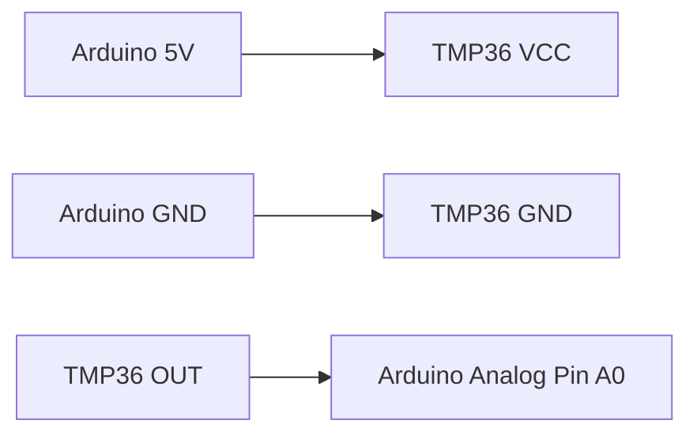
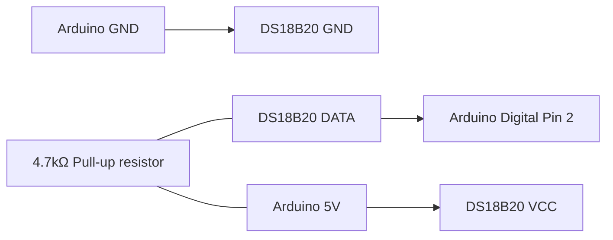
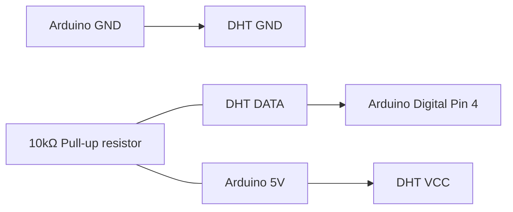
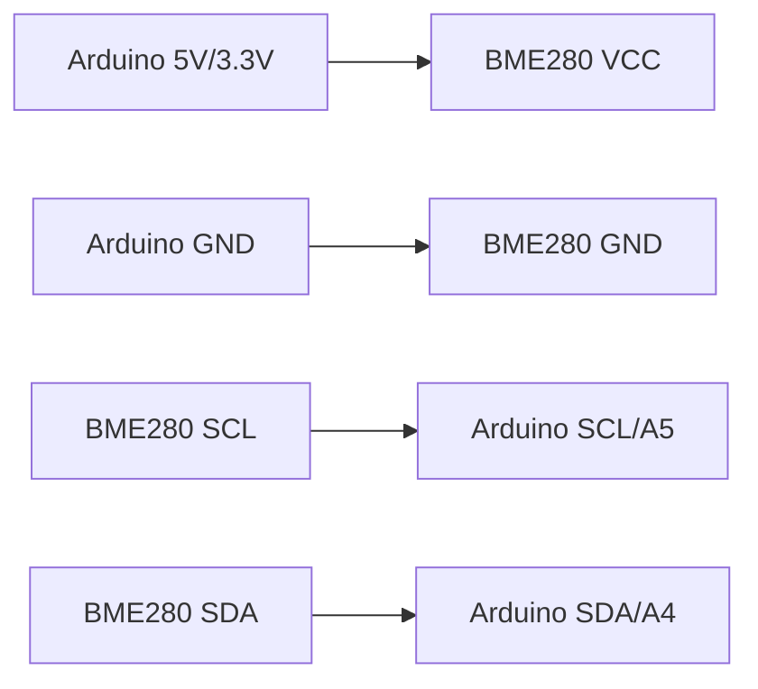
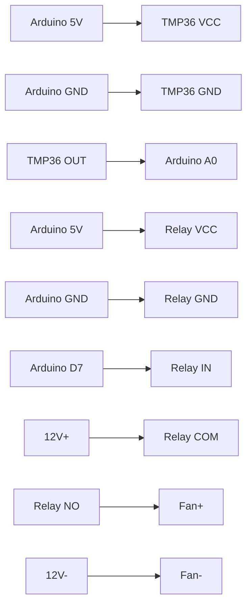
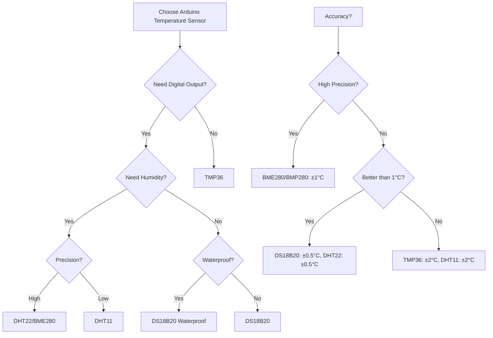

# Arduino Temperature Sensors

## Introduction

Temperature is one of the most commonly measured environmental variables in Arduino projects. From weather stations to home automation systems, temperature sensing provides crucial data that can trigger actions or be logged for analysis. This guide will explore different temperature sensors compatible with Arduino, how they work, and how to implement them in your projects.

Temperature sensors convert thermal energy into electrical signals that Arduino can read and process. These sensors vary in accuracy, range, form factor, and communication protocols. Choosing the right sensor depends on your project's specific requirements.

## Types of Temperature Sensors for Arduino

### Analog Temperature Sensors

#### TMP36 Temperature Sensor

The TMP36 is a simple analog temperature sensor that outputs a voltage proportional to the temperature.

**How it works:**
- Outputs an analog voltage that increases by 10mV per degree Celsius
- Operating range: -40°C to +125°C
- Accuracy: ±2°C
- Requires just one analog input pin

**Wiring diagram:**



**Example code:**

```cpp
const int sensorPin = A0;  // TMP36 connected to analog pin A0

void setup() {
  Serial.begin(9600);  // Initialize serial communication
}

void loop() {
  // Read the sensor value
  int sensorValue = analogRead(sensorPin);
  
  // Convert the sensor reading to voltage
  float voltage = sensorValue * (5.0 / 1023.0);
  
  // Convert voltage to temperature in Celsius
  // The TMP36 outputs 10mV per degree Celsius with a 500mV offset
  float temperatureC = (voltage - 0.5) * 100;
  
  // Print the temperature to the Serial Monitor
  Serial.print("Temperature: ");
  Serial.print(temperatureC);
  Serial.println(" °C");
  
  delay(1000);  // Wait a second between readings
}
```

**Example output:**
```
Temperature: 23.44 °C
Temperature: 23.52 °C
Temperature: 23.44 °C
```

### Digital Temperature Sensors

#### DS18B20 One-Wire Temperature Sensor

The DS18B20 is a popular digital temperature sensor that uses the OneWire protocol, allowing you to connect multiple sensors to a single Arduino pin.

**Features:**
- Digital output (no analog-to-digital conversion needed)
- Operating range: -55°C to +125°C
- Accuracy: ±0.5°C
- Waterproof versions available
- Unique 64-bit address for each sensor (multiple sensors on one pin)

**Wiring diagram:**



**Required libraries:**
- OneWire
- DallasTemperature

**Example code:**

```cpp
#include <OneWire.h>
#include <DallasTemperature.h>

// Data wire is connected to digital pin 2
#define ONE_WIRE_BUS 2

// Setup a oneWire instance to communicate with any OneWire devices
OneWire oneWire(ONE_WIRE_BUS);

// Pass our oneWire reference to Dallas Temperature sensor
DallasTemperature sensors(&oneWire);

void setup() {
  Serial.begin(9600);  // Initialize serial communication
  sensors.begin();     // Start up the library
  Serial.println("DS18B20 Temperature Sensor Demo");
}

void loop() {
  // Request temperature readings from all sensors
  Serial.print("Requesting temperatures...");
  sensors.requestTemperatures();
  Serial.println("DONE");
  
  // Get temperature in Celsius
  float tempC = sensors.getTempCByIndex(0);
  
  // Check if reading was successful
  if (tempC != DEVICE_DISCONNECTED_C) {
    Serial.print("Temperature: ");
    Serial.print(tempC);
    Serial.println(" °C");
  } else {
    Serial.println("Error: Could not read temperature data");
  }
  
  delay(2000);  // Wait 2 seconds between readings
}
```

**Example output:**
```
Requesting temperatures...DONE
Temperature: 22.31 °C
Requesting temperatures...DONE
Temperature: 22.25 °C
```

#### DHT11/DHT22 Temperature and Humidity Sensors

The DHT sensors measure both temperature and humidity, making them versatile options for environmental monitoring.

**Comparison:**

| Feature | DHT11 | DHT22 |
|---------|-------|-------|
| Temperature Range | 0°C to 50°C | -40°C to 80°C |
| Temperature Accuracy | ±2°C | ±0.5°C |
| Humidity Range | 20% to 80% | 0% to 100% |
| Humidity Accuracy | ±5% | ±2% |
| Reading Rate | 1Hz (once per second) | 0.5Hz (once every 2 seconds) |
| Price | Lower | Higher |

**Wiring diagram:**



**Required library:**
- DHT sensor library by Adafruit

**Example code:**

```cpp
#include <DHT.h>

#define DHTPIN 4      // DHT sensor connected to digital pin 4
#define DHTTYPE DHT22 // Change to DHT11 if using that sensor

DHT dht(DHTPIN, DHTTYPE);

void setup() {
  Serial.begin(9600);
  dht.begin();
  Serial.println("DHT Temperature and Humidity Sensor Demo");
}

void loop() {
  // Wait a few seconds between measurements
  delay(2000);

  // Reading temperature or humidity takes about 250 milliseconds
  float humidity = dht.readHumidity();
  float temperature = dht.readTemperature();

  // Check if any reads failed and exit early (to try again)
  if (isnan(humidity) || isnan(temperature)) {
    Serial.println("Failed to read from DHT sensor!");
    return;
  }

  Serial.print("Humidity: ");
  Serial.print(humidity);
  Serial.print("%  Temperature: ");
  Serial.print(temperature);
  Serial.println("°C");
}
```

**Example output:**
```
Humidity: 42.10%  Temperature: 23.40°C
Humidity: 42.30%  Temperature: 23.50°C
```

#### BME280/BMP280 Environmental Sensors

The BME280 and BMP280 are precision sensors that use the I2C or SPI communication protocol. The BME280 measures temperature, humidity, and barometric pressure, while the BMP280 only measures temperature and pressure.

**Features:**
- High precision
- Low power consumption
- I2C and SPI interfaces
- Operating temperature range: -40°C to +85°C
- Temperature accuracy: ±1°C

**Wiring diagram for I2C:**



**Required library:**
- Adafruit BME280 Library

**Example code:**

```cpp
#include <Wire.h>
#include <Adafruit_Sensor.h>
#include <Adafruit_BME280.h>

#define SEALEVELPRESSURE_HPA (1013.25) // Standard sea level pressure

Adafruit_BME280 bme; // Create BME280 object

void setup() {
  Serial.begin(9600);
  
  // Initialize BME280 sensor
  if (!bme.begin(0x76)) { // Address can be 0x76 or 0x77
    Serial.println("Could not find a valid BME280 sensor, check wiring!");
    while (1);
  }
  
  Serial.println("BME280 Environmental Sensor Demo");
}

void loop() {
  Serial.print("Temperature: ");
  Serial.print(bme.readTemperature());
  Serial.println(" °C");

  Serial.print("Humidity: ");
  Serial.print(bme.readHumidity());
  Serial.println(" %");

  Serial.print("Pressure: ");
  Serial.print(bme.readPressure() / 100.0F); // Convert Pa to hPa
  Serial.println(" hPa");

  Serial.print("Altitude: ");
  Serial.print(bme.readAltitude(SEALEVELPRESSURE_HPA));
  Serial.println(" m");

  Serial.println();
  delay(2000);
}
```

**Example output:**
```
Temperature: 22.34 °C
Humidity: 43.21 %
Pressure: 1010.23 hPa
Altitude: 24.52 m
```

## Practical Applications

### Temperature-Controlled Fan

This project demonstrates how to create a simple temperature-controlled fan that turns on when the temperature rises above a certain threshold.

**Components needed:**
- Arduino board
- TMP36 temperature sensor
- 5V relay module
- 12V DC fan
- 12V power supply
- Breadboard and jumper wires

**Circuit diagram:**



**Example code:**

```cpp
const int sensorPin = A0;     // TMP36 connected to analog pin A0
const int relayPin = 7;       // Relay connected to digital pin 7
const float threshold = 25.0; // Temperature threshold in Celsius

void setup() {
  Serial.begin(9600);
  pinMode(relayPin, OUTPUT);
  digitalWrite(relayPin, LOW); // Ensure fan is off at startup
  Serial.println("Temperature-Controlled Fan System");
}

void loop() {
  // Read the sensor value
  int sensorValue = analogRead(sensorPin);
  
  // Convert the sensor reading to voltage
  float voltage = sensorValue * (5.0 / 1023.0);
  
  // Convert voltage to temperature in Celsius
  float temperatureC = (voltage - 0.5) * 100;
  
  // Print the temperature to the Serial Monitor
  Serial.print("Temperature: ");
  Serial.print(temperatureC);
  Serial.print(" °C, Fan: ");
  
  // Control the fan based on temperature
  if (temperatureC > threshold) {
    digitalWrite(relayPin, HIGH); // Turn fan on
    Serial.println("ON");
  } else {
    digitalWrite(relayPin, LOW);  // Turn fan off
    Serial.println("OFF");
  }
  
  delay(1000);  // Wait a second between readings
}
```

### Weather Station

This example shows how to build a basic weather station that displays temperature and humidity data on an LCD screen.

**Components needed:**
- Arduino board
- DHT22 temperature and humidity sensor
- 16x2 LCD display with I2C adapter
- Breadboard and jumper wires

**Required libraries:**
- DHT sensor library
- LiquidCrystal_I2C

**Example code:**

```cpp
#include <DHT.h>
#include <Wire.h>
#include <LiquidCrystal_I2C.h>

#define DHTPIN 4      // DHT sensor connected to digital pin 4
#define DHTTYPE DHT22 // DHT 22 sensor type

DHT dht(DHTPIN, DHTTYPE);
LiquidCrystal_I2C lcd(0x27, 16, 2); // Set LCD address to 0x27 for a 16x2 display

void setup() {
  Serial.begin(9600);
  dht.begin();
  
  // Initialize LCD
  lcd.init();
  lcd.backlight();
  lcd.print("Weather Station");
  lcd.setCursor(0, 1);
  lcd.print("Initializing...");
  
  delay(2000);
}

void loop() {
  // Wait between measurements
  delay(2000);

  // Reading temperature and humidity
  float humidity = dht.readHumidity();
  float temperature = dht.readTemperature();

  // Check if any reads failed
  if (isnan(humidity) || isnan(temperature)) {
    lcd.clear();
    lcd.setCursor(0, 0);
    lcd.print("Sensor Error!");
    return;
  }

  // Print to Serial Monitor
  Serial.print("Humidity: ");
  Serial.print(humidity);
  Serial.print("%, Temperature: ");
  Serial.print(temperature);
  Serial.println("°C");

  // Update LCD
  lcd.clear();
  lcd.setCursor(0, 0);
  lcd.print("Temp: ");
  lcd.print(temperature, 1);
  lcd.print(" C");
  
  lcd.setCursor(0, 1);
  lcd.print("Humidity: ");
  lcd.print(humidity, 1);
  lcd.print("%");
}
```

### Temperature Data Logger

This example demonstrates how to log temperature data to an SD card, which can be useful for long-term monitoring applications.

**Components needed:**
- Arduino board
- DS18B20 temperature sensor
- SD card module
- RTC (Real Time Clock) module
- Breadboard and jumper wires

**Required libraries:**
- OneWire
- DallasTemperature
- SD
- RTClib

**Example code:**

```cpp
#include <OneWire.h>
#include <DallasTemperature.h>
#include <SPI.h>
#include <SD.h>
#include <RTClib.h>

// Pin definitions
#define ONE_WIRE_BUS 2  // DS18B20 data wire connected to digital pin 2
#define CHIP_SELECT 10  // SD card module CS pin

// Setup oneWire instance and Dallas Temperature sensor
OneWire oneWire(ONE_WIRE_BUS);
DallasTemperature sensors(&oneWire);

// Setup RTC
RTC_DS3231 rtc;

// File to write data to
File dataFile;

void setup() {
  Serial.begin(9600);
  
  // Initialize sensors
  sensors.begin();
  
  // Initialize RTC
  if (!rtc.begin()) {
    Serial.println("Couldn't find RTC");
    while (1);
  }
  
  // Automatically set RTC date/time based on computer time during upload
  if (rtc.lostPower()) {
    Serial.println("RTC lost power, setting to compile time!");
    rtc.adjust(DateTime(F(__DATE__), F(__TIME__)));
  }
  
  // Initialize SD card
  Serial.print("Initializing SD card...");
  if (!SD.begin(CHIP_SELECT)) {
    Serial.println("SD card initialization failed!");
    while (1);
  }
  Serial.println("SD card initialized.");
  
  // Create/open log file and write header
  dataFile = SD.open("templog.csv", FILE_WRITE);
  if (dataFile) {
    if (dataFile.size() == 0) {
      dataFile.println("Date,Time,Temperature (C)");
    }
    dataFile.close();
  } else {
    Serial.println("Error opening templog.csv");
  }
}

void loop() {
  // Get current time from RTC
  DateTime now = rtc.now();
  
  // Request temperature readings
  sensors.requestTemperatures();
  float tempC = sensors.getTempCByIndex(0);
  
  // Check if reading was successful
  if (tempC != DEVICE_DISCONNECTED_C) {
    // Format date and time
    char dateBuffer[11];
    sprintf(dateBuffer, "%04d-%02d-%02d", now.year(), now.month(), now.day());
    
    char timeBuffer[9];
    sprintf(timeBuffer, "%02d:%02d:%02d", now.hour(), now.minute(), now.second());
    
    // Open file and write data
    dataFile = SD.open("templog.csv", FILE_WRITE);
    if (dataFile) {
      dataFile.print(dateBuffer);
      dataFile.print(",");
      dataFile.print(timeBuffer);
      dataFile.print(",");
      dataFile.println(tempC);
      dataFile.close();
      
      // Print to serial monitor
      Serial.print(dateBuffer);
      Serial.print(" ");
      Serial.print(timeBuffer);
      Serial.print(" - Temperature: ");
      Serial.print(tempC);
      Serial.println(" °C");
    } else {
      Serial.println("Error opening templog.csv");
    }
  } else {
    Serial.println("Error: Could not read temperature data");
  }
  
  // Wait 1 minute before next reading
  delay(60000);
}
```

## Temperature Sensor Comparison

When choosing a temperature sensor for your Arduino project, consider these factors:



| Sensor | Type | Range | Accuracy | Special Features | Communication Protocol |
|--------|------|-------|----------|------------------|------------------------|
| TMP36 | Analog | -40°C to +125°C | ±2°C | Simple to use | Analog |
| DS18B20 | Digital | -55°C to +125°C | ±0.5°C | Waterproof versions, Multiple on one pin | OneWire |
| DHT11 | Digital | 0°C to +50°C | ±2°C | Includes humidity sensor | Custom digital |
| DHT22 | Digital | -40°C to +80°C | ±0.5°C | Includes humidity sensor | Custom digital |
| BME280 | Digital | -40°C to +85°C | ±1°C | Temperature, humidity, pressure | I2C/SPI |
| BMP280 | Digital | -40°C to +85°C | ±1°C | Temperature, pressure | I2C/SPI |

## Troubleshooting

### Common Issues with Temperature Sensors

1. **Inaccurate readings:**
   - Check power supply stability
   - Ensure proper grounding
   - Verify pull-up resistors (for digital sensors)
   - Allow sensor to acclimate to environment

2. **No readings or communication errors:**
   - Verify wiring connections
   - Check library installation
   - Confirm correct pin assignments in code
   - Make sure sensor is not damaged

3. **Inconsistent readings:**
   - Add capacitor (0.1μF) between VCC and GND near the sensor
   - Place sensor away from heat-generating components
   - Reduce reading frequency if oversampling
   - Implement averaging to smooth out readings

4. **Noisy analog readings (TMP36):**
   - Add a low-pass filter (e.g., 0.1μF capacitor between output and ground)
   - Use shorter wires to reduce noise
   - Implement software averaging

**Debugging code for sensor issues:**

```cpp
// Debugging code for DS18B20 sensor
#include <OneWire.h>
#include <DallasTemperature.h>

#define ONE_WIRE_BUS 2

OneWire oneWire(ONE_WIRE_BUS);
DallasTemperature sensors(&oneWire);
DeviceAddress thermometerAddress;

void setup() {
  Serial.begin(9600);
  sensors.begin();
  
  Serial.println("DS18B20 Debugging");
  
  // Find all devices on the bus
  Serial.print("Locating devices...");
  Serial.print("Found ");
  Serial.print(sensors.getDeviceCount());
  Serial.println(" devices.");
  
  // Report parasite power requirements
  Serial.print("Parasite power is: ");
  if (sensors.isParasitePowerMode()) Serial.println("ON");
  else Serial.println("OFF");
  
  // Show the addresses of each sensor
  if (!sensors.getAddress(thermometerAddress, 0)) {
    Serial.println("Unable to find address for Device 0");
  } else {
    Serial.print("Device 0 Address: ");
    printAddress(thermometerAddress);
    Serial.println();
  }
}

void loop() {
  Serial.print("Requesting temperatures...");
  sensors.requestTemperatures();
  Serial.println("DONE");
  
  float tempC = sensors.getTempCByIndex(0);
  
  if (tempC != DEVICE_DISCONNECTED_C) {
    Serial.print("Temperature: ");
    Serial.print(tempC);
    Serial.println(" °C");
    
    // Show raw data
    Serial.print("Raw value: ");
    Serial.println(sensors.getTemp(thermometerAddress));
  } else {
    Serial.println("Error: Could not read temperature data");
  }
  
  delay(2000);
}

void printAddress(DeviceAddress deviceAddress) {
  for (uint8_t i = 0; i < 8; i++) {
    if (deviceAddress[i] < 16) Serial.print("0");
    Serial.print(deviceAddress[i], HEX);
  }
}
```

## Summary

Temperature sensors are essential components in many Arduino projects, allowing you to monitor and respond to environmental conditions. In this guide, we've covered:

1. **Different types of temperature sensors:**
   - Analog sensors like TMP36
   - Digital sensors like DS18B20, DHT11/DHT22, and BME280/BMP280

2. **How to connect and program each sensor type:**
   - Wiring diagrams
   - Required libraries
   - Example code

3. **Practical applications:**
   - Temperature-controlled fan
   - Weather station
   - Data logger

4. **Troubleshooting common issues:**
   - Inaccurate readings
   - Communication errors
   - Debugging techniques

When selecting a temperature sensor for your Arduino project, consider the accuracy requirements, environmental conditions, and whether you need additional measurements like humidity or pressure. Each sensor has its strengths and limitations, making them suitable for different applications.

## Additional Resources

### Exercises

1. **Basic TMP36 Exercise:**
   Create a temperature alert system that turns on an LED when the temperature exceeds a certain threshold.

2. **DS18B20 Exercise:**
   Connect multiple DS18B20 sensors to monitor temperatures in different locations and display the differences.

3. **DHT22 Exercise:**
   Build a humidity-controlled system that activates a relay when humidity levels fall below a certain threshold.

4. **Advanced Exercise:**
   Create a temperature monitoring system that displays current, minimum, and maximum temperatures on an LCD and allows the user to reset the min/max values with a button press.

### Library Documentation

- [OneWire Library](https://www.arduino.cc/reference/en/libraries/onewire/)
- [DallasTemperature Library](https://www.arduino.cc/reference/en/libraries/dallastemperature/)
- [DHT Sensor Library](https://www.arduino.cc/reference/en/libraries/dht-sensor-library/)
- [Adafruit BME280 Library](https://www.arduino.cc/reference/en/libraries/adafruit-bme280-library/)

### Further Reading

- [Arduino Temperature Control Library](https://www.arduino.cc/reference/en/libraries/arduino-temperature-control-library/)
- [Arduino Sensor Guide](https://www.arduino.cc/en/Tutorial/BuiltInExamples#sensors)
- [Adafruit Learn: Temperature Sensing](https://learn.adafruit.com/thermistor/overview)