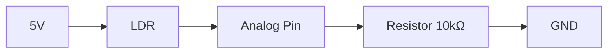

# Arduino Light Sensors

## Introduction

Light sensors are essential components in many electronic projects that need to detect or respond to light levels. They convert light energy into electrical signals that your Arduino can measure and process. Whether you want to create an automatic night light, a sunlight tracker, or a plant monitoring system, understanding how to work with light sensors is a valuable skill for any Arduino enthusiast.

In this tutorial, we'll explore different types of light sensors compatible with Arduino, how they work, and how to implement them in various practical projects. By the end, you'll be able to confidently incorporate light sensing capabilities into your own Arduino creations.

## Types of Light Sensors

There are several types of light sensors commonly used with Arduino:

### 1. Photoresistors (LDRs)

A photoresistor, also known as a Light Dependent Resistor (LDR), is the most common and affordable light sensor used with Arduino. Its resistance decreases when light intensity increases.


Key characteristics:
- Low cost and widely available
- Simple to use
- Moderate accuracy
- Slow response time
- Most sensitive to visible light

### 2. Photodiodes

Photodiodes are semiconductor devices that convert light into current. They offer faster response times compared to photoresistors.

Key characteristics:
- Faster response time
- Good accuracy
- Directional sensitivity
- Requires more complex circuitry
- Can be selected for specific light wavelength sensitivity

### 3. Phototransistors

Phototransistors are similar to photodiodes but provide amplification of the photocurrent.

Key characteristics:
- Higher sensitivity than photodiodes
- Fast response time
- Good for detecting rapid changes in light
- More complex to implement

### 4. Integrated Light Sensors

These are specialized IC modules that combine a light sensor with processing circuitry:

- **TSL2561/TSL2591**: Digital light sensors with I2C interface, providing precise lux measurements
- **BH1750**: Digital ambient light sensor with I2C interface
- **VEML7700**: High accuracy ambient light sensor with I2C interface

Key characteristics:
- High precision
- Direct lux readings
- I2C or SPI communication
- More expensive but easier to integrate
- Often include infrared filtering for better accuracy

## Working with a Photoresistor (LDR)

Let's start with the most common light sensor - the photoresistor or LDR.

### How Photoresistors Work

A photoresistor decreases its resistance when exposed to light. In darkness, a typical LDR might have a resistance of around 1 MΩ (megaohm), while in bright light, the resistance could drop to just a few hundred ohms.

To read this changing resistance with Arduino, we use a voltage divider circuit:



### Required Components

- Arduino board (Uno, Nano, etc.)
- Photoresistor (LDR)
- 10kΩ resistor (for voltage divider)
- Breadboard
- Jumper wires

### Circuit Connection

1. Connect one leg of the photoresistor to 5V
2. Connect the other leg to an analog pin (e.g., A0)
3. Connect a 10kΩ resistor between the analog pin and ground

### Basic Code Example

Here's a simple sketch to read values from a photoresistor and display them in the Serial Monitor:

```cpp
const int ldrPin = A0;  // LDR connected to analog pin A0

void setup() {
  Serial.begin(9600);  // Initialize serial communication
}

void loop() {
  int lightValue = analogRead(ldrPin);  // Read the analog value from LDR
  
  Serial.print("Light value: ");
  Serial.println(lightValue);
  
  delay(500);  // Small delay between readings
}
```

### Expected Output

When you run this code and open the Serial Monitor (9600 baud), you'll see values ranging from 0 to 1023:

```
Light value: 842
Light value: 835
Light value: 567
Light value: 230
```

Higher values indicate brighter light, while lower values indicate less light.

### Converting Raw Values to Percentages

To make the readings more intuitive, you can convert them to a percentage:

```cpp
const int ldrPin = A0;  // LDR connected to analog pin A0

void setup() {
  Serial.begin(9600);  // Initialize serial communication
}

void loop() {
  int lightValue = analogRead(ldrPin);  // Read the analog value from LDR
  
  // Convert to percentage (0-100%)
  int lightPercentage = map(lightValue, 0, 1023, 0, 100);
  
  Serial.print("Light level: ");
  Serial.print(lightPercentage);
  Serial.println("%");
  
  delay(500);  // Small delay between readings
}
```

## Building an Automatic Night Light

Let's create a practical project - an automatic night light that turns on an LED when it gets dark.

### Required Components

- Arduino board
- Photoresistor (LDR)
- 10kΩ resistor (for LDR voltage divider)
- LED (any color)
- 220Ω resistor (for LED)
- Breadboard
- Jumper wires

### Circuit Connection

1. Connect the LDR and 10kΩ resistor as a voltage divider (as shown earlier)
2. Connect the LED's anode (longer leg) to digital pin 9 through a 220Ω resistor
3. Connect the LED's cathode (shorter leg) to ground

### Code

```cpp
const int ldrPin = A0;  // LDR connected to analog pin A0
const int ledPin = 9;   // LED connected to digital pin 9
const int threshold = 300;  // Light threshold value (adjust based on your environment)

void setup() {
  pinMode(ledPin, OUTPUT);  // Set LED pin as output
  Serial.begin(9600);       // Initialize serial communication
}

void loop() {
  int lightValue = analogRead(ldrPin);  // Read the analog value from LDR
  
  Serial.print("Light value: ");
  Serial.println(lightValue);
  
  // Turn on LED if it's dark (below threshold)
  if (lightValue < threshold) {
    digitalWrite(ledPin, HIGH);
    Serial.println("LED ON - It's dark");
  } else {
    digitalWrite(ledPin, LOW);
    Serial.println("LED OFF - It's bright");
  }
  
  delay(500);  // Small delay between readings
}
```

### How It Works

1. We read the light value from the LDR
2. We compare it to a threshold value (you'll need to adjust this based on your environment)
3. If the light value is below the threshold (dark), we turn the LED on
4. If the light value is above the threshold (bright), we turn the LED off

### Improving with Analog Control

Instead of just turning the LED on or off, we can adjust its brightness based on how dark it is:

```cpp
const int ldrPin = A0;  // LDR connected to analog pin A0
const int ledPin = 9;   // LED connected to digital pin 9 (must be PWM pin)

void setup() {
  pinMode(ledPin, OUTPUT);  // Set LED pin as output
  Serial.begin(9600);       // Initialize serial communication
}

void loop() {
  int lightValue = analogRead(ldrPin);  // Read the analog value from LDR
  
  // Map the light value (0-1023) to LED brightness (255-0)
  // Note: We invert the range - darker = brighter LED
  int ledBrightness = map(lightValue, 0, 1023, 255, 0);
  
  // Ensure the LED turns completely off in bright light
  if (lightValue > 800) {
    ledBrightness = 0;
  }
  
  // Set LED brightness
  analogWrite(ledPin, ledBrightness);
  
  // Print values to Serial Monitor
  Serial.print("Light value: ");
  Serial.print(lightValue);
  Serial.print(" | LED brightness: ");
  Serial.println(ledBrightness);
  
  delay(100);  // Small delay between readings
}
```

## Working with Digital Light Sensors (BH1750)

For more accurate light measurements, you might want to use a digital light sensor like the BH1750. This sensor communicates via I2C and provides values in lux, a standard unit of illuminance.

### Required Components

- Arduino board
- BH1750 light sensor module
- Breadboard
- Jumper wires

### Installing the Library

First, install the BH1750 library:
1. In Arduino IDE, go to Sketch > Include Library > Manage Libraries...
2. Search for "BH1750"
3. Find the library by "Christopher Laws" and click Install

### Circuit Connection

1. Connect VCC to 5V on Arduino (or 3.3V for 3.3V modules)
2. Connect GND to GND on Arduino
3. Connect SCL to A5 on Arduino (or the SCL pin for your board)
4. Connect SDA to A4 on Arduino (or the SDA pin for your board)
5. Connect ADDR to GND (for default I2C address)

### Code Example

```cpp
#include <Wire.h>
#include <BH1750.h>

BH1750 lightMeter;

void setup() {
  Serial.begin(9600);
  Wire.begin();
  lightMeter.begin();
  
  Serial.println("BH1750 Light Sensor Test");
}

void loop() {
  float lux = lightMeter.readLightLevel();
  
  Serial.print("Light: ");
  Serial.print(lux);
  Serial.println(" lux");
  
  delay(1000);
}
```

### Expected Output

The Serial Monitor will display the light level in lux:

```
BH1750 Light Sensor Test
Light: 124.00 lux
Light: 125.00 lux
Light: 120.00 lux
Light: 45.00 lux
```

### Understanding Lux Values

Here are typical lux values for different environments:

- Moonlight: 0.1 - 1 lux
- Living room: 50 - 200 lux
- Office lighting: 300 - 500 lux
- Overcast day: 1,000 - 2,000 lux
- Full daylight: 10,000 - 25,000 lux
- Direct sunlight: 32,000 - 100,000 lux

## Project: Plant Light Monitor with Data Logging

Let's create a more advanced project that monitors light levels for a plant and logs the data to the Serial Monitor.

### Required Components

- Arduino board
- BH1750 light sensor
- 16x2 LCD screen (with I2C adapter)
- Breadboard
- Jumper wires

### Installing Libraries

You'll need these libraries:
1. BH1750 (as installed earlier)
2. LiquidCrystal_I2C

### Circuit Connection

1. Connect the BH1750 as shown earlier
2. Connect LCD's VCC to 5V
3. Connect LCD's GND to GND
4. Connect LCD's SDA to A4
5. Connect LCD's SCL to A5

Note: Make sure your I2C devices have different addresses. The default address for BH1750 is 0x23 and for LCD is typically 0x27.

### Code

```cpp
#include <Wire.h>
#include <BH1750.h>
#include <LiquidCrystal_I2C.h>

BH1750 lightMeter;
LiquidCrystal_I2C lcd(0x27, 16, 2);  // Set the LCD address to 0x27 for a 16x2 display

// Light thresholds for plants (in lux)
const int LOW_LIGHT = 500;
const int HIGH_LIGHT = 10000;

// Variables for data logging
unsigned long previousMillis = 0;
const long interval = 60000;  // Log data every minute (60,000 ms)
unsigned long startTime;

void setup() {
  Serial.begin(9600);
  Wire.begin();
  lightMeter.begin();
  
  lcd.init();
  lcd.backlight();
  
  startTime = millis();
  
  // Print header for data logging
  Serial.println("Time (min), Light Level (lux), Status");
}

void loop() {
  // Read light level
  float lux = lightMeter.readLightLevel();
  
  // Determine light status
  String lightStatus;
  if (lux < LOW_LIGHT) {
    lightStatus = "Too Low";
  } else if (lux > HIGH_LIGHT) {
    lightStatus = "Too High";
  } else {
    lightStatus = "Optimal";
  }
  
  // Update LCD
  lcd.clear();
  lcd.setCursor(0, 0);
  lcd.print("Light: ");
  lcd.print(lux);
  lcd.print(" lux");
  lcd.setCursor(0, 1);
  lcd.print("Status: ");
  lcd.print(lightStatus);
  
  // Log data every minute
  unsigned long currentMillis = millis();
  if (currentMillis - previousMillis >= interval) {
    previousMillis = currentMillis;
    
    // Calculate elapsed time in minutes
    float elapsedMinutes = (currentMillis - startTime) / 60000.0;
    
    // Log data to Serial Monitor
    Serial.print(elapsedMinutes, 2);
    Serial.print(", ");
    Serial.print(lux);
    Serial.print(", ");
    Serial.println(lightStatus);
  }
  
  delay(1000);  // Update every second
}
```

### How It Works

1. The program continuously monitors light levels using the BH1750 sensor
2. It displays current light levels and status on the LCD screen
3. Every minute, it logs data to the Serial Monitor
4. It categorizes light levels as "Too Low," "Optimal," or "Too High" based on preset thresholds

### Data Analysis

You can export the data from the Serial Monitor (using the "Save" button) and then import it into a spreadsheet program for further analysis or visualization.

## Calibrating Light Sensors

To get accurate readings from your light sensors, particularly analog ones like LDRs, you might need to calibrate them.

### Calibration for Photoresistors

Here's a simple calibration process:

```cpp
const int ldrPin = A0;

// Calibration values
int minLight = 1023;  // Start with maximum possible value
int maxLight = 0;     // Start with minimum possible value
const int calibrationTime = 10000;  // 10 seconds calibration

void setup() {
  Serial.begin(9600);
  
  // Calibration phase
  Serial.println("Starting calibration...");
  Serial.println("Please expose the sensor to various light conditions");
  
  long startTime = millis();
  
  // Calibrate for the specified time
  while (millis() - startTime < calibrationTime) {
    int lightValue = analogRead(ldrPin);
    
    // Update min and max values
    if (lightValue < minLight) {
      minLight = lightValue;
    }
    if (lightValue > maxLight) {
      maxLight = lightValue;
    }
    
    // Display the current value
    Serial.print("Current: ");
    Serial.println(lightValue);
    
    delay(100);
  }
  
  Serial.println("Calibration complete!");
  Serial.print("Minimum light value: ");
  Serial.println(minLight);
  Serial.print("Maximum light value: ");
  Serial.println(maxLight);
}

void loop() {
  int lightValue = analogRead(ldrPin);
  
  // Map to a calibrated percentage (0-100%)
  int calibratedPercentage = map(lightValue, minLight, maxLight, 0, 100);
  
  // Constrain to handle values outside calibration range
  calibratedPercentage = constrain(calibratedPercentage, 0, 100);
  
  Serial.print("Raw: ");
  Serial.print(lightValue);
  Serial.print(" | Calibrated: ");
  Serial.print(calibratedPercentage);
  Serial.println("%");
  
  delay(500);
}
```

### How to Use the Calibration

1. Run the sketch and expose the sensor to the darkest and brightest conditions it will experience
2. After calibration, the sensor will map readings to a 0-100% scale based on these min/max values
3. For persistent calibration, you can save the min/max values to EEPROM

## Troubleshooting Light Sensors

If you're having issues with your light sensor, here are some common problems and solutions:

### Inconsistent Readings with LDR

Problem: Readings fluctuate wildly even in stable lighting conditions.

Solutions:
- Add a small capacitor (0.1μF) between the analog pin and ground to reduce noise
- Take multiple readings and average them:

```cpp
const int ldrPin = A0;
const int numReadings = 10;

void setup() {
  Serial.begin(9600);
}

void loop() {
  int total = 0;
  
  // Take multiple readings
  for (int i = 0; i < numReadings; i++) {
    total += analogRead(ldrPin);
    delay(10);
  }
  
  // Calculate average
  int average = total / numReadings;
  
  Serial.print("Average light level: ");
  Serial.println(average);
  
  delay(500);
}
```

### I2C Device Not Found

Problem: Your code can't detect the BH1750 or other I2C light sensor.

Solutions:
- Check connections, especially SDA and SCL pins
- Run an I2C scanner to verify the address:

```cpp
#include <Wire.h>

void setup() {
  Wire.begin();
  Serial.begin(9600);
  Serial.println("I2C Scanner");
}

void loop() {
  byte error, address;
  int nDevices = 0;

  Serial.println("Scanning...");

  for (address = 1; address < 127; address++) {
    Wire.beginTransmission(address);
    error = Wire.endTransmission();

    if (error == 0) {
      Serial.print("I2C device found at address 0x");
      if (address < 16) {
        Serial.print("0");
      }
      Serial.println(address, HEX);
      nDevices++;
    }
  }
  
  if (nDevices == 0) {
    Serial.println("No I2C devices found");
  } else {
    Serial.println("Done");
  }
  
  delay(5000);
}
```

## Summary

In this tutorial, we've explored various types of light sensors compatible with Arduino, focusing primarily on photoresistors (LDRs) and digital light sensors like the BH1750. We've covered:

1. Different types of light sensors and their characteristics
2. Basic circuit connections for both analog and digital light sensors
3. Reading and processing light sensor data
4. Building practical projects like an automatic night light and plant light monitor
5. Calibrating light sensors for more accurate readings
6. Troubleshooting common issues

Light sensors are versatile components that enable your Arduino projects to interact with the environment. Whether you're creating an ambient light detector, an automated lighting system, or a plant monitoring solution, understanding how to work with light sensors is a valuable skill in your Arduino journey.

## Exercises

1. **Basic Light Meter**: Create a simple light meter that displays the light level using a row of LEDs (the brighter the light, the more LEDs light up).

2. **Light-Based Alarm**: Build an alarm that triggers when light levels suddenly change (like someone turning on a light in a dark room).

3. **Light Data Logger**: Extend the plant monitor project to save data to an SD card for long-term monitoring.

4. **Sunrise Simulator**: Create a project that gradually increases LED brightness at a specific time to simulate sunrise.

5. **Light-Following Robot**: Build a simple robot that follows the brightest light source using multiple light sensors.

## Additional Resources

- [Arduino Official Documentation](https://www.arduino.cc/reference/en/)
- [BH1750 Library Documentation](https://github.com/claws/BH1750)
- [Adafruit Learning System - Light Sensors](https://learn.adafruit.com/category/sensors)
- [SparkFun Light Sensor Guide](https://learn.sparkfun.com/tutorials/light)
- [Instructables Arduino Light Sensor Projects](https://www.instructables.com/circuits/arduino/light-sensor/)