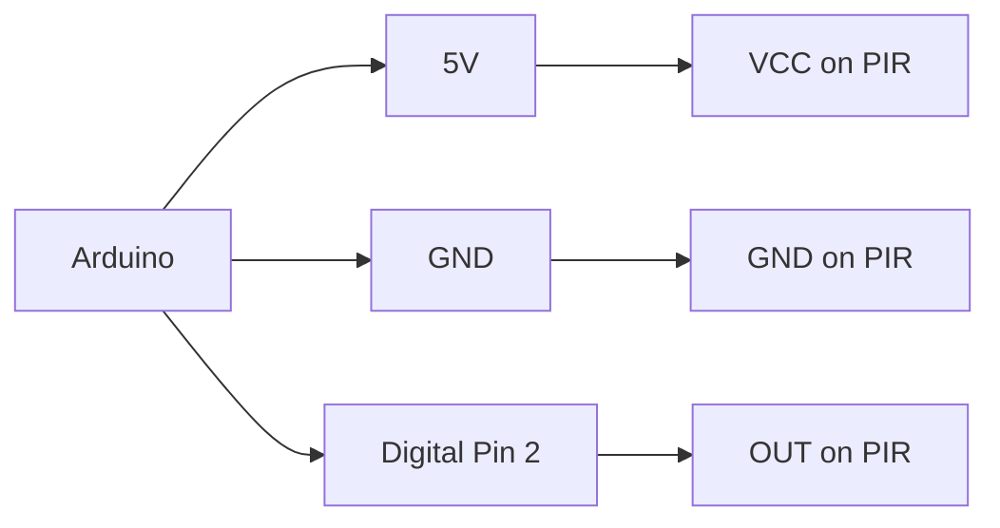
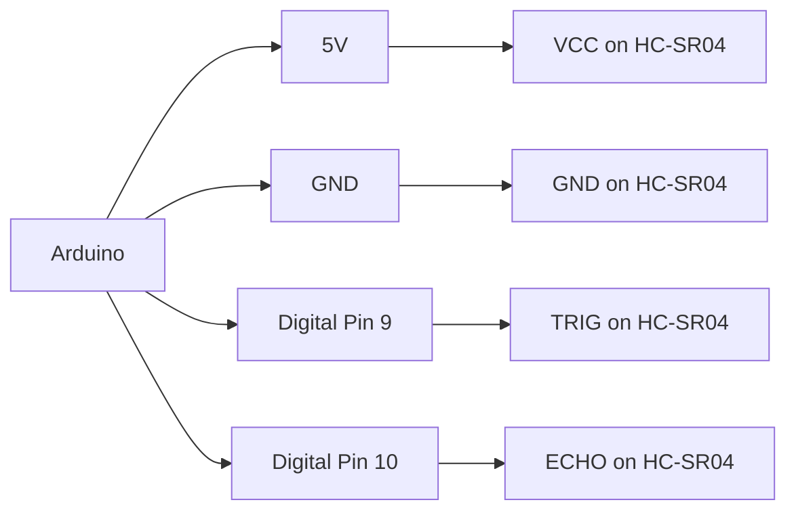
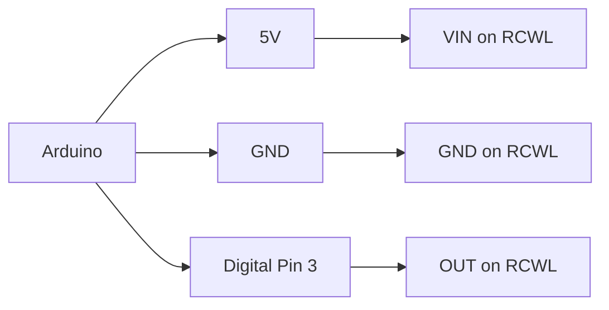
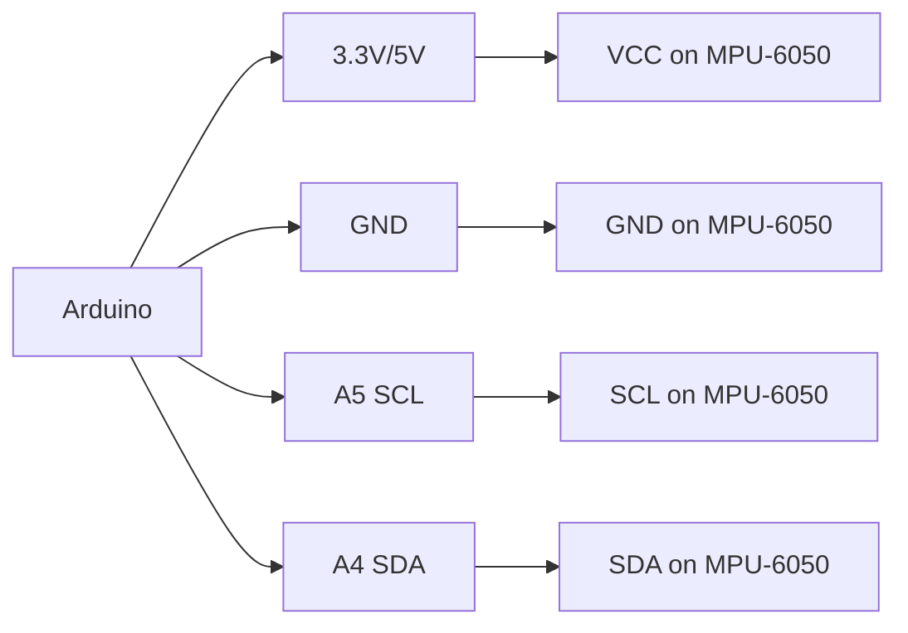

# Arduino Motion Sensors

## Introduction

Motion sensors are essential components in many Arduino projects, allowing your creations to detect movement, measure distance, or respond to changes in their environment. These sensors transform physical motion into electrical signals that Arduino can process, enabling interactions with the world around them.

In this guide, we'll explore various types of motion sensors compatible with Arduino, how they work, and how to implement them in your projects. Whether you're building a security system, an interactive art installation, or a robot, understanding motion sensors will open up exciting possibilities for your Arduino projects.

## Types of Motion Sensors

There are several types of motion sensors that work well with Arduino, each with unique characteristics and use cases:

### 1. PIR (Passive Infrared) Sensors

PIR sensors detect infrared radiation changes caused by moving warm bodies (like humans or animals). They're commonly used in:
- Motion-activated lights
- Security systems
- Automated displays

### 2. Ultrasonic Distance Sensors

These sensors use sound waves to detect objects and measure distance. Popular models include:
- HC-SR04
- US-015
- HC-SR05

### 3. RCWL Microwave Motion Sensors

These sensors use microwave radar technology to detect movement through walls and solid objects.

### 4. Accelerometers and Gyroscopes

These sensors detect device orientation, acceleration, and rotational movement:
- MPU-6050 (combined accelerometer and gyroscope)
- ADXL345 (3-axis accelerometer)
- L3G4200D (gyroscope)

### 5. Infrared Proximity Sensors

These detect objects at close range using infrared light:
- Sharp GP2Y0A21YK
- TCRT5000

## PIR Motion Sensor

Let's start with one of the most common motion sensors - the PIR sensor.

### How PIR Sensors Work

PIR sensors detect changes in infrared radiation. All objects emit some level of infrared radiation, but warm objects like humans and animals emit more. The sensor contains a pyroelectric sensor that generates a small electric current when exposed to infrared radiation.

The sensor has two slots, each containing a special material sensitive to infrared. When the sensor is idle (no movement), both slots detect the same amount of infrared. When a warm object passes by, it first activates one slot, then the other, causing a positive differential change. When the warm object leaves the sensing area, the reverse happens, creating a negative differential change.

### Connecting a PIR Sensor to Arduino

PIR sensors typically have three pins:
- VCC (Power): Connect to 5V on Arduino
- GND (Ground): Connect to GND on Arduino
- OUT (Signal): Connect to a digital pin on Arduino

Here's a simple wiring diagram:



### Basic PIR Sensor Code

```cpp
// Define the pin for the PIR sensor
const int pirPin = 2;
// Variable to store the PIR status
int motionDetected = 0;

void setup() {
  // Initialize serial communication
  Serial.begin(9600);
  // Set the PIR pin as input
  pinMode(pirPin, INPUT);
  // Allow the PIR sensor to calibrate
  Serial.println("Calibrating PIR sensor...");
  delay(2000);
  Serial.println("PIR sensor ready!");
}

void loop() {
  // Read the PIR sensor value
  motionDetected = digitalRead(pirPin);
  
  // Check if motion is detected
  if (motionDetected == HIGH) {
    Serial.println("Motion detected!");
    delay(1000); // Small delay to avoid multiple triggers
  }
}
```

### Output Example

When running this code with a properly connected PIR sensor, you would see output like:

```
Calibrating PIR sensor...
PIR sensor ready!
Motion detected!
Motion detected!
```

The "Motion detected!" message appears whenever someone moves in front of the sensor.

### Adjusting PIR Sensitivity and Timing

Most PIR sensors have two potentiometers that allow you to adjust:
1. Sensitivity - how much motion is required to trigger the sensor
2. Delay time - how long the output remains HIGH after detecting motion

Turn these potentiometers clockwise to increase and counterclockwise to decrease their values.

## Ultrasonic Distance Sensor

Ultrasonic sensors like the HC-SR04 are perfect for measuring distance without physical contact.

### How Ultrasonic Sensors Work

These sensors work similar to sonar:
1. The transmitter sends out an ultrasonic pulse (40kHz)
2. This pulse bounces off objects and returns to the receiver
3. The sensor measures the time between sending and receiving
4. Distance is calculated using the speed of sound (343m/s at room temperature)

### Connecting HC-SR04 to Arduino

The HC-SR04 has four pins:
- VCC: Connect to 5V on Arduino
- GND: Connect to GND on Arduino
- TRIG: Connect to a digital pin on Arduino (e.g., pin 9)
- ECHO: Connect to a digital pin on Arduino (e.g., pin 10)



### Basic Ultrasonic Sensor Code

```cpp
// Define pins for the ultrasonic sensor
const int trigPin = 9;
const int echoPin = 10;

// Variables for duration and distance
long duration;
int distance;

void setup() {
  // Initialize serial communication
  Serial.begin(9600);
  // Set the trig pin as output and echo pin as input
  pinMode(trigPin, OUTPUT);
  pinMode(echoPin, INPUT);
}

void loop() {
  // Clear the trigPin
  digitalWrite(trigPin, LOW);
  delayMicroseconds(2);
  
  // Set the trigPin HIGH for 10 microseconds
  digitalWrite(trigPin, HIGH);
  delayMicroseconds(10);
  digitalWrite(trigPin, LOW);
  
  // Read the echoPin, which returns the sound wave travel time in microseconds
  duration = pulseIn(echoPin, HIGH);
  
  // Calculate the distance
  // Speed of sound is 343 m/s or 0.0343 cm/microsecond
  // We divide by 2 because the sound wave travels to the object and back
  distance = duration * 0.0343 / 2;
  
  // Display the distance on the Serial Monitor
  Serial.print("Distance: ");
  Serial.print(distance);
  Serial.println(" cm");
  
  delay(500); // Short delay between measurements
}
```

### Output Example

With this code and a properly connected ultrasonic sensor, you would see output like:

```
Distance: 45 cm
Distance: 46 cm
Distance: 23 cm
Distance: 10 cm
```

The values change as objects move closer to or farther from the sensor.

### Creating a Distance Alarm

Let's build on our basic example to create a simple distance alarm that triggers when something gets too close:

```cpp
// Define pins for the ultrasonic sensor
const int trigPin = 9;
const int echoPin = 10;
// Define pin for the buzzer
const int buzzerPin = 8;
// Define threshold distance in cm
const int threshold = 20;

// Variables for duration and distance
long duration;
int distance;

void setup() {
  // Initialize serial communication
  Serial.begin(9600);
  // Set the trig pin as output and echo pin as input
  pinMode(trigPin, OUTPUT);
  pinMode(echoPin, INPUT);
  // Set buzzer pin as output
  pinMode(buzzerPin, OUTPUT);
}

void loop() {
  // Clear the trigPin
  digitalWrite(trigPin, LOW);
  delayMicroseconds(2);
  
  // Set the trigPin HIGH for 10 microseconds
  digitalWrite(trigPin, HIGH);
  delayMicroseconds(10);
  digitalWrite(trigPin, LOW);
  
  // Read the echoPin
  duration = pulseIn(echoPin, HIGH);
  
  // Calculate the distance
  distance = duration * 0.0343 / 2;
  
  // Display the distance on the Serial Monitor
  Serial.print("Distance: ");
  Serial.print(distance);
  Serial.println(" cm");
  
  // Check if the distance is less than the threshold
  if (distance < threshold && distance > 0) {
    // Object is too close - sound the alarm
    digitalWrite(buzzerPin, HIGH);
    Serial.println("ALERT: Object too close!");
  } else {
    // No object detected or object is at a safe distance
    digitalWrite(buzzerPin, LOW);
  }
  
  delay(100); // Short delay between measurements
}
```

## RCWL Microwave Motion Sensor

The RCWL-0516 is a microwave-based motion detector that can sense movement through non-metallic materials like walls, glass, and wood.

### How RCWL Sensors Work

Unlike PIR sensors that detect infrared radiation, RCWL sensors emit microwaves (around 3GHz) and detect changes in the reflected waves caused by moving objects. This technology is similar to Doppler radar.

### Connecting RCWL-0516 to Arduino

The RCWL-0516 has a simple 3-pin interface:
- VIN: Connect to 5V on Arduino
- GND: Connect to GND on Arduino
- OUT: Connect to a digital pin on Arduino (e.g., pin 3)



### Basic RCWL Sensor Code

```cpp
// Define the pin for the RCWL sensor
const int rcwlPin = 3;
// Define LED pin for visual indication
const int ledPin = 13;
// Variable to store the sensor status
int motionDetected = 0;

void setup() {
  // Initialize serial communication
  Serial.begin(9600);
  // Set the RCWL pin as input
  pinMode(rcwlPin, INPUT);
  // Set the LED pin as output
  pinMode(ledPin, OUTPUT);
  
  Serial.println("RCWL-0516 Motion Sensor Test");
  delay(1000);
}

void loop() {
  // Read the RCWL sensor value
  motionDetected = digitalRead(rcwlPin);
  
  // Check if motion is detected
  if (motionDetected == HIGH) {
    digitalWrite(ledPin, HIGH);
    Serial.println("Motion detected!");
  } else {
    digitalWrite(ledPin, LOW);
  }
  
  delay(100); // Short delay between readings
}
```

The RCWL sensor's output stays HIGH for a few seconds after detecting motion, which helps reduce false triggers.

## Accelerometer and Gyroscope

The MPU-6050 is a popular, affordable sensor that combines a 3-axis accelerometer and a 3-axis gyroscope.

### How Accelerometers and Gyroscopes Work

- **Accelerometer**: Measures linear acceleration along three axes (X, Y, Z)
- **Gyroscope**: Measures rotational velocity around three axes

Together, they provide complete information about an object's movement and orientation.

### Connecting MPU-6050 to Arduino

The MPU-6050 uses I2C communication, requiring only four connections:
- VCC: Connect to 3.3V on Arduino (can also use 5V as the module has a voltage regulator)
- GND: Connect to GND on Arduino
- SCL: Connect to Arduino's SCL pin (A5 on Uno)
- SDA: Connect to Arduino's SDA pin (A4 on Uno)



### Basic MPU-6050 Code

For this sensor, we'll use the "MPU6050" library by Electronic Cats, which you can install via the Arduino Library Manager.

```cpp
#include <Wire.h>
#include <MPU6050.h>

MPU6050 mpu;

void setup() {
  Serial.begin(9600);
  
  Serial.println("Initialize MPU6050");
  
  // Initialize the MPU6050
  while(!mpu.begin(MPU6050_SCALE_2000DPS, MPU6050_RANGE_2G)) {
    Serial.println("Could not find a valid MPU6050 sensor, check wiring!");
    delay(500);
  }
  
  // Calibrate gyroscope. The sensor should be at rest during calibration
  mpu.calibrateGyro();
  
  // Set threshold sensitivity for motion detection
  mpu.setThreshold(3);
  
  Serial.println("MPU6050 initialized!");
}

void loop() {
  // Read normalized acceleration values
  Vector normAccel = mpu.readNormalizeAccel();
  
  // Read normalized gyroscope values
  Vector normGyro = mpu.readNormalizeGyro();
  
  // Output values
  Serial.print("Accel: ");
  Serial.print(normAccel.XAxis);
  Serial.print(" ");
  Serial.print(normAccel.YAxis);
  Serial.print(" ");
  Serial.print(normAccel.ZAxis);
  
  Serial.print(" | Gyro: ");
  Serial.print(normGyro.XAxis);
  Serial.print(" ");
  Serial.print(normGyro.YAxis);
  Serial.print(" ");
  Serial.println(normGyro.ZAxis);
  
  delay(100);
}
```

### Output Example

When running this code with a properly connected MPU-6050, you would see output like:

```
Initialize MPU6050
MPU6050 initialized!
Accel: 0.06 0.02 1.01 | Gyro: 0.00 0.00 0.00
Accel: 0.05 0.03 1.02 | Gyro: 0.00 0.00 0.00
Accel: -0.42 0.36 0.88 | Gyro: 7.23 -5.10 1.21
```

The values change as the sensor moves or rotates.

## Practical Applications

Now that we've covered several motion sensors, let's explore some real-world applications:

### 1. Smart Security System

Combine a PIR sensor with an Arduino to create a simple security system:

```cpp
const int pirPin = 2;
const int buzzerPin = 8;
const int ledPin = 13;

void setup() {
  Serial.begin(9600);
  pinMode(pirPin, INPUT);
  pinMode(buzzerPin, OUTPUT);
  pinMode(ledPin, OUTPUT);
  
  // Allow PIR to stabilize
  Serial.println("Calibrating PIR sensor...");
  delay(2000);
  Serial.println("System armed!");
}

void loop() {
  if (digitalRead(pirPin) == HIGH) {
    Serial.println("INTRUDER DETECTED!");
    digitalWrite(ledPin, HIGH);
    
    // Sound the alarm
    for (int i = 0; i < 5; i++) {
      tone(buzzerPin, 1000); // 1000 Hz tone
      delay(200);
      noTone(buzzerPin);
      delay(100);
    }
    
    digitalWrite(ledPin, LOW);
    delay(2000); // Short delay to prevent multiple triggers
  }
}
```

### 2. Touchless Door Bell

Use an ultrasonic sensor to create a touchless doorbell:

```cpp
const int trigPin = 9;
const int echoPin = 10;
const int buzzerPin = 8;
const int ledPin = 13;

// Threshold distance in cm
const int threshold = 15;
// Variable to track if someone is in range
bool inRange = false;

void setup() {
  Serial.begin(9600);
  pinMode(trigPin, OUTPUT);
  pinMode(echoPin, INPUT);
  pinMode(buzzerPin, OUTPUT);
  pinMode(ledPin, OUTPUT);
  Serial.println("Touchless Doorbell Ready");
}

void loop() {
  // Clear the trigPin
  digitalWrite(trigPin, LOW);
  delayMicroseconds(2);
  
  // Set the trigPin HIGH for 10 microseconds
  digitalWrite(trigPin, HIGH);
  delayMicroseconds(10);
  digitalWrite(trigPin, LOW);
  
  // Read the echoPin
  long duration = pulseIn(echoPin, HIGH);
  
  // Calculate the distance
  int distance = duration * 0.0343 / 2;
  
  // Check if hand is in range
  if (distance <= threshold && distance > 0 && !inRange) {
    // Hand entered the detection zone
    inRange = true;
    Serial.println("Doorbell activated!");
    
    // Visual and audible feedback
    digitalWrite(ledPin, HIGH);
    
    // Play doorbell sound
    tone(buzzerPin, 880); // A5 note
    delay(200);
    tone(buzzerPin, 698); // F5 note
    delay(400);
    noTone(buzzerPin);
    
    digitalWrite(ledPin, LOW);
  } else if (distance > threshold) {
    // Hand is outside the detection zone
    inRange = false;
  }
  
  delay(100);
}
```

### 3. Motion-Controlled Gesture Light

Using an accelerometer to control LED brightness with tilting:

```cpp
#include <Wire.h>
#include <MPU6050.h>

MPU6050 mpu;

const int ledPin = 9; // PWM pin for LED brightness control

void setup() {
  Serial.begin(9600);
  pinMode(ledPin, OUTPUT);
  
  // Initialize MPU6050
  while(!mpu.begin(MPU6050_SCALE_2000DPS, MPU6050_RANGE_2G)) {
    Serial.println("Could not find a valid MPU6050 sensor, check wiring!");
    delay(500);
  }
  
  Serial.println("Gesture-controlled light ready!");
}

void loop() {
  // Read normalized acceleration values
  Vector normAccel = mpu.readNormalizeAccel();
  
  // Map Y-axis tilt to LED brightness
  // When flat, Y-axis reads ~0
  // When tilted forward, Y-axis decreases
  // When tilted backward, Y-axis increases
  int brightness = map(normAccel.YAxis * 100, -100, 100, 0, 255);
  
  // Ensure values are within range
  brightness = constrain(brightness, 0, 255);
  
  // Set LED brightness
  analogWrite(ledPin, brightness);
  
  // Print values for debugging
  Serial.print("Tilt: ");
  Serial.print(normAccel.YAxis);
  Serial.print(" | Brightness: ");
  Serial.println(brightness);
  
  delay(100);
}
```

## Summary

Motion sensors are versatile components that can enhance your Arduino projects by adding interactivity and awareness of the surrounding environment. In this guide, we've covered:

1. **PIR Sensors**: Great for detecting human/animal presence
2. **Ultrasonic Sensors**: Perfect for precise distance measurements
3. **RCWL Microwave Sensors**: Capable of detecting motion through walls
4. **Accelerometers and Gyroscopes**: Excellent for measuring orientation and movement

Each sensor type has its strengths and ideal use cases:
- Use PIR sensors for simple presence detection
- Use ultrasonic sensors when precise distance is important
- Use RCWL sensors when detection through obstacles is needed
- Use accelerometers/gyroscopes for orientation and motion tracking

## Exercises

To reinforce your understanding, try these exercises:

1. Create a motion-activated night light using a PIR sensor and LEDs
2. Build a parking assistant with an ultrasonic sensor that gives different signals based on distance
3. Make an intruder alarm using the RCWL sensor that sends a message to the Serial monitor
4. Design a digital level using the MPU-6050 accelerometer
5. Combine multiple sensors (e.g., PIR and ultrasonic) to create a more robust motion detection system

## Additional Resources

- [Official Arduino Reference](https://www.arduino.cc/reference/en/)
- [Arduino Library Reference](https://www.arduino.cc/reference/en/libraries/)
- [SparkFun PIR Motion Sensor Hookup Guide](https://learn.sparkfun.com/tutorials/pir-motion-sensor-hookup-guide)
- [Adafruit Ultimate Ultrasonic Sensor Guide](https://learn.adafruit.com/using-the-adafruit-hc-sr04-distance-sensor/)
- [MPU-6050 Accelerometer and Gyroscope Tutorial](https://www.electronicwings.com/arduino/mpu6050-interfacing-with-arduino-uno)

Remember, the best way to learn is by experimenting! Start with simple examples and gradually build more complex projects as you become comfortable with these sensors.