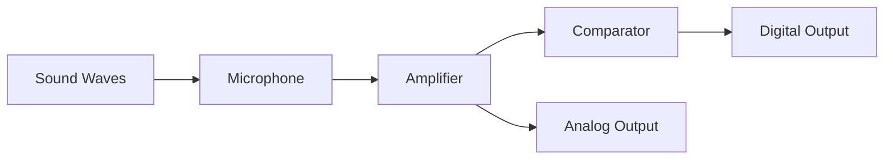
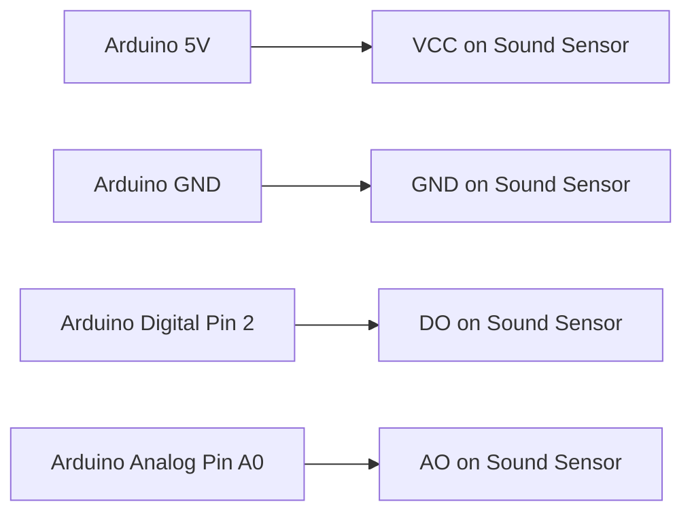

# Arduino Sound Sensors

## Introduction

Sound sensors allow your Arduino projects to interact with the audio environment, enabling applications ranging from simple noise detection to complex sound-reactive systems. These sensors act as electronic "ears" that convert sound waves into electrical signals your Arduino can understand and process.

In this tutorial, we'll explore different types of sound sensors compatible with Arduino, how they work, how to connect them, and how to use them in practical applications. By the end, you'll have the knowledge to incorporate sound detection and measurement into your own Arduino projects.

## Types of Sound Sensors for Arduino

There are several types of sound sensors commonly used with Arduino:

1. **Sound Detection Modules** - Simple modules that output a digital HIGH/LOW signal when sound exceeds a threshold
2. **Analog Sound Sensors** - More sophisticated sensors that provide analog values representing sound intensity
3. **Microphone Modules** - Including electret microphones with amplifiers that can be used for more detailed audio processing

The most common for beginners is the KY-038 or similar sound detection module, which we'll focus on first.

## How Sound Sensors Work

Sound sensors typically consist of three main components:

1. **Microphone** - Converts sound waves to electrical signals
2. **Amplifier** - Increases the signal strength
3. **Comparator Circuit** - Compares the amplified signal against a reference threshold



When sound waves hit the microphone, they create small electrical signals that are too weak for direct processing. The amplifier boosts these signals, and then:

- The **digital output** uses a comparator to produce a HIGH signal when sound exceeds the set threshold
- The **analog output** provides a continuous value representing the sound intensity

## Hardware Requirements

To follow along with this tutorial, you'll need:

- Arduino board (Uno, Nano, or similar)
- KY-038 sound sensor module (or equivalent)
- Jumper wires
- LED (optional, for visual feedback)
- Breadboard
- USB cable for Arduino

## Connecting a Sound Sensor to Arduino

The KY-038 sound sensor module typically has three or four pins:

- VCC - Connect to 5V on Arduino
- GND - Connect to GND on Arduino
- DO (Digital Output) - Connect to a digital pin (e.g., D2)
- AO (Analog Output) - Connect to an analog pin (e.g., A0)

Here's a basic wiring diagram:



## Basic Sound Detection (Digital Output)

Let's start with a simple example that detects when sound exceeds a threshold and turns on an LED:

```cpp
const int soundDigitalPin = 2;  // Digital pin connected to DO of sound sensor
const int ledPin = 13;          // Onboard LED

void setup() {
  pinMode(soundDigitalPin, INPUT);
  pinMode(ledPin, OUTPUT);
  Serial.begin(9600);
  Serial.println("Sound sensor test - digital output");
}

void loop() {
  int soundDetected = digitalRead(soundDigitalPin);
  
  if (soundDetected == LOW) {  // Most modules output LOW when sound is detected
    digitalWrite(ledPin, HIGH);
    Serial.println("Sound detected!");
    delay(500);  // Keep LED on for a moment
  } else {
    digitalWrite(ledPin, LOW);
  }
}
```

### What This Code Does

1. Sets up pins for the sound sensor (digital input) and LED (output)
2. In the loop, continuously checks if sound is detected
3. When sound exceeds the threshold, turns on the LED and prints a message
4. Note that many modules output LOW when sound is detected (active-LOW)

You can adjust the sensitivity of most sound modules using the potentiometer on the module itself.

## Measuring Sound Intensity (Analog Output)

For more detailed sound measurement, we can use the analog output of the sensor:

```cpp
const int soundAnalogPin = A0;  // Analog pin connected to AO of sound sensor
const int ledPin = 13;          // Onboard LED

void setup() {
  pinMode(ledPin, OUTPUT);
  Serial.begin(9600);
  Serial.println("Sound sensor test - analog output");
}

void loop() {
  int soundValue = analogRead(soundAnalogPin);
  
  // Print the analog value to Serial Monitor
  Serial.print("Sound level: ");
  Serial.println(soundValue);
  
  // Adjust LED brightness based on sound intensity
  // Map the sound value to LED brightness (0-255)
  int brightness = map(soundValue, 0, 1023, 0, 255);
  analogWrite(ledPin, brightness);
  
  delay(50);  // Small delay for stability
}
```

### What This Code Does

1. Reads the analog value from the sound sensor
2. Prints the sound level to the Serial Monitor
3. Maps the analog reading (0-1023) to LED brightness (0-255)
4. Adjusts the LED brightness proportionally to the sound level

This creates a simple sound-reactive LED that gets brighter with louder sounds.

## Sound Visualizer with Serial Plotter

Arduino's Serial Plotter is a great tool to visualize sound patterns. Here's how to create a simple sound visualizer:

```cpp
const int soundAnalogPin = A0;

void setup() {
  Serial.begin(9600);
}

void loop() {
  int soundValue = analogRead(soundAnalogPin);
  
  // Send value directly to Serial Plotter
  Serial.println(soundValue);
  
  delay(10);  // Fast sampling for better visualization
}
```

To see the visualization:
1. Upload the code to your Arduino
2. Open Tools → Serial Plotter in the Arduino IDE
3. Make sounds near the sensor to see the waveform change

## Creating a Clap Switch

Now let's build something more practical - a clap-activated switch:

```cpp
const int soundDigitalPin = 2;
const int relayPin = 7;  // Connected to a relay or LED

unsigned long lastClapTime = 0;
boolean deviceState = false;
const unsigned long clapWindow = 1000;  // Time window for double clap (ms)
boolean firstClapDetected = false;

void setup() {
  pinMode(soundDigitalPin, INPUT);
  pinMode(relayPin, OUTPUT);
  Serial.begin(9600);
  Serial.println("Clap switch activated");
}

void loop() {
  int soundDetected = digitalRead(soundDigitalPin);
  unsigned long currentTime = millis();
  
  // Sound detected (active-LOW sensor)
  if (soundDetected == LOW) {
    if (!firstClapDetected) {
      // First clap detected
      firstClapDetected = true;
      lastClapTime = currentTime;
      Serial.println("First clap detected");
      delay(200);  // Debounce delay
    } 
    else if ((currentTime - lastClapTime) < clapWindow) {
      // Second clap within time window
      deviceState = !deviceState;  // Toggle device state
      digitalWrite(relayPin, deviceState ? HIGH : LOW);
      Serial.println(deviceState ? "Device turned ON" : "Device turned OFF");
      firstClapDetected = false;
      delay(200);  // Debounce delay
    }
  }
  
  // Reset if time window expires
  if (firstClapDetected && (currentTime - lastClapTime) > clapWindow) {
    firstClapDetected = false;
    Serial.println("Clap window expired");
  }
}
```

### How This Clap Switch Works

1. Detects the first clap and starts a timer
2. If a second clap is detected within the time window, toggles the output
3. If no second clap is detected within the time window, resets and waits for a new first clap
4. Uses debounce delays to prevent false triggering

## Creating a Sound Level Meter

Let's build a more sophisticated project - a sound level meter that shows different levels on multiple LEDs:

```cpp
const int soundAnalogPin = A0;
const int ledPins[] = {3, 4, 5, 6, 7};  // 5 LEDs for different sound levels
const int numLeds = 5;

// Sound level thresholds
const int soundThresholds[] = {200, 300, 400, 600, 800};

void setup() {
  // Set all LED pins as outputs
  for (int i = 0; i < numLeds; i++) {
    pinMode(ledPins[i], OUTPUT);
  }
  
  Serial.begin(9600);
  Serial.println("Sound Level Meter");
}

void loop() {
  int soundValue = analogRead(soundAnalogPin);
  
  Serial.print("Sound level: ");
  Serial.println(soundValue);
  
  // Update LEDs based on sound level
  for (int i = 0; i < numLeds; i++) {
    if (soundValue > soundThresholds[i]) {
      digitalWrite(ledPins[i], HIGH);
    } else {
      digitalWrite(ledPins[i], LOW);
    }
  }
  
  delay(50);  // Small delay for stability
}
```

This project creates a visual sound level meter where more LEDs light up as the sound gets louder.

## Audio Beat Detection

For more advanced applications, we can detect beats in music:

```cpp
const int soundAnalogPin = A0;
const int ledPin = 13;

int soundThreshold = 500;       // Threshold for beat detection
int beatHoldTime = 50;          // How long to keep the beat LED on
unsigned long lastBeatTime = 0; // Last time a beat was detected

// Variables for running average
const int numReadings = 10;
int readings[numReadings];
int readIndex = 0;
int total = 0;
int average = 0;

void setup() {
  pinMode(ledPin, OUTPUT);
  Serial.begin(9600);
  
  // Initialize readings array
  for (int i = 0; i < numReadings; i++) {
    readings[i] = 0;
  }
  
  Serial.println("Beat detector initialized");
}

void loop() {
  // Subtract the last reading
  total = total - readings[readIndex];
  // Read the sound sensor
  readings[readIndex] = analogRead(soundAnalogPin);
  // Add the reading to the total
  total = total + readings[readIndex];
  // Advance to the next position in the array
  readIndex = (readIndex + 1) % numReadings;
  
  // Calculate the average
  average = total / numReadings;
  
  // Print values for debugging
  Serial.print("Current: ");
  Serial.print(readings[(readIndex - 1 + numReadings) % numReadings]);
  Serial.print("\tAverage: ");
  Serial.println(average);
  
  // Beat detection
  int currentSoundValue = readings[(readIndex - 1 + numReadings) % numReadings];
  if (currentSoundValue > average + soundThreshold && millis() - lastBeatTime > beatHoldTime) {
    lastBeatTime = millis();
    digitalWrite(ledPin, HIGH);
    Serial.println("BEAT!");
  } else if (millis() - lastBeatTime > beatHoldTime) {
    digitalWrite(ledPin, LOW);
  }
  
  delay(10);  // Small delay for sampling rate
}
```

This code:
1. Maintains a running average of sound levels
2. Detects when the current sound level significantly exceeds the average (a beat)
3. Flashes an LED on each beat
4. Can be tuned by adjusting the `soundThreshold` and `beatHoldTime` values

## Calibration and Troubleshooting

### Calibrating Your Sound Sensor

Most sound sensor modules have a potentiometer that can be adjusted to set the threshold for the digital output. To calibrate:

1. Connect the sensor as shown earlier
2. Upload a simple sketch that reads and prints the digital output
3. Turn the potentiometer while making sounds of different volumes
4. Adjust until the digital output triggers at your desired sound level

### Common Issues and Solutions

1. **Sensor Not Responding**
   - Check connections and power
   - Ensure the potentiometer isn't set to an extreme position
   - Try a different analog pin

2. **Too Sensitive/Not Sensitive Enough**
   - Adjust the potentiometer
   - For digital readings: modify the threshold in code
   - For analog readings: adjust the mapping range

3. **Inconsistent Readings**
   - Add a capacitor (100μF) between VCC and GND to stabilize power
   - Use running averages in code to smooth readings
   - Check for environmental noise or interference

## Real-World Applications

Sound sensors can be used in various practical Arduino projects:

1. **Home Automation**
   - Voice-activated lights or appliances
   - Sound-based security systems that alert on breaking glass or loud noises

2. **Interactive Art**
   - Sound-reactive LED displays
   - Music visualization installations

3. **Environmental Monitoring**
   - Noise level monitoring in public spaces
   - Industrial equipment monitoring for abnormal sounds

4. **Assistive Technology**
   - Sound-based alerts for the hearing impaired
   - Devices that respond to specific sound patterns

## Advanced Topics

### Frequency Analysis

For more advanced applications, you might want to analyze frequency components of sound. While Arduino's processing power is limited, basic frequency analysis is possible with libraries like arduinoFFT.

### Using Multiple Sensors

For directional sound detection, you can use multiple sound sensors and compare their readings to determine the sound source direction.

### Wireless Sound Monitoring

Combine a sound sensor with wireless modules (WiFi, Bluetooth, LoRa) to create remote sound monitoring systems.

## Summary

Sound sensors add an exciting dimension to Arduino projects by allowing them to interact with audio environments. In this tutorial, we've covered:

- Different types of sound sensors and how they work
- Basic connections and circuit setup
- Simple sound detection using digital outputs
- Sound level measurement using analog outputs
- Practical projects including:
  - A clap switch
  - A sound level meter
  - A beat detector

The applications for Arduino sound sensors are vast, from simple reactive projects to complex environmental monitoring systems. These sensors are affordable, easy to use, and can add significant interactivity to your projects.

## Exercises for Practice

1. **Beginner:** Create a sound-activated nightlight that turns on when the room is noisy and off when it's quiet.

2. **Intermediate:** Build a "knock lock" that unlocks (lights an LED) when a specific pattern of knocks is detected.

3. **Advanced:** Create a sound direction detector using multiple sound sensors, showing which direction a sound is coming from using LEDs.

## Additional Resources

- Explore Arduino's [Tone Library](https://www.arduino.cc/reference/en/language/functions/advanced-io/tone/) to generate sounds with Arduino
- Learn more about digital signal processing concepts to better understand audio processing
- Look into connecting Arduino to processing or other software for more advanced audio visualization

Remember that sound detection is just the beginning – as you become more comfortable with these concepts, you can combine sound sensors with other technologies to create increasingly sophisticated interactive systems.