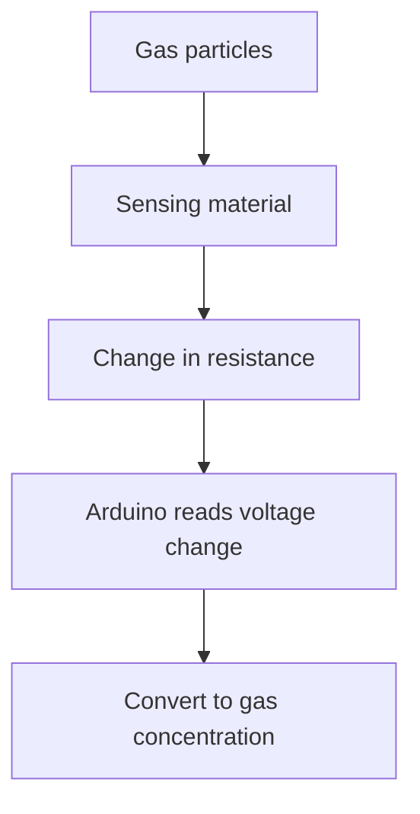
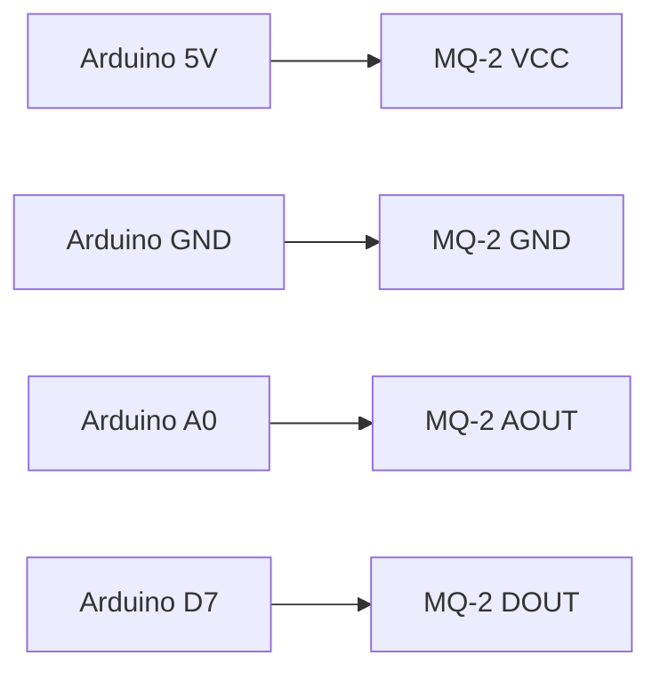

# Arduino Gas Sensors

## Introduction

Gas sensors are essential components in many IoT and environmental monitoring projects. They allow your Arduino to detect various gases in the air, from carbon monoxide to methane, hydrogen, and volatile organic compounds (VOCs). In this tutorial, we'll explore how gas sensors work, how to connect them to your Arduino, and how to write code that interprets their readings.

Gas sensors are particularly useful for:
- Home safety monitoring (detecting gas leaks)
- Air quality monitoring
- Industrial safety applications
- Environmental science projects
- Smart home automation based on air quality

## Types of Gas Sensors for Arduino

Arduino-compatible gas sensors typically fall into a few major categories:

### MQ Series Sensors

The MQ series is the most common and affordable type of gas sensor used with Arduino. Each model is calibrated to detect specific gases:

| Sensor | Primary Gases Detected | Sensitivity Range |
|--------|------------------------|-------------------|
| MQ-2   | LPG, Propane, Hydrogen | 200-10000ppm      |
| MQ-3   | Alcohol, Ethanol       | 25-500ppm         |
| MQ-4   | Methane (Natural Gas)  | 200-10000ppm      |
| MQ-5   | LPG, Natural Gas       | 200-10000ppm      |
| MQ-6   | LPG, Propane           | 200-10000ppm      |
| MQ-7   | Carbon Monoxide        | 10-500ppm         |
| MQ-8   | Hydrogen               | 100-10000ppm      |
| MQ-9   | Carbon Monoxide, LPG   | 10-1000ppm        |
| MQ-135 | Air Quality (NH3, NOx, CO2) | 10-300ppm    |

### Other Gas Sensor Types

- **CJMCU-811**: A digital CO2 and TVOC sensor
- **SGP30**: Detects VOCs and CO2 equivalent
- **BME680**: A 4-in-1 sensor measuring gas resistance, temperature, humidity, and pressure
- **SCD30**: High-precision CO2 sensor using NDIR technology

## How Gas Sensors Work

Most Arduino gas sensors like the MQ series work based on a principle called chemiresistance:



1. The sensor has a heating element that warms up a sensing material (usually tin dioxide)
2. When gas molecules interact with this material, they cause a change in electrical resistance
3. The sensor outputs an analog voltage proportional to the gas concentration
4. Your Arduino reads this voltage through an analog pin
5. The reading is converted to a gas concentration using calibration values

## Hardware Setup

### What You'll Need

- Arduino board (Uno, Nano, or similar)
- Gas sensor (we'll use MQ-2 as an example)
- Jumper wires
- Breadboard
- 10KΩ resistor (for some sensors)
- Optional: LED and 220Ω resistor for visual alerts

### Wiring the MQ-2 Gas Sensor

The MQ-2 sensor typically has 4 pins:

- VCC: Connect to 5V on Arduino
- GND: Connect to GND on Arduino
- AOUT: Analog output - connect to an analog pin (A0)
- DOUT: Digital output - connect to a digital pin (D7)

Here's a basic wiring diagram:



## Basic Code Example

Let's start with a simple example that reads values from an MQ-2 sensor and prints them to the Serial Monitor:

```cpp
const int gasPin = A0;      // Analog pin for gas sensor
const int digitalPin = 7;   // Digital pin for threshold alert
const int ledPin = 13;      // Built-in LED pin

void setup() {
  pinMode(gasPin, INPUT);
  pinMode(digitalPin, INPUT);
  pinMode(ledPin, OUTPUT);
  Serial.begin(9600);
  Serial.println("MQ-2 Gas Sensor Test");
  
  // Allow the sensor to warm up (crucial for accurate readings)
  Serial.println("Sensor warming up...");
  delay(20000);  // 20 seconds warm-up time
  Serial.println("Sensor ready!");
}

void loop() {
  // Read the analog value from the sensor
  int gasValue = analogRead(gasPin);
  
  // Read the digital value (high when gas detected above threshold)
  int gasDetected = digitalRead(digitalPin);
  
  // Print the analog value to Serial Monitor
  Serial.print("Gas Sensor Value: ");
  Serial.println(gasValue);
  
  // If gas is detected above threshold, turn on LED
  if (gasDetected == LOW) {  // Note: LOW means gas detected on most modules
    digitalWrite(ledPin, HIGH);
    Serial.println("Gas level above threshold!");
  } else {
    digitalWrite(ledPin, LOW);
  }
  
  delay(1000);  // Wait 1 second between readings
}
```

### Expected Output

When you run this code and open the Serial Monitor (9600 baud), you'll see:

```
MQ-2 Gas Sensor Test
Sensor warming up...
Sensor ready!
Gas Sensor Value: 120
Gas Sensor Value: 118
Gas Sensor Value: 121
Gas Sensor Value: 432
Gas level above threshold!
Gas Sensor Value: 658
Gas level above threshold!
```

The values will vary based on your ambient air quality. When the sensor detects gas above its threshold, you'll see the "Gas level above threshold!" message.

## Understanding Sensor Readings

The analog readings from the sensor (0-1023) need interpretation:

- Higher values indicate higher gas concentration
- The baseline value varies based on your environment
- Readings are affected by humidity and temperature

### Calibration

Gas sensors like the MQ series require calibration for accurate measurements. A basic calibration process:

```cpp
// Constants for MQ-2 sensor calibration
#define CALIBRATION_SAMPLE_TIMES 50
#define CALIBRATION_SAMPLE_INTERVAL 500
#define READ_SAMPLE_TIMES 5
#define READ_SAMPLE_INTERVAL 50
#define GAS_LPG 0
#define GAS_CO 1
#define GAS_SMOKE 2

// Arrays with calibration values for different gases (LPG, CO, Smoke)
float LPGCurve[3] = {2.3, 0.21, -0.47};
float COCurve[3] = {2.3, 0.72, -0.34};
float SmokeCurve[3] = {2.3, 0.53, -0.44};
float Ro = 10;  // Initial resistance value

void setup() {
  Serial.begin(9600);
  Serial.println("MQ-2 Calibration");
  
  Serial.print("Calibrating...");
  Ro = MQCalibration();
  Serial.println("done!");
  Serial.print("Ro = ");
  Serial.println(Ro);
}

void loop() {
  Serial.print("LPG: ");
  Serial.print(MQGetGasPercentage(MQRead()/Ro, GAS_LPG));
  Serial.println(" ppm");
  
  Serial.print("CO: ");
  Serial.print(MQGetGasPercentage(MQRead()/Ro, GAS_CO));
  Serial.println(" ppm");
  
  Serial.print("SMOKE: ");
  Serial.print(MQGetGasPercentage(MQRead()/Ro, GAS_SMOKE));
  Serial.println(" ppm");
  
  delay(1000);
}

float MQCalibration() {
  float val = 0;
  for (int i = 0; i < CALIBRATION_SAMPLE_TIMES; i++) {
    val += MQResistanceCalculation(analogRead(A0));
    delay(CALIBRATION_SAMPLE_INTERVAL);
  }
  val = val / CALIBRATION_SAMPLE_TIMES;
  val = val / 9.83;  // Divided by 9.83 for clean air according to datasheet
  return val;
}

float MQResistanceCalculation(int raw_adc) {
  return (float)(1023 - raw_adc) / (float)raw_adc;
}

float MQRead() {
  float rs = 0;
  for (int i = 0; i < READ_SAMPLE_TIMES; i++) {
    rs += MQResistanceCalculation(analogRead(A0));
    delay(READ_SAMPLE_INTERVAL);
  }
  rs = rs / READ_SAMPLE_TIMES;
  return rs;
}

float MQGetGasPercentage(float rs_ro_ratio, int gas_id) {
  if (gas_id == GAS_LPG) {
    return MQGetPercentage(rs_ro_ratio, LPGCurve);
  } else if (gas_id == GAS_CO) {
    return MQGetPercentage(rs_ro_ratio, COCurve);
  } else if (gas_id == GAS_SMOKE) {
    return MQGetPercentage(rs_ro_ratio, SmokeCurve);
  }
  return 0;
}

float MQGetPercentage(float rs_ro_ratio, float *curve) {
  return pow(10, (((log10(rs_ro_ratio) - curve[1]) / curve[2]) + curve[0]));
}
```

This code calibrates the sensor and converts readings to approximate ppm (parts per million) values for different gases. Note that for precise measurements, professional calibration equipment is required.

## Advanced Example: Air Quality Monitor with Data Logging

Let's build a more complete project: an air quality monitor that logs data to the Serial Monitor and responds to dangerous levels.

### Hardware

- Arduino Uno
- MQ-135 Air Quality Sensor
- 16x2 LCD Display with I2C adapter
- Buzzer for alerts
- RGB LED (to indicate air quality levels)

### Code

```cpp
#include <LiquidCrystal_I2C.h>

// Pins
const int mq135Pin = A0;
const int buzzerPin = 8;
const int redPin = 9;
const int greenPin = 10;
const int bluePin = 11;

// Thresholds for air quality
const int GOOD_AIR_THRESHOLD = 300;
const int POOR_AIR_THRESHOLD = 600;

// Initialize LCD
LiquidCrystal_I2C lcd(0x27, 16, 2);

// Variables for averaging
const int numReadings = 10;
int readings[numReadings];
int readIndex = 0;
int total = 0;
int average = 0;

void setup() {
  pinMode(buzzerPin, OUTPUT);
  pinMode(redPin, OUTPUT);
  pinMode(greenPin, OUTPUT);
  pinMode(bluePin, OUTPUT);
  
  // Initialize all readings to 0
  for (int thisReading = 0; thisReading < numReadings; thisReading++) {
    readings[thisReading] = 0;
  }
  
  // Initialize LCD
  lcd.init();
  lcd.backlight();
  lcd.print("Air Quality");
  lcd.setCursor(0, 1);
  lcd.print("Monitor");
  
  Serial.begin(9600);
  Serial.println("Air Quality Monitor");
  Serial.println("Time,AQ Value,Status");
  
  // Warm-up time
  delay(10000);
}

void loop() {
  // Subtract the last reading
  total = total - readings[readIndex];
  // Read from the sensor
  readings[readIndex] = analogRead(mq135Pin);
  // Add the reading to the total
  total = total + readings[readIndex];
  // Advance to the next position in the array
  readIndex = readIndex + 1;
  
  // If we're at the end of the array...
  if (readIndex >= numReadings) {
    // ...wrap around to the beginning
    readIndex = 0;
  }
  
  // Calculate the average
  average = total / numReadings;
  
  // Determine air quality status
  String status;
  if (average < GOOD_AIR_THRESHOLD) {
    status = "GOOD";
    setColor(0, 255, 0); // Green
    noTone(buzzerPin);
  } else if (average < POOR_AIR_THRESHOLD) {
    status = "MODERATE";
    setColor(255, 255, 0); // Yellow
    noTone(buzzerPin);
  } else {
    status = "POOR";
    setColor(255, 0, 0); // Red
    // Beep alert for poor air quality
    tone(buzzerPin, 1000, 200);
  }
  
  // Update LCD
  lcd.clear();
  lcd.print("Air Quality: ");
  lcd.setCursor(0, 1);
  lcd.print(average);
  lcd.print(" - ");
  lcd.print(status);
  
  // Log to Serial
  Serial.print(millis() / 1000);
  Serial.print(",");
  Serial.print(average);
  Serial.print(",");
  Serial.println(status);
  
  delay(1000);
}

void setColor(int red, int green, int blue) {
  analogWrite(redPin, red);
  analogWrite(greenPin, green);
  analogWrite(bluePin, blue);
}
```

### How This System Works

1. The code takes multiple readings from the MQ-135 sensor and averages them for stability
2. It categorizes air quality into three levels: GOOD, MODERATE, and POOR
3. The RGB LED changes color to indicate the current air quality level
4. The buzzer sounds an alert when air quality is POOR
5. Data is displayed on the LCD and logged to the Serial Monitor in CSV format
6. The CSV format makes it easy to log data to a file or import into a spreadsheet

## Real-World Applications

### Home Safety Monitor

Gas sensors can be used to create a home safety system that detects:
- Natural gas leaks (MQ-4)
- Carbon monoxide (MQ-7)
- Smoke (MQ-2)

When dangerous levels are detected, the system can trigger alarms, send SMS alerts, or even activate ventilation systems.

### Weather Station

Combine gas sensors with temperature, humidity, and pressure sensors to create a comprehensive weather station that also monitors air quality.

### Smart Farm Monitoring

In agricultural settings, gas sensors can monitor:
- Methane levels in livestock areas
- Ammonia concentration in fertilized fields
- CO2 levels in greenhouses

### Industrial Safety

In industrial environments, gas sensors provide early warning of:
- Solvent vapors
- Hydrogen leaks
- Carbon monoxide buildup

## Troubleshooting Gas Sensors

### Common Issues and Solutions

| Issue | Possible Cause | Solution |
|-------|---------------|----------|
| Erratic readings | Insufficient warm-up time | Allow 20+ minutes for full warm-up |
| Always reading maximum | Sensor failure or short circuit | Check wiring, replace sensor if needed |
| No change in readings | Improper wiring or dead sensor | Verify connections, especially heater power |
| Readings drift over time | Environmental changes | Use relative changes rather than absolute values |
| Inaccurate measurements | Lack of calibration | Calibrate with known gas concentrations |

### Best Practices

1. **Warm-up Period**: Always allow sufficient warm-up time (10-30 minutes)
2. **Regular Calibration**: Calibrate sensors in clean air
3. **Ventilation**: Ensure proper airflow around the sensor
4. **Multiple Readings**: Take multiple readings and average them
5. **Sensor Placement**: Position sensors where they'll detect gases effectively, away from direct wind

## Summary

In this tutorial, we've covered:
- Different types of gas sensors compatible with Arduino
- How these sensors work and how to interpret their readings
- Basic and advanced code examples for gas detection
- Building a complete air quality monitoring system
- Real-world applications for gas sensors
- Troubleshooting common issues

Gas sensors greatly expand the capabilities of your Arduino projects, allowing them to interact with and respond to the invisible environment around us. Whether you're building a safety system, an environmental monitor, or just experimenting with sensor technology, gas sensors are a powerful addition to your Arduino toolkit.

## Exercises

1. Build a simple gas detector using an MQ-2 sensor and an LED that lights up when gas is detected.
2. Modify the basic example to log data to the Serial monitor in CSV format so you can track gas levels over time.
3. Create a multi-sensor array using different MQ sensors to detect various gases simultaneously.
4. Build a portable gas detector with a battery pack and LCD screen.
5. Advanced: Connect your gas sensor to WiFi and send alerts to your phone when dangerous levels are detected.

## Additional Resources

- [MQ Sensor Series Datasheets](https://www.pololu.com/file/0J309/MQ2.pdf)
- [Gas Sensor Calibration Techniques](https://playground.arduino.cc/Main/MQGasSensors/)
- [Environmental Monitoring with Arduino](https://www.arduino.cc/en/Guide/Environment)
- [Arduino Libraries for Gas Sensors](https://github.com/topics/gas-sensor)