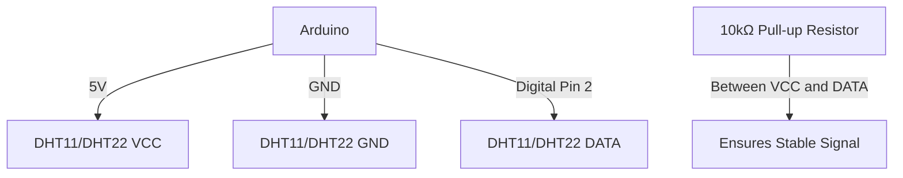

# Arduino Humidity Sensors

## Introduction

Humidity sensors are essential components for monitoring environmental conditions in various applications. They measure the amount of water vapor in the air relative to the maximum amount the air could hold at a specific temperature. This measurement, known as Relative Humidity (RH), is expressed as a percentage.

In this guide, we'll explore how to connect humidity sensors to Arduino boards, read humidity values, and build practical applications. Whether you're creating a smart home system, a weather station, or a plant monitoring solution, understanding humidity sensors will help you collect valuable environmental data.

## Common Arduino Humidity Sensors

There are several humidity sensors compatible with Arduino, but two stand out for their ease of use and reliability for beginners:

### DHT11

The DHT11 is a basic, low-cost digital temperature and humidity sensor. It uses a capacitive humidity sensor and a thermistor to measure the surrounding air.

**Specifications:**
- Humidity Range: 20-80% RH (±5% RH accuracy)
- Temperature Range: 0-50°C (±2°C accuracy)
- Sampling Rate: 1Hz (one reading every second)
- Operating Voltage: 3-5V DC

### DHT22/AM2302

The DHT22 (also sold as AM2302) is the more precise and feature-rich version of the DHT11.

**Specifications:**
- Humidity Range: 0-100% RH (±2-5% RH accuracy)
- Temperature Range: -40 to 80°C (±0.5°C accuracy)
- Sampling Rate: 0.5Hz (one reading every 2 seconds)
- Operating Voltage: 3-5V DC

### Other Options

- **BME280**: A more advanced sensor that measures humidity, temperature, and barometric pressure
- **SHT31**: A high-precision digital humidity and temperature sensor
- **HIH-4030**: An analog humidity sensor that requires additional temperature compensation

## Required Components

To follow along with this tutorial, you'll need:

- Arduino board (Uno, Nano, Mega, etc.)
- DHT11 or DHT22 humidity sensor
- Breadboard
- Jumper wires
- 10kΩ resistor (for pull-up)
- USB cable for programming

## Wiring a Humidity Sensor to Arduino

Let's look at how to connect a DHT11 or DHT22 sensor to an Arduino:



### Connection Steps:

1. Connect the VCC pin of the sensor to the 5V output on the Arduino
2. Connect the GND pin of the sensor to the GND on the Arduino
3. Connect the DATA pin of the sensor to Digital Pin 2 (or any digital pin)
4. Add a 10kΩ pull-up resistor between VCC and DATA pins (some modules have built-in resistors)

## Installing Required Libraries

Before we start coding, we need to install the necessary libraries to work with DHT sensors:

1. Open the Arduino IDE
2. Go to **Sketch > Include Library > Manage Libraries**
3. Search for "DHT sensor library" (by Adafruit)
4. Click **Install**
5. Also install the "Adafruit Unified Sensor" library when prompted

## Basic Humidity Reading Example

Let's start with a simple code example that reads and displays humidity and temperature values from a DHT sensor:

```cpp
#include <DHT.h>

#define DHTPIN 2      // Digital pin connected to the DHT sensor
#define DHTTYPE DHT11 // DHT 11
// Uncomment if using DHT22
// #define DHTTYPE DHT22   // DHT 22 (AM2302)

DHT dht(DHTPIN, DHTTYPE);

void setup() {
  Serial.begin(9600);
  Serial.println("DHT Humidity & Temperature Test!");

  dht.begin();
}

void loop() {
  // Wait a few seconds between measurements
  delay(2000);

  // Reading temperature or humidity takes about 250 milliseconds!
  float humidity = dht.readHumidity();
  float temperature = dht.readTemperature();

  // Check if any reads failed and exit early (to try again)
  if (isnan(humidity) || isnan(temperature)) {
    Serial.println("Failed to read from DHT sensor!");
    return;
  }

  Serial.print("Humidity: ");
  Serial.print(humidity);
  Serial.print("% | Temperature: ");
  Serial.print(temperature);
  Serial.println("°C");
}
```

### Expected Output:

```
DHT Humidity & Temperature Test!
Humidity: 45.60% | Temperature: 23.40°C
Humidity: 45.70% | Temperature: 23.40°C
Humidity: 45.70% | Temperature: 23.50°C
```

### Code Explanation:

1. We include the DHT library and define which pin and sensor type we're using
2. The `setup()` function initializes serial communication and the DHT sensor
3. In the `loop()` function:
   - We wait 2 seconds between readings (DHT sensors are slow)
   - Read both humidity and temperature values
   - Check for failed readings
   - Print the values to the Serial Monitor

## Understanding Dew Point

The dew point is the temperature at which air becomes saturated with water vapor, causing condensation to form. This is a useful value to calculate from humidity and temperature data.

Here's how to calculate and display the dew point:

```cpp
#include <DHT.h>

#define DHTPIN 2
#define DHTTYPE DHT22 // Using DHT22 for better accuracy

DHT dht(DHTPIN, DHTTYPE);

void setup() {
  Serial.begin(9600);
  dht.begin();
}

void loop() {
  delay(2000);
  
  float humidity = dht.readHumidity();
  float temperature = dht.readTemperature();
  
  if (isnan(humidity) || isnan(temperature)) {
    Serial.println("Failed to read from DHT sensor!");
    return;
  }
  
  // Calculate dew point
  float dewPoint = calculateDewPoint(temperature, humidity);
  
  Serial.print("Humidity: ");
  Serial.print(humidity);
  Serial.print("% | Temperature: ");
  Serial.print(temperature);
  Serial.print("°C | Dew Point: ");
  Serial.print(dewPoint);
  Serial.println("°C");
}

float calculateDewPoint(float temperature, float humidity) {
  // Constants for Magnus formula
  float a = 17.27;
  float b = 237.7;
  
  // Intermediate calculation
  float alpha = ((a * temperature) / (b + temperature)) + log(humidity / 100);
  
  // Calculate dew point
  float dewPoint = (b * alpha) / (a - alpha);
  
  return dewPoint;
}
```

## Creating a Humidity Data Logger

Next, let's build a more practical project: a humidity data logger that records values to the Serial Monitor with timestamps.

```cpp
#include <DHT.h>

#define DHTPIN 2
#define DHTTYPE DHT22
#define LOG_INTERVAL 60000 // Log every minute (60,000 ms)

DHT dht(DHTPIN, DHTTYPE);
unsigned long previousMillis = 0;
unsigned long startTime;

void setup() {
  Serial.begin(9600);
  dht.begin();
  startTime = millis();
  
  // Print CSV header
  Serial.println("Time (s),Humidity (%),Temperature (°C)");
}

void loop() {
  unsigned long currentMillis = millis();
  
  // Check if it's time to log data
  if (currentMillis - previousMillis >= LOG_INTERVAL) {
    previousMillis = currentMillis;
    
    float humidity = dht.readHumidity();
    float temperature = dht.readTemperature();
    
    if (isnan(humidity) || isnan(temperature)) {
      Serial.println("Error reading sensor");
    } else {
      // Calculate time in seconds since start
      unsigned long timeSeconds = (currentMillis - startTime) / 1000;
      
      // Log data in CSV format
      Serial.print(timeSeconds);
      Serial.print(",");
      Serial.print(humidity);
      Serial.print(",");
      Serial.println(temperature);
    }
  }
}
```

This code logs data in CSV format, which you can easily import into a spreadsheet program for analysis or visualization.

## Humidity Threshold Alert System

Let's build a practical humidity monitoring system that alerts when humidity goes above or below specific thresholds:

```cpp
#include <DHT.h>

#define DHTPIN 2
#define DHTTYPE DHT11
#define LED_PIN 13          // Onboard LED
#define BUZZER_PIN 8        // Connect a buzzer here
#define HUMIDITY_HIGH 70.0  // High humidity threshold
#define HUMIDITY_LOW 30.0   // Low humidity threshold

DHT dht(DHTPIN, DHTTYPE);
bool alarmActive = false;

void setup() {
  Serial.begin(9600);
  dht.begin();
  
  pinMode(LED_PIN, OUTPUT);
  pinMode(BUZZER_PIN, OUTPUT);
  
  Serial.println("Humidity Monitoring System");
  Serial.print("High threshold: ");
  Serial.print(HUMIDITY_HIGH);
  Serial.print("% | Low threshold: ");
  Serial.print(HUMIDITY_LOW);
  Serial.println("%");
}

void loop() {
  delay(2000);
  
  float humidity = dht.readHumidity();
  float temperature = dht.readTemperature();
  
  if (isnan(humidity) || isnan(temperature)) {
    Serial.println("Failed to read from DHT sensor!");
    return;
  }
  
  Serial.print("Humidity: ");
  Serial.print(humidity);
  Serial.print("% | Temperature: ");
  Serial.print(temperature);
  Serial.println("°C");
  
  // Check if humidity is outside acceptable range
  if (humidity > HUMIDITY_HIGH) {
    Serial.println("WARNING: Humidity too high!");
    triggerAlarm(true);
  } else if (humidity < HUMIDITY_LOW) {
    Serial.println("WARNING: Humidity too low!");
    triggerAlarm(true);
  } else {
    // Humidity is in acceptable range
    triggerAlarm(false);
  }
}

void triggerAlarm(bool activate) {
  if (activate) {
    if (!alarmActive) {
      Serial.println("Alarm activated!");
      alarmActive = true;
    }
    // Blink LED and beep buzzer
    digitalWrite(LED_PIN, HIGH);
    tone(BUZZER_PIN, 1000); // 1kHz tone
    delay(500);
    digitalWrite(LED_PIN, LOW);
    noTone(BUZZER_PIN);
    delay(500);
  } else {
    if (alarmActive) {
      Serial.println("Alarm deactivated.");
      alarmActive = false;
    }
    // Turn off LED and buzzer
    digitalWrite(LED_PIN, LOW);
    noTone(BUZZER_PIN);
  }
}
```

## Multiple Sensor Array System

For more advanced applications, you might want to use multiple humidity sensors to monitor different locations:

```cpp
#include <DHT.h>

// Define pins for each sensor
#define DHT1_PIN 2
#define DHT2_PIN 3
#define DHT3_PIN 4

// Define types for each sensor
#define DHT1_TYPE DHT22
#define DHT2_TYPE DHT22
#define DHT3_TYPE DHT22

// Create sensor objects
DHT dht1(DHT1_PIN, DHT1_TYPE);
DHT dht2(DHT2_PIN, DHT2_TYPE);
DHT dht3(DHT3_PIN, DHT3_TYPE);

void setup() {
  Serial.begin(9600);
  
  // Initialize all sensors
  dht1.begin();
  dht2.begin();
  dht3.begin();
  
  Serial.println("Multi-Sensor Humidity Monitoring System");
}

void loop() {
  delay(2000);
  
  // Read from Sensor 1
  float humidity1 = dht1.readHumidity();
  float temperature1 = dht1.readTemperature();
  
  // Read from Sensor 2
  float humidity2 = dht2.readHumidity();
  float temperature2 = dht2.readTemperature();
  
  // Read from Sensor 3
  float humidity3 = dht3.readHumidity();
  float temperature3 = dht3.readTemperature();
  
  // Display all readings
  Serial.println("=== Sensor Readings ===");
  
  Serial.print("Sensor 1: ");
  displayReadings(humidity1, temperature1);
  
  Serial.print("Sensor 2: ");
  displayReadings(humidity2, temperature2);
  
  Serial.print("Sensor 3: ");
  displayReadings(humidity3, temperature3);
  
  Serial.println("======================");
  Serial.println();
  
  delay(5000); // Extra delay between complete reading cycles
}

void displayReadings(float humidity, float temperature) {
  if (isnan(humidity) || isnan(temperature)) {
    Serial.println("Failed to read from sensor!");
  } else {
    Serial.print("Humidity: ");
    Serial.print(humidity);
    Serial.print("% | Temperature: ");
    Serial.print(temperature);
    Serial.println("°C");
  }
}
```

## Calibrating Your Humidity Sensor

Humidity sensors might need calibration for accurate readings. Here's a simple method to apply a calibration offset:

```cpp
#include <DHT.h>

#define DHTPIN 2
#define DHTTYPE DHT22

// Calibration values - adjust based on comparison with reference sensor
#define HUMIDITY_OFFSET -2.5  // If your sensor reads 2.5% too high
#define TEMP_OFFSET 0.0       // No temperature offset needed

DHT dht(DHTPIN, DHTTYPE);

void setup() {
  Serial.begin(9600);
  dht.begin();
  
  Serial.println("Calibrated DHT Sensor Readings");
  Serial.print("Humidity offset: ");
  Serial.print(HUMIDITY_OFFSET);
  Serial.println("%");
}

void loop() {
  delay(2000);
  
  // Get raw readings
  float rawHumidity = dht.readHumidity();
  float rawTemperature = dht.readTemperature();
  
  if (isnan(rawHumidity) || isnan(rawTemperature)) {
    Serial.println("Failed to read from DHT sensor!");
    return;
  }
  
  // Apply calibration offsets
  float calibratedHumidity = rawHumidity + HUMIDITY_OFFSET;
  float calibratedTemperature = rawTemperature + TEMP_OFFSET;
  
  // Ensure humidity stays in valid range (0-100%)
  calibratedHumidity = constrain(calibratedHumidity, 0, 100);
  
  // Display both raw and calibrated values
  Serial.println("=== Sensor Readings ===");
  Serial.print("Raw Humidity: ");
  Serial.print(rawHumidity);
  Serial.print("% | Calibrated: ");
  Serial.print(calibratedHumidity);
  Serial.println("%");
  
  Serial.print("Raw Temperature: ");
  Serial.print(rawTemperature);
  Serial.print("°C | Calibrated: ");
  Serial.print(calibratedTemperature);
  Serial.println("°C");
  Serial.println("======================");
}
```

## Practical Application: Plant Monitoring System

Here's a complete project example that monitors soil and air humidity for plants:

```cpp
#include <DHT.h>

#define DHT_PIN 2
#define DHT_TYPE DHT22
#define SOIL_MOISTURE_PIN A0
#define RELAY_PIN 7  // Controls a water pump
#define DRY_THRESHOLD 700  // Analog reading threshold for dry soil

DHT dht(DHT_PIN, DHT_TYPE);

void setup() {
  Serial.begin(9600);
  dht.begin();
  
  pinMode(RELAY_PIN, OUTPUT);
  digitalWrite(RELAY_PIN, LOW);  // Ensure pump is off at start
  
  Serial.println("Plant Monitoring and Watering System");
}

void loop() {
  // Read air temperature and humidity
  float airHumidity = dht.readHumidity();
  float temperature = dht.readTemperature();
  
  // Read soil moisture (higher value = drier soil)
  int soilMoisture = analogRead(SOIL_MOISTURE_PIN);
  
  // Calculate soil moisture percentage (inverted - higher = wetter)
  // Assuming 1023 = completely dry, 0 = completely wet
  int soilMoisturePercent = map(soilMoisture, 0, 1023, 100, 0);
  
  // Display all readings
  Serial.println("=== Plant Environment ===");
  
  if (isnan(airHumidity) || isnan(temperature)) {
    Serial.println("Failed to read from DHT sensor!");
  } else {
    Serial.print("Air Humidity: ");
    Serial.print(airHumidity);
    Serial.print("% | Temperature: ");
    Serial.print(temperature);
    Serial.println("°C");
  }
  
  Serial.print("Soil Moisture: ");
  Serial.print(soilMoisturePercent);
  Serial.print("% (Raw: ");
  Serial.print(soilMoisture);
  Serial.println(")");
  
  // Watering logic
  if (soilMoisture > DRY_THRESHOLD) {
    Serial.println("Soil is dry - Starting watering cycle");
    startWatering();
  } else {
    Serial.println("Soil moisture adequate");
    digitalWrite(RELAY_PIN, LOW);  // Ensure pump is off
  }
  
  Serial.println("===========================");
  delay(10000);  // Check every 10 seconds
}

void startWatering() {
  // Turn on the pump for 3 seconds
  digitalWrite(RELAY_PIN, HIGH);
  delay(3000);
  digitalWrite(RELAY_PIN, LOW);
  
  Serial.println("Watering complete - waiting 1 minute before next check");
  delay(57000);  // Wait almost a minute (plus the 3s from above)
}
```

## Troubleshooting Humidity Sensors

If you're having issues with your humidity sensor, here are some common problems and solutions:

### No Readings or Invalid Values (NaN)

- **Check wiring**: Ensure all connections are secure
- **Pull-up resistor**: Make sure a 10kΩ pull-up resistor is connected between DATA and VCC
- **Power supply**: DHT sensors need a stable 3-5V power supply
- **Library issues**: Try reinstalling the DHT library

### Inconsistent Readings

- **Placement**: Keep the sensor away from heat sources and direct sunlight
- **Timing**: DHT sensors need at least 2 seconds between readings
- **Interference**: Keep wiring short and away from high-current cables
- **Calibration**: Compare with a reference sensor and apply offsets if necessary

### Slow Response Time

- **Sensor limitations**: DHT sensors have a slow response time by nature
- **Air circulation**: Improve airflow around the sensor for faster response
- **Model upgrade**: Consider upgrading to a faster-responding sensor like BME280

## Summary

In this guide, we've covered:

- The basics of humidity measurement with Arduino
- How to connect DHT11 and DHT22 sensors
- Reading humidity and temperature values
- Calculating dew point
- Building data logging systems
- Creating humidity threshold alerts
- Setting up multi-sensor arrays
- Calibrating sensors for better accuracy
- Creating a practical plant monitoring application

Humidity sensors are versatile components that can be used in numerous projects, from weather stations and smart home systems to environmental monitoring and plant care solutions. By understanding how to work with these sensors, you've added an important tool to your Arduino skillset.

## Exercises

1. **Weather Station**: Extend the basic humidity example to include a pressure sensor (BMP280) and an LCD display to create a complete weather station.
2. **Data Visualization**: Modify the data logger example to send data to a computer application (like Processing) for real-time graphing.
3. **Humidity Controller**: Build a system that maintains a specific humidity level in an enclosure using a humidifier or dehumidifier controlled by a relay.
4. **Remote Monitoring**: Add an ESP8266 or ESP32 to send humidity data to an online IoT platform like Blynk or ThingSpeak.
5. **Long-term Statistics**: Modify the data logger to calculate daily min/max/average humidity values and store them in EEPROM.

## Additional Resources

- [Arduino Official Reference](https://www.arduino.cc/reference/)
- [Adafruit DHT Sensor Library Documentation](https://github.com/adafruit/DHT-sensor-library)
- [SparkFun Humidity Sensor Comparison](https://learn.sparkfun.com/tutorials/humidity-sensor-comparison)
- [Environmental Monitoring Best Practices](https://www.instructables.com/id/Environmental-Monitoring-With-Arduino/)

Happy sensing!