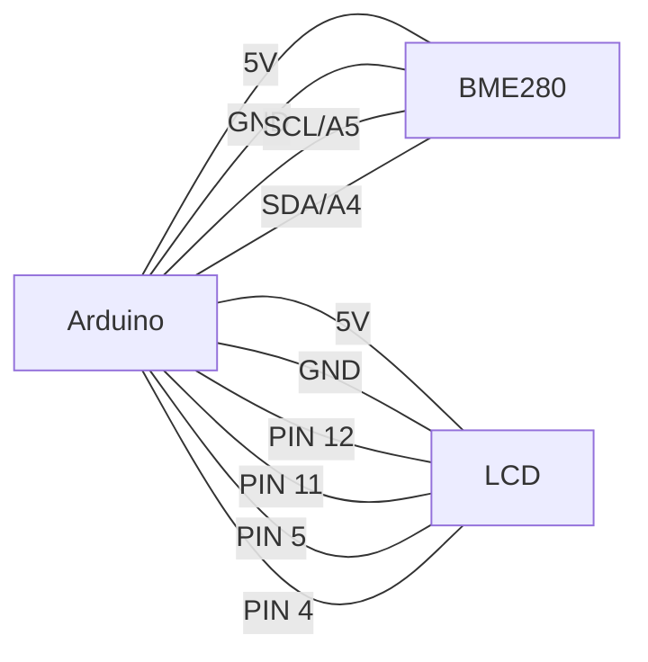

# Arduino Pressure Sensors

## Introduction

Pressure sensors allow your Arduino projects to measure physical force or pressure in various forms. Whether you're creating a weather station, smart scale, touch-sensitive interface, or a force-feedback system, pressure sensors provide crucial data about the physical world around us.

In this tutorial, we'll explore different types of pressure sensors compatible with Arduino, how they work, and how to implement them in your projects. By the end, you'll be ready to add pressure-sensing capabilities to your Arduino creations!

## Types of Pressure Sensors for Arduino

There are several types of pressure sensors you can use with Arduino:

1. **Barometric Pressure Sensors** - Measure atmospheric pressure
2. **Force Sensitive Resistors (FSRs)** - Detect physical pressure/force applied to a surface
3. **Load Cells** - Measure weight/force precisely
4. **Liquid/Gas Pressure Sensors** - Measure pressure in liquids or gases

Let's explore each type in detail.

## Barometric Pressure Sensors

Barometric pressure sensors measure atmospheric pressure, which is useful for weather stations, altitude measurements, and environmental monitoring.

### How They Work

Barometric sensors typically contain a small, flexible membrane that deforms slightly under air pressure changes. This deformation is measured electronically and converted to a pressure reading, usually in hectopascals (hPa) or inches of mercury (inHg).

### Common Sensors

The BMP280 and BME280 are popular barometric sensors that communicate with Arduino using I2C or SPI protocols. The BME280 also includes humidity and temperature sensors.

### Wiring the BMP280 to Arduino

```
BMP280    Arduino
VCC  -->  3.3V
GND  -->  GND
SCL  -->  A5 (SCL)
SDA  -->  A4 (SDA)
```

### Example Code for BMP280

```cpp
#include <Wire.h>
#include <Adafruit_BMP280.h>

Adafruit_BMP280 bmp; // I2C interface

void setup() {
  Serial.begin(9600);
  
  if (!bmp.begin(0x76)) { // Some BMP280 sensors use address 0x77
    Serial.println("Could not find a valid BMP280 sensor, check wiring!");
    while (1);
  }
}

void loop() {
  float pressure = bmp.readPressure() / 100.0; // Convert Pa to hPa
  float altitude = bmp.readAltitude(1013.25); // Standard pressure at sea level
  float temperature = bmp.readTemperature();
  
  Serial.print("Temperature: ");
  Serial.print(temperature);
  Serial.println(" °C");
  
  Serial.print("Pressure: ");
  Serial.print(pressure);
  Serial.println(" hPa");
  
  Serial.print("Approx Altitude: ");
  Serial.print(altitude);
  Serial.println(" m");
  
  Serial.println();
  delay(2000);
}
```

### Example Output

```
Temperature: 23.45 °C
Pressure: 1012.34 hPa
Approx Altitude: 12.45 m

Temperature: 23.47 °C
Pressure: 1012.36 hPa
Approx Altitude: 12.27 m
```

## Force Sensitive Resistors (FSRs)

FSRs are simple sensors that change resistance depending on how much pressure is applied to their surface. They're great for detecting touch, pressure, or weight in simple applications.

### How They Work

FSRs contain conductive particles embedded in a polymer matrix. When pressure is applied, these particles come closer together, decreasing the resistance. More pressure = lower resistance.

### Wiring an FSR to Arduino

```
FSR      Arduino
Pin 1 --> 5V
Pin 2 --> A0 (and to a 10kΩ resistor connected to GND)
```

### Example Code for FSR

```cpp
const int fsrPin = A0;
const int ledPin = 9;

void setup() {
  Serial.begin(9600);
  pinMode(ledPin, OUTPUT);
}

void loop() {
  int fsrReading = analogRead(fsrPin);
  
  // Map the FSR reading to LED brightness (0-255)
  int brightness = map(fsrReading, 0, 1023, 0, 255);
  analogWrite(ledPin, brightness);
  
  // Print the raw reading and mapped value
  Serial.print("FSR Reading: ");
  Serial.print(fsrReading);
  Serial.print(" | LED Brightness: ");
  Serial.println(brightness);
  
  delay(100);
}
```

### Converting FSR Reading to Force

The relationship between FSR resistance and force isn't linear. Here's a more advanced example that converts the reading to approximate force in grams:

```cpp
const int fsrPin = A0;
const float VCC = 5.0;    // Arduino 5V supply
const float R_DIV = 10000.0; // 10k resistor in voltage divider

void setup() {
  Serial.begin(9600);
}

void loop() {
  int fsrADC = analogRead(fsrPin);
  
  // If no pressure is being applied, skip rest of loop
  if (fsrADC == 0) {
    Serial.println("No pressure");
    delay(500);
    return;
  }
  
  // Calculate voltage using voltage divider equation
  float voltage = fsrADC * VCC / 1023.0;
  
  // Calculate resistance of FSR
  float resistance = R_DIV * (VCC / voltage - 1.0);
  
  Serial.print("Resistance: ");
  Serial.print(resistance);
  Serial.println(" ohms");
  
  // Approximate force using empirical data
  // This is an approximation based on typical FSR behavior
  float force;
  if (resistance <= 600) 
    force = (1.0 / resistance) * 1000;
  else
    force = (3.625 - (resistance / 1000.0)) * 10;
  
  Serial.print("Approx. force: ");
  Serial.print(force);
  Serial.println(" g");
  Serial.println();
  
  delay(500);
}
```

## Load Cells

Load cells provide more precise weight measurements than FSRs and are used in digital scales, industrial automation, and force measurement applications.

### How They Work

Load cells contain a strain gauge that changes electrical resistance when deformed. This tiny change in resistance is measured using a Wheatstone bridge circuit and an amplifier.

### Hardware Requirements

1. Load cell (Single point or bar type)
2. HX711 amplifier module (to amplify the tiny signals from the load cell)
3. Arduino

### Wiring the HX711 with a Load Cell

```
HX711      Arduino
VCC   -->  5V
GND   -->  GND
DT    -->  Pin 2
SCK   -->  Pin 3

Load Cell  HX711
Red    -->  E+
Black  -->  E-
White  -->  A-
Green  -->  A+
```

### Example Code for Load Cell

```cpp
#include "HX711.h"

// HX711 circuit wiring
const int LOADCELL_DOUT_PIN = 2;
const int LOADCELL_SCK_PIN = 3;

HX711 scale;

void setup() {
  Serial.begin(9600);
  
  Serial.println("Initializing the scale");
  scale.begin(LOADCELL_DOUT_PIN, LOADCELL_SCK_PIN);
  
  Serial.println("Before setting up the scale:");
  Serial.print("read: \t\t");
  Serial.println(scale.read());
  
  Serial.println("Removing any previous tare value:");
  scale.set_scale();
  scale.tare();
  
  Serial.println("Place known weight on scale:");
  delay(5000);
  
  long reading = scale.get_units(10);
  Serial.print("Result: ");
  Serial.println(reading);
  
  // Replace 92.23 with your known weight in grams
  float calibration_factor = reading / 92.23;
  
  Serial.print("Calibration factor: ");
  Serial.println(calibration_factor);
  
  scale.set_scale(calibration_factor);
  scale.tare();
  
  Serial.println("Scale calibrated! Readings will now show in grams.");
}

void loop() {
  Serial.print("Weight: ");
  Serial.print(scale.get_units(5), 1);
  Serial.println(" g");
  delay(1000);
}
```

### Calibrating Your Load Cell

For accurate measurements, you'll need to calibrate your load cell with a known weight. The calibration process is included in the setup function of the example code above.

## MPX Series Pressure Sensors

For measuring liquid or gas pressure (like in pneumatic or hydraulic systems), the MPX series sensors are a good choice.

### How They Work

MPX sensors typically have a silicon piezoresistive pressure sensor housed in a case with a pressure port. As pressure is applied, the resistance changes proportionally.

### Wiring an MPX5010DP to Arduino

```
MPX5010DP   Arduino
Pin 1 (Vs)  --> 5V
Pin 2 (GND) --> GND
Pin 3 (Vout)--> A0
```

### Example Code for MPX5010DP

```cpp
const int pressurePin = A0;
const float supplyVolt = 5.0;

// For MPX5010DP: 0 to 10 kPa (0 to 1.45 PSI)
void setup() {
  Serial.begin(9600);
}

void loop() {
  // Read the analog pin
  int sensorValue = analogRead(pressurePin);
  
  // Convert analog reading to voltage
  float voltage = sensorValue * (supplyVolt / 1023.0);
  
  // Convert voltage to pressure (kPa) - see datasheet for formula
  float pressure_kPa = (voltage - 0.2) * 10.0 / 4.5;
  
  // Ensure we don't show negative pressure
  if (pressure_kPa < 0) pressure_kPa = 0;
  
  // Convert to other units
  float pressure_psi = pressure_kPa * 0.145038;
  float pressure_mmHg = pressure_kPa * 7.50062;
  
  Serial.print("Voltage: ");
  Serial.print(voltage, 3);
  Serial.print("V | Pressure: ");
  Serial.print(pressure_kPa, 2);
  Serial.print(" kPa | ");
  Serial.print(pressure_psi, 2);
  Serial.print(" PSI | ");
  Serial.print(pressure_mmHg, 2);
  Serial.println(" mmHg");
  
  delay(1000);
}
```

## Building a Simple Weather Station

Let's create a practical project combining a barometric pressure sensor with temperature and humidity measurements to build a simple weather station.

### Components Needed

- Arduino Uno
- BME280 sensor (measures pressure, temperature, humidity)
- 16x2 LCD display
- Breadboard and jumper wires

### Circuit Diagram



### Example Code for Weather Station

```cpp
#include <Wire.h>
#include <Adafruit_BME280.h>
#include <LiquidCrystal.h>

#define SEALEVELPRESSURE_HPA (1013.25)

Adafruit_BME280 bme; // I2C
LiquidCrystal lcd(12, 11, 5, 4, 3, 2);

unsigned long delayTime = 1000;

void setup() {
  Serial.begin(9600);
  
  // Initialize LCD
  lcd.begin(16, 2);
  lcd.print("Weather Station");
  
  if (!bme.begin(0x76)) {
    lcd.setCursor(0, 1);
    lcd.print("BME280 not found");
    Serial.println("Could not find BME280 sensor!");
    while (1) delay(10);
  }
  
  delay(2000);
}

void loop() {
  // Read sensor values
  float temperature = bme.readTemperature();
  float pressure = bme.readPressure() / 100.0F; // Convert to hPa
  float humidity = bme.readHumidity();
  float altitude = bme.readAltitude(SEALEVELPRESSURE_HPA);
  
  // Weather trend prediction (simplified)
  String forecast = predictWeather(pressure);
  
  // Print to LCD (cycling between values)
  static int displayState = 0;
  
  switch (displayState) {
    case 0:
      lcd.clear();
      lcd.print("Temp: ");
      lcd.print(temperature, 1);
      lcd.print("C");
      lcd.setCursor(0, 1);
      lcd.print("Humidity: ");
      lcd.print(humidity, 0);
      lcd.print("%");
      break;
    case 1:
      lcd.clear();
      lcd.print("Pressure:");
      lcd.setCursor(0, 1);
      lcd.print(pressure, 1);
      lcd.print(" hPa");
      break;
    case 2:
      lcd.clear();
      lcd.print("Forecast:");
      lcd.setCursor(0, 1);
      lcd.print(forecast);
      break;
  }
  
  // Cycle to next display state
  displayState = (displayState + 1) % 3;
  
  // Print to serial monitor
  Serial.print("Temperature: ");
  Serial.print(temperature);
  Serial.println(" °C");
  
  Serial.print("Pressure: ");
  Serial.print(pressure);
  Serial.println(" hPa");
  
  Serial.print("Humidity: ");
  Serial.print(humidity);
  Serial.println(" %");
  
  Serial.print("Altitude: ");
  Serial.print(altitude);
  Serial.println(" m");
  
  Serial.print("Forecast: ");
  Serial.println(forecast);
  Serial.println();
  
  delay(3000);
}

String predictWeather(float pressure) {
  // Very simplified weather prediction
  static float lastPressure = pressure;
  String result = "";
  
  if (pressure - lastPressure >= 0.5) {
    result = "Improving";
  } else if (lastPressure - pressure >= 0.5) {
    result = "Deteriorating";
  } else {
    result = "Stable";
  }
  
  lastPressure = pressure;
  return result;
}
```

## Creating a Smart Scale with Load Cell

Here's a practical project to build a digital scale with a load cell and OLED display.

### Components Needed

- Arduino Nano
- Load cell with HX711 amplifier
- SSD1306 OLED display (I2C)
- Button (for tare)

### Example Code for Smart Scale

```cpp
#include "HX711.h"
#include <Wire.h>
#include <Adafruit_GFX.h>
#include <Adafruit_SSD1306.h>

#define SCREEN_WIDTH 128
#define SCREEN_HEIGHT 64
#define OLED_RESET    -1
#define SCREEN_ADDRESS 0x3C

// HX711 circuit wiring
const int LOADCELL_DOUT_PIN = 2;
const int LOADCELL_SCK_PIN = 3;
const int TARE_BUTTON = 4;

HX711 scale;
Adafruit_SSD1306 display(SCREEN_WIDTH, SCREEN_HEIGHT, &Wire, OLED_RESET);

void setup() {
  Serial.begin(9600);
  pinMode(TARE_BUTTON, INPUT_PULLUP);
  
  // Initialize OLED
  if(!display.begin(SSD1306_SWITCHCAPVCC, SCREEN_ADDRESS)) {
    Serial.println(F("SSD1306 allocation failed"));
    for(;;);
  }
  display.clearDisplay();
  display.setTextSize(1);
  display.setTextColor(SSD1306_WHITE);
  display.setCursor(0, 0);
  display.println(F("Smart Scale"));
  display.println(F("Initializing..."));
  display.display();
  delay(1000);
  
  // Initialize scale
  scale.begin(LOADCELL_DOUT_PIN, LOADCELL_SCK_PIN);
  
  // You may need to adjust this calibration factor
  // based on your specific load cell
  scale.set_scale(420.0983);  // Calibration factor
  scale.tare();               // Reset scale to zero
  
  display.clearDisplay();
  display.setCursor(0, 0);
  display.println(F("Scale ready"));
  display.println(F("Place items to weigh"));
  display.display();
  delay(1000);
}

void loop() {
  // Check if tare button is pressed
  if (digitalRead(TARE_BUTTON) == LOW) {
    display.clearDisplay();
    display.setCursor(0, 0);
    display.println(F("Taring..."));
    display.display();
    
    scale.tare();
    delay(500);
  }
  
  // Get weight
  float weight = scale.get_units(5);
  
  // Display weight on OLED
  display.clearDisplay();
  display.setCursor(0, 0);
  display.println(F("Smart Scale"));
  display.setCursor(0, 20);
  display.setTextSize(2);
  
  if (abs(weight) < 0.5) {
    weight = 0.0;  // Eliminate noise when scale is empty
  }
  
  display.print(weight, 1);
  display.println(F(" g"));
  
  display.setTextSize(1);
  display.setCursor(0, 50);
  display.println(F("Press button to tare"));
  display.display();
  
  // Output to serial for debugging
  Serial.print("Weight: ");
  Serial.print(weight, 1);
  Serial.println(" g");
  
  delay(200);
}
```

## Pressure-Sensitive Touch Interface

You can create a simple touch-sensitive interface using Force Sensitive Resistors (FSRs).

### Components Needed

- Arduino Uno
- 3 Force Sensitive Resistors (FSRs)
- 3 10kΩ resistors
- LEDs or other output devices

### Example Code

```cpp
const int NUM_FSRS = 3;
const int fsrPins[NUM_FSRS] = {A0, A1, A2};  // FSR analog pins
const int ledPins[NUM_FSRS] = {9, 10, 11};   // LED output pins
const int thresholds[NUM_FSRS] = {200, 200, 200}; // Pressure thresholds
int lastState[NUM_FSRS] = {0, 0, 0};  // Track previous state

void setup() {
  Serial.begin(9600);
  
  // Set up LED pins as outputs
  for (int i = 0; i < NUM_FSRS; i++) {
    pinMode(ledPins[i], OUTPUT);
  }
  
  Serial.println("FSR Touch Interface Ready");
}

void loop() {
  // Check each FSR
  for (int i = 0; i < NUM_FSRS; i++) {
    int fsrReading = analogRead(fsrPins[i]);
    
    // Check if pressure exceeds threshold
    if (fsrReading > thresholds[i]) {
      // Pressure detected
      if (lastState[i] == 0) {
        // New touch detected
        Serial.print("Button ");
        Serial.print(i + 1);
        Serial.println(" pressed!");
        
        // Toggle the LED
        digitalWrite(ledPins[i], !digitalRead(ledPins[i]));
      }
      lastState[i] = 1;
    } else {
      lastState[i] = 0;
    }
    
    // Output the FSR values
    Serial.print("FSR ");
    Serial.print(i + 1);
    Serial.print(": ");
    Serial.print(fsrReading);
    Serial.print("  ");
  }
  Serial.println();
  
  delay(100);  // Small delay to debounce and prevent serial flooding
}
```

## Troubleshooting Pressure Sensors

Here are some common issues and solutions when working with pressure sensors:

### Barometric Sensors

- **Inconsistent readings**: Check for drafts or sudden temperature changes near the sensor
- **No I2C communication**: Verify address (0x76 or 0x77) and check wiring
- **Incorrect altitude**: Calibrate sea level pressure for your location

### FSRs

- **Erratic readings**: Use a capacitor (0.1μF) between the analog pin and ground to reduce noise
- **No response**: Check resistor value (try different values between 5kΩ-100kΩ)
- **Poor sensitivity**: Adjust the placement and mounting of the FSR

### Load Cells

- **Drift in readings**: Allow warm-up time and use averaging
- **Inconsistent weight**: Check for mechanical interference or load cell deformation
- **Zero drift**: Implement auto-tare at fixed intervals
- **No readings from HX711**: Check clock and data pins, power supply stability

## Summary

Pressure sensors expand Arduino's sensing capabilities by allowing it to measure physical forces and pressure in various forms. In this tutorial, we've covered:

1. **Barometric pressure sensors** for measuring atmospheric pressure
2. **Force Sensitive Resistors (FSRs)** for detecting touch and pressure
3. **Load cells** for precise weight measurement
4. **MPX series sensors** for gas/liquid pressure

We've also built practical examples including a weather station, digital scale, and touch interface. These concepts can be extended and combined to create sophisticated projects like:

- Home weather stations with pressure trend forecasting
- Smart kitchen scales with recipe integration
- Pressure-sensitive musical instruments
- Automated plant watering systems based on soil pressure
- Interactive art installations
- Physical therapy rehabilitation tools

## Exercise Ideas

1. Build a pressure-sensitive musical instrument using FSRs to control tone or volume
2. Create a smart mailbox that notifies you when mail is delivered (using an FSR or load cell)
3. Build a bathroom scale that logs weight to an SD card or sends it to your computer
4. Make a smart cushion that detects sitting posture using multiple FSRs
5. Create a barometric-based altitude tracker for hiking

## Additional Resources

- [Force Sensitive Resistor Guide](https://learn.adafruit.com/force-sensitive-resistor-fsr)
- [Load Cell Amplifier HX711 Datasheet](https://cdn.sparkfun.com/datasheets/Sensors/ForceFlex/hx711_english.pdf)
- [MPX5010 Datasheet](https://www.nxp.com/docs/en/data-sheet/MPX5010.pdf)
- [BME280 Environmental Sensor](https://www.bosch-sensortec.com/products/environmental-sensors/humidity-sensors-bme280/)
- [Arduino Measurement Guide](https://www.arduino.cc/en/Tutorial/BuiltInExamples/AnalogInput)