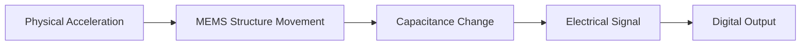

# Arduino Accelerometers

## Introduction

Accelerometers are versatile sensors that measure acceleration forces. These forces can be static, like the constant force of gravity, or dynamic, caused by moving or vibrating the accelerometer. In the Arduino ecosystem, accelerometers open up possibilities for creating motion-sensitive projects, from simple tilt detection to complex motion analysis.

This guide will walk you through understanding accelerometers, connecting them to Arduino boards, and programming them to create interactive projects. By the end, you'll be able to incorporate acceleration detection into your own Arduino creations!

## What is an Accelerometer?

An accelerometer is a sensor that measures proper acceleration (g-force) in one or more axes. Modern accelerometers typically use microelectromechanical systems (MEMS) technology, which allows them to be very small while maintaining high sensitivity.

### Key Characteristics

- **Axes**: Most accelerometers measure acceleration in 3 axes (X, Y, and Z)
- **Sensitivity**: Typically measured in g (where 1g = 9.8 m/s²)
- **Range**: Common ranges include ±2g, ±4g, ±8g, or ±16g
- **Resolution**: How small a change in acceleration can be detected

### How Accelerometers Work



At a basic level, accelerometers contain tiny structures that move when subjected to acceleration forces. This movement is converted into measurable electrical signals, which are then processed to determine the direction and magnitude of acceleration.

## Common Accelerometer Modules for Arduino

### ADXL345

The ADXL345 is a popular 3-axis accelerometer with digital output that communicates via I²C or SPI:

- Measurement range: ±2g to ±16g (selectable)
- High resolution: Up to 13-bit at ±16g
- Low power consumption
- 3.3V or 5V compatible

### MPU6050

The MPU6050 combines a 3-axis accelerometer with a 3-axis gyroscope, making it a 6-DOF (Degrees of Freedom) inertial measurement unit (IMU):

- Built-in temperature sensor
- Digital Motion Processor for complex motion processing
- I²C interface
- 3.3V logic level (but many modules include level shifters for 5V compatibility)

## Connecting an Accelerometer to Arduino

Let's look at how to connect the popular ADXL345 accelerometer to an Arduino using I²C communication.

### Wiring Diagram for ADXL345 (I²C Mode)

| ADXL345 Pin | Arduino Pin | Function |
|-------------|-------------|----------|
| VCC         | 3.3V        | Power    |
| GND         | GND         | Ground   |
| SDA         | A4 (UNO)/20 (MEGA) | I²C Data |
| SCL         | A5 (UNO)/21 (MEGA) | I²C Clock |
| CS          | 3.3V        | I²C Mode Select |

### Wiring Diagram for MPU6050

| MPU6050 Pin | Arduino Pin | Function |
|-------------|-------------|----------|
| VCC         | 5V or 3.3V  | Power    |
| GND         | GND         | Ground   |
| SDA         | A4 (UNO)/20 (MEGA) | I²C Data |
| SCL         | A5 (UNO)/21 (MEGA) | I²C Clock |
| INT         | 2 (optional)| Interrupt |

## Programming Arduino with Accelerometers

### Required Libraries

For the ADXL345, we'll use the Adafruit_ADXL345 library:

```
#include <Wire.h>
#include <Adafruit_Sensor.h>
#include <Adafruit_ADXL345_U.h>
```

For the MPU6050, we'll use the Adafruit MPU6050 library:

```
#include <Wire.h>
#include <Adafruit_MPU6050.h>
#include <Adafruit_Sensor.h>
```

### Basic ADXL345 Example

Here's a simple example to read and display acceleration data from an ADXL345:

```cpp
#include <Wire.h>
#include <Adafruit_Sensor.h>
#include <Adafruit_ADXL345_U.h>

Adafruit_ADXL345_Unified accel = Adafruit_ADXL345_Unified(12345);

void setup() {
  Serial.begin(9600);
  
  if(!accel.begin()) {
    Serial.println("No ADXL345 detected. Check your wiring!");
    while(1);
  }
  
  accel.setRange(ADXL345_RANGE_16_G);
  Serial.println("ADXL345 Accelerometer Test");
  Serial.println("");
}

void loop() {
  sensors_event_t event; 
  accel.getEvent(&event);
 
  /* Display the results (acceleration is measured in m/s^2) */
  Serial.print("X: "); Serial.print(event.acceleration.x); Serial.print("  ");
  Serial.print("Y: "); Serial.print(event.acceleration.y); Serial.print("  ");
  Serial.print("Z: "); Serial.print(event.acceleration.z); Serial.print("  ");
  Serial.println("m/s^2 ");
  
  delay(500);
}
```

#### Expected Output

```
ADXL345 Accelerometer Test

X: 0.47  Y: 0.24  Z: 9.78  m/s^2 
X: 0.51  Y: 0.20  Z: 9.81  m/s^2 
X: 0.43  Y: 0.28  Z: 9.77  m/s^2 
```

Notice that when the sensor is at rest on a flat surface, the Z-axis shows approximately 9.8 m/s², which is the acceleration due to gravity.

### Basic MPU6050 Example

Here's how to read accelerometer data from an MPU6050:

```cpp
#include <Adafruit_MPU6050.h>
#include <Adafruit_Sensor.h>
#include <Wire.h>

Adafruit_MPU6050 mpu;

void setup() {
  Serial.begin(115200);
  
  // Try to initialize!
  if (!mpu.begin()) {
    Serial.println("Failed to find MPU6050 chip");
    while (1) {
      delay(10);
    }
  }
  
  mpu.setAccelerometerRange(MPU6050_RANGE_8_G);
  Serial.println("MPU6050 Found!");
}

void loop() {
  /* Get new sensor events with the readings */
  sensors_event_t a, g, temp;
  mpu.getEvent(&a, &g, &temp);

  /* Print out the acceleration values */
  Serial.print("Acceleration X: ");
  Serial.print(a.acceleration.x);
  Serial.print(", Y: ");
  Serial.print(a.acceleration.y);
  Serial.print(", Z: ");
  Serial.print(a.acceleration.z);
  Serial.println(" m/s^2");

  /* Print out the rotation values */
  Serial.print("Rotation X: ");
  Serial.print(g.gyro.x);
  Serial.print(", Y: ");
  Serial.print(g.gyro.y);
  Serial.print(", Z: ");
  Serial.print(g.gyro.z);
  Serial.println(" rad/s");
  
  Serial.println("");
  delay(500);
}
```

#### Expected Output

```
MPU6050 Found!
Acceleration X: 0.25, Y: 0.74, Z: 9.81 m/s^2
Rotation X: 0.01, Y: 0.02, Z: -0.01 rad/s

Acceleration X: 0.27, Y: 0.71, Z: 9.82 m/s^2
Rotation X: 0.01, Y: 0.01, Z: -0.01 rad/s
```

## Practical Projects with Accelerometers

### 1. Simple Tilt Detection

This project uses an accelerometer to detect tilt and light up different LEDs based on the direction:

```cpp
#include <Wire.h>
#include <Adafruit_Sensor.h>
#include <Adafruit_ADXL345_U.h>

Adafruit_ADXL345_Unified accel = Adafruit_ADXL345_Unified(12345);

const int ledPinLeft = 2;   // LED for left tilt
const int ledPinRight = 3;  // LED for right tilt
const int ledPinForward = 4; // LED for forward tilt
const int ledPinBack = 5;    // LED for backward tilt

// Threshold value to detect tilt (in m/s^2)
const float tiltThreshold = 3.0;

void setup() {
  Serial.begin(9600);
  
  pinMode(ledPinLeft, OUTPUT);
  pinMode(ledPinRight, OUTPUT);
  pinMode(ledPinForward, OUTPUT);
  pinMode(ledPinBack, OUTPUT);
  
  if(!accel.begin()) {
    Serial.println("No ADXL345 detected. Check your wiring!");
    while(1);
  }
}

void loop() {
  sensors_event_t event; 
  accel.getEvent(&event);
  
  // All LEDs off initially
  digitalWrite(ledPinLeft, LOW);
  digitalWrite(ledPinRight, LOW);
  digitalWrite(ledPinForward, LOW);
  digitalWrite(ledPinBack, LOW);
  
  // Check X axis tilt (left-right)
  if(event.acceleration.x < -tiltThreshold) {
    digitalWrite(ledPinLeft, HIGH);  // Left tilt
    Serial.println("Tilted Left");
  }
  else if(event.acceleration.x > tiltThreshold) {
    digitalWrite(ledPinRight, HIGH); // Right tilt
    Serial.println("Tilted Right");
  }
  
  // Check Y axis tilt (forward-backward)
  if(event.acceleration.y < -tiltThreshold) {
    digitalWrite(ledPinBack, HIGH);  // Backward tilt
    Serial.println("Tilted Backward");
  }
  else if(event.acceleration.y > tiltThreshold) {
    digitalWrite(ledPinForward, HIGH); // Forward tilt
    Serial.println("Tilted Forward");
  }
  
  delay(100);
}
```

### 2. Step Counter

This project uses an accelerometer to create a basic pedometer:

```cpp
#include <Wire.h>
#include <Adafruit_MPU6050.h>
#include <Adafruit_Sensor.h>

Adafruit_MPU6050 mpu;

int stepCount = 0;
float lastMagnitude = 0;
float currentMagnitude = 0;
boolean stepDetected = false;
const float stepThreshold = 12.0; // Adjust based on sensitivity needed

void setup() {
  Serial.begin(115200);
  
  if (!mpu.begin()) {
    Serial.println("Failed to find MPU6050 chip");
    while (1) {
      delay(10);
    }
  }
  
  mpu.setAccelerometerRange(MPU6050_RANGE_8_G);
  Serial.println("Step Counter Initialized");
  Serial.println("Steps: 0");
}

void loop() {
  sensors_event_t a, g, temp;
  mpu.getEvent(&a, &g, &temp);
  
  // Calculate magnitude of acceleration vector
  currentMagnitude = sqrt(a.acceleration.x * a.acceleration.x + 
                         a.acceleration.y * a.acceleration.y + 
                         a.acceleration.z * a.acceleration.z);
                         
  // Detect steps based on acceleration spike
  if (currentMagnitude > stepThreshold && !stepDetected) {
    stepCount++;
    stepDetected = true;
    
    Serial.print("Steps: ");
    Serial.println(stepCount);
  }
  
  // Reset step detection when acceleration drops
  if (currentMagnitude < stepThreshold - 1.0) {
    stepDetected = false;
  }
  
  lastMagnitude = currentMagnitude;
  delay(50);
}
```

### 3. Vibration Monitoring System

This example shows how to detect vibrations and log them:

```cpp
#include <Wire.h>
#include <Adafruit_ADXL345_U.h>
#include <Adafruit_Sensor.h>

Adafruit_ADXL345_Unified accel = Adafruit_ADXL345_Unified(12345);

const float vibeThreshold = 11.0;  // Vibration threshold in m/s^2
const int ledPin = 13;             // Onboard LED
unsigned long lastVibeTime = 0;    // Last time vibration was detected
unsigned long vibeCount = 0;       // Count of vibrations

void setup() {
  Serial.begin(9600);
  pinMode(ledPin, OUTPUT);
  
  if(!accel.begin()) {
    Serial.println("No ADXL345 detected!");
    while(1);
  }
  
  // Set range to +/- 16G for vibration detection
  accel.setRange(ADXL345_RANGE_16_G);
  
  Serial.println("Vibration Monitor Started");
  Serial.println("Time(ms), Magnitude(m/s^2), Event");
}

void loop() {
  sensors_event_t event;
  accel.getEvent(&event);
  
  // Calculate magnitude of acceleration vector
  float magnitude = sqrt(event.acceleration.x * event.acceleration.x + 
                        event.acceleration.y * event.acceleration.y + 
                        event.acceleration.z * event.acceleration.z);
  
  // Subtract gravity component (approx 9.8 m/s^2)
  float vibeMagnitude = abs(magnitude - 9.8);
  
  // Print data point every 500ms for monitoring
  if (millis() % 500 == 0) {
    Serial.print(millis());
    Serial.print(", ");
    Serial.print(vibeMagnitude);
    Serial.print(", ");
    
    if (vibeMagnitude > vibeThreshold) {
      Serial.println("VIBRATION");
    } else {
      Serial.println("-");
    }
  }
  
  // Check if vibration exceeds threshold
  if (vibeMagnitude > vibeThreshold) {
    // Only count as new vibration if more than 1000ms since last one
    if (millis() - lastVibeTime > 1000) {
      vibeCount++;
      digitalWrite(ledPin, HIGH);
      
      Serial.print(millis());
      Serial.print(", ");
      Serial.print(vibeMagnitude);
      Serial.print(", ");
      Serial.print("VIBRATION #");
      Serial.println(vibeCount);
      
      lastVibeTime = millis();
    }
  } else {
    digitalWrite(ledPin, LOW);
  }
  
  delay(10);
}
```

## Understanding Accelerometer Data

### Gravity vs. Motion

When an accelerometer is stationary, it measures the Earth's gravitational field (approximately 9.8 m/s² or 1g). This means:

- When flat on a table, the Z-axis reads ~9.8 m/s²
- When tilted, the gravitational force is distributed among the axes
- To isolate motion acceleration, you need to subtract the gravity component

### Calculating Tilt Angles

You can calculate tilt angles using accelerometer data:

```cpp
// Calculate pitch and roll in degrees
float roll = atan2(accelY, accelZ) * 180.0 / PI;
float pitch = atan2(-accelX, sqrt(accelY * accelY + accelZ * accelZ)) * 180.0 / PI;
```

### Filtering Accelerometer Data

Raw accelerometer data can be noisy. Common filtering techniques include:

1. **Moving Average Filter**: Averages several readings to smooth out noise

```cpp
const int samples = 10;
float readings[samples];
int readIndex = 0;
float total = 0;

void loop() {
  // Read accelerometer
  sensors_event_t event;
  accel.getEvent(&event);
  
  // Subtract the last reading
  total = total - readings[readIndex];
  // Read from the sensor
  readings[readIndex] = event.acceleration.x;
  // Add the reading to the total
  total = total + readings[readIndex];
  // Advance to the next position in the array
  readIndex = (readIndex + 1) % samples;
  
  // Calculate the average
  float average = total / samples;
  
  Serial.print("Raw X: ");
  Serial.print(event.acceleration.x);
  Serial.print(" Filtered X: ");
  Serial.println(average);
  
  delay(50);
}
```

2. **Low-Pass Filter**: Gives more weight to previous readings

```cpp
float filtered = 0;
float alpha = 0.2; // Smoothing factor between 0 and 1

void loop() {
  sensors_event_t event;
  accel.getEvent(&event);
  
  // Apply low-pass filter
  filtered = alpha * event.acceleration.x + (1 - alpha) * filtered;
  
  Serial.print("Raw X: ");
  Serial.print(event.acceleration.x);
  Serial.print(" Filtered X: ");
  Serial.println(filtered);
  
  delay(50);
}
```

## Troubleshooting Arduino Accelerometers

### Common Issues and Solutions

1. **Incorrect Readings**
   - Check power supply stability
   - Verify correct wiring
   - Ensure proper library installation
   - Calibrate the sensor

2. **Communication Errors**
   - Verify I²C address (use an I²C scanner)
   - Check for proper pull-up resistors on SDA/SCL lines
   - Slow down I²C clock speed for longer wires

3. **Noisy Data**
   - Apply filtering techniques
   - Secure the sensor to prevent mechanical vibrations
   - Use shielded cables for connections

### Calibration

For better accuracy, you can calibrate your accelerometer:

```cpp
// Simple offset calibration
void calibrateAccelerometer() {
  const int numSamples = 100;
  float sumX = 0, sumY = 0, sumZ = 0;
  
  Serial.println("Calibrating accelerometer...");
  Serial.println("Keep the sensor still and level");
  
  // Collect samples
  for (int i = 0; i < numSamples; i++) {
    sensors_event_t event;
    accel.getEvent(&event);
    
    sumX += event.acceleration.x;
    sumY += event.acceleration.y;
    sumZ += event.acceleration.z;
    
    delay(10);
  }
  
  // Calculate offsets
  float offsetX = sumX / numSamples;
  float offsetY = sumY / numSamples;
  // Z offset should be 9.8 m/s^2 when level
  float offsetZ = (sumZ / numSamples) - 9.8;
  
  Serial.println("Calibration complete");
  Serial.print("X Offset: "); Serial.println(offsetX);
  Serial.print("Y Offset: "); Serial.println(offsetY);
  Serial.print("Z Offset: "); Serial.println(offsetZ);
  
  // You can now subtract these offsets from your readings
}
```

## Summary

Accelerometers are versatile sensors that can detect motion, orientation, and vibration. With Arduino, you can easily:

- Measure acceleration in three axes (X, Y, Z)
- Detect tilt and orientation
- Count steps or movements
- Monitor vibrations
- Create gesture-controlled devices

The projects covered in this guide demonstrate just a few possibilities. Accelerometers can be used in countless applications, from gaming controllers to structural health monitoring systems.

## Next Steps and Exercises

1. **Exercise**: Modify the tilt detection project to control a servo motor that points in the direction of tilt.

2. **Exercise**: Create a digital bubble level that shows how level a surface is using the Serial Plotter.

3. **Exercise**: Build a shock detector that logs data to an SD card when impacts above a certain threshold are detected.

4. **Challenge**: Combine an accelerometer with other sensors (like a gyroscope) to create a more accurate motion tracking system.

5. **Challenge**: Use machine learning to recognize specific gestures based on accelerometer data patterns.

## Additional Resources

- [Adafruit Learning Guide for ADXL345](https://learn.adafruit.com/adxl345-digital-accelerometer)
- [Adafruit Learning Guide for MPU6050](https://learn.adafruit.com/mpu6050-6-dof-accelerometer-and-gyro)
- [Arduino Library Reference for Wire (I²C)](https://www.arduino.cc/reference/en/language/functions/communication/wire/)
- [Understanding Accelerometer Specifications](https://www.dimensionengineering.com/info/accelerometers)