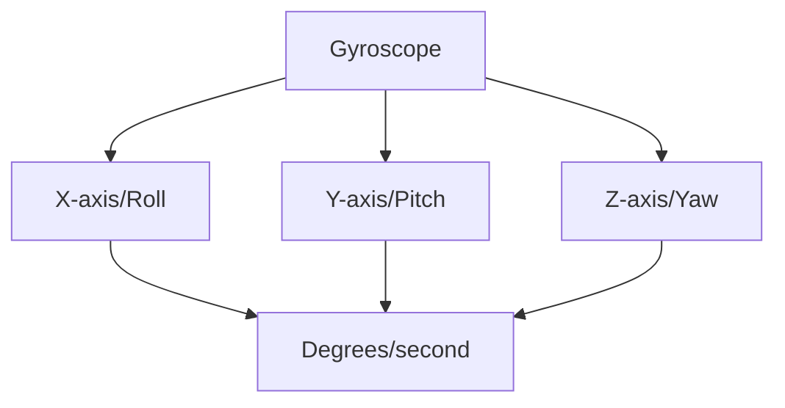
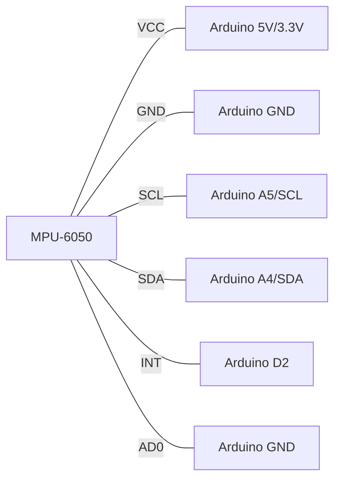

# Arduino Gyroscopes

## Introduction

Gyroscope sensors are essential components in many modern electronics, from smartphones to drones. Unlike accelerometers that measure linear acceleration, gyroscopes measure rotational motion or angular velocity. When used with Arduino, gyroscopes open up possibilities for building motion-controlled gadgets, stabilization systems, and orientation-aware devices.

In this tutorial, we'll explore how gyroscopes work, how to connect them to your Arduino, and how to use the data they provide to create interesting projects.

## What is a Gyroscope?

A gyroscope is a sensor that measures angular velocity - the rate of rotation around an axis. Modern MEMS (Micro-Electro-Mechanical Systems) gyroscopes use tiny vibrating elements that experience the Coriolis effect when rotated, allowing them to detect rotation.

Most gyroscopes provide data for three axes of rotation:
- **X-axis (Roll)**: Rotation around the front-to-back axis
- **Y-axis (Pitch)**: Rotation around the side-to-side axis
- **Z-axis (Yaw)**: Rotation around the vertical axis

The output values typically represent angular velocity in degrees per second (°/s).



## Common Gyroscope Modules for Arduino

Several gyroscope modules work well with Arduino:

1. **MPU-6050**: The most popular and affordable option, which combines a 3-axis gyroscope with a 3-axis accelerometer (making it an IMU - Inertial Measurement Unit)
2. **L3G4200D**: A standalone 3-axis gyroscope with good sensitivity
3. **MPU-9250**: A more advanced IMU with gyroscope, accelerometer, and magnetometer
4. **ICM-20948**: A newer, high-precision 9-axis IMU

For this tutorial, we'll focus on the MPU-6050 as it's widely available, inexpensive, and has excellent library support.

## Connecting an MPU-6050 to Arduino

The MPU-6050 communicates with Arduino using the I²C protocol, making connections simple:

| MPU-6050 Pin | Arduino Pin |
|--------------|-------------|
| VCC          | 3.3V or 5V  |
| GND          | GND         |
| SCL          | A5 (UNO/Nano), 21 (MEGA), SCL pin |
| SDA          | A4 (UNO/Nano), 20 (MEGA), SDA pin |
| INT          | 2 (optional) |
| AD0          | GND (sets address to 0x68) |

Here's a visual representation of the connections:



## Installing Required Libraries

To use the MPU-6050 with Arduino, we need to install some libraries. Open the Arduino IDE and go to **Sketch > Include Library > Manage Libraries**. Search for and install:

1. **Adafruit MPU6050** by Adafruit
2. **Adafruit Unified Sensor** (dependency for the MPU6050 library)

Alternatively, if you prefer a simpler library, you can install:

- **MPU6050** by Electronic Cats

## Basic Reading from a Gyroscope

Let's start with a simple example to read raw gyroscope data from the MPU-6050:

```cpp
#include <Wire.h>
#include <Adafruit_MPU6050.h>
#include <Adafruit_Sensor.h>

Adafruit_MPU6050 mpu;

void setup() {
  Serial.begin(115200);
  
  // Initialize the MPU-6050
  if (!mpu.begin()) {
    Serial.println("Failed to find MPU6050 chip");
    while (1) {
      delay(10);
    }
  }
  
  Serial.println("MPU6050 Found!");
  
  // Set gyroscope range (in degrees/second)
  mpu.setGyroRange(MPU6050_RANGE_500_DEG);
  
  Serial.println("Gyroscope range set to: 500 degrees/s");
  delay(100);
}

void loop() {
  // Get new sensor events with the readings
  sensors_event_t a, g, temp;
  mpu.getEvent(&a, &g, &temp);

  // Print gyroscope values (degrees per second)
  Serial.print("Gyroscope: X = ");
  Serial.print(g.gyro.x);
  Serial.print(", Y = ");
  Serial.print(g.gyro.y);
  Serial.print(", Z = ");
  Serial.println(g.gyro.z);
  
  delay(500);
}
```

### Expected Output

When running this code and opening the Serial Monitor (set to 115200 baud), you'll see something like:

```
MPU6050 Found!
Gyroscope range set to: 500 degrees/s
Gyroscope: X = 0.01, Y = -0.03, Z = 0.02
Gyroscope: X = 0.00, Y = -0.02, Z = 0.01
Gyroscope: X = 0.02, Y = -0.01, Z = 0.00
```

If you rotate the sensor, you'll see the values change. When at rest, values should be close to zero (though some drift is normal).

## Understanding Gyroscope Data

The gyroscope data requires some interpretation:

1. **Units**: The values represent angular velocity in radians per second (the Adafruit library converts to this unit). Multiply by 57.296 to convert to degrees per second (°/s).
2. **Direction**: Positive values indicate rotation in one direction, negative values in the opposite direction.
3. **Calibration**: Gyroscopes often have a slight offset or "bias" when not moving. For precise measurements, you'll need to calibrate by finding and subtracting this bias.

## Calibrating Your Gyroscope

To improve accuracy, let's calibrate the gyroscope by taking numerous readings at rest and calculating the average bias:

```cpp
#include <Wire.h>
#include <Adafruit_MPU6050.h>
#include <Adafruit_Sensor.h>

Adafruit_MPU6050 mpu;

float gyroXcalibration = 0;
float gyroYcalibration = 0;
float gyroZcalibration = 0;

void setup() {
  Serial.begin(115200);
  
  // Initialize the MPU-6050
  if (!mpu.begin()) {
    Serial.println("Failed to find MPU6050 chip");
    while (1) {
      delay(10);
    }
  }
  
  Serial.println("MPU6050 Found!");
  mpu.setGyroRange(MPU6050_RANGE_500_DEG);
  
  Serial.println("Calibrating gyroscope... Keep the sensor still!");
  
  // Take 100 readings for calibration
  int calibrationCount = 500;
  for (int i = 0; i < calibrationCount; i++) {
    sensors_event_t a, g, temp;
    mpu.getEvent(&a, &g, &temp);
    
    gyroXcalibration += g.gyro.x;
    gyroYcalibration += g.gyro.y;
    gyroZcalibration += g.gyro.z;
    
    delay(5);
  }
  
  // Calculate average offset (bias)
  gyroXcalibration /= calibrationCount;
  gyroYcalibration /= calibrationCount;
  gyroZcalibration /= calibrationCount;
  
  Serial.println("Calibration complete!");
  Serial.print("X offset: "); Serial.println(gyroXcalibration);
  Serial.print("Y offset: "); Serial.println(gyroYcalibration);
  Serial.print("Z offset: "); Serial.println(gyroZcalibration);
}

void loop() {
  // Get new sensor readings
  sensors_event_t a, g, temp;
  mpu.getEvent(&a, &g, &temp);

  // Apply calibration
  float gyroX = g.gyro.x - gyroXcalibration;
  float gyroY = g.gyro.y - gyroYcalibration;
  float gyroZ = g.gyro.z - gyroZcalibration;
  
  // Convert to degrees per second
  float gyroX_deg = gyroX * 57.296;
  float gyroY_deg = gyroY * 57.296;
  float gyroZ_deg = gyroZ * 57.296;

  // Print calibrated values in degrees per second
  Serial.print("Gyro (deg/s): X = ");
  Serial.print(gyroX_deg);
  Serial.print(", Y = ");
  Serial.print(gyroY_deg);
  Serial.print(", Z = ");
  Serial.println(gyroZ_deg);
  
  delay(100);
}
```

### Expected Output

When calibrated, your resting values should be much closer to zero:

```
MPU6050 Found!
Calibrating gyroscope... Keep the sensor still!
Calibration complete!
X offset: 0.01
Y offset: -0.02
Z offset: 0.01
Gyro (deg/s): X = 0.00, Y = 0.06, Z = -0.01
Gyro (deg/s): X = -0.03, Y = 0.00, Z = 0.02
```

## Calculating Rotation Angles

While gyroscopes measure angular velocity, often we want to know actual angles. We can calculate angles by integrating gyroscope readings over time:

```cpp
#include <Wire.h>
#include <Adafruit_MPU6050.h>
#include <Adafruit_Sensor.h>

Adafruit_MPU6050 mpu;

float gyroXcalibration = 0;
float gyroYcalibration = 0;
float gyroZcalibration = 0;

float angleX = 0;
float angleY = 0;
float angleZ = 0;

unsigned long previousTime = 0;

void setup() {
  Serial.begin(115200);
  
  // Initialize the MPU-6050
  if (!mpu.begin()) {
    Serial.println("Failed to find MPU6050 chip");
    while (1) {
      delay(10);
    }
  }
  
  Serial.println("MPU6050 Found!");
  mpu.setGyroRange(MPU6050_RANGE_500_DEG);
  
  // Calibration code (same as previous example)
  Serial.println("Calibrating gyroscope... Keep the sensor still!");
  int calibrationCount = 500;
  for (int i = 0; i < calibrationCount; i++) {
    sensors_event_t a, g, temp;
    mpu.getEvent(&a, &g, &temp);
    
    gyroXcalibration += g.gyro.x;
    gyroYcalibration += g.gyro.y;
    gyroZcalibration += g.gyro.z;
    
    delay(5);
  }
  
  gyroXcalibration /= calibrationCount;
  gyroYcalibration /= calibrationCount;
  gyroZcalibration /= calibrationCount;
  
  Serial.println("Calibration complete!");
  
  previousTime = millis();
}

void loop() {
  // Calculate time elapsed since last reading
  unsigned long currentTime = millis();
  float elapsedTime = (currentTime - previousTime) / 1000.0; // Convert to seconds
  previousTime = currentTime;
  
  // Get new sensor readings
  sensors_event_t a, g, temp;
  mpu.getEvent(&a, &g, &temp);

  // Apply calibration
  float gyroX = g.gyro.x - gyroXcalibration;
  float gyroY = g.gyro.y - gyroYcalibration;
  float gyroZ = g.gyro.z - gyroZcalibration;
  
  // Convert to degrees per second
  float gyroX_deg = gyroX * 57.296;
  float gyroY_deg = gyroY * 57.296;
  float gyroZ_deg = gyroZ * 57.296;
  
  // Integrate angular velocity to get angles
  angleX += gyroX_deg * elapsedTime;
  angleY += gyroY_deg * elapsedTime;
  angleZ += gyroZ_deg * elapsedTime;

  // Print angles
  Serial.print("Angle (deg): X = ");
  Serial.print(angleX);
  Serial.print(", Y = ");
  Serial.print(angleY);
  Serial.print(", Z = ");
  Serial.println(angleZ);
  
  delay(50);
}
```

### Expected Output

The angles should change smoothly as you rotate the sensor:

```
MPU6050 Found!
Calibrating gyroscope... Keep the sensor still!
Calibration complete!
Angle (deg): X = 0.00, Y = 0.00, Z = 0.00
Angle (deg): X = 0.02, Y = -0.01, Z = 0.00
Angle (deg): X = 0.05, Y = -0.03, Z = -0.01
Angle (deg): X = 11.25, Y = -3.17, Z = -1.02  // After rotating around X axis
```

## The Gyroscope Drift Problem

You might notice that even when the sensor is stationary, the angles slowly increase or decrease over time. This is called "drift" and is a fundamental limitation of gyroscopes.

There are two common solutions:
1. **Complementary Filter**: Combines gyroscope data with accelerometer data
2. **Kalman Filter**: A more complex algorithm that provides better results

## Creating a Simple Tilt Sensing Project

Let's create a practical example - a tilt detection system that lights up different LEDs based on the orientation:

```cpp
#include <Wire.h>
#include <Adafruit_MPU6050.h>
#include <Adafruit_Sensor.h>

Adafruit_MPU6050 mpu;

// LED pins
const int ledForward = 7;  // Green LED
const int ledBack = 6;     // Yellow LED
const int ledRight = 5;    // Blue LED
const int ledLeft = 4;     // Red LED

// Calibration variables
float gyroXcalibration = 0;
float gyroYcalibration = 0;

// Angle variables
float angleX = 0;
float angleY = 0;

unsigned long previousTime = 0;

void setup() {
  Serial.begin(115200);
  
  // Setup LED pins
  pinMode(ledForward, OUTPUT);
  pinMode(ledBack, OUTPUT);
  pinMode(ledRight, OUTPUT);
  pinMode(ledLeft, OUTPUT);
  
  // Initialize the MPU-6050
  if (!mpu.begin()) {
    Serial.println("Failed to find MPU6050 chip");
    while (1) {
      delay(10);
    }
  }
  
  Serial.println("MPU6050 Found!");
  mpu.setGyroRange(MPU6050_RANGE_500_DEG);
  
  // Calibration (simplified)
  Serial.println("Calibrating gyroscope... Keep the sensor still!");
  for (int i = 0; i < 100; i++) {
    sensors_event_t a, g, temp;
    mpu.getEvent(&a, &g, &temp);
    
    gyroXcalibration += g.gyro.x;
    gyroYcalibration += g.gyro.y;
    
    delay(10);
  }
  
  gyroXcalibration /= 100;
  gyroYcalibration /= 100;
  
  Serial.println("Calibration complete!");
  
  // Use accelerometer for initial angle
  sensors_event_t a, g, temp;
  mpu.getEvent(&a, &g, &temp);
  
  // Calculate initial angles from accelerometer (when stationary)
  angleX = atan2(a.acceleration.y, a.acceleration.z) * 57.296;
  angleY = atan2(-a.acceleration.x, sqrt(a.acceleration.y * a.acceleration.y + a.acceleration.z * a.acceleration.z)) * 57.296;
  
  previousTime = millis();
}

void loop() {
  // Time calculation
  unsigned long currentTime = millis();
  float elapsedTime = (currentTime - previousTime) / 1000.0;
  previousTime = currentTime;
  
  // Get sensor readings
  sensors_event_t a, g, temp;
  mpu.getEvent(&a, &g, &temp);

  // Apply calibration
  float gyroX = g.gyro.x - gyroXcalibration;
  float gyroY = g.gyro.y - gyroYcalibration;
  
  // Convert to degrees per second
  float gyroX_deg = gyroX * 57.296;
  float gyroY_deg = gyroY * 57.296;
  
  // Calculate angles (complementary filter)
  // 98% gyroscope + 2% accelerometer for stability
  float accelAngleX = atan2(a.acceleration.y, a.acceleration.z) * 57.296;
  float accelAngleY = atan2(-a.acceleration.x, sqrt(a.acceleration.y * a.acceleration.y + a.acceleration.z * a.acceleration.z)) * 57.296;
  
  angleX = 0.98 * (angleX + gyroX_deg * elapsedTime) + 0.02 * accelAngleX;
  angleY = 0.98 * (angleY + gyroY_deg * elapsedTime) + 0.02 * accelAngleY;

  // Print angles
  Serial.print("Angle X: ");
  Serial.print(angleX);
  Serial.print("  Angle Y: ");
  Serial.println(angleY);
  
  // Control LEDs based on tilt
  // Turn all LEDs off first
  digitalWrite(ledForward, LOW);
  digitalWrite(ledBack, LOW);
  digitalWrite(ledRight, LOW);
  digitalWrite(ledLeft, LOW);
  
  // Check pitch (X-axis) for forward/backward tilt
  if (angleX > 20) {
    digitalWrite(ledForward, HIGH);
  } else if (angleX < -20) {
    digitalWrite(ledBack, HIGH);
  }
  
  // Check roll (Y-axis) for left/right tilt
  if (angleY > 20) {
    digitalWrite(ledRight, HIGH);
  } else if (angleY < -20) {
    digitalWrite(ledLeft, HIGH);
  }
  
  delay(20);
}
```

This example uses a complementary filter, which combines gyroscope data with accelerometer data to reduce drift. The code lights up different LEDs depending on which way you tilt the sensor.

## Practical Applications of Gyroscopes

Gyroscopes are used in numerous applications:

1. **Drone Stabilization**: Gyroscopes detect unwanted tilting and help keep drones level
2. **Robot Balance**: Self-balancing robots use gyroscopes to maintain their position
3. **Motion-Controlled Games**: Game controllers use gyroscopes for intuitive control
4. **Camera Stabilization**: Gimbals use gyroscopes to keep cameras steady
5. **Navigation Systems**: When paired with other sensors, gyroscopes help with position tracking

## Example Project: Self-Balancing Platform

Here's a simplified code example for a self-balancing platform using a servo motor:

```cpp
#include <Wire.h>
#include <Adafruit_MPU6050.h>
#include <Adafruit_Sensor.h>
#include <Servo.h>

Adafruit_MPU6050 mpu;
Servo balanceServo;

float angleX = 0;
float gyroXcalibration = 0;
unsigned long previousTime = 0;

void setup() {
  Serial.begin(115200);
  
  // Setup servo
  balanceServo.attach(9);
  balanceServo.write(90); // Center position
  
  // Initialize MPU-6050
  if (!mpu.begin()) {
    Serial.println("Failed to find MPU6050 chip");
    while (1) {
      delay(10);
    }
  }
  
  Serial.println("MPU6050 Found!");
  
  // Calibrate gyro
  for (int i = 0; i < 100; i++) {
    sensors_event_t a, g, temp;
    mpu.getEvent(&a, &g, &temp);
    gyroXcalibration += g.gyro.x;
    delay(10);
  }
  gyroXcalibration /= 100;
  
  // Initial angle from accelerometer
  sensors_event_t a, g, temp;
  mpu.getEvent(&a, &g, &temp);
  angleX = atan2(a.acceleration.y, a.acceleration.z) * 57.296;
  
  previousTime = millis();
}

void loop() {
  // Calculate time
  unsigned long currentTime = millis();
  float elapsedTime = (currentTime - previousTime) / 1000.0;
  previousTime = currentTime;
  
  // Get sensor data
  sensors_event_t a, g, temp;
  mpu.getEvent(&a, &g, &temp);
  
  // Update angle with complementary filter
  float accelAngleX = atan2(a.acceleration.y, a.acceleration.z) * 57.296;
  float gyroRate = (g.gyro.x - gyroXcalibration) * 57.296;
  angleX = 0.96 * (angleX + gyroRate * elapsedTime) + 0.04 * accelAngleX;
  
  // Map angle to servo position (-30 to +30 degrees maps to 60-120 servo angle)
  int servoPos = map(constrain(angleX, -30, 30), -30, 30, 60, 120);
  balanceServo.write(servoPos);
  
  // Print data
  Serial.print("Angle: ");
  Serial.print(angleX);
  Serial.print("  Servo: ");
  Serial.println(servoPos);
  
  delay(20);
}
```

## Advanced Topic: Sensor Fusion

For more precise measurements, consider implementing sensor fusion algorithms like the Madgwick or Mahony filter. These combine accelerometer, gyroscope, and sometimes magnetometer data to provide accurate orientation tracking with minimal drift.

Libraries like:
- MPU6050_tockn
- FastIMU
- TinyMPU6050

Have built-in sensor fusion capabilities that simplify implementation.

## Summary

In this tutorial, we've covered:
- How gyroscopes work and what they measure
- Connecting an MPU-6050 gyroscope to Arduino
- Reading and calibrating gyroscope data
- Converting angular velocity to orientation angles
- Dealing with gyroscope drift
- Creating practical projects with gyroscopes

Gyroscopes are powerful sensors that, when combined with proper processing techniques, enable your Arduino projects to understand rotation and orientation. This capability is essential for robotics, drones, gaming interfaces, and many other exciting applications.

## Exercises

1. Build a digital spirit level that displays the tilt angle on an LCD screen.
2. Create a motion-controlled game where tilting controls an on-screen character.
3. Modify the tilt-detection project to add a buzzer that sounds when the tilt exceeds a threshold.
4. Build a simple stabilization system for a camera using a small servo motor.
5. Combine a gyroscope with an accelerometer to create a pedometer that counts steps.

## Additional Resources

- [MPU-6050 Datasheet](https://invensense.tdk.com/products/motion-tracking/6-axis/mpu-6050/)
- [Understanding MEMS Gyroscopes](https://www.analog.com/en/analog-dialogue/articles/mems-gyroscopes-for-industrial-applications.html)
- [Sensor Fusion Algorithms](https://ahrs.readthedocs.io/en/latest/filters/madgwick.html)
- [Arduino IMU Guide](https://www.arduino.cc/reference/en/libraries/mpu6050_tockn/)