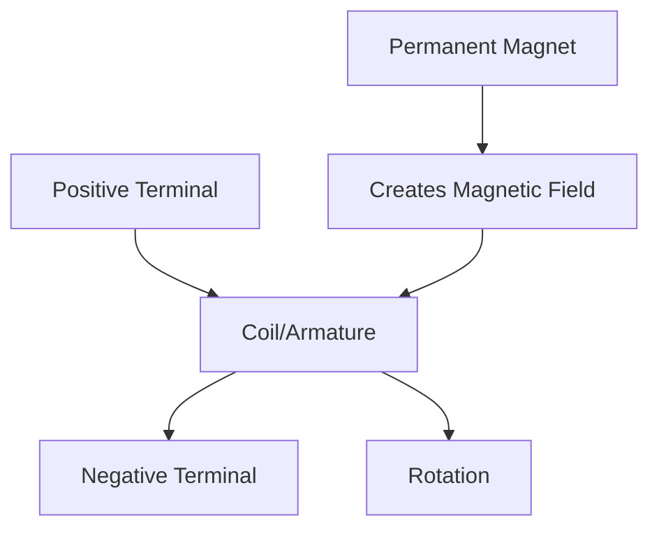
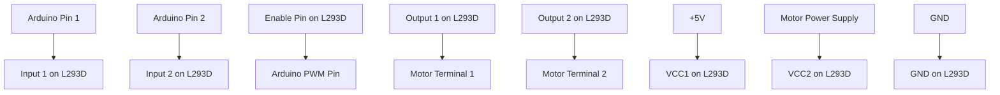
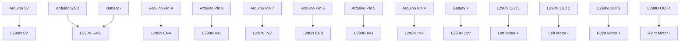

# Arduino Motors DC

## Introduction

DC motors are one of the most common actuators in electronics projects, allowing you to create movement in robots, toys, mechanical systems, and more. Unlike servos that move to specific positions, DC motors rotate continuously and are perfect for wheels, fans, or any application that needs continuous rotation.

In this tutorial, you'll learn how to connect and control DC motors with your Arduino. We'll cover:

- Basic DC motor principles
- Connection methods
- Speed control using PWM
- Direction control with H-bridges
- Practical examples and applications

## Basic DC Motor Principles

DC motors convert electrical energy into mechanical energy through electromagnetic principles. When current flows through the motor's coil in a magnetic field, it generates a force that causes rotation.

Key characteristics of DC motors include:

- **Voltage Rating**: Typically 3V to 12V for hobby motors
- **Current Draw**: Can range from a few milliamps to several amps
- **RPM (Rotations Per Minute)**: Depends on the motor specifications
- **Torque**: The rotational force the motor can provide

Here's a simple diagram showing the basic components of a DC motor:



## Connecting DC Motors to Arduino

### Direct Connection (Not Recommended)

Arduino pins can only supply a small amount of current (around 40mA), which is insufficient for most DC motors. **Never connect a DC motor directly to an Arduino pin** as it can damage your board.

### Using a Transistor

For small motors that require more current than an Arduino can provide but run on low voltage (3-5V), you can use a transistor as a switch:

```
Arduino Pin ---- 1kΩ Resistor ---- Base of Transistor
                                     |
                                     Collector
                                     |
                              DC Motor ---- Positive Power Supply
                                     |
                                     Emitter
                                     |
                                    GND
```

Here's the Arduino code to control such a motor:

```cpp
const int motorPin = 9;  // The pin that will control the motor

void setup() {
  pinMode(motorPin, OUTPUT);  // Set the motor pin as output
}

void loop() {
  digitalWrite(motorPin, HIGH);  // Turn the motor on
  delay(2000);                  // Wait for 2 seconds
  
  digitalWrite(motorPin, LOW);   // Turn the motor off
  delay(2000);                  // Wait for 2 seconds
}
```

### Using a Motor Driver (Recommended)

For more power and control, a motor driver IC or module (like the L298N or L293D) is recommended. These drivers:

- Handle higher currents and voltages
- Protect your Arduino
- Allow speed and direction control

## Controlling DC Motor Speed

### Pulse Width Modulation (PWM)

To control a DC motor's speed, we use PWM (Pulse Width Modulation). PWM rapidly switches the power on and off. The ratio of "on time" to "off time" determines the average power delivered to the motor.

Arduino has built-in PWM capabilities on pins marked with a `~` symbol (usually pins 3, 5, 6, 9, 10, and 11 on the Uno).

Here's a code example using PWM to gradually increase and decrease motor speed:

```cpp
const int motorPin = 9;  // Must be a PWM pin (marked with ~)

void setup() {
  pinMode(motorPin, OUTPUT);
}

void loop() {
  // Gradually increase speed
  for (int speed = 0; speed <= 255; speed++) {
    analogWrite(motorPin, speed);
    delay(10);
  }
  
  // Maintain maximum speed for a moment
  delay(1000);
  
  // Gradually decrease speed
  for (int speed = 255; speed >= 0; speed--) {
    analogWrite(motorPin, speed);
    delay(10);
  }
  
  // Stay stopped for a moment
  delay(1000);
}
```

## Controlling DC Motor Direction

### Using an H-Bridge

To control the direction of a DC motor, you need an H-bridge circuit. An H-bridge allows you to reverse the polarity of the voltage applied to the motor.

Popular H-bridge ICs include:
- L293D
- L298N
- TB6612FNG
- DRV8833

### Wiring an L293D H-Bridge

The L293D is a common, beginner-friendly H-bridge IC:



### Code Example for Direction Control

```cpp
// Motor A connections
const int enA = 9;   // Enable pin for motor A (must be PWM)
const int in1 = 8;   // Input 1 for motor A
const int in2 = 7;   // Input 2 for motor A

void setup() {
  // Set all motor control pins as outputs
  pinMode(enA, OUTPUT);
  pinMode(in1, OUTPUT);
  pinMode(in2, OUTPUT);
  
  // Initially stop the motor
  digitalWrite(in1, LOW);
  digitalWrite(in2, LOW);
}

void loop() {
  // Run the motor forward at half speed
  digitalWrite(in1, HIGH);
  digitalWrite(in2, LOW);
  analogWrite(enA, 128);  // PWM value 0-255
  delay(2000);
  
  // Stop the motor
  digitalWrite(in1, LOW);
  digitalWrite(in2, LOW);
  delay(1000);
  
  // Run the motor backward at full speed
  digitalWrite(in1, LOW);
  digitalWrite(in2, HIGH);
  analogWrite(enA, 255);  // PWM value 0-255
  delay(2000);
  
  // Stop the motor
  digitalWrite(in1, LOW);
  digitalWrite(in2, LOW);
  delay(1000);
}
```

## Practical Project: Simple Robot Car

Let's build a simple two-wheel robot car that can move forward, backward, turn left, and turn right.

### Components Needed:
- Arduino board
- L298N motor driver module
- 2 DC motors
- Wheels attached to the motors
- Chassis (can be made from cardboard for beginners)
- Battery pack (6-12V)
- Jumper wires

### Wiring:



### Code:

```cpp
// Motor A connections (Left Motor)
const int enA = 9;
const int in1 = 8;
const int in2 = 7;

// Motor B connections (Right Motor)
const int enB = 6;
const int in3 = 5;
const int in4 = 4;

void setup() {
  // Set all motor control pins as outputs
  pinMode(enA, OUTPUT);
  pinMode(enB, OUTPUT);
  pinMode(in1, OUTPUT);
  pinMode(in2, OUTPUT);
  pinMode(in3, OUTPUT);
  pinMode(in4, OUTPUT);
  
  // Initially stop both motors
  stop();
}

void loop() {
  // Move forward for 2 seconds
  forward(200);  // Speed 0-255
  delay(2000);
  
  // Stop for 1 second
  stop();
  delay(1000);
  
  // Move backward for 2 seconds
  backward(200);
  delay(2000);
  
  // Stop for 1 second
  stop();
  delay(1000);
  
  // Turn left for 1 second
  left(200);
  delay(1000);
  
  // Stop for 1 second
  stop();
  delay(1000);
  
  // Turn right for 1 second
  right(200);
  delay(1000);
  
  // Stop for 1 second
  stop();
  delay(1000);
}

// Function to move forward
void forward(int speed) {
  // Left motor forward
  digitalWrite(in1, HIGH);
  digitalWrite(in2, LOW);
  analogWrite(enA, speed);
  
  // Right motor forward
  digitalWrite(in3, HIGH);
  digitalWrite(in4, LOW);
  analogWrite(enB, speed);
}

// Function to move backward
void backward(int speed) {
  // Left motor backward
  digitalWrite(in1, LOW);
  digitalWrite(in2, HIGH);
  analogWrite(enA, speed);
  
  // Right motor backward
  digitalWrite(in3, LOW);
  digitalWrite(in4, HIGH);
  analogWrite(enB, speed);
}

// Function to turn left
void left(int speed) {
  // Left motor stop
  digitalWrite(in1, LOW);
  digitalWrite(in2, LOW);
  analogWrite(enA, 0);
  
  // Right motor forward
  digitalWrite(in3, HIGH);
  digitalWrite(in4, LOW);
  analogWrite(enB, speed);
}

// Function to turn right
void right(int speed) {
  // Left motor forward
  digitalWrite(in1, HIGH);
  digitalWrite(in2, LOW);
  analogWrite(enA, speed);
  
  // Right motor stop
  digitalWrite(in3, LOW);
  digitalWrite(in4, LOW);
  analogWrite(enB, 0);
}

// Function to stop both motors
void stop() {
  digitalWrite(in1, LOW);
  digitalWrite(in2, LOW);
  digitalWrite(in3, LOW);
  digitalWrite(in4, LOW);
  analogWrite(enA, 0);
  analogWrite(enB, 0);
}
```

## Tips for Working with DC Motors

1. **Power Supply**: Always use a separate power supply for motors, not the Arduino's 5V pin.

2. **Decoupling Capacitors**: Place a 0.1μF capacitor across the motor terminals to reduce interference.

3. **Free-Wheeling Diodes**: If not using a motor driver with built-in protection, add diodes across the motor to protect from back-EMF.

4. **Current Limiting**: Be aware of your motor's current draw and ensure your driver can handle it.

5. **Noise Isolation**: Keep motor wiring separate from sensor and signal wires to avoid interference.

## Real-World Applications

DC motors with Arduino are used in numerous applications:

- **Robotics**: Movement systems for robots and automated vehicles
- **Home Automation**: Motorized curtains, blinds, or doors
- **DIY Tools**: Automated tools like CNC machines or 3D printers
- **Toys and Games**: Remote-controlled cars, interactive toys
- **Cooling Systems**: Fans and pumps with variable speed control

## Summary

In this tutorial, you've learned how to work with DC motors using Arduino. We covered:

- Basic DC motor principles and characteristics
- Different methods to connect motors to Arduino
- Controlling motor speed using PWM
- Controlling motor direction with H-bridges
- Building a practical robot car project

With these skills, you can now incorporate movement into your Arduino projects, opening up possibilities for robotics, automation, and interactive physical systems.

## Exercises

1. Modify the robot car code to create a pattern of movements (like a square or figure-eight).
2. Create a motor speed controller using a potentiometer for user input.
3. Add an ultrasonic sensor to the robot car to create an obstacle-avoiding robot.
4. Build a fan with variable speed control based on temperature readings.
5. Design a simple conveyor belt system that moves at different speeds based on inputs.

## Additional Resources

- [Arduino Official DC Motor Tutorial](https://www.arduino.cc/en/Tutorial/MotorKnob)
- [Introduction to H-Bridge Motor Control Circuits](https://www.electronics-tutorials.ws/blog/h-bridge.html)
- [Understanding PWM](https://learn.sparkfun.com/tutorials/pulse-width-modulation/all)