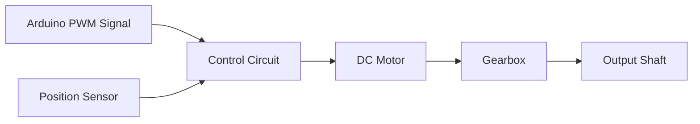
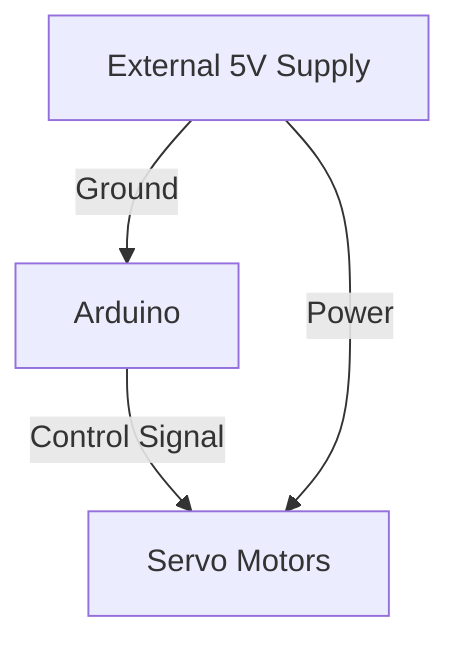

# Arduino Servo Motors

## Introduction

Servo motors are precise, controllable motors that can rotate to a specific position and hold that position. Unlike standard DC motors that spin continuously, servos typically rotate within a limited range (often 0-180 degrees). This precision makes them ideal for robotics, automation, and various electronic projects where exact positioning is required.

In this tutorial, you'll learn how servo motors work, how to connect them to an Arduino, and how to program them to create useful applications. By the end, you'll be able to incorporate servo motors into your own Arduino projects with confidence.

## What You'll Need

- Arduino board (Uno, Nano, Mega, etc.)
- Servo motor (standard size SG90 recommended for beginners)
- Jumper wires
- Breadboard (optional)
- 5V power supply (for multiple or larger servos)

## Understanding Servo Motors

### How Servo Motors Work

Servo motors contain three main components:
- A small DC motor
- A control circuit with feedback
- A set of gears for precision

<br />



Servos operate on a principle called Pulse Width Modulation (PWM). The Arduino sends pulses of varying width, which the servo interprets as position commands. The internal control circuit compares the desired position with the actual position (measured by a potentiometer) and adjusts the motor accordingly.

### Types of Servo Motors

1. **Standard Servos**: Rotate approximately 180 degrees
2. **Continuous Rotation Servos**: Modified to rotate continuously like a regular DC motor
3. **Digital Servos**: Use digital circuitry for more precise control
4. **Analog Servos**: Use analog circuitry (traditional type)

## Connecting a Servo to Arduino

Servo motors typically have three wires:
- **Red**: Power (5V)
- **Brown or Black**: Ground (GND)
- **Orange, Yellow, or White**: Signal (PWM)

### Basic Connection Diagram

```
Arduino Pin   Servo Wire
-----------------------
5V            Red
GND           Brown/Black
Digital Pin 9 Yellow/Orange/White
```

## Programming Servo Motors

### The Servo Library

Arduino provides a built-in `Servo` library that makes controlling servos simple. Let's start with a basic example:

```cpp
#include <Servo.h>

Servo myServo;  // Create a servo object

void setup() {
  myServo.attach(9);  // Attach the servo to pin 9
}

void loop() {
  myServo.write(0);    // Move servo to 0 degrees
  delay(1000);         // Wait 1 second
  myServo.write(90);   // Move servo to 90 degrees
  delay(1000);         // Wait 1 second
  myServo.write(180);  // Move servo to 180 degrees
  delay(1000);         // Wait 1 second
}
```

This code creates a sweeping motion where the servo moves from 0 to 90 to 180 degrees, pausing for one second at each position.

### Key Servo Functions

- `attach(pin)`: Connects the servo to a specific Arduino pin
- `write(angle)`: Positions the servo at a specific angle (0-180)
- `read()`: Returns the current servo position
- `detach()`: Disconnects the servo from its pin

### Smooth Movement

The example above moves the servo in large jumps. For smoother movement, you can create a sweeping motion:

```cpp
#include <Servo.h>

Servo myServo;
int pos = 0;  // Variable to store the servo position

void setup() {
  myServo.attach(9);
}

void loop() {
  // Sweep from 0 to 180 degrees
  for (pos = 0; pos <= 180; pos += 1) {
    myServo.write(pos);
    delay(15);  // Small delay for smooth movement
  }
  
  // Sweep from 180 to 0 degrees
  for (pos = 180; pos >= 0; pos -= 1) {
    myServo.write(pos);
    delay(15);
  }
}
```

## Controlling Servos with Input

Let's look at how to control a servo with different inputs.

### Potentiometer Control

This example uses a potentiometer (variable resistor) to control the servo position:

```cpp
#include <Servo.h>

Servo myServo;
int potPin = A0;  // Analog pin for potentiometer
int potValue;     // Variable to store potentiometer reading
int angle;        // Variable to store servo angle

void setup() {
  myServo.attach(9);
}

void loop() {
  potValue = analogRead(potPin);       // Read potentiometer (0-1023)
  angle = map(potValue, 0, 1023, 0, 180);  // Convert to angle (0-180)
  myServo.write(angle);                // Set servo position
  delay(15);                           // Small delay for stability
}
```

### Serial Control

You can also control the servo through the Serial Monitor:

```cpp
#include <Servo.h>

Servo myServo;
String inputString = "";      // String to hold input
boolean stringComplete = false;  // Whether string is complete

void setup() {
  myServo.attach(9);
  Serial.begin(9600);
  Serial.println("Enter an angle between 0-180:");
}

void loop() {
  // When a new serial line is received
  if (stringComplete) {
    int angle = inputString.toInt();  // Convert string to integer
    
    // Check if angle is within valid range
    if (angle >= 0 && angle <= 180) {
      myServo.write(angle);
      Serial.print("Servo moved to ");
      Serial.print(angle);
      Serial.println(" degrees");
    } else {
      Serial.println("Angle must be between 0 and 180 degrees");
    }
    
    // Reset for the next input
    inputString = "";
    stringComplete = false;
    Serial.println("Enter an angle between 0-180:");
  }
}

void serialEvent() {
  while (Serial.available()) {
    char inChar = (char)Serial.read();
    if (inChar == '
') {
      stringComplete = true;
    } else {
      inputString += inChar;
    }
  }
}
```

## Real-World Applications

### 1. Automatic Door Opener

This project uses a distance sensor to open a door (servo) when someone approaches:

```cpp
#include <Servo.h>

Servo doorServo;
const int trigPin = 2;
const int echoPin = 3;
long duration;
int distance;

void setup() {
  doorServo.attach(9);
  pinMode(trigPin, OUTPUT);
  pinMode(echoPin, INPUT);
  Serial.begin(9600);
  // Start with door closed
  doorServo.write(0);
}

void loop() {
  // Measure distance
  digitalWrite(trigPin, LOW);
  delayMicroseconds(2);
  digitalWrite(trigPin, HIGH);
  delayMicroseconds(10);
  digitalWrite(trigPin, LOW);
  
  duration = pulseIn(echoPin, HIGH);
  distance = duration * 0.034 / 2;
  
  Serial.print("Distance: ");
  Serial.println(distance);
  
  // If someone is close, open the door
  if (distance < 30) {
    doorServo.write(90);  // Open position
    delay(2000);          // Keep open for 2 seconds
  } else {
    doorServo.write(0);   // Closed position
  }
  
  delay(100);  // Short delay between readings
}
```

### 2. Simple Robotic Arm

This example controls a 2-joint robotic arm with two servos:

```cpp
#include <Servo.h>

Servo baseServo;    // Controls left-right movement
Servo shoulderServo;  // Controls up-down movement

void setup() {
  baseServo.attach(9);
  shoulderServo.attach(10);
  
  // Initialize to starting position
  baseServo.write(90);
  shoulderServo.write(45);
}

void loop() {
  // Perform a pick and place sequence
  
  // Move to pickup position
  baseServo.write(30);
  delay(500);
  shoulderServo.write(20);
  delay(1000);
  
  // Simulate grabbing (would use a third servo in real implementation)
  delay(500);
  
  // Move to place position
  shoulderServo.write(45);
  delay(500);
  baseServo.write(150);
  delay(500);
  shoulderServo.write(20);
  delay(1000);
  
  // Simulate releasing
  delay(500);
  
  // Return to home position
  shoulderServo.write(45);
  delay(500);
  baseServo.write(90);
  delay(2000);  // Wait before repeating
}
```

### 3. Weather Display Gauge

This project uses a servo to create a physical gauge that displays temperature ranges:

```cpp
#include <Servo.h>

Servo gaugeServo;
const int tempPin = A0;  // Temperature sensor (e.g., TMP36)
int tempReading;
float voltage;
float temperatureC;
int gaugePosition;

void setup() {
  gaugeServo.attach(9);
  Serial.begin(9600);
}

void loop() {
  // Read temperature
  tempReading = analogRead(tempPin);
  voltage = tempReading * 5.0 / 1024.0;
  temperatureC = (voltage - 0.5) * 100;
  
  Serial.print("Temperature: ");
  Serial.print(temperatureC);
  Serial.println(" °C");
  
  // Convert temperature to servo position
  // Let's say our range is -10°C to 40°C mapped to 0-180 degrees
  gaugePosition = map(temperatureC, -10, 40, 0, 180);
  gaugePosition = constrain(gaugePosition, 0, 180);  // Keep within valid range
  
  gaugeServo.write(gaugePosition);
  delay(1000);  // Update once per second
}
```

## Power Considerations

When working with multiple servos or larger servo motors, the Arduino's onboard 5V regulator may not provide enough current. In these cases:

1. Use an external power supply specifically for the servos
2. Connect the ground of the external supply to the Arduino's ground
3. Keep the control signals connected to the Arduino pins



## Common Issues and Troubleshooting

1. **Jittering Servo**
   - Cause: Insufficient power or interference
   - Solution: Use an external power supply or add a capacitor (100-470μF) across power and ground

2. **Limited Range**
   - Cause: Servo specifications or library limitations
   - Solution: Verify your servo's range and adjust your code accordingly

3. **Servo Not Responding**
   - Cause: Incorrect wiring or code
   - Solution: Double-check wire connections and verify PWM pin is correctly specified

4. **Buzzing Sound**
   - Cause: Servo straining to reach an unattainable position
   - Solution: Check physical constraints or adjust position commands

## Summary

Servo motors are versatile actuators that provide precise position control for Arduino projects. Key points to remember:

- Servos use PWM signals to control their position
- The Arduino Servo library simplifies control with functions like `attach()` and `write()`
- Standard servos typically rotate 0-180 degrees
- Servos can be controlled by various inputs like potentiometers, sensors, or serial commands
- For multiple servos, consider using an external power supply

With the knowledge from this tutorial, you can now incorporate servo motors into your Arduino projects to create moving parts, automated systems, and interactive devices.

## Exercises

1. Create a "parking gate" that opens when a button is pressed and closes automatically after 5 seconds.

2. Build a "light tracker" using a servo and two photoresistors to point a solar panel (or a cardboard stand-in) toward the brightest light source.

3. Design a "servo clock" that uses two servos: one for minutes and one for hours. Have the servos update their positions based on the actual time (you might need a real-time clock module for accuracy).

4. Modify the weather gauge example to include LED indicators for different temperature ranges (cold, comfortable, hot).

## Further Resources

- [Arduino Servo Library Reference](https://www.arduino.cc/reference/en/libraries/servo/)
- [Servo Motors Datasheet](https://www.arduino.cc/documents/datasheets/servoSG90.pdf) (common SG90 model)
- ["Robotics with Arduino" by Michael McRoberts](https://www.amazon.com/Beginning-Arduino-Michael-McRoberts/dp/1430232407) (book)