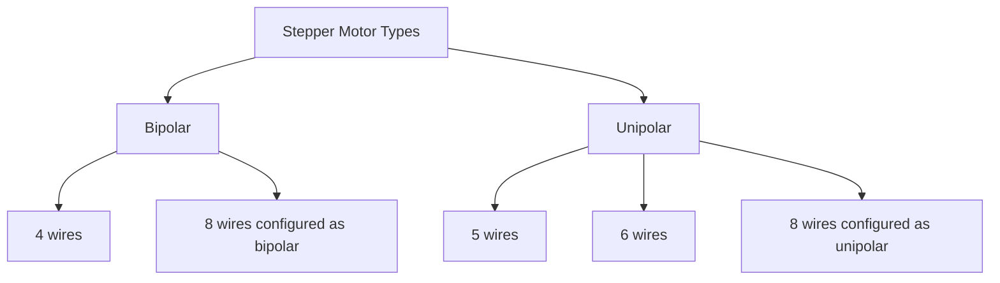

# Arduino Stepper Motors

## Introduction

Stepper motors are versatile actuators that convert electrical pulses into precise mechanical movements. Unlike regular DC motors, stepper motors rotate in discrete steps, allowing for accurate position control without requiring feedback sensors. This precise control makes them ideal for applications like 3D printers, CNC machines, camera sliders, and robotics projects.

In this tutorial, we'll explore how to use stepper motors with Arduino, from understanding the basics to implementing practical projects. By the end, you'll be able to integrate these powerful actuators into your own Arduino creations.

## What is a Stepper Motor?

A stepper motor is an electromechanical device that converts electrical pulses into discrete mechanical movements (steps). Each pulse rotates the motor shaft by a fixed angle, called a "step."

### Key Features

- **Precise Positioning**: Moves in exact increments
- **Holding Torque**: Maintains position even when stationary
- **Bidirectional**: Can rotate clockwise or counterclockwise
- **Speed Control**: Velocity determined by pulse frequency
- **No Feedback Required**: Open-loop control is possible (unlike servo motors)

## Types of Stepper Motors

There are three main types of stepper motors you'll encounter:

### 1. Permanent Magnet (PM) Stepper Motors

- Simplest design
- Lower resolution (larger step angle)
- Cost-effective

### 2. Variable Reluctance (VR) Stepper Motors

- No permanent magnet
- Requires specialized controllers
- Less common in hobbyist projects

### 3. Hybrid Stepper Motors

- Combines features of PM and VR motors
- Higher resolution (smaller step angle)
- Most common in Arduino projects

## Common Specifications

When selecting a stepper motor, consider these specifications:

- **Step Angle**: Typically 1.8° (200 steps per revolution) or 0.9° (400 steps per revolution)
- **Phases**: Usually 2-phase (4-wire) or 4-phase (5-wire)
- **Rated Current**: Maximum current per phase
- **Holding Torque**: Torque when powered but not moving
- **Detent Torque**: Resistance when unpowered
- **Size**: Often specified using NEMA standards (e.g., NEMA 17, NEMA 23)

## Stepper Motor Wiring

Most hobbyist stepper motors come in one of these configurations:

### Bipolar Stepper Motors (4 wires)

- Two coils/phases
- Requires direction change in current flow
- Needs an H-bridge driver circuit or dedicated stepper driver

### Unipolar Stepper Motors (5, 6, or 8 wires)

- Center-tapped coils
- Simpler to drive (no current reversal needed)
- 5-wire (common ground) or 6-wire (separate commons)
- 8-wire motors can be configured as either unipolar or bipolar



## Stepper Motor Drivers

While it's technically possible to connect a stepper motor directly to Arduino pins, it's not practical due to:

1. Insufficient current from Arduino pins
2. No back-EMF protection
3. Complex driving sequences required

Instead, we use dedicated stepper motor drivers like:

- **A4988**: Popular, cost-effective driver for bipolar motors
- **DRV8825**: Similar to A4988 but with higher current capacity
- **TMC2208/TMC2209**: Silent operation with advanced features
- **ULN2003**: Simple driver for unipolar motors

## Basic Connection Example

Let's see how to connect a common bipolar stepper motor with an A4988 driver:

```
Arduino ────── A4988 Driver ────── Stepper Motor
  5V ────────── VDD
  GND ───────── GND
  D8 ────────── STEP
  D9 ────────── DIR
              VMOT ─── External Power Supply (8-35V)
              GND ──── External Power Supply (GND)
              1A, 1B, 2A, 2B ─── Motor Coil Connections
```

:::note
Always use an external power supply for the motor power (VMOT). Do not power stepper motors through the Arduino's 5V output!
:::

## Basic Stepper Motor Control

Let's start with a simple example that rotates a stepper motor using the `Stepper` library included with Arduino IDE:

```cpp
#include <Stepper.h>

// Define number of steps per revolution
const int STEPS_PER_REV = 200;  // For a 1.8° motor (360/1.8 = 200)

// Initialize the stepper library on pins 8 through 11
Stepper myStepper(STEPS_PER_REV, 8, 9, 10, 11);

void setup() {
  // Set speed in RPM
  myStepper.setSpeed(60);  // 60 RPM (1 revolution per second)
}

void loop() {
  // Rotate one revolution clockwise
  myStepper.step(STEPS_PER_REV);
  delay(1000);
  
  // Rotate one revolution counterclockwise
  myStepper.step(-STEPS_PER_REV);
  delay(1000);
}
```

This example is suitable for simple unipolar motors or bipolar motors with an H-bridge circuit. It uses direct Arduino pins, which works for small motors but isn't ideal for larger ones.

## Using a Stepper Motor Driver

For most projects, you'll want to use a dedicated stepper driver. Here's how to use the popular A4988 driver:

```cpp
// Pins for A4988 driver
const int stepPin = 8;  // STEP pin
const int dirPin = 9;   // DIR pin

// Motor parameters
const int stepsPerRevolution = 200;  // For a 1.8° motor

void setup() {
  // Set pin modes
  pinMode(stepPin, OUTPUT);
  pinMode(dirPin, OUTPUT);
}

void loop() {
  // Set clockwise direction
  digitalWrite(dirPin, HIGH);
  
  // Make 200 steps (one revolution)
  for (int i = 0; i < stepsPerRevolution; i++) {
    digitalWrite(stepPin, HIGH);
    delayMicroseconds(2000);  // Speed control
    digitalWrite(stepPin, LOW);
    delayMicroseconds(2000);  // Speed control
  }
  
  delay(1000);  // Wait a second
  
  // Set counterclockwise direction
  digitalWrite(dirPin, LOW);
  
  // Make 200 steps (one revolution)
  for (int i = 0; i < stepsPerRevolution; i++) {
    digitalWrite(stepPin, HIGH);
    delayMicroseconds(1000);  // Faster speed
    digitalWrite(stepPin, LOW);
    delayMicroseconds(1000);
  }
  
  delay(1000);  // Wait a second
}
```

## Advanced Control with AccelStepper Library

The `AccelStepper` library provides more advanced features like acceleration, deceleration, and position tracking:

```cpp
#include <AccelStepper.h>

// Define pins
const int stepPin = 8;
const int dirPin = 9;

// Create stepper object
// AccelStepper::DRIVER means step/dir pins
AccelStepper stepper(AccelStepper::DRIVER, stepPin, dirPin);

void setup() {
  // Set maximum speed and acceleration
  stepper.setMaxSpeed(1000);    // Steps per second
  stepper.setAcceleration(500); // Steps per second per second
  
  // Set target position
  stepper.moveTo(1000); // Move 1000 steps
}

void loop() {
  // Run the stepper to the target position with acceleration/deceleration
  if (stepper.distanceToGo() == 0) {
    // When reaching the target, reverse direction
    stepper.moveTo(-stepper.currentPosition());
    delay(1000); // Pause for a second
  }
  
  // Step the motor once when needed
  stepper.run();
}
```

## Microstepping

Microstepping allows for smoother motion and increased position resolution by energizing the coils with intermediate current levels. Most drivers like the A4988 support microstepping modes:

```cpp
// Microstepping control pins on A4988
const int MS1 = 10;
const int MS2 = 11;
const int MS3 = 12;

void setup() {
  // Set pin modes for step, direction, and microstepping control
  pinMode(stepPin, OUTPUT);
  pinMode(dirPin, OUTPUT);
  pinMode(MS1, OUTPUT);
  pinMode(MS2, OUTPUT);
  pinMode(MS3, OUTPUT);
  
  // Set microstepping mode (Example: 1/8 microstepping)
  digitalWrite(MS1, HIGH);
  digitalWrite(MS2, HIGH);
  digitalWrite(MS3, LOW);
  
  // Microstepping modes for A4988:
  // MS1   MS2   MS3   Microstep Resolution
  // LOW   LOW   LOW   Full step (1)
  // HIGH  LOW   LOW   Half step (1/2)
  // LOW   HIGH  LOW   Quarter step (1/4)
  // HIGH  HIGH  LOW   Eighth step (1/8)
  // HIGH  HIGH  HIGH  Sixteenth step (1/16)
}
```

When using microstepping, remember to adjust your steps-per-revolution calculation accordingly. For example, in 1/16 microstepping mode, a 200-step motor will require 3200 steps for a full revolution.

## Practical Project: Simple Rotating Platform

Let's create a simple rotating display platform:

```cpp
#include <AccelStepper.h>

// Define pins for A4988 driver
const int stepPin = 8;
const int dirPin = 9;

// Platform parameters
const int STEPS_PER_REV = 200;   // Steps per revolution
const float PLATFORM_DIAMETER = 15.0;  // cm
const float ROTATION_SPEED = 2.0;      // RPM

// Create stepper object
AccelStepper stepper(AccelStepper::DRIVER, stepPin, dirPin);

void setup() {
  // Calculate speed in steps per second
  float stepsPerSecond = (ROTATION_SPEED * STEPS_PER_REV) / 60.0;
  
  // Set up the stepper
  stepper.setMaxSpeed(stepsPerSecond);
  stepper.setSpeed(stepsPerSecond);
  
  Serial.begin(9600);
  Serial.println("Rotating Platform Active");
  Serial.print("Rotation Speed: ");
  Serial.print(ROTATION_SPEED);
  Serial.println(" RPM");
}

void loop() {
  // Run the motor continuously at constant speed
  stepper.runSpeed();
}
```

## Practical Project: Digital Linear Actuator

This example moves a stepper motor back and forth like a linear actuator, using limit switches for safety:

```cpp
#include <AccelStepper.h>

// Define pins
const int stepPin = 8;
const int dirPin = 9;
const int limitSwitchStart = 2;
const int limitSwitchEnd = 3;

// Create stepper object
AccelStepper stepper(AccelStepper::DRIVER, stepPin, dirPin);

// Define positions
const long HOME_POSITION = 0;
const long END_POSITION = 8000;  // Adjust based on your setup

// Current state
bool goingHome = false;

void setup() {
  // Set maximum speed and acceleration
  stepper.setMaxSpeed(1000);
  stepper.setAcceleration(500);
  
  // Set up limit switches
  pinMode(limitSwitchStart, INPUT_PULLUP);
  pinMode(limitSwitchEnd, INPUT_PULLUP);
  
  // Home the actuator at startup
  homeActuator();
  
  // Move to end position to start
  stepper.moveTo(END_POSITION);
}

void loop() {
  // Check limit switches
  if (digitalRead(limitSwitchStart) == LOW && goingHome) {
    // Hit home limit switch
    stepper.setCurrentPosition(HOME_POSITION);
    stepper.moveTo(END_POSITION);
    goingHome = false;
  } else if (digitalRead(limitSwitchEnd) == LOW && !goingHome) {
    // Hit end limit switch
    stepper.setCurrentPosition(END_POSITION);
    stepper.moveTo(HOME_POSITION);
    goingHome = true;
  }
  
  // Run the stepper
  stepper.run();
  
  // If we've reached our target
  if (stepper.distanceToGo() == 0) {
    delay(1000);  // Wait at the end points
    
    // Toggle direction
    if (stepper.currentPosition() == HOME_POSITION) {
      stepper.moveTo(END_POSITION);
      goingHome = false;
    } else {
      stepper.moveTo(HOME_POSITION);
      goingHome = true;
    }
  }
}

void homeActuator() {
  // Move slowly towards home until limit switch is hit
  stepper.setSpeed(-100);  // Slow speed
  
  while (digitalRead(limitSwitchStart) == HIGH) {
    stepper.runSpeed();
  }
  
  // We've hit the limit switch
  stepper.setCurrentPosition(HOME_POSITION);
  stepper.setSpeed(0);
}
```

## Controlling Multiple Stepper Motors

For projects requiring multiple stepper motors, you can use multiple driver boards:

```cpp
#include <AccelStepper.h>
#include <MultiStepper.h>

// Define pins
const int stepPinX = 2;
const int dirPinX = 3;
const int stepPinY = 4;
const int dirPinY = 5;

// Create instances
AccelStepper stepperX(AccelStepper::DRIVER, stepPinX, dirPinX);
AccelStepper stepperY(AccelStepper::DRIVER, stepPinY, dirPinY);
MultiStepper steppers;

void setup() {
  // Configure each stepper
  stepperX.setMaxSpeed(1000);
  stepperY.setMaxSpeed(1000);
  
  // Add to MultiStepper
  steppers.addStepper(stepperX);
  steppers.addStepper(stepperY);
}

void loop() {
  // Array to store target positions
  long positions[2];
  
  // Move to coordinates
  positions[0] = 1000;  // X position
  positions[1] = 500;   // Y position
  steppers.moveTo(positions);
  steppers.runSpeedToPosition();
  
  delay(1000);
  
  // Move to new coordinates
  positions[0] = 0;
  positions[1] = 0;
  steppers.moveTo(positions);
  steppers.runSpeedToPosition();
  
  delay(1000);
}
```

## Troubleshooting Stepper Motors

### Common Issues and Solutions

| Problem | Possible Causes | Solutions |
|---------|----------------|-----------|
| Motor doesn't move | No power, incorrect wiring, driver issues | Check connections, ensure proper voltage |
| Motor vibrates but doesn't rotate | Incorrect sequence, insufficient current | Verify wiring order, adjust current |
| Missed steps | Too fast speed, insufficient torque | Decrease speed, increase current, check mechanical constraints |
| Motor overheating | Too high current, continuous operation | Reduce current, add cooling, use sleep mode |
| Loud noise | Resonance, high speed | Use microstepping, avoid resonant speeds |

## Power Considerations

Stepper motors require significantly more power than many other Arduino components:

- Typical NEMA 17 motor: 1-2A per phase
- Power supply voltage: 12-24V for most drivers
- Power calculation: P = V × I (e.g., 12V × 2A = 24W)

:::warning
Never power stepper motors directly from Arduino's 5V pin. Always use an external power supply with the appropriate voltage and current rating for your motors.
:::

## Advanced Concepts

### Closed-Loop Stepper Control

For high-precision applications, consider closed-loop control by adding an encoder:

```cpp
// This is a conceptual example of closed-loop control
int targetPosition = 1000;
int currentPosition = readEncoder();  // Function to read encoder

void loop() {
  currentPosition = readEncoder();
  
  if (currentPosition < targetPosition) {
    // Move forward
    moveStepperForward();
  } else if (currentPosition > targetPosition) {
    // Move backward
    moveStepperBackward();
  } else {
    // At target position, hold
    holdPosition();
  }
}
```

### Stepper Motor Calculations

Calculate steps needed for linear motion with a lead screw:

```cpp
// Lead screw calculations
float pitchMm = 8.0;  // Pitch in mm (distance per revolution)
float distanceMm = 100.0;  // Target distance in mm
int stepsPerRev = 200;  // Steps per revolution 

// Calculate required steps
int stepsRequired = (distanceMm / pitchMm) * stepsPerRev;
```

## Summary

Stepper motors are powerful actuators that enable precise position control in your Arduino projects. We've covered:

- Stepper motor fundamentals and types
- Wiring configurations and drivers
- Basic and advanced control techniques
- Practical projects and applications
- Troubleshooting common issues

With this knowledge, you should be able to integrate stepper motors into a wide variety of Arduino projects requiring precise motion control.

## Exercises

1. Modify the rotating platform example to change direction every 5 rotations.
2. Create a project that uses a potentiometer to control stepper motor speed.
3. Build a simple pen plotter using two stepper motors for X and Y axes.
4. Implement a stepper-controlled camera slider with adjustable speed.
5. Design a digital sundial that rotates according to the time of day.

## Additional Resources

- [Arduino Stepper Library Reference](https://www.arduino.cc/reference/en/libraries/stepper/)
- [AccelStepper Library Documentation](http://www.airspayce.com/mikem/arduino/AccelStepper/)
- [Stepper Motor Physics and Mathematics](https://learn.adafruit.com/all-about-stepper-motors)
- [Open Source CNC Projects](https://blog.prusaprinters.org/grbl-an-open-source-solution-for-your-diy-cnc-machine_38322/)