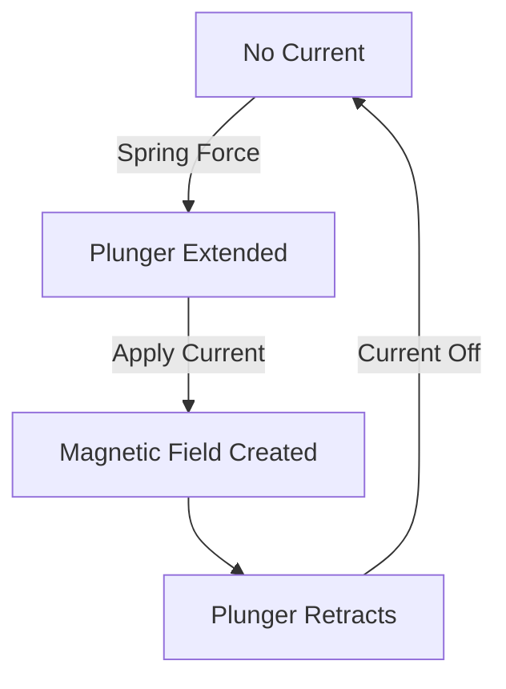

# Arduino Solenoids

## Introduction

Solenoids are electromagnetic devices that convert electrical energy into linear mechanical motion. They consist of a coil of wire wrapped around a movable iron core (plunger). When current flows through the coil, it creates a magnetic field that pulls or pushes the plunger, creating linear motion. This makes solenoids incredibly useful for applications requiring pushing, pulling, or controlling the flow of liquids or gases.

In this tutorial, we'll explore how to connect and control solenoids with Arduino, understand their working principles, and build some practical applications. Solenoids are widely used in automation, robotics, and many household devices like door locks, washing machines, and automotive systems.

## Understanding Solenoids

### How Solenoids Work

Solenoids operate based on the principle of electromagnetism. Here's a simplified explanation of how they work:

1. When no current flows through the coil, the solenoid's plunger remains in its resting position (extended or retracted, depending on the type).
2. When current flows through the coil, it creates a magnetic field.
3. This magnetic field moves the plunger (either pulling it in or pushing it out).
4. When the current stops, a spring usually returns the plunger to its original position.



### Types of Solenoids

There are several types of solenoids you might use with Arduino:

- **Pull Solenoids**: The most common type, which pulls the plunger in when energized.
- **Push Solenoids**: These push the plunger out when energized.
- **Latching Solenoids**: These require power only to change state, not to maintain it.
- **Solenoid Valves**: Special solenoids designed to control the flow of fluids or gases.

## Hardware Requirements

To follow along with this tutorial, you'll need:

- Arduino board (UNO, Nano, or similar)
- Solenoid (5V or 12V depending on your setup)
- TIP120 or similar NPN transistor, or a MOSFET
- 1N4001 or similar diode
- 1kΩ resistor
- External power supply (if using 12V solenoids)
- Breadboard and jumper wires

## Circuit Connections

Solenoids typically require more current than an Arduino pin can provide directly. Therefore, we need to use a transistor to control the solenoid. Here's how to connect everything:

1. Connect the Arduino GND to the breadboard's ground rail.
2. Connect the transistor's base to a digital pin (e.g., pin 9) through a 1kΩ resistor.
3. Connect the transistor's collector to one lead of the solenoid.
4. Connect the other lead of the solenoid to the positive voltage source.
5. Connect the transistor's emitter to ground.
6. Connect the diode across the solenoid (cathode to positive, anode to the transistor side) as a flyback diode.

If you're using a 12V solenoid:
1. Connect the external power supply's positive to the solenoid.
2. Connect the external power supply's ground to the Arduino's ground.

## Basic Solenoid Control Code

Let's start with a simple example to activate a solenoid for a short period:

```cpp
const int solenoidPin = 9;  // Digital pin connected to the base of the transistor

void setup() {
  pinMode(solenoidPin, OUTPUT);  // Set the pin as output
}

void loop() {
  // Activate the solenoid
  digitalWrite(solenoidPin, HIGH);
  delay(1000);  // Keep activated for 1 second
  
  // Deactivate the solenoid
  digitalWrite(solenoidPin, LOW);
  delay(2000);  // Wait for 2 seconds before next activation
}
```

This code will activate the solenoid for 1 second, then deactivate it for 2 seconds, in a continuous cycle.

## PWM Control for Solenoids

For some applications, you might want to control the force of the solenoid. While solenoids are typically binary devices (on or off), you can use Pulse Width Modulation (PWM) to control the average power delivered to the solenoid:

```cpp
const int solenoidPin = 9;  // PWM-capable pin

void setup() {
  pinMode(solenoidPin, OUTPUT);
}

void loop() {
  // Gradually increase power
  for (int power = 0; power <= 255; power += 5) {
    analogWrite(solenoidPin, power);
    delay(50);
  }
  
  // Hold at full power
  delay(1000);
  
  // Gradually decrease power
  for (int power = 255; power >= 0; power -= 5) {
    analogWrite(solenoidPin, power);
    delay(50);
  }
  
  // Keep off for a while
  delay(2000);
}
```

**Note**: PWM control works better for some solenoids than others. Many solenoids need a minimum threshold current to activate, so gradual control might not be effective for all solenoids.

## Button-Controlled Solenoid Example

Let's create a more interactive example where a button press activates the solenoid:

```cpp
const int solenoidPin = 9;  // Digital pin for solenoid
const int buttonPin = 2;    // Digital pin for button

int buttonState = 0;        // Variable to store button state

void setup() {
  pinMode(solenoidPin, OUTPUT);
  pinMode(buttonPin, INPUT_PULLUP);  // Using internal pull-up resistor
}

void loop() {
  // Read the button state
  buttonState = digitalRead(buttonPin);
  
  // If button is pressed (LOW because of pull-up resistor)
  if (buttonState == LOW) {
    digitalWrite(solenoidPin, HIGH);  // Activate solenoid
  } else {
    digitalWrite(solenoidPin, LOW);   // Deactivate solenoid
  }
  
  // Small delay to debounce
  delay(10);
}
```

## Solenoid Valve Water Control Example

Solenoid valves are special solenoids used to control the flow of liquids or gases. Here's an example of using a soil moisture sensor to control a water solenoid valve for an automated plant watering system:

```cpp
const int solenoidPin = 9;     // Digital pin for solenoid valve
const int moistureSensorPin = A0;  // Analog pin for moisture sensor
const int dryThreshold = 500;   // Adjust based on your sensor and soil

void setup() {
  pinMode(solenoidPin, OUTPUT);
  Serial.begin(9600);  // Initialize serial communication
}

void loop() {
  // Read the moisture level
  int moistureLevel = analogRead(moistureSensorPin);
  
  // Print the moisture level to serial monitor
  Serial.print("Moisture level: ");
  Serial.println(moistureLevel);
  
  // If soil is dry, open the valve
  if (moistureLevel > dryThreshold) {
    Serial.println("Soil is dry - Watering plants...");
    digitalWrite(solenoidPin, HIGH);  // Open valve
    delay(3000);  // Water for 3 seconds
    digitalWrite(solenoidPin, LOW);   // Close valve
    
    // Wait longer before checking again after watering
    delay(30000);  // 30 seconds
  } else {
    Serial.println("Soil is moist - No watering needed");
    delay(10000);  // Check again in 10 seconds
  }
}
```

## Electronic Door Lock Example

Solenoids are commonly used in electronic door locks. Here's an example using a keypad to control a door lock solenoid:

```cpp
#include <Keypad.h>

const int solenoidPin = 9;  // Digital pin for door lock solenoid

// Define the keypad
const byte ROWS = 4;
const byte COLS = 3;
char keys[ROWS][COLS] = {
  {'1','2','3'},
  {'4','5','6'},
  {'7','8','9'},
  {'*','0','#'}
};
byte rowPins[ROWS] = {5, 4, 3, 2}; // Connect to the row pinouts of the keypad
byte colPins[COLS] = {8, 7, 6};    // Connect to the column pinouts of the keypad

Keypad keypad = Keypad(makeKeymap(keys), rowPins, colPins, ROWS, COLS);

// Define the password
char correctPassword[] = "1234";
char enteredPassword[5]; // 4 digits + null terminator
int passwordIndex = 0;

void setup() {
  pinMode(solenoidPin, OUTPUT);
  Serial.begin(9600);
  Serial.println("Electronic Door Lock");
  Serial.println("Enter 4-digit PIN:");
}

void loop() {
  char key = keypad.getKey();
  
  if (key) {
    // If # is pressed, check the password
    if (key == '#') {
      enteredPassword[passwordIndex] = '\0'; // Null terminate
      
      // Check if password is correct
      if (strcmp(enteredPassword, correctPassword) == 0) {
        Serial.println("Access Granted!");
        unlockDoor();
      } else {
        Serial.println("Access Denied!");
      }
      
      // Reset for next entry
      passwordIndex = 0;
      Serial.println("Enter 4-digit PIN:");
    }
    // If * is pressed, reset entry
    else if (key == '*') {
      passwordIndex = 0;
      Serial.println("Entry Reset");
      Serial.println("Enter 4-digit PIN:");
    }
    // Otherwise add digit to password
    else if (passwordIndex < 4) {
      enteredPassword[passwordIndex++] = key;
      Serial.print("*");  // Print asterisk for security
    }
  }
}

void unlockDoor() {
  digitalWrite(solenoidPin, HIGH); // Unlock the door
  delay(5000);                     // Keep unlocked for 5 seconds
  digitalWrite(solenoidPin, LOW);  // Lock the door
}
```

## Tips and Best Practices

1. **Always Use a Flyback Diode**: Solenoids are inductive loads that can generate voltage spikes when switched off. A diode across the solenoid protects your circuitry.

2. **Use External Power for Larger Solenoids**: Most solenoids require more current than Arduino can provide. Use an external power supply and ensure all grounds are connected.

3. **Choose the Right Transistor**: For small solenoids, a TIP120 or similar NPN transistor works well. For larger solenoids, consider using a MOSFET like the IRF540.

4. **Consider Duty Cycle**: Solenoids can heat up if activated for too long. Check the specifications of your solenoid for recommended duty cycles.

5. **Add Capacitors for Noise Reduction**: If you experience erratic behavior, add a 100nF ceramic capacitor across the solenoid to reduce electromagnetic interference.

## Troubleshooting

If your solenoid isn't working:

1. **Check Power Supply**: Ensure your power supply can provide enough current for the solenoid.
2. **Verify Connections**: Double-check all wiring, especially the flyback diode orientation.
3. **Test the Circuit**: Measure voltage across the solenoid when activated.
4. **Check Transistor Selection**: Ensure your transistor can handle the solenoid's current requirements.
5. **Listen for Clicking**: Most solenoids make an audible click when activated, even if the plunger doesn't move much.

## Practical Applications

Solenoids have numerous applications, including:

1. **Home Automation**: Door locks, curtain controls, and valve systems.
2. **Robotics**: Grippers, pneumatic control, and mechanical actuators.
3. **Industrial Automation**: Assembly line mechanisms and sorting systems.
4. **Art Installations**: Interactive exhibits and kinetic sculptures.
5. **Musical Instruments**: Electronic percussion and mechanical sound generators.

## Summary

Solenoids are versatile actuators that convert electrical energy into linear motion, making them incredibly useful for a wide range of Arduino projects. In this tutorial, we've covered:

- The basic principles of how solenoids work
- Different types of solenoids
- How to properly connect solenoids to Arduino
- Basic control and PWM techniques
- Real-world applications including valve control and electronic locks

As you get more comfortable with solenoids, you'll find they're an essential tool in your Arduino actuator toolkit, enabling you to build projects that physically interact with the world.

## Further Learning

To continue learning about Arduino and solenoids:

1. Experiment with different types of solenoids (push, pull, latching).
2. Try combining solenoids with sensors to create reactive systems.
3. Build a project that uses multiple solenoids in sequence, like a simple robotic arm.
4. Explore using shift registers to control multiple solenoids with fewer Arduino pins.
5. Learn about H-bridge circuits to control bidirectional solenoids.

## Exercises

1. **Basic Exercise**: Modify the button-controlled solenoid example to add a delay after pressing the button before the solenoid deactivates.

2. **Intermediate Exercise**: Create a sequencer that activates multiple solenoids in a pattern, like a simple drum machine.

3. **Advanced Exercise**: Build a solenoid-controlled sorting system that moves items based on input from a color or distance sensor.