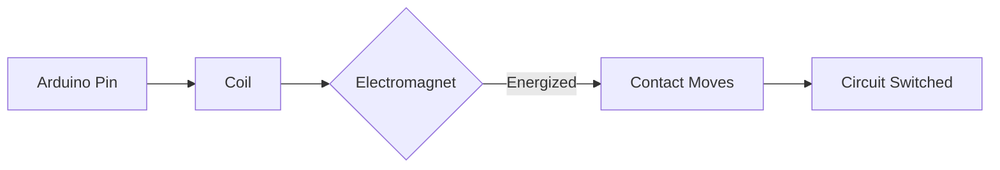
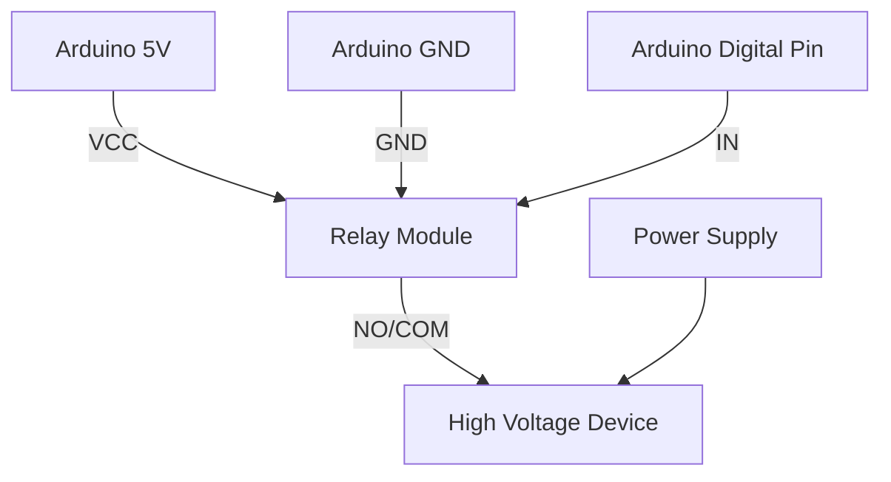

# Arduino Relays

## Introduction

Relays are electromechanical switches that allow your Arduino to control high-voltage or high-current devices that would otherwise be impossible to operate with the Arduino's limited output capabilities. Think of relays as bridges between your low-voltage Arduino world and the high-power devices around you like lamps, motors, appliances, or industrial equipment.

In this tutorial, you'll learn:
- What relays are and how they work
- How to connect relays to your Arduino
- How to program your Arduino to control relays
- Real-world applications and project ideas

## What is a Relay?

A relay is essentially an electrically operated switch. It uses a small voltage (from the Arduino) to control a much larger voltage or current circuit. This isolation between the control circuit and the switched circuit is what makes relays particularly useful and safe.

### How Relays Work

Relays operate on a simple principle:



1. When you send a signal from your Arduino, it energizes an electromagnet (the coil)
2. This electromagnet attracts a mechanical switch (contacts)
3. The movement of this switch either connects or disconnects the external circuit
4. When the signal stops, a spring pulls the switch back to its original position

### Types of Relays for Arduino

For Arduino projects, you'll typically encounter these types of relay modules:

1. **Single Channel Relay Modules** - Control one device
2. **Multi-Channel Relay Modules** - Control multiple devices (2, 4, 8, or 16 channels)
3. **Solid State Relays (SSR)** - Electronic versions without moving parts

## Connecting a Relay to Arduino

Let's start with a simple example using a standard single-channel relay module.

### Components Needed:
- Arduino board (Uno, Nano, etc.)
- Relay module (single channel for beginners)
- Jumper wires
- Device to control (e.g., a lamp)
- Power supply for the device

### Wiring Diagram

Here's how to connect a typical relay module to your Arduino:



### Basic Connections:

1. **VCC** of relay module → **5V** on Arduino
2. **GND** of relay module → **GND** on Arduino
3. **IN** (or Signal) of relay module → Any **digital pin** on Arduino (e.g., pin 7)

For the high-voltage side:
- Connect your device between the **COM** (Common) terminal and power supply
- Use **NO** (Normally Open) if you want the device OFF by default
- Use **NC** (Normally Closed) if you want the device ON by default

**⚠️ SAFETY WARNING:** When working with high voltage (like household AC power), extreme caution is required. If you're a beginner, start with low-voltage DC devices until you're comfortable with relay operation.

## Programming Arduino to Control Relays

Now let's write code to control our relay. The basic principle is simple: when you send a HIGH signal to the relay module, it activates; when you send a LOW signal, it deactivates.

However, some relay modules are "active-low," meaning they activate with a LOW signal. Check your module's documentation if you're unsure.

### Basic Relay Control Example

```cpp
const int relayPin = 7;  // Define the Arduino pin connected to relay

void setup() {
  pinMode(relayPin, OUTPUT);  // Set the relay pin as an output
  digitalWrite(relayPin, LOW);  // Initialize relay in OFF state
}

void loop() {
  digitalWrite(relayPin, HIGH);  // Turn relay ON
  delay(3000);                   // Wait for 3 seconds
  digitalWrite(relayPin, LOW);   // Turn relay OFF
  delay(3000);                   // Wait for 3 seconds
}
```

This simple program will turn the relay on for 3 seconds, then off for 3 seconds, creating a continuous cycle.

### Example with Button Control

Let's create a more interactive example that uses a button to toggle the relay state:

```cpp
const int relayPin = 7;    // Relay control pin
const int buttonPin = 2;   // Button input pin
int relayState = LOW;      // Current state of the relay
int lastButtonState = HIGH; // Previous state of the button (assuming pull-up resistor)
int buttonState;           // Current reading from button

// Debounce variables
unsigned long lastDebounceTime = 0;
unsigned long debounceDelay = 50; // Adjust if needed

void setup() {
  pinMode(relayPin, OUTPUT);
  pinMode(buttonPin, INPUT_PULLUP); // Using internal pull-up resistor
  digitalWrite(relayPin, relayState); // Initialize relay state
}

void loop() {
  // Read the button state
  int reading = digitalRead(buttonPin);

  // Check if button state changed
  if (reading != lastButtonState) {
    lastDebounceTime = millis();
  }

  // Check if enough time has passed for debounce
  if ((millis() - lastDebounceTime) > debounceDelay) {
    // If button state has changed
    if (reading != buttonState) {
      buttonState = reading;

      // If button is pressed (LOW with pull-up resistor)
      if (buttonState == LOW) {
        // Toggle relay state
        relayState = !relayState;
        digitalWrite(relayPin, relayState);
      }
    }
  }

  lastButtonState = reading;
}
```

This program includes button debouncing to prevent multiple triggers from a single press, which is important for reliable operation.

## Working with Multiple Relays

Often, you'll need to control multiple devices independently. Here's how to use a 4-channel relay module:

```cpp
// Define relay pins
const int relay1 = 7;
const int relay2 = 6;
const int relay3 = 5;
const int relay4 = 4;

void setup() {
  // Set all relay pins as outputs
  pinMode(relay1, OUTPUT);
  pinMode(relay2, OUTPUT);
  pinMode(relay3, OUTPUT);
  pinMode(relay4, OUTPUT);
  
  // Initialize all relays to OFF
  digitalWrite(relay1, LOW);
  digitalWrite(relay2, LOW);
  digitalWrite(relay3, LOW);
  digitalWrite(relay4, LOW);
  
  // Start serial communication for control
  Serial.begin(9600);
  Serial.println("Relay Control System");
  Serial.println("Enter 1-4 to toggle a relay");
}

void loop() {
  // Check if data is available to read
  if (Serial.available() > 0) {
    // Read the incoming byte
    char input = Serial.read();
    
    // Control relay based on input
    switch (input) {
      case '1':
        toggleRelay(relay1, "Relay 1");
        break;
      case '2':
        toggleRelay(relay2, "Relay 2");
        break;
      case '3':
        toggleRelay(relay3, "Relay 3");
        break;
      case '4':
        toggleRelay(relay4, "Relay 4");
        break;
    }
  }
}

// Function to toggle relay state
void toggleRelay(int pin, String name) {
  // Read current state and toggle
  int state = digitalRead(pin);
  digitalWrite(pin, !state);
  
  // Report back via serial
  Serial.print(name);
  Serial.println(!state == HIGH ? " turned ON" : " turned OFF");
}
```

This code allows you to control each relay individually by typing numbers 1-4 in the Serial Monitor.

## Real-World Applications

Now that you understand the basics, let's explore some practical applications for Arduino-controlled relays:

### 1. Home Automation

Create a smart home system that controls:
- Lights based on time of day or motion detection
- Fans or air conditioners based on temperature sensors
- Window blinds based on light levels

Example code for temperature-based fan control:

```cpp
#include <DHT.h>

#define DHTPIN 2        // Pin connected to DHT sensor
#define DHTTYPE DHT11   // DHT sensor type
#define RELAY_PIN 7     // Pin connected to relay

DHT dht(DHTPIN, DHTTYPE);
float tempThreshold = 25.0; // Turn on fan at 25°C

void setup() {
  pinMode(RELAY_PIN, OUTPUT);
  digitalWrite(RELAY_PIN, LOW); // Start with fan off
  
  Serial.begin(9600);
  dht.begin();
  Serial.println("Temperature-controlled fan system initialized");
}

void loop() {
  // Read temperature
  float temperature = dht.readTemperature();
  
  // Check if reading is valid
  if (isnan(temperature)) {
    Serial.println("Failed to read from DHT sensor!");
    delay(2000);
    return;
  }
  
  Serial.print("Temperature: ");
  Serial.print(temperature);
  Serial.println("°C");
  
  // Control fan based on temperature
  if (temperature > tempThreshold) {
    digitalWrite(RELAY_PIN, HIGH); // Turn fan on
    Serial.println("Fan ON");
  } else {
    digitalWrite(RELAY_PIN, LOW); // Turn fan off
    Serial.println("Fan OFF");
  }
  
  delay(5000); // Check every 5 seconds
}
```

### 2. Irrigation Systems

Build an automated plant watering system:

```cpp
const int moistureSensorPin = A0; // Analog pin for soil moisture sensor
const int relayPin = 7;           // Digital pin controlling water pump relay
const int dryThreshold = 500;     // Adjust based on your sensor readings
const int wetThreshold = 300;     // Adjust based on your sensor readings

void setup() {
  pinMode(relayPin, OUTPUT);
  digitalWrite(relayPin, LOW); // Ensure pump is off at startup
  
  Serial.begin(9600);
  Serial.println("Automated Irrigation System");
}

void loop() {
  // Read soil moisture
  int moistureLevel = analogRead(moistureSensorPin);
  
  // Print current moisture level
  Serial.print("Soil Moisture: ");
  Serial.println(moistureLevel);
  
  // Control water pump
  if (moistureLevel > dryThreshold) {
    // Soil is too dry, turn on pump
    digitalWrite(relayPin, HIGH);
    Serial.println("Watering plants...");
  } 
  else if (moistureLevel < wetThreshold) {
    // Soil is wet enough, turn off pump
    digitalWrite(relayPin, LOW);
    Serial.println("Soil moisture adequate");
  }
  
  delay(30000); // Check every 30 seconds
}
```

### 3. Timer-Based Systems

Create devices that operate on schedules:

```cpp
#include <RTClib.h>

RTC_DS3231 rtc;
const int relayPin = 7;

// Define on and off times (24-hour format)
const int onHour = 8;   // 8:00 AM
const int onMinute = 0;
const int offHour = 18; // 6:00 PM
const int offMinute = 0;

void setup() {
  Serial.begin(9600);
  pinMode(relayPin, OUTPUT);
  digitalWrite(relayPin, LOW);
  
  // Initialize RTC
  if (!rtc.begin()) {
    Serial.println("Couldn't find RTC");
    while (1);
  }
  
  // Set the RTC to the date & time on PC this sketch was compiled
  // Uncomment once to set time, then comment out and re-upload
  // rtc.adjust(DateTime(F(__DATE__), F(__TIME__)));
  
  Serial.println("Timer-based relay control system ready");
}

void loop() {
  DateTime now = rtc.now();
  
  Serial.print("Current time: ");
  Serial.print(now.hour(), DEC);
  Serial.print(':');
  Serial.print(now.minute(), DEC);
  Serial.print(':');
  Serial.println(now.second(), DEC);
  
  // Check if current time matches on time
  if (now.hour() == onHour && now.minute() == onMinute && now.second() == 0) {
    digitalWrite(relayPin, HIGH);
    Serial.println("Device turned ON");
  }
  
  // Check if current time matches off time
  if (now.hour() == offHour && now.minute() == offMinute && now.second() == 0) {
    digitalWrite(relayPin, LOW);
    Serial.println("Device turned OFF");
  }
  
  delay(1000); // Check every second
}
```

## Advanced Topics: Working with AC Power

When controlling AC-powered devices like household appliances, additional safety considerations are crucial:

1. **Use proper enclosures** - All high-voltage wiring should be enclosed
2. **Install fuses** - For overcurrent protection
3. **Follow electrical codes** - Be aware of local regulations
4. **Use rated components** - Ensure your relay is rated for the voltage and current
5. **Consider solid-state relays** for frequent switching

**⚠️ IMPORTANT SAFETY WARNING:** Working with household AC electricity can be dangerous and potentially fatal. If you're not experienced with electrical work, consult a licensed electrician or start with low-voltage DC projects.

## Troubleshooting Relay Circuits

Common issues and solutions:

| Problem | Possible Causes | Solutions |
|---------|----------------|-----------|
| Relay doesn't switch | - Incorrect wiring<br />- Insufficient current<br />- Failed relay | - Double-check connections<br />- Use external power for relay module<br />- Test with direct 5V |
| Relay chatters | - Unstable power<br />- Code issues | - Add capacitor to power<br />- Check for logic errors in code |
| Arduino resets when relay activates | - Power spike/dip<br />- Insufficient power supply | - Use separate power source for relay<br />- Add flyback diode if not built-in |
| Relay works intermittently | - Bad connections<br />- Interference | - Check all wires<br />- Add capacitors to filter noise |

## Summary

Relays are powerful components that extend your Arduino's capabilities to control high-power devices. In this tutorial, you've learned:

1. The basics of how relays work as electrically controlled switches
2. How to connect relay modules to your Arduino
3. How to write code for basic relay control, button-triggered control, and multi-relay systems
4. Real-world applications including home automation, irrigation, and timer-based systems
5. Important safety considerations when working with high-voltage circuits

With this knowledge, you can now incorporate relays into your Arduino projects to control a wide range of devices, from small DC motors to household appliances (with proper safety precautions).

## Exercises for Practice

1. **Basic Control**: Build a simple lamp controller that turns on and off at set intervals.
2. **Interactive Control**: Create a system where a potentiometer controls how long a relay stays on.
3. **Sensor Integration**: Design a project where a relay activates based on sensor readings (light, temperature, sound, etc.).
4. **Multi-Relay Sequencer**: Program a sequence of relays to activate in patterns (like running lights).
5. **Web Control**: Add an Ethernet or WiFi shield to control relays through a web interface.

## Additional Resources

- Arduino's official documentation on digital I/O
- Manufacturers' datasheets for your specific relay modules
- Online communities like Arduino Forums and Stack Exchange for project ideas
- Books on electronics fundamentals to better understand relay operation in circuits

Remember, relays open up a world of possibilities for controlling high-power devices with your Arduino. Start with simple projects, prioritize safety, and gradually work your way up to more complex systems.