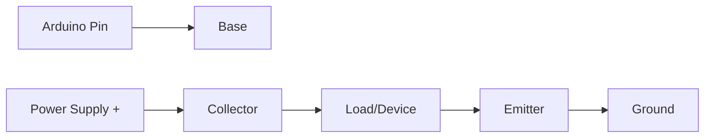

# Arduino Transistors

## Introduction

Transistors are fundamental electronic components that serve as the building blocks of modern electronics. When working with Arduino projects, transistors allow you to control high-power devices that your Arduino couldn't power directly. Think of transistors as electronic switches or amplifiers that can be controlled with small electrical signals from your Arduino pins.

In this guide, we'll explore how to use transistors with Arduino, understand their working principles, and implement practical projects that demonstrate their capabilities.

## What is a Transistor?

A transistor is a semiconductor device used to amplify or switch electronic signals. For Arduino projects, we primarily use transistors as switches to control devices that require more power than an Arduino pin can provide (which is typically limited to around 40mA).

There are two main types of transistors you'll encounter in Arduino projects:

1. **Bipolar Junction Transistors (BJTs)** - These have three pins: Collector, Base, and Emitter
2. **Metal-Oxide-Semiconductor Field-Effect Transistors (MOSFETs)** - These have three pins: Drain, Gate, and Source

## BJT Transistors with Arduino

### Understanding BJT Transistors

BJT transistors come in two varieties:
- **NPN** - The most commonly used type with Arduino
- **PNP** - Used in specific applications

For an NPN transistor, when you apply a small current to the base pin, it allows a much larger current to flow from collector to emitter.



### Basic BJT Circuit with Arduino

Let's build a simple circuit to control an LED using a transistor:

```
Arduino Pin 9 ---[ 1kΩ Resistor ]--- Base of NPN Transistor (2N2222)
                                       |
                                       |
5V Power Supply --------------------- Collector
                                       |
                                       |
                                     LED
                                       |
                                       |
Ground ----------------------------- Emitter
```

Here's the code to control this circuit:

```cpp
const int transistorPin = 9;  // Connect to the base of the transistor

void setup() {
  pinMode(transistorPin, OUTPUT);
}

void loop() {
  // Turn on the transistor
  digitalWrite(transistorPin, HIGH);
  delay(1000);
  
  // Turn off the transistor
  digitalWrite(transistorPin, LOW);
  delay(1000);
}
```

### Controlling a Motor with BJT

One common application is controlling DC motors, which typically draw more current than an Arduino can supply directly:

```cpp
const int motorPin = 9;  // Connect to the base of the transistor

void setup() {
  pinMode(motorPin, OUTPUT);
}

void loop() {
  // Gradually increase motor speed
  for (int speed = 0; speed <= 255; speed++) {
    analogWrite(motorPin, speed);
    delay(10);
  }
  
  // Gradually decrease motor speed
  for (int speed = 255; speed >= 0; speed--) {
    analogWrite(motorPin, speed);
    delay(10);
  }
  
  delay(1000);
}
```

When using this code, connect your circuit as follows:

```
Arduino Pin 9 ---[ 1kΩ Resistor ]--- Base of NPN Transistor
                                       |
                                       |
External Power Supply (+) ------------ Collector
                                       |
                                       |
                                     Motor
                                       |
                                       |
External Power Supply (-) ------------ Emitter
                                     & Arduino GND
```

**Note:** For controlling motors, you should also add a flyback diode across the motor terminals to protect your circuit from voltage spikes.

## MOSFET Transistors with Arduino

### Understanding MOSFETs

MOSFETs are voltage-controlled transistors that are ideal for handling higher power devices. They're commonly used when you need to control devices that draw substantial current.

The key advantage of MOSFETs is their very low resistance when fully turned on (known as R<sub>DS(on)</sub>), which means they generate less heat than BJTs when controlling high-current loads.

### Basic MOSFET Circuit with Arduino

Let's use an N-channel MOSFET (like the popular IRL540N or IRLZ44N) to control a 12V LED strip:

```
Arduino Pin 9 ---[ 220Ω Resistor ]--- Gate of MOSFET
                                        |
12V Power Supply -------------------- Drain
                                        |
                                    LED Strip
                                        |
                                        |
Ground ------------------------------ Source
                                     & Arduino GND
```

Here's the code to control the LED strip with PWM for brightness control:

```cpp
const int mosfetPin = 9;  // Connect to the gate of the MOSFET

void setup() {
  pinMode(mosfetPin, OUTPUT);
}

void loop() {
  // Fade in
  for (int brightness = 0; brightness <= 255; brightness++) {
    analogWrite(mosfetPin, brightness);
    delay(10);
  }
  
  // Stay at full brightness
  delay(1000);
  
  // Fade out
  for (int brightness = 255; brightness >= 0; brightness--) {
    analogWrite(mosfetPin, brightness);
    delay(10);
  }
  
  // Stay off
  delay(1000);
}
```

## Practical Project: Temperature-Controlled Fan

Let's build a practical project that uses a transistor to control a fan based on temperature readings:

### Components Needed:
- Arduino
- TMP36 temperature sensor
- 2N2222 NPN transistor
- 1kΩ resistor
- Small DC fan (5-12V)
- External power supply for the fan
- Breadboard and wires

### Circuit Connections:

```
TMP36 Pin 1 (left) ------------ 5V
TMP36 Pin 2 (middle) --------- A0
TMP36 Pin 3 (right) ---------- GND

Arduino Pin 9 ---[ 1kΩ Resistor ]--- Base of 2N2222
                                       |
External Power Supply (+) ------------ Collector
                                       |
                                      Fan
                                       |
External Power Supply (-) ------------ Emitter
                                     & Arduino GND
```

### Code:

```cpp
const int tempPin = A0;       // Temperature sensor pin
const int transistorPin = 9;  // Transistor base pin
const float threshold = 25.0; // Temperature threshold in Celsius

void setup() {
  pinMode(transistorPin, OUTPUT);
  Serial.begin(9600);
}

void loop() {
  // Read temperature
  int sensorValue = analogRead(tempPin);
  
  // Convert to voltage
  float voltage = sensorValue * (5.0 / 1023.0);
  
  // Convert to temperature in Celsius
  // TMP36 outputs 10mV per degree with a 500mV offset
  float temperatureC = (voltage - 0.5) * 100;
  
  Serial.print("Temperature: ");
  Serial.print(temperatureC);
  Serial.println(" °C");
  
  // Control fan based on temperature
  if (temperatureC > threshold) {
    // Calculate fan speed based on how much the temperature exceeds the threshold
    // Map temperature range of threshold to (threshold+10) to PWM range of 100-255
    int fanSpeed = map(constrain(temperatureC, threshold, threshold + 10),
                       threshold, threshold + 10, 100, 255);
    
    analogWrite(transistorPin, fanSpeed);
    Serial.print("Fan speed: ");
    Serial.println(fanSpeed);
  } else {
    digitalWrite(transistorPin, LOW); // Turn off fan
    Serial.println("Fan OFF");
  }
  
  delay(1000); // Wait a second before checking again
}
```

## Using a Transistor Array (ULN2003)

For projects where you need to control multiple high-current devices, a transistor array like the ULN2003 is extremely useful. It contains seven NPN Darlington pairs with common emitters and built-in protection diodes.

### Controlling Multiple LEDs with ULN2003:

```cpp
// Define the pins connected to the ULN2003
const int numPins = 4;
const int inputPins[numPins] = {2, 3, 4, 5};

void setup() {
  // Set all the control pins as OUTPUT
  for (int i = 0; i < numPins; i++) {
    pinMode(inputPins[i], OUTPUT);
    digitalWrite(inputPins[i], LOW); // Start with all OFF
  }
}

void loop() {
  // Light sequence pattern
  for (int i = 0; i < numPins; i++) {
    digitalWrite(inputPins[i], HIGH); // Turn on current LED
    delay(200);
    digitalWrite(inputPins[i], LOW);  // Turn off current LED
  }
  
  // Reverse direction
  for (int i = numPins - 2; i >= 0; i--) {
    digitalWrite(inputPins[i], HIGH); // Turn on current LED
    delay(200);
    digitalWrite(inputPins[i], LOW);  // Turn off current LED
  }
  
  // All on then all off
  for (int i = 0; i < numPins; i++) {
    digitalWrite(inputPins[i], HIGH);
    delay(100);
  }
  
  delay(500);
  
  for (int i = 0; i < numPins; i++) {
    digitalWrite(inputPins[i], LOW);
    delay(100);
  }
  
  delay(500);
}
```

## Common Transistor Questions and Issues

### Why Do I Need a Base Resistor?
A resistor between the Arduino pin and the transistor base limits the current flowing into the base, protecting both the Arduino and the transistor. Without it, you could damage your components.

### How to Choose the Right Transistor?
Consider these factors:
- **Current requirements**: Check the collector current (I<sub>C</sub>) for BJTs or drain current (I<sub>D</sub>) for MOSFETs
- **Voltage requirements**: Check V<sub>CE</sub> for BJTs or V<sub>DS</sub> for MOSFETs
- **Switching speed**: Important for high-frequency applications
- **Power dissipation**: Consider heat management for high-power applications

### My Transistor is Getting Hot
This usually indicates either:
1. The transistor is handling too much current for its rating
2. It's not fully switched on (operating in the linear region)
3. You need a heatsink for your application

### Choosing Between BJT and MOSFET
- **Use BJT when**: You need a simple switch for low to medium power applications
- **Use MOSFET when**: You're controlling high-current loads, need high efficiency, or working with logic-level signals

## Summary

Transistors are versatile components that extend your Arduino's capabilities by allowing it to control high-power devices. In this guide, we've covered:

- The basics of BJT and MOSFET transistors
- How to connect transistors to Arduino
- Controlling LEDs and motors with transistors
- Building a practical temperature-controlled fan
- Using transistor arrays for multiple devices
- Common issues and their solutions

Remember that when working with higher voltages or currents, safety should be your primary concern. Always double-check your connections and ensure that your transistor is rated for your application.

## Exercises

1. **Basic Switch**: Modify the LED example to turn on the LED when a button is pressed.
2. **PWM Control**: Create a circuit that uses a potentiometer to control the brightness of a 12V LED strip using a MOSFET.
3. **Motor Control Challenge**: Build a circuit that controls the direction of a DC motor using two transistors.
4. **Relay Alternative**: Design a high-power switching circuit using a MOSFET that could replace a relay in applications where silent operation is required.

## Next Steps

After mastering transistors, you might want to explore:
- H-bridge circuits for bidirectional motor control
- Optocouplers for electrically isolated switching
- Power MOSFETs for controlling very high current devices
- Darlington pairs for high-gain applications