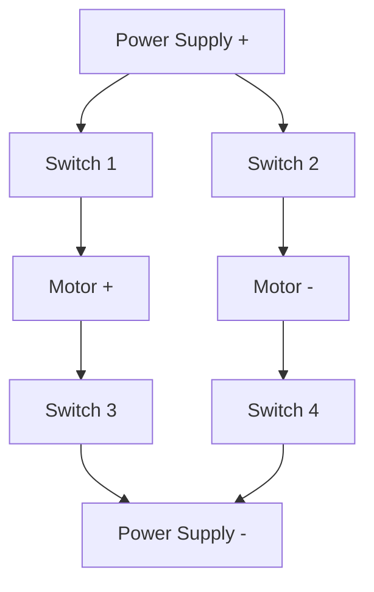
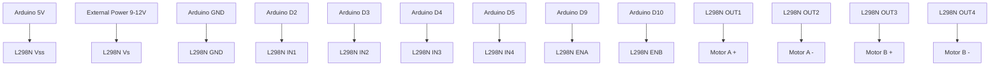

# Arduino Motor Drivers

## Introduction

Motors are essential components in robotics, automation, and many DIY projects. However, most motors require more power than an Arduino can provide directly through its pins. This is where **motor drivers** come in - specialized circuits that act as intermediaries between your Arduino and motors, enabling you to control high-power motors using low-power control signals.

In this tutorial, we'll explore different types of motor drivers for Arduino, how they work, and how to use them in your projects. By the end, you'll be able to select the appropriate motor driver for your needs and implement motor control in your Arduino projects.

## Why Motor Drivers are Necessary

Arduino pins can typically source or sink only about 20-40mA of current, with an absolute maximum of 5V output. Most motors require:

- Higher voltage (6V, 12V, 24V, or more)
- Much higher current (100mA to several amps)

Attempting to connect a motor directly to an Arduino pin could:
1. Damage your Arduino due to excessive current draw
2. Fail to provide enough power to run the motor effectively
3. Offer no protection against voltage spikes generated by motors

Additionally, motors often need bidirectional control (forward/reverse), variable speed, or precise positioning - capabilities that motor drivers help implement.

## Types of Motor Drivers

Let's explore the most common types of motor drivers used with Arduino:

### 1. H-Bridge Motor Drivers

The H-Bridge is a fundamental circuit configuration for DC motor control that allows:
- Bidirectional control (forward/reverse)
- Speed control (via PWM)
- Braking capability



#### How It Works

By controlling four switches (typically MOSFETs or transistors) in specific combinations:

| Switch 1 | Switch 2 | Switch 3 | Switch 4 | Motor Action |
|----------|----------|----------|----------|--------------|
| ON       | OFF      | OFF      | ON       | Forward      |
| OFF      | ON       | ON       | OFF      | Reverse      |
| OFF      | OFF      | OFF      | OFF      | Coast (free) |
| ON       | ON       | OFF      | OFF      | Brake        |
| OFF      | OFF      | ON       | ON       | Brake        |

Popular H-Bridge ICs include:
- L293D (Dual H-Bridge, up to 600mA per motor)
- L298N (Dual H-Bridge, up to 2A per motor)
- TB6612FNG (Dual H-Bridge, up to 1.2A per motor)

#### L293D Example

The L293D is a beginner-friendly motor driver capable of controlling two DC motors:

```
   +-----+
---|1  16|---
---|2  15|---
---|3  14|---
---|4  13|---
---|5  12|---
---|6  11|---
---|7  10|---
---|8   9|---
   +-----+
```

Let's create a simple circuit to control a DC motor with L293D:

```
Arduino 5V    -> L293D pin 16 (Vss)
Arduino GND   -> L293D pin 8 (GND)
Motor Power   -> L293D pin 8 (Vs)
Arduino D2    -> L293D pin 2 (Input 1)
Arduino D3    -> L293D pin 7 (Input 2)
Motor Terminal -> L293D pin 3 (Output 1)
Motor Terminal -> L293D pin 6 (Output 2)
```

Here's the code to control a DC motor with L293D:

```cpp
// L293D Motor Driver Example

// Motor control pins
const int motorPin1 = 2;  // L293D Input 1
const int motorPin2 = 3;  // L293D Input 2
const int enablePin = 9;  // L293D Enable pin for PWM speed control

void setup() {
  // Set all the motor control pins as outputs
  pinMode(motorPin1, OUTPUT);
  pinMode(motorPin2, OUTPUT);
  pinMode(enablePin, OUTPUT);
}

void loop() {
  // Turn motor forward at full speed
  motorForward(255);
  delay(2000);
  
  // Turn motor forward at half speed
  motorForward(127);
  delay(2000);
  
  // Turn motor in reverse at full speed
  motorReverse(255);
  delay(2000);
  
  // Stop motor
  motorStop();
  delay(2000);
}

// Function to run motor forward
void motorForward(int speed) {
  digitalWrite(motorPin1, HIGH);
  digitalWrite(motorPin2, LOW);
  analogWrite(enablePin, speed);  // Speed control (0-255)
}

// Function to run motor in reverse
void motorReverse(int speed) {
  digitalWrite(motorPin1, LOW);
  digitalWrite(motorPin2, HIGH);
  analogWrite(enablePin, speed);  // Speed control (0-255)
}

// Function to stop motor
void motorStop() {
  digitalWrite(motorPin1, LOW);
  digitalWrite(motorPin2, LOW);
  analogWrite(enablePin, 0);
}
```

### 2. L298N Motor Driver Module

The L298N module is one of the most popular motor driver solutions for Arduino projects. It's a complete module that includes:
- Dual H-bridge driver (L298N chip)
- Heat sink for handling higher currents
- On-board 5V regulator (optional use)
- Terminal blocks for easy connection
- Control up to 2 DC motors or 1 stepper motor

**Specifications:**
- Motor supply voltage (Vs): 5V to 35V
- Logic supply voltage (Vss): 5V
- Peak current: Up to 2A per channel
- Current sensing capability

#### L298N Connection Diagram



Here's a code example to control two DC motors with the L298N module:

```cpp
// L298N Dual Motor Driver Example

// Motor A connections
const int enA = 9;
const int in1 = 2;
const int in2 = 3;

// Motor B connections
const int enB = 10;
const int in3 = 4;
const int in4 = 5;

void setup() {
  // Set all the motor control pins to outputs
  pinMode(enA, OUTPUT);
  pinMode(enB, OUTPUT);
  pinMode(in1, OUTPUT);
  pinMode(in2, OUTPUT);
  pinMode(in3, OUTPUT);
  pinMode(in4, OUTPUT);
  
  // Turn off motors - Initial state
  digitalWrite(in1, LOW);
  digitalWrite(in2, LOW);
  digitalWrite(in3, LOW);
  digitalWrite(in4, LOW);
}

void loop() {
  // Run motors in forward direction
  directionControl();
  delay(1000);
  
  // Run motors with speed control
  speedControl();
  delay(1000);
}

// This function controls the direction of both motors
void directionControl() {
  // Set motors to maximum speed
  analogWrite(enA, 255);
  analogWrite(enB, 255);

  // Turn on Motor A & B in forward direction
  digitalWrite(in1, HIGH);
  digitalWrite(in2, LOW);
  digitalWrite(in3, HIGH);
  digitalWrite(in4, LOW);
  delay(2000);
  
  // Turn on Motor A & B in reverse direction
  digitalWrite(in1, LOW);
  digitalWrite(in2, HIGH);
  digitalWrite(in3, LOW);
  digitalWrite(in4, HIGH);
  delay(2000);
  
  // Turn off motors
  digitalWrite(in1, LOW);
  digitalWrite(in2, LOW);
  digitalWrite(in3, LOW);
  digitalWrite(in4, LOW);
}

// This function demonstrates speed control with PWM
void speedControl() {
  // Set motors to forward direction
  digitalWrite(in1, HIGH);
  digitalWrite(in2, LOW);
  digitalWrite(in3, HIGH);
  digitalWrite(in4, LOW);
  
  // Speed up (from 0 to max speed)
  for (int i = 0; i < 256; i++) {
    analogWrite(enA, i);
    analogWrite(enB, i);
    delay(20);
  }
  
  // Speed down (from max speed to 0)
  for (int i = 255; i >= 0; --i) {
    analogWrite(enA, i);
    analogWrite(enB, i);
    delay(20);
  }
  
  // Turn off motors
  digitalWrite(in1, LOW);
  digitalWrite(in2, LOW);
  digitalWrite(in3, LOW);
  digitalWrite(in4, LOW);
}
```

### 3. DRV8833 Motor Driver

For smaller projects or when space is limited, the DRV8833 is an excellent choice. It's a dual H-Bridge motor driver in a compact package.

**Specifications:**
- Dual H-Bridge motor driver
- 2.7V to 10.8V operating voltage range
- Up to 1.5A per channel
- Current limiting and protection features
- Sleep mode for power saving

```cpp
// DRV8833 Motor Driver Example

// Motor A connections
const int MOTOR_A1 = 5;
const int MOTOR_A2 = 6;

// Motor B connections
const int MOTOR_B1 = 9;
const int MOTOR_B2 = 10;

void setup() {
  // Set all the motor control pins as outputs
  pinMode(MOTOR_A1, OUTPUT);
  pinMode(MOTOR_A2, OUTPUT);
  pinMode(MOTOR_B1, OUTPUT);
  pinMode(MOTOR_B2, OUTPUT);
  
  // Initially stop all motors
  motorStop();
}

void loop() {
  // Move forward
  motorForward(150);
  delay(2000);
  
  // Move backward
  motorBackward(150);
  delay(2000);
  
  // Turn right
  turnRight(150);
  delay(2000);
  
  // Turn left
  turnLeft(150);
  delay(2000);
  
  // Stop
  motorStop();
  delay(2000);
}

// Motor control functions
void motorForward(int speed) {
  analogWrite(MOTOR_A1, speed);
  analogWrite(MOTOR_A2, 0);
  analogWrite(MOTOR_B1, speed);
  analogWrite(MOTOR_B2, 0);
}

void motorBackward(int speed) {
  analogWrite(MOTOR_A1, 0);
  analogWrite(MOTOR_A2, speed);
  analogWrite(MOTOR_B1, 0);
  analogWrite(MOTOR_B2, speed);
}

void turnRight(int speed) {
  analogWrite(MOTOR_A1, speed);
  analogWrite(MOTOR_A2, 0);
  analogWrite(MOTOR_B1, 0);
  analogWrite(MOTOR_B2, speed);
}

void turnLeft(int speed) {
  analogWrite(MOTOR_A1, 0);
  analogWrite(MOTOR_A2, speed);
  analogWrite(MOTOR_B1, speed);
  analogWrite(MOTOR_B2, 0);
}

void motorStop() {
  analogWrite(MOTOR_A1, 0);
  analogWrite(MOTOR_A2, 0);
  analogWrite(MOTOR_B1, 0);
  analogWrite(MOTOR_B2, 0);
}
```

### 4. A4988 Stepper Motor Driver

For controlling stepper motors, specialized drivers like the A4988 are commonly used. These drivers handle the complex sequence of pulses needed to drive a stepper motor.

**Specifications:**
- Microstepping controller for bipolar stepper motors
- Up to 1/16 microstepping resolution
- Simple step and direction control interface
- Up to 2A output current per coil
- Adjustable current limiting
- Multiple protection features

Here's how to connect the A4988 to an Arduino:

```
Arduino 5V    -> A4988 VDD
Arduino GND   -> A4988 GND
Motor Power   -> A4988 VMOT
Arduino D3    -> A4988 STEP
Arduino D2    -> A4988 DIR
```

And here's sample code for controlling a stepper motor with the A4988 driver:

```cpp
// A4988 Stepper Motor Driver Example

const int stepPin = 3;
const int dirPin = 2;
const int stepsPerRevolution = 200;  // Depends on your stepper motor

void setup() {
  // Set pins as outputs
  pinMode(stepPin, OUTPUT);
  pinMode(dirPin, OUTPUT);
}

void loop() {
  // Set direction clockwise
  digitalWrite(dirPin, HIGH);
  
  // Spin motor one revolution quickly
  for(int x = 0; x < stepsPerRevolution; x++) {
    digitalWrite(stepPin, HIGH);
    delayMicroseconds(500);
    digitalWrite(stepPin, LOW);
    delayMicroseconds(500);
  }
  delay(1000);
  
  // Set direction counterclockwise
  digitalWrite(dirPin, LOW);
  
  // Spin motor one revolution slowly
  for(int x = 0; x < stepsPerRevolution; x++) {
    digitalWrite(stepPin, HIGH);
    delayMicroseconds(1000);
    digitalWrite(stepPin, LOW);
    delayMicroseconds(1000);
  }
  delay(1000);
}
```

## Practical Projects

Let's explore some practical applications of motor drivers with Arduino:

### 1. Simple RC Car

This project uses an L298N motor driver to control a small robotic car with two DC motors:

```cpp
// Arduino RC Car with L298N Motor Driver

// Motor A connections (Right motor)
const int enA = 9;
const int in1 = 4;
const int in2 = 5;

// Motor B connections (Left motor)
const int enB = 10;
const int in3 = 6;
const int in4 = 7;

// Remote control pins (could be replaced with Bluetooth or IR)
const int forwardPin = A0;
const int backwardPin = A1;
const int leftPin = A2;
const int rightPin = A3;

void setup() {
  // Set all motor control pins to outputs
  pinMode(enA, OUTPUT);
  pinMode(enB, OUTPUT);
  pinMode(in1, OUTPUT);
  pinMode(in2, OUTPUT);
  pinMode(in3, OUTPUT);
  pinMode(in4, OUTPUT);
  
  // Set remote control pins as inputs with pull-up resistors
  pinMode(forwardPin, INPUT_PULLUP);
  pinMode(backwardPin, INPUT_PULLUP);
  pinMode(leftPin, INPUT_PULLUP);
  pinMode(rightPin, INPUT_PULLUP);
  
  // Turn off motors - Initial state
  stopCar();
}

void loop() {
  // Check remote control inputs and control the car
  if (digitalRead(forwardPin) == LOW) {
    moveForward(200);  // Medium speed forward
  }
  else if (digitalRead(backwardPin) == LOW) {
    moveBackward(200);  // Medium speed backward
  }
  else if (digitalRead(leftPin) == LOW) {
    turnLeft(180);  // Turn left
  }
  else if (digitalRead(rightPin) == LOW) {
    turnRight(180);  // Turn right
  }
  else {
    stopCar();  // Stop if no button is pressed
  }
}

// Motor control functions
void moveForward(int speed) {
  digitalWrite(in1, HIGH);
  digitalWrite(in2, LOW);
  digitalWrite(in3, HIGH);
  digitalWrite(in4, LOW);
  analogWrite(enA, speed);
  analogWrite(enB, speed);
}

void moveBackward(int speed) {
  digitalWrite(in1, LOW);
  digitalWrite(in2, HIGH);
  digitalWrite(in3, LOW);
  digitalWrite(in4, HIGH);
  analogWrite(enA, speed);
  analogWrite(enB, speed);
}

void turnRight(int speed) {
  digitalWrite(in1, LOW);
  digitalWrite(in2, HIGH);
  digitalWrite(in3, HIGH);
  digitalWrite(in4, LOW);
  analogWrite(enA, speed);
  analogWrite(enB, speed);
}

void turnLeft(int speed) {
  digitalWrite(in1, HIGH);
  digitalWrite(in2, LOW);
  digitalWrite(in3, LOW);
  digitalWrite(in4, HIGH);
  analogWrite(enA, speed);
  analogWrite(enB, speed);
}

void stopCar() {
  digitalWrite(in1, LOW);
  digitalWrite(in2, LOW);
  digitalWrite(in3, LOW);
  digitalWrite(in4, LOW);
  analogWrite(enA, 0);
  analogWrite(enB, 0);
}
```

### 2. Mini CNC Plotter

This project uses A4988 stepper motor drivers to control a simple two-axis drawing machine:

```cpp
// Mini CNC Plotter with A4988 Stepper Drivers

// X-axis stepper motor pins
const int stepX = 2;
const int dirX = 3;
const int enX = 4;

// Y-axis stepper motor pins
const int stepY = 5;
const int dirY = 6;
const int enY = 7;

// Pen servo pin
const int penServoPin = 9;

// Constants
const int stepsPerMM = 80;  // Steps per millimeter (depends on your setup)

#include <Servo.h>
Servo penServo;

void setup() {
  // Set pins as outputs
  pinMode(stepX, OUTPUT);
  pinMode(dirX, OUTPUT);
  pinMode(enX, OUTPUT);
  pinMode(stepY, OUTPUT);
  pinMode(dirY, OUTPUT);
  pinMode(enY, OUTPUT);
  
  // Initialize servo
  penServo.attach(penServoPin);
  penUp();
  
  // Enable stepper motors
  digitalWrite(enX, LOW);
  digitalWrite(enY, LOW);
  
  Serial.begin(9600);
  Serial.println("Mini CNC Plotter ready!");
  Serial.println("Send commands in format: X,Y,P");
  Serial.println("Where X and Y are coordinates in mm, P is 0 (pen up) or 1 (pen down)");
}

// Current position
int currentX = 0;
int currentY = 0;

void loop() {
  if (Serial.available() > 0) {
    // Parse command string: X,Y,P
    String cmd = Serial.readStringUntil('
');
    int commaIndex1 = cmd.indexOf(',');
    int commaIndex2 = cmd.indexOf(',', commaIndex1 + 1);
    
    int targetX = cmd.substring(0, commaIndex1).toInt();
    int targetY = cmd.substring(commaIndex1 + 1, commaIndex2).toInt();
    int penPosition = cmd.substring(commaIndex2 + 1).toInt();
    
    // Move to position
    moveTo(targetX, targetY);
    
    // Set pen position
    if (penPosition == 1) {
      penDown();
    } else {
      penUp();
    }
    
    // Update current position
    currentX = targetX;
    currentY = targetY;
    
    Serial.println("Moved to X: " + String(currentX) + " Y: " + String(currentY));
  }
}

// Function to move to absolute position
void moveTo(int x, int y) {
  // Calculate steps to move
  int stepsX = (x - currentX) * stepsPerMM;
  int stepsY = (y - currentY) * stepsPerMM;
  
  // Set direction
  digitalWrite(dirX, stepsX > 0 ? HIGH : LOW);
  digitalWrite(dirY, stepsY > 0 ? HIGH : LOW);
  
  // Take absolute values
  stepsX = abs(stepsX);
  stepsY = abs(stepsY);
  
  // Move both axes simultaneously using Bresenham's line algorithm
  int stepX_count = 0;
  int stepY_count = 0;
  
  if (stepsX > stepsY) {
    int err = stepsX / 2;
    while (stepX_count < stepsX) {
      step(stepX);
      stepX_count++;
      err -= stepsY;
      if (err < 0) {
        step(stepY);
        stepY_count++;
        err += stepsX;
      }
      delayMicroseconds(500);
    }
  } else {
    int err = stepsY / 2;
    while (stepY_count < stepsY) {
      step(stepY);
      stepY_count++;
      err -= stepsX;
      if (err < 0) {
        step(stepX);
        stepX_count++;
        err += stepsY;
      }
      delayMicroseconds(500);
    }
  }
}

// Function to generate a single step pulse
void step(int pin) {
  digitalWrite(pin, HIGH);
  delayMicroseconds(2);
  digitalWrite(pin, LOW);
}

// Pen control functions
void penUp() {
  penServo.write(90);  // Adjust angle as needed
  delay(200);  // Give time for servo to move
}

void penDown() {
  penServo.write(30);  // Adjust angle as needed
  delay(200);  // Give time for servo to move
}
```

## Troubleshooting Motor Drivers

When working with motor drivers, you might encounter some common issues:

### 1. Motor Doesn't Move
- Check power connections, especially the motor power supply
- Verify that the driver is receiving control signals from Arduino
- Ensure your code is sending the correct signals to the driver
- Check for firmware errors or control pin misconfiguration

### 2. Motor Moves Erratically
- Check for loose connections
- Verify PWM frequency settings
- Ensure sufficient power supply capacity
- Check for EMI (electromagnetic interference)

### 3. Overheating Driver
- Verify current limit settings
- Check for short circuits
- Ensure proper heat sinking
- Reduce duty cycle or motor load

### 4. Motor Produces Buzzing Sound But Doesn't Turn
- Check for mechanical binding
- Verify driver output voltage
- Ensure proper control signal sequence (especially for stepper motors)
- Check current limit settings

## Selecting the Right Motor Driver

When choosing a motor driver for your Arduino project, consider these factors:

1. **Motor Type**: DC, stepper, or servo?
2. **Voltage Requirements**: What voltage does your motor need?
3. **Current Rating**: How much current does your motor draw?
4. **Control Features**: Do you need PWM speed control, direction control, or precise positioning?
5. **Size and Form Factor**: How much space do you have available?
6. **Heat Dissipation**: Will your application require continuous operation?
7. **Protection Features**: Do you need overcurrent, thermal, or undervoltage protection?

## Summary

Motor drivers are essential components that bridge the gap between Arduino's low-power control signals and the high-power requirements of motors. In this tutorial, we've covered:

- Why motor drivers are necessary
- Different types of motor drivers (H-Bridge, L298N, DRV8833, A4988)
- How to connect and program various motor drivers
- Practical project examples
- Troubleshooting common issues
- Selection criteria for choosing the right motor driver

With this knowledge, you should now be able to incorporate motors into your Arduino projects safely and effectively. Motor control opens up a world of possibilities for creating dynamic, interactive, and automated systems!

## Exercises

1. Build a simple DC motor speed controller using an L298N driver and a potentiometer.
2. Create a basic stepper motor position controller with an A4988 driver and a rotary encoder.
3. Design a dual-motor system that alternates between synchronized and differential operation.
4. Implement a soft start/stop algorithm to reduce mechanical stress on your motors.
5. Build a motor current monitoring system using the current sense pins on your motor driver.

## Additional Resources

- [Arduino Motor Shield Rev3](https://store.arduino.cc/products/arduino-motor-shield-rev3) - Official Arduino motor shield documentation
- [Adafruit Motor Shield Library](https://learn.adafruit.com/adafruit-motor-shield-v2-for-arduino) - Excellent library for motor control
- [Pololu Stepper Motor Drivers](https://www.pololu.com/category/120/stepper-motor-drivers) - High-quality stepper motor drivers
- [Arduino Motor Control Tutorial](https://www.arduino.cc/en/Tutorial/MotorControl) - Official Arduino tutorial
- [Robotics: DC Motor Control](https://www.instructables.com/DC-Motor-Control-Tutorial/) - In-depth motor control tutorial