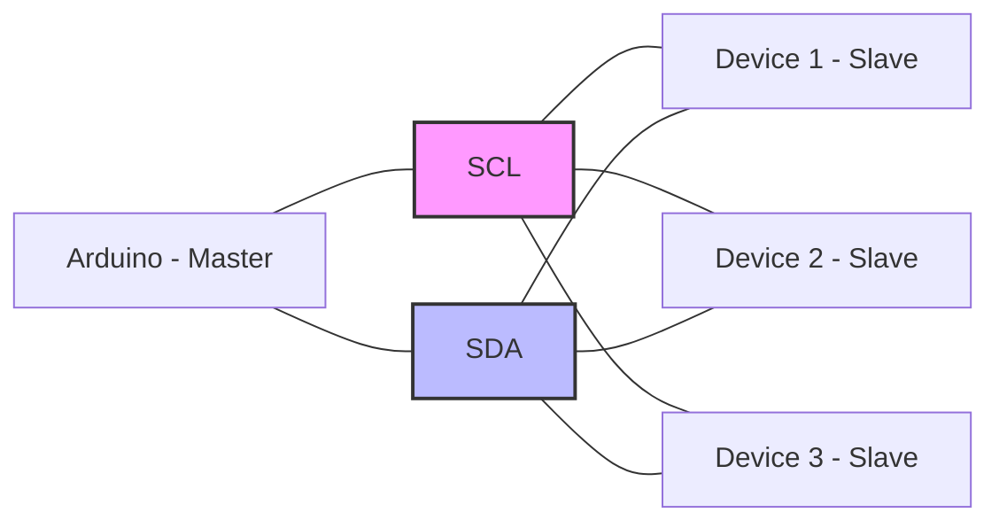
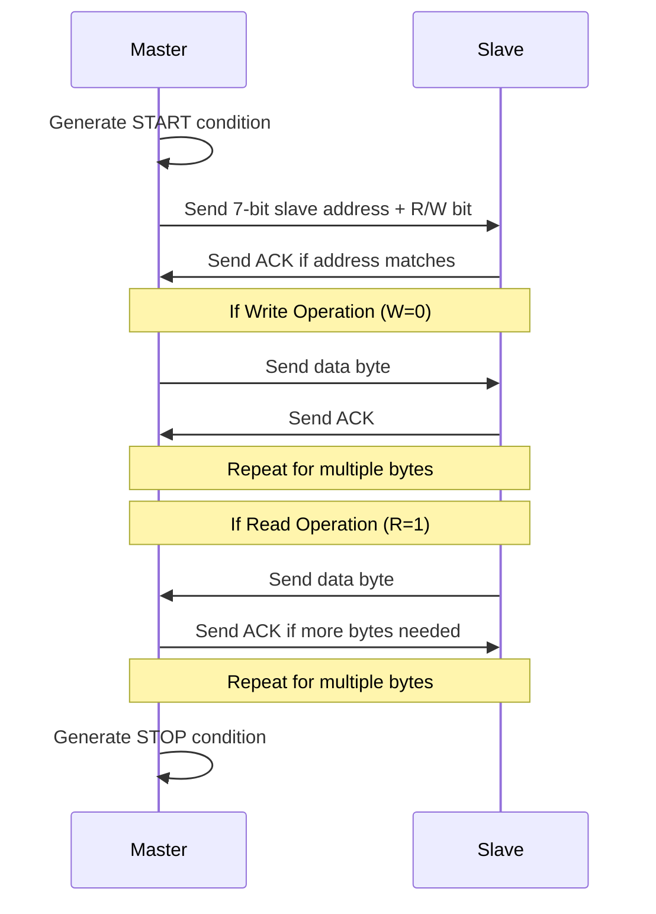

# Arduino I2C Protocol

## Introduction

The I2C (Inter-Integrated Circuit) protocol is one of the most widely used communication protocols in embedded systems. Designed by Philips Semiconductor (now NXP), I2C allows multiple devices to communicate over just two wires, making it extremely efficient for connecting sensors, displays, memory chips, and other peripherals to your Arduino.

In this guide, we'll explore how I2C works, its advantages and limitations, and how to implement it in your Arduino projects. Whether you're building a weather station with multiple sensors or a complex robotics project, understanding I2C will significantly expand your Arduino capabilities.

## What is I2C?

I2C is a synchronous, multi-master, multi-slave, packet-switched, serial communication protocol that requires just two wires to transmit data between devices:

1. **SDA (Serial Data Line)** - The line through which data travels
2. **SCL (Serial Clock Line)** - The line that carries the clock signal

Here's a simple diagram showing how I2C connects multiple devices:



### Key Features of I2C

- **Two-Wire Interface**: Minimizes pin usage on your microcontroller
- **Addressing System**: Each slave device has a unique address, allowing up to 127 devices on the same bus
- **Built-in Flow Control**: The clock line synchronizes data transfer
- **Acknowledgment Bit**: Provides confirmation that data was received
- **Multi-master Support**: Multiple control devices can be connected to the same bus
- **Moderate Speed**: Standard mode operates at 100 kHz, with faster modes available up to 5 MHz

## I2C on Arduino

On most Arduino boards, the I2C pins are:

- **Arduino Uno, Nano, Mini**: A4 (SDA), A5 (SCL)
- **Arduino Mega**: 20 (SDA), 21 (SCL)
- **Arduino Leonardo**: 2 (SDA), 3 (SCL)

These pins are also accessible on the ICSP header on compatible boards.

## The Wire Library

Arduino provides the `Wire` library for I2C communication. This library simplifies the process of setting up and managing I2C connections.

First, include the library at the top of your sketch:

```cpp
#include <Wire.h>
```

### Basic Functions

Here are the essential Wire library functions:

1. `Wire.begin()` - Initialize Wire library as master
2. `Wire.begin(address)` - Initialize Wire library as slave with given address
3. `Wire.requestFrom(address, quantity)` - Request data from a slave device
4. `Wire.beginTransmission(address)` - Begin a transmission to a slave device
5. `Wire.write(data)` - Write data to the transmission buffer
6. `Wire.endTransmission()` - End a transmission and transmit the buffer
7. `Wire.available()` - Returns how many bytes are available for reading
8. `Wire.read()` - Reads one byte from the receive buffer

## How I2C Communication Works

I2C communication follows a specific protocol:

1. **Start Condition**: The master initiates communication
2. **Address Transmission**: The master sends the slave address + read/write bit
3. **Acknowledgment**: The slave acknowledges its presence
4. **Data Transmission**: Data is sent one byte at a time
5. **Acknowledgment**: Each byte is acknowledged by the receiver
6. **Stop Condition**: The master terminates the communication

Let's look at this process in more detail:



## I2C Example: Reading from a Sensor

Let's create a practical example using a common I2C sensor - the BME280 temperature, humidity, and pressure sensor.

First, install the Adafruit BME280 library via the Arduino Library Manager.

```cpp
#include <Wire.h>
#include <Adafruit_Sensor.h>
#include <Adafruit_BME280.h>

#define SEALEVELPRESSURE_HPA (1013.25)

Adafruit_BME280 bme; // Create BME280 object

void setup() {
  Serial.begin(9600);
  
  if (!bme.begin(0x76)) {  // 0x76 is the I2C address of the BME280
    Serial.println("Could not find a valid BME280 sensor, check wiring!");
    while (1);
  }
  
  Serial.println("BME280 sensor found!");
}

void loop() {
  // Read values from the sensor
  float temperature = bme.readTemperature();
  float humidity = bme.readHumidity();
  float pressure = bme.readPressure() / 100.0F;
  float altitude = bme.readAltitude(SEALEVELPRESSURE_HPA);
  
  // Print the values to Serial Monitor
  Serial.print("Temperature: ");
  Serial.print(temperature);
  Serial.println(" °C");
  
  Serial.print("Humidity: ");
  Serial.print(humidity);
  Serial.println(" %");
  
  Serial.print("Pressure: ");
  Serial.print(pressure);
  Serial.println(" hPa");
  
  Serial.print("Approximate Altitude: ");
  Serial.print(altitude);
  Serial.println(" m");
  
  Serial.println();
  
  delay(2000);  // Wait 2 seconds before next reading
}
```

**Output Example:**
```
BME280 sensor found!
Temperature: 22.34 °C
Humidity: 45.21 %
Pressure: 1012.73 hPa
Approximate Altitude: 0.43 m

Temperature: 22.36 °C
Humidity: 45.19 %
Pressure: 1012.75 hPa
Approximate Altitude: 0.41 m
```

### Understanding the Code

1. We include the necessary libraries
2. We create a BME280 object
3. In `setup()`, we initialize serial communication and the BME280 sensor
4. In `loop()`, we read sensor values and print them to the Serial Monitor

## I2C Example: Multiple Devices

One of the main advantages of I2C is the ability to connect multiple devices. Let's see how to work with two I2C devices - a BME280 sensor and an OLED display:

```cpp
#include <Wire.h>
#include <Adafruit_Sensor.h>
#include <Adafruit_BME280.h>
#include <Adafruit_SSD1306.h>

#define SCREEN_WIDTH 128
#define SCREEN_HEIGHT 64
#define OLED_RESET -1
#define SCREEN_ADDRESS 0x3C

Adafruit_BME280 bme;
Adafruit_SSD1306 display(SCREEN_WIDTH, SCREEN_HEIGHT, &Wire, OLED_RESET);

void setup() {
  Serial.begin(9600);
  
  // Initialize BME280
  if (!bme.begin(0x76)) {
    Serial.println("Could not find BME280 sensor!");
    while (1);
  }
  
  // Initialize OLED
  if (!display.begin(SSD1306_SWITCHCAPVCC, SCREEN_ADDRESS)) {
    Serial.println("SSD1306 allocation failed");
    while (1);
  }
  
  display.clearDisplay();
  display.setTextSize(1);
  display.setTextColor(SSD1306_WHITE);
  display.setCursor(0, 0);
  display.println("BME280 Weather Station");
  display.display();
  delay(2000);
}

void loop() {
  // Read values
  float temperature = bme.readTemperature();
  float humidity = bme.readHumidity();
  float pressure = bme.readPressure() / 100.0F;
  
  // Update display
  display.clearDisplay();
  display.setCursor(0, 0);
  display.println("Weather Data:");
  
  display.setCursor(0, 16);
  display.print("Temp: ");
  display.print(temperature);
  display.println(" C");
  
  display.setCursor(0, 26);
  display.print("Humidity: ");
  display.print(humidity);
  display.println(" %");
  
  display.setCursor(0, 36);
  display.print("Pressure: ");
  display.print(pressure);
  display.println(" hPa");
  
  display.display();
  
  // Also print to Serial
  Serial.print("Temperature: ");
  Serial.print(temperature);
  Serial.println(" °C");
  Serial.print("Humidity: ");
  Serial.print(humidity);
  Serial.println(" %");
  Serial.print("Pressure: ");
  Serial.print(pressure);
  Serial.println(" hPa");
  Serial.println();
  
  delay(5000);
}
```

In this example, we're using the same I2C bus to communicate with two different devices, each with its own address:
- BME280 sensor at address 0x76
- SSD1306 OLED display at address 0x3C

## Creating Your Own I2C Slave Device

While Arduino is typically used as a master, it can also function as an I2C slave. Here's a simple example of setting up an Arduino as a slave that responds to requests from a master:

**Slave Arduino:**

```cpp
#include <Wire.h>

#define SLAVE_ADDRESS 0x08
byte dataToSend = 0;

void setup() {
  Wire.begin(SLAVE_ADDRESS);
  Wire.onRequest(requestEvent);
  Wire.onReceive(receiveEvent);
  Serial.begin(9600);
  Serial.println("I2C Slave Ready");
}

void loop() {
  // Increment the data value (simulating a sensor reading)
  dataToSend++;
  if (dataToSend > 100) dataToSend = 0;
  delay(100);
}

// Function that executes when data is requested by master
void requestEvent() {
  Wire.write(dataToSend);
  Serial.print("Sent value: ");
  Serial.println(dataToSend);
}

// Function that executes when data is received from master
void receiveEvent(int howMany) {
  while (Wire.available()) {
    byte command = Wire.read();
    Serial.print("Received command: ");
    Serial.println(command);
  }
}
```

**Master Arduino:**

```cpp
#include <Wire.h>

#define SLAVE_ADDRESS 0x08

void setup() {
  Wire.begin();
  Serial.begin(9600);
  Serial.println("I2C Master Ready");
}

void loop() {
  // Send a command (1)
  Wire.beginTransmission(SLAVE_ADDRESS);
  Wire.write(1);
  Wire.endTransmission();
  
  // Request a response
  Wire.requestFrom(SLAVE_ADDRESS, 1);
  
  if (Wire.available()) {
    byte response = Wire.read();
    Serial.print("Received from slave: ");
    Serial.println(response);
  }
  
  delay(1000);
}
```

## Common I2C Issues and Troubleshooting

### 1. Address Conflicts

If two devices share the same address, they will both respond to the same commands, causing conflicts. Solution:
- Some I2C devices have configurable addresses (via jumpers or solder pads)
- Use an I2C multiplexer for devices with fixed addresses

### 2. Pullup Resistors

I2C requires pullup resistors on both SDA and SCL lines. Arduino boards have built-in pullups, but these may be too weak for longer cables or multiple devices. Solution:
- Add external 4.7kΩ pullup resistors to both SDA and SCL lines

```
VCC (5V or 3.3V)
    |
    ↓
   4.7kΩ       4.7kΩ
    ↓           ↓
    +-----+-----+
          |     |
    SDA ←-+     +-→ SCL
```

### 3. Bus Speed

Some devices may not support high-speed I2C communication. Solution:
- Reduce the I2C clock frequency using `Wire.setClock()`
- Example: `Wire.setClock(10000);` sets the clock to 10 kHz

### 4. Cable Length

Long cables can cause signal degradation. Solution:
- Keep I2C cables as short as possible
- Use twisted pair cables for better signal integrity
- Consider I2C repeaters for long distances

### 5. Device Detection

To scan for I2C devices on your bus:

```cpp
#include <Wire.h>

void setup() {
  Wire.begin();
  Serial.begin(9600);
  Serial.println("I2C Scanner");
}

void loop() {
  byte error, address;
  int deviceCount = 0;
  
  Serial.println("Scanning...");
  
  for (address = 1; address < 127; address++) {
    Wire.beginTransmission(address);
    error = Wire.endTransmission();
    
    if (error == 0) {
      Serial.print("I2C device found at address 0x");
      if (address < 16) {
        Serial.print("0");
      }
      Serial.print(address, HEX);
      Serial.println();
      deviceCount++;
    }
  }
  
  if (deviceCount == 0) {
    Serial.println("No I2C devices found");
  } else {
    Serial.print("Found ");
    Serial.print(deviceCount);
    Serial.println(" device(s)");
  }
  
  delay(5000);
}
```

## Advanced I2C Techniques

### Using Multiple I2C Buses

Some Arduino boards like the Arduino Due and some ESP32 boards have multiple I2C buses. This is useful when you have address conflicts or need to separate high and low-speed devices:

```cpp
#include <Wire.h>

// For Arduino Due
TwoWire Wire1(&PERIPH_WIRE1, PIN_WIRE1_SDA, PIN_WIRE1_SCL);

void setup() {
  Wire.begin();  // First I2C bus
  Wire1.begin(); // Second I2C bus
  
  // Use like normal
  Wire.beginTransmission(0x68);
  // ...
  
  Wire1.beginTransmission(0x42);
  // ...
}
```

### Using an I2C Multiplexer

For projects with many I2C devices, especially those with fixed addresses, an I2C multiplexer like the TCA9548A can be used:

```cpp
#include <Wire.h>

#define TCAADDR 0x70

void tcaselect(uint8_t i) {
  if (i > 7) return;
  
  Wire.beginTransmission(TCAADDR);
  Wire.write(1 << i);
  Wire.endTransmission();
}

void setup() {
  Wire.begin();
  Serial.begin(9600);
}

void loop() {
  // Select multiplexer channel 0
  tcaselect(0);
  // Now talk to device on channel 0
  
  // Select multiplexer channel 2
  tcaselect(2);
  // Now talk to device on channel 2
}
```

## Summary

I2C is a powerful and versatile communication protocol that allows your Arduino to communicate with multiple devices using just two pins. Key takeaways:

- I2C requires only two wires (SDA and SCL)
- Each slave device has a unique address
- The Arduino Wire library provides easy-to-use functions for I2C communication
- Multiple devices can be connected to the same bus
- I2C is suitable for short to medium-distance communication between components

With the knowledge gained from this guide, you can now integrate various I2C devices into your Arduino projects, from sensors and displays to memory modules and motor controllers.

## Practice Exercises

1. Build a weather station using a BME280 sensor and display the data on an OLED display.
2. Create a system with an Arduino as a master communicating with another Arduino as a slave.
3. Use the I2C scanner sketch to identify all I2C devices connected to your Arduino.
4. Implement a data logger using an I2C real-time clock (like DS3231) and an I2C EEPROM memory.
5. Build a multi-sensor system with at least three different I2C sensors, reading and processing data from all of them.

## Additional Resources

- [Arduino Wire Library Reference](https://www.arduino.cc/en/Reference/Wire)
- [I2C Bus Specification](https://www.nxp.com/docs/en/user-guide/UM10204.pdf)
- [SparkFun I2C Tutorial](https://learn.sparkfun.com/tutorials/i2c)
- [Adafruit I2C Guide](https://learn.adafruit.com/i2c-addresses)