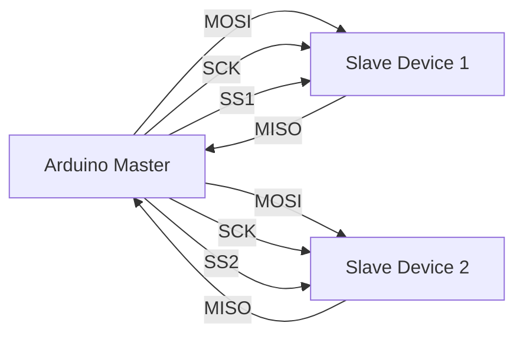

# Arduino SPI Protocol

## Introduction

The Serial Peripheral Interface (SPI) is a synchronous serial communication protocol developed by Motorola that allows your Arduino to communicate with one or multiple peripheral devices quickly and efficiently. SPI is commonly used for communicating with sensors, SD cards, displays, and other microcontrollers at short distances.

Unlike other serial protocols like I2C or UART, SPI can achieve very high data transfer rates (several MHz), making it ideal for applications requiring fast data exchange. However, it uses more pins than some other protocols, which is an important consideration when choosing the right communication method for your project.

## How SPI Works

SPI operates on a master-slave architecture where one device (usually your Arduino) acts as the master, controlling the communication with one or more slave devices.

### Key Components of SPI

SPI uses four signals for communication:

1. **MOSI (Master Out Slave In)**: Data sent from master to slave
2. **MISO (Master In Slave Out)**: Data sent from slave to master
3. **SCK (Serial Clock)**: Clock signal generated by the master
4. **SS/CS (Slave Select/Chip Select)**: Signal used to select which slave device to communicate with

### SPI Connection Diagram



### SPI Mode Configuration

SPI can operate in four different modes, based on two parameters:
- **Clock Polarity (CPOL)**: Determines whether the clock is idle at high (1) or low (0)
- **Clock Phase (CPHA)**: Determines whether data is sampled on the rising (0) or falling (1) edge

| Mode | CPOL | CPHA |
|------|------|------|
| 0    | 0    | 0    |
| 1    | 0    | 1    |
| 2    | 1    | 0    |
| 3    | 1    | 1    |

Most devices use Mode 0 (CPOL=0, CPHA=0), but you should always check the datasheet of your specific device.

## SPI on Arduino

Arduino provides the `SPI.h` library, which makes it easy to use the SPI protocol in your projects.

### Arduino SPI Pins

On most Arduino boards, the SPI pins are:

| Signal | Arduino Uno/Nano Pin | Arduino Mega Pin |
|--------|----------------------|------------------|
| MOSI   | D11                  | D51              |
| MISO   | D12                  | D50              |
| SCK    | D13                  | D52              |
| SS     | D10 (default)        | D53 (default)    |

Note that you can use any digital pin for SS if you're controlling it manually.

### Basic SPI Setup

Here's how to set up basic SPI communication on an Arduino:

```cpp
#include <SPI.h>

const int slaveSelectPin = 10;

void setup() {
  // Set the slave select pin as output
  pinMode(slaveSelectPin, OUTPUT);
  
  // Initialize SPI
  SPI.begin();
  
  // Optional: Configure SPI settings
  SPI.setClockDivider(SPI_CLOCK_DIV4); // Set speed (16MHz/4 = 4MHz)
  SPI.setBitOrder(MSBFIRST);           // Most significant bit first
  SPI.setDataMode(SPI_MODE0);          // Mode 0 (most common)
  
  // Begin serial for debugging
  Serial.begin(9600);
  Serial.println("SPI initialized");
}

void loop() {
  // Code to use SPI will go here
}
```

### Sending and Receiving Data

To exchange data with a slave device:

```cpp
void loop() {
  // Select the slave device
  digitalWrite(slaveSelectPin, LOW);
  
  // Send a byte and receive a response
  byte dataToSend = 0x55;
  byte receivedData = SPI.transfer(dataToSend);
  
  // Print the received data
  Serial.print("Sent: 0x");
  Serial.print(dataToSend, HEX);
  Serial.print(", Received: 0x");
  Serial.println(receivedData, HEX);
  
  // Deselect the slave device
  digitalWrite(slaveSelectPin, HIGH);
  
  delay(1000);
}
```

## Practical Example: Reading a Temperature Sensor with SPI

Let's create a practical example using the MAX6675 thermocouple interface, which communicates via SPI to measure temperature.

```cpp
#include <SPI.h>

// Define pins
const int csPin = 10;  // Chip Select pin
const int soPin = 12;  // MISO pin (SO = Serial Out from MAX6675)
const int sckPin = 13; // SCK pin

void setup() {
  // Set up pins
  pinMode(csPin, OUTPUT);
  digitalWrite(csPin, HIGH); // Deselect the sensor initially
  
  // Initialize SPI
  SPI.begin();
  
  // Begin serial for debugging
  Serial.begin(9600);
  Serial.println("MAX6675 Thermocouple Reader");
}

void loop() {
  // Read temperature
  float temperature = readMAX6675();
  
  // Print result
  Serial.print("Temperature: ");
  Serial.print(temperature);
  Serial.println("°C");
  
  delay(1000);
}

float readMAX6675() {
  // Select the MAX6675 chip
  digitalWrite(csPin, LOW);
  
  // Wait a bit
  delay(1);
  
  // Read 16 bits (2 bytes) from the sensor
  uint16_t value = SPI.transfer(0) << 8;  // Read first byte and shift left 8 bits
  value |= SPI.transfer(0);               // Read second byte and combine with first
  
  // Deselect the chip
  digitalWrite(csPin, HIGH);
  
  // Check if thermocouple is open (disconnected)
  if (value & 0x4) {
    return NAN; // Return NaN (Not a Number) if thermocouple is disconnected
  }
  
  // The 12 most significant bits contain the temperature
  value >>= 3; // Shift right 3 bits to get rid of status bits
  
  // Convert to Celsius (0.25°C per bit)
  return value * 0.25;
}
```

**Sample Output:**
```
MAX6675 Thermocouple Reader
Temperature: 22.75°C
Temperature: 22.75°C
Temperature: 23.00°C
Temperature: 23.00°C
```

## Example: Communicating with Multiple SPI Devices

When working with multiple SPI devices, you need a separate SS/CS pin for each device:

```cpp
#include <SPI.h>

// Define CS pins for multiple devices
const int cs1Pin = 10;  // Chip Select for device 1
const int cs2Pin = 9;   // Chip Select for device 2

void setup() {
  // Set up pins
  pinMode(cs1Pin, OUTPUT);
  pinMode(cs2Pin, OUTPUT);
  digitalWrite(cs1Pin, HIGH); // Deselect device 1 initially
  digitalWrite(cs2Pin, HIGH); // Deselect device 2 initially
  
  // Initialize SPI
  SPI.begin();
  
  // Begin serial for debugging
  Serial.begin(9600);
  Serial.println("Multiple SPI Devices Example");
}

void loop() {
  // Talk to device 1
  digitalWrite(cs1Pin, LOW); // Select device 1
  byte response1 = SPI.transfer(0xAA);
  digitalWrite(cs1Pin, HIGH); // Deselect device 1
  
  // Talk to device 2
  digitalWrite(cs2Pin, LOW); // Select device 2
  byte response2 = SPI.transfer(0x55);
  digitalWrite(cs2Pin, HIGH); // Deselect device 2
  
  // Print responses
  Serial.print("Device 1 response: 0x");
  Serial.println(response1, HEX);
  Serial.print("Device 2 response: 0x");
  Serial.println(response2, HEX);
  
  delay(1000);
}
```

## Using SPI with Common Devices

### SD Card Module

SD cards use SPI for communication. Here's how to use an SD card with Arduino:

```cpp
#include <SPI.h>
#include <SD.h>

const int chipSelectPin = 10;

void setup() {
  Serial.begin(9600);
  Serial.print("Initializing SD card...");

  // Check if the card is present and can be initialized
  if (!SD.begin(chipSelectPin)) {
    Serial.println("Card failed or not present");
    while (1); // Don't proceed if no SD card
  }
  Serial.println("Card initialized.");
  
  // Create or open a file and write to it
  File dataFile = SD.open("data.txt", FILE_WRITE);
  
  if (dataFile) {
    dataFile.println("Hello, SD Card!");
    dataFile.close();
    Serial.println("Wrote to data.txt");
  } else {
    Serial.println("Error opening data.txt");
  }
}

void loop() {
  // Read the file and print its contents
  File dataFile = SD.open("data.txt");
  
  if (dataFile) {
    Serial.println("Contents of data.txt:");
    
    while (dataFile.available()) {
      Serial.write(dataFile.read());
    }
    
    dataFile.close();
  } else {
    Serial.println("Error opening data.txt");
  }
  
  delay(5000);
}
```

### OLED Display via SPI

Here's an example using the popular SSD1306 OLED display with SPI:

```cpp
#include <SPI.h>
#include <Wire.h>
#include <Adafruit_GFX.h>
#include <Adafruit_SSD1306.h>

#define SCREEN_WIDTH 128
#define SCREEN_HEIGHT 64
#define OLED_DC     9
#define OLED_CS     10
#define OLED_RESET  8

// Initialize display
Adafruit_SSD1306 display(SCREEN_WIDTH, SCREEN_HEIGHT,
  &SPI, OLED_DC, OLED_RESET, OLED_CS);

void setup() {
  Serial.begin(9600);
  
  // Initialize SSD1306 OLED display
  if(!display.begin(SSD1306_SWITCHCAPVCC)) {
    Serial.println(F("SSD1306 allocation failed"));
    for(;;); // Don't proceed, loop forever
  }

  // Clear the display buffer
  display.clearDisplay();
  
  // Set text properties
  display.setTextSize(1);
  display.setTextColor(SSD1306_WHITE);
  display.setCursor(0, 0);
  
  // Display text
  display.println(F("Hello, SPI OLED!"));
  display.println(F("This display uses"));
  display.println(F("SPI for communication"));
  
  // Show on screen
  display.display();
}

void loop() {
  // Nothing to do in the loop for this example
}
```

## Performance and Considerations

### Advantages of SPI:
1. **High Speed**: SPI can operate at much higher clock frequencies than I2C.
2. **Full-Duplex**: Data can be sent and received simultaneously.
3. **Simple Protocol**: No complex addressing or acknowledgment mechanisms.
4. **Flexible Data Size**: Not limited to 8-bit transfers.

### Disadvantages of SPI:
1. **More Pins**: Requires more connections than I2C or UART.
2. **No Built-in Error Checking**: Unlike some other protocols, SPI has no acknowledgment mechanism.
3. **Distance Limitation**: Works best over short distances.
4. **No Standard**: Different implementations may have slight variations.

### When to Use SPI:
- When speed is a priority
- For short-distance communication
- When working with devices that only support SPI
- When you don't need bidirectional communication on a single line

## Troubleshooting SPI Communication

If you encounter issues with SPI communication:

1. **Check Connections**: Ensure all pins are correctly connected.
2. **Verify Mode Settings**: Check that you're using the correct SPI mode for your device.
3. **Check Timing**: Some devices have specific timing requirements.
4. **Inspect SS/CS Timing**: The slave select line may need to be held low for a minimum duration.
5. **Use a Logic Analyzer**: If available, use a logic analyzer to see the actual signals.

## Summary

SPI is a powerful and fast communication protocol that allows your Arduino to communicate with various peripheral devices. It uses a master-slave architecture with four main signals: MOSI, MISO, SCK, and SS. While it requires more pins than some other protocols, it offers high speed and full-duplex communication.

Key points to remember:
- SPI uses four wires for communication
- The master controls all communication
- Multiple slaves can be connected using additional SS pins
- SPI is fast but works best over short distances
- The Arduino SPI library makes it easy to implement SPI communication

## Additional Resources and Exercises

### Exercises for Practice:

1. **Basic SPI Communication**: Set up an SPI connection between two Arduinos, with one as master and one as slave. Try sending different data patterns back and forth.

2. **Data Logging with SD Card**: Create a project that reads sensors and logs the data to an SD card using SPI.

3. **Multi-device SPI Network**: Connect two or more different SPI devices to an Arduino and communicate with each independently.

### Further Learning:

- Dive deeper into the Arduino SPI library documentation
- Learn about SPI-specific IC features like daisy-chaining
- Explore hardware SPI versus software SPI implementations
- Study specialized SPI modes like dual and quad SPI for advanced applications

By understanding and using the SPI protocol, you'll have a powerful tool in your Arduino communication toolkit that enables high-speed data exchange with a wide range of devices.