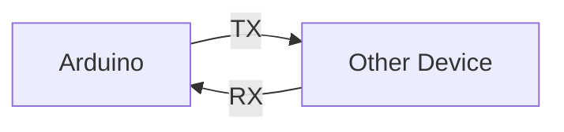
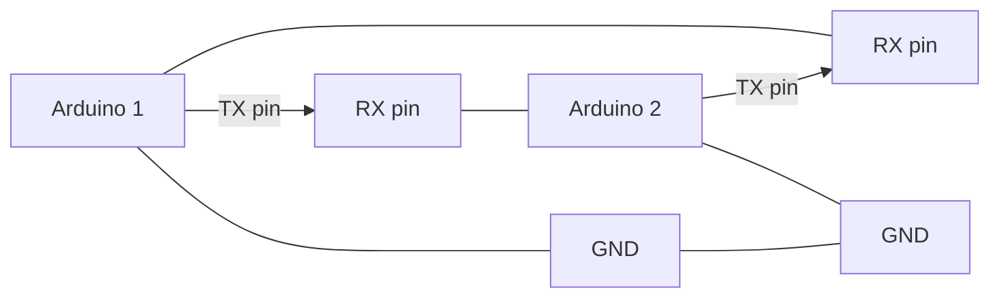

# Arduino UART Serial Communication

## Introduction

Serial communication is one of the most fundamental ways your Arduino can talk to other devices. UART (Universal Asynchronous Receiver/Transmitter) is the hardware that enables this communication. In this tutorial, we'll explore how UART Serial communication works on Arduino, why it's important, and how to use it in your projects.

When you connect your Arduino to your computer via USB, you're actually using Serial communication! This makes it not just a theoretical concept but a practical tool you use every time you upload code or debug your projects.

## What is UART Serial Communication?

UART Serial is a form of asynchronous communication where data is transmitted bit by bit over a single wire, without an accompanying clock signal. Let's break down what this means:

- **Universal**: It's a standard protocol that works across different devices
- **Asynchronous**: No clock signal is shared between devices; instead, both sides agree on a speed (baud rate)
- **Receiver/Transmitter**: Data flows in both directions

A typical UART connection uses two wires for data:
- **TX (Transmit)**: Sends data from your Arduino to another device
- **RX (Receive)**: Receives data from another device to your Arduino



## How Serial Communication Works on Arduino

Arduino boards come with at least one hardware UART. The Arduino Uno has one UART on pins 0 (RX) and 1 (TX), while other boards like the Mega have multiple UARTs.

When you use the Serial functions in Arduino, you're interacting with this hardware. Here's how the Arduino handles Serial communication:

1. **Initialization**: Set the baud rate (communication speed)
2. **Data Packaging**: Adds start/stop bits to each byte
3. **Transmission/Reception**: Sends or receives one bit at a time
4. **Buffer Management**: Stores incoming data until your code reads it

Each byte sent includes:
- 1 start bit (always 0)
- 8 data bits (the actual information)
- 1 or more stop bits (always 1)

This packaging ensures both devices stay synchronized during communication.

## Setting Up Serial Communication

Let's start with the basics. Here's how to initialize and use Serial communication:

```cpp
void setup() {
  // Initialize serial communication at 9600 bits per second
  Serial.begin(9600);
  
  // Wait for serial port to connect (needed for native USB port only)
  while (!Serial) {
    ; // wait for serial port to connect
  }
  
  Serial.println("Serial communication started!");
}

void loop() {
  // Your code here
}
```

Common baud rates include 9600, 57600, and 115200. Higher rates allow faster communication but may be less reliable over longer distances or with cheaper hardware.

## Sending Data from Arduino

Sending data is straightforward using the various Serial print functions:

```cpp
void setup() {
  Serial.begin(9600);
}

void loop() {
  // Send a string
  Serial.println("Hello from Arduino!");
  
  // Send numbers
  Serial.print("Integer: ");
  Serial.println(42);
  
  // Send decimals with specified precision
  Serial.print("Float with 2 decimals: ");
  Serial.println(3.14159, 2);  // Outputs: 3.14
  
  // Send data in different formats
  Serial.print("Binary: ");
  Serial.println(42, BIN);  // Outputs: 101010
  
  Serial.print("Hexadecimal: ");
  Serial.println(42, HEX);  // Outputs: 2A
  
  delay(1000);  // Wait a second between outputs
}
```

## Receiving Data on Arduino

Receiving data is a bit more complex because you need to check if data is available and then read it properly:

```cpp
const int ledPin = 13;  // Built-in LED

void setup() {
  Serial.begin(9600);
  pinMode(ledPin, OUTPUT);
  Serial.println("Type '1' to turn LED ON or '0' to turn LED OFF");
}

void loop() {
  // Check if data is available
  if (Serial.available() > 0) {
    // Read the incoming byte
    char incomingByte = Serial.read();
    
    // Echo the incoming character
    Serial.print("Received: ");
    Serial.println(incomingByte);
    
    // Act based on the character received
    if (incomingByte == '1') {
      digitalWrite(ledPin, HIGH);
      Serial.println("LED ON");
    } 
    else if (incomingByte == '0') {
      digitalWrite(ledPin, LOW);
      Serial.println("LED OFF");
    }
    
    // Clear any additional characters in buffer
    while (Serial.available() > 0) {
      Serial.read();
    }
  }
}
```

## Handling Larger Amounts of Data

For more complex scenarios, you might need to read entire strings or numbers:

```cpp
void setup() {
  Serial.begin(9600);
  Serial.println("Enter a value (ending with newline):");
}

void loop() {
  // Read a full line when available
  if (Serial.available() > 0) {
    String receivedString = Serial.readStringUntil('
');
    
    // Trim any whitespace
    receivedString.trim();
    
    // Convert string to integer if needed
    int receivedValue = receivedString.toInt();
    
    // Echo it back
    Serial.print("You sent: ");
    Serial.println(receivedString);
    Serial.print("As integer: ");
    Serial.println(receivedValue);
    Serial.println("Enter another value:");
  }
}
```

## Serial Communication Between Two Arduinos

You can connect two Arduinos together using their UART pins. Connect the TX pin of one Arduino to the RX pin of the other and vice versa:



Here's an example for the sender Arduino:

```cpp
void setup() {
  Serial.begin(9600);
}

void loop() {
  // Send a counter value
  static int counter = 0;
  Serial.println(counter);
  counter++;
  
  delay(1000);  // Send once per second
}
```

And for the receiver Arduino:

```cpp
void setup() {
  Serial.begin(9600);
  // Initialize a second serial port for debugging
  // (if available on your Arduino model)
  Serial1.begin(9600);
  // Otherwise, comment out Serial1 lines and use LEDs or other outputs to verify
}

void loop() {
  if (Serial.available() > 0) {
    String receivedString = Serial.readStringUntil('
');
    
    // Do something with the received data
    int value = receivedString.toInt();
    
    // Print to debug serial port
    Serial1.print("Received: ");
    Serial1.println(value);
    
    // Alternative: Blink an LED 'value' times
  }
}
```

**Note**: On Arduino Uno, which has only one hardware UART, you'll need to disconnect the RX/TX pins from the other Arduino during programming, as they're also used for USB communication with your computer.

## Advanced Serial Techniques

### Software Serial

If you need more UART ports than your Arduino provides in hardware, you can use the SoftwareSerial library to create additional serial ports on other digital pins:

```cpp
#include <SoftwareSerial.h>

// Create a software serial port on pins 10 (RX) and 11 (TX)
SoftwareSerial mySerial(10, 11);

void setup() {
  // Initialize hardware serial for debugging
  Serial.begin(9600);
  
  // Initialize software serial for communication
  mySerial.begin(9600);
  
  Serial.println("Software Serial Example");
}

void loop() {
  // Forward data from software serial to hardware serial
  if (mySerial.available()) {
    Serial.write(mySerial.read());
  }
  
  // Forward data from hardware serial to software serial
  if (Serial.available()) {
    mySerial.write(Serial.read());
  }
}
```

Software Serial has limitations compared to hardware UART:
- Lower maximum baud rate
- Can miss data when receiving at high speeds
- May interfere with other timing-sensitive operations

### Parsing Complex Data

For complex data protocols, you'll want to parse the incoming stream into structured data:

```cpp
// Example: Parsing comma-separated values

void setup() {
  Serial.begin(9600);
  Serial.println("Send comma-separated values (format: x,y,z)");
}

void loop() {
  if (Serial.available() > 0) {
    String data = Serial.readStringUntil('
');
    
    // Parse the comma-separated string
    int firstComma = data.indexOf(',');
    int secondComma = data.indexOf(',', firstComma + 1);
    
    if (firstComma != -1 && secondComma != -1) {
      String xStr = data.substring(0, firstComma);
      String yStr = data.substring(firstComma + 1, secondComma);
      String zStr = data.substring(secondComma + 1);
      
      int x = xStr.toInt();
      int y = yStr.toInt();
      int z = zStr.toInt();
      
      // Use the parsed values
      Serial.print("Received x: ");
      Serial.print(x);
      Serial.print(", y: ");
      Serial.print(y);
      Serial.print(", z: ");
      Serial.println(z);
      
      Serial.print("Sum: ");
      Serial.println(x + y + z);
    }
  }
}
```

## Real-World Applications

### 1. Connecting to Sensors

Many sensors communicate using serial protocols. Here's an example with a GPS module:

```cpp
#include <SoftwareSerial.h>

SoftwareSerial gpsSerial(3, 2); // RX, TX

void setup() {
  // Open serial communications with computer
  Serial.begin(9600);
  
  // Open serial communications with GPS
  gpsSerial.begin(9600);
  
  Serial.println("GPS Reading Example");
}

void loop() {
  // Read data from GPS and forward to Serial Monitor
  if (gpsSerial.available()) {
    char c = gpsSerial.read();
    Serial.write(c);
  }
}
```

### 2. Connecting to a Computer Interface

You can create interactive applications that respond to commands from a computer:

```cpp
const int ledPin = 13;

void setup() {
  Serial.begin(9600);
  pinMode(ledPin, OUTPUT);
  
  Serial.println("Available commands:");
  Serial.println("  ON - Turn on LED");
  Serial.println("  OFF - Turn off LED");
  Serial.println("  BLINK n - Blink LED n times");
  Serial.println("  STATUS - Report LED status");
}

void loop() {
  if (Serial.available() > 0) {
    String command = Serial.readStringUntil('
');
    command.trim();
    command.toUpperCase();
    
    if (command == "ON") {
      digitalWrite(ledPin, HIGH);
      Serial.println("LED turned ON");
    }
    else if (command == "OFF") {
      digitalWrite(ledPin, LOW);
      Serial.println("LED turned OFF");
    }
    else if (command.startsWith("BLINK ")) {
      int times = command.substring(6).toInt();
      Serial.print("Blinking LED ");
      Serial.print(times);
      Serial.println(" times");
      
      for (int i = 0; i < times; i++) {
        digitalWrite(ledPin, HIGH);
        delay(200);
        digitalWrite(ledPin, LOW);
        delay(200);
      }
      Serial.println("Blinking complete");
    }
    else if (command == "STATUS") {
      if (digitalRead(ledPin) == HIGH) {
        Serial.println("LED is ON");
      } else {
        Serial.println("LED is OFF");
      }
    }
    else {
      Serial.println("Unknown command");
    }
  }
}
```

### 3. Data Logging System

Create a system that logs sensor readings to a computer:

```cpp
const int sensorPin = A0;  // Analog input pin
unsigned long lastLogTime = 0;
const unsigned long logInterval = 5000;  // Log every 5 seconds

void setup() {
  Serial.begin(9600);
  Serial.println("Time(ms),Sensor Value");
}

void loop() {
  unsigned long currentTime = millis();
  
  // Log data at specified intervals
  if (currentTime - lastLogTime >= logInterval) {
    int sensorValue = analogRead(sensorPin);
    
    // Print in CSV format
    Serial.print(currentTime);
    Serial.print(",");
    Serial.println(sensorValue);
    
    lastLogTime = currentTime;
  }
  
  // Check for commands
  if (Serial.available() > 0) {
    String command = Serial.readStringUntil('
');
    command.trim();
    
    if (command == "FASTER") {
      logInterval = 1000;  // Change to 1 second
      Serial.println("# Logging speed increased to 1 second");
    }
    else if (command == "SLOWER") {
      logInterval = 10000;  // Change to 10 seconds
      Serial.println("# Logging speed decreased to 10 seconds");
    }
    else if (command == "NORMAL") {
      logInterval = 5000;  // Reset to 5 seconds
      Serial.println("# Logging speed set to 5 seconds");
    }
  }
}
```

## Common Pitfalls and Solutions

### 1. Baud Rate Mismatch

If the baud rates don't match between devices, communication will fail or result in garbage data.

**Solution**: Always ensure both sides are configured for the same baud rate.

### 2. Buffer Overflow

The Arduino has limited buffer space for incoming Serial data. If you don't read it quickly enough, the buffer will overflow and you'll lose data.

**Solution**: Read data promptly and consider flow control mechanisms.

### 3. Voltage Level Incompatibility

Arduino operates at 5V (or 3.3V for some boards), but other devices might use different voltage levels.

**Solution**: Use level shifters when connecting to devices with different voltage requirements.

### 4. RX/TX Reversal

A common mistake is mixing up the RX and TX connections between devices.

**Solution**: Remember that RX on one device connects to TX on the other, and vice versa.

## Summary

UART Serial communication is a fundamental skill for Arduino programmers. We've covered:

- The basics of how UART works
- Setting up serial communication
- Sending and receiving data
- Advanced techniques like Software Serial
- Real-world applications
- Common pitfalls and solutions

With these skills, you can now connect your Arduino to computers, sensors, displays, and other microcontrollers, opening up endless possibilities for your projects.

## Exercises for Practice

1. **Basic Communication**: Write a program that echoes anything sent from the Serial Monitor back with "You said: " prefixed.

2. **Command Parser**: Create a program that accepts commands to control multiple LEDs (e.g., "LED1 ON", "LED2 OFF").

3. **Data Logger**: Connect a temperature sensor to your Arduino and log readings to your computer at regular intervals.

4. **Two-Way Communication**: Set up communication between two Arduinos where one sends sensor readings and the other displays them on an LCD.

5. **Serial Protocol**: Design a simple protocol for sending multiple values with error checking (e.g., checksum).

## Additional Resources

- [Arduino Serial Reference](https://www.arduino.cc/reference/en/language/functions/communication/serial/)
- [SoftwareSerial Library](https://www.arduino.cc/en/Reference/SoftwareSerial)
- [Serial Communication Principles](https://learn.sparkfun.com/tutorials/serial-communication)
- [Debugging with Serial Monitor](https://learn.adafruit.com/debugging-with-serial-monitor)

With practice, you'll become proficient at using Serial communication in your Arduino projects, allowing for more complex and interactive applications!