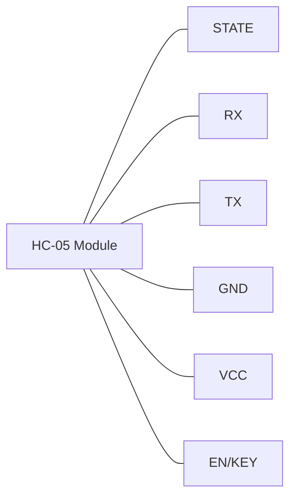
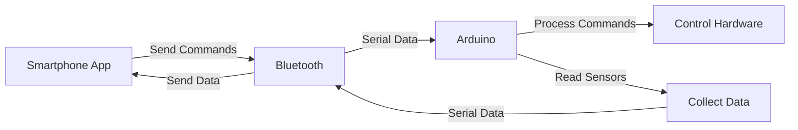

# Arduino Bluetooth Communication

## Introduction

Bluetooth is a popular wireless technology standard for exchanging data over short distances. When combined with Arduino, it enables you to create wireless projects that can communicate with smartphones, computers, or other microcontrollers. This tutorial will guide you through the basics of using Bluetooth modules with Arduino, focusing on the commonly used HC-05 and HC-06 modules.

## What You'll Learn

- Understanding Bluetooth technology and its application with Arduino
- Setting up and configuring Bluetooth modules
- Establishing serial communication between Arduino and other devices
- Building practical projects using Arduino and Bluetooth

## Required Components

- Arduino board (Uno, Nano, Mega, etc.)
- Bluetooth module (HC-05 or HC-06)
- Jumper wires
- Breadboard
- LED (for demonstration)
- 220Ω resistor
- Android/iOS smartphone or laptop with Bluetooth capability

## Understanding Bluetooth Modules for Arduino

The two most common Bluetooth modules used with Arduino are:

1. **HC-05**: Master/Slave mode configurable, can initiate connections to other devices
2. **HC-06**: Slave mode only, can only accept connections

Let's look at the pinout of a typical HC-05 module:



## Pin Configuration

| Pin Name | Description |
|----------|-------------|
| VCC | Power supply (3.3V to 6V) |
| GND | Ground |
| TX | Transmit data |
| RX | Receive data |
| STATE | Indicates connection status |
| EN/KEY | Enables AT command mode (HC-05 only) |

## Connecting Bluetooth Module to Arduino

Let's connect the HC-05/HC-06 to an Arduino Uno:

1. VCC → 5V on Arduino
2. GND → GND on Arduino
3. TX → Pin 2 on Arduino (RX)
4. RX → Pin 3 on Arduino (TX)

**Important:** The TX pin of the Bluetooth module connects to the RX of the Arduino and vice versa. Also, the RX pin of HC-05/HC-06 operates at 3.3V, while Arduino's TX operates at 5V. Ideally, you should use a voltage divider, but for basic testing, a direct connection often works.

## Basic Communication Example

Let's create a simple project where we control an LED connected to Arduino using a smartphone app.

### Hardware Setup

```
Arduino Uno  | Bluetooth Module | Other Components
-------------|------------------|------------------
5V           | VCC              |
GND          | GND              |
Pin 2        | TX               |
Pin 3        | RX               |
Pin 13       |                  | LED (+ 220Ω resistor to GND)
```

### Software - Arduino Code

```cpp
// Arduino Bluetooth LED Control
// This sketch allows you to control an LED via Bluetooth

#include <SoftwareSerial.h>

// Define the pins for software serial communication
const int rxPin = 2;  // Connect to TX of Bluetooth module
const int txPin = 3;  // Connect to RX of Bluetooth module
const int ledPin = 13; // Built-in LED on Arduino

// Create a software serial object
SoftwareSerial bluetoothSerial(rxPin, txPin);

void setup() {
  // Initialize serial communications
  Serial.begin(9600);
  bluetoothSerial.begin(9600);  // Default baud rate for HC-05/HC-06
  
  // Set LED pin as output
  pinMode(ledPin, OUTPUT);
  
  Serial.println("Bluetooth LED control ready!");
}

void loop() {
  // Check if data is available from Bluetooth
  if (bluetoothSerial.available() > 0) {
    char data = bluetoothSerial.read();
    Serial.print("Received: ");
    Serial.println(data);
    
    // Control LED based on received character
    if (data == '1') {
      digitalWrite(ledPin, HIGH);
      bluetoothSerial.println("LED ON");
    } 
    else if (data == '0') {
      digitalWrite(ledPin, LOW);
      bluetoothSerial.println("LED OFF");
    }
  }
  
  // Check if data is available from Serial Monitor
  if (Serial.available() > 0) {
    char data = Serial.read();
    bluetoothSerial.write(data);
  }
}
```

### How It Works

1. We use the `SoftwareSerial` library to create a virtual serial port for Bluetooth communication
2. When the Arduino receives a "1" via Bluetooth, it turns the LED on
3. When it receives a "0", it turns the LED off
4. The Arduino also sends back a confirmation message to the connected device

## Testing the Connection

To test your Bluetooth connection:

1. Upload the code to your Arduino
2. Power up the Arduino and the Bluetooth module
3. Pair your smartphone with the Bluetooth module (default pairing code is usually "1234" or "0000")
4. Use a Bluetooth terminal app (like "Bluetooth Terminal" for Android or "BlueTerm" for iOS)
5. Connect to the paired Bluetooth module
6. Send "1" to turn the LED on and "0" to turn it off

## Configuring HC-05 with AT Commands

The HC-05 can be configured using AT commands. Here's how to enter AT command mode:

1. Disconnect power from the HC-05
2. Connect the KEY/EN pin to 3.3V or 5V
3. Power up the HC-05 while holding the KEY/EN pin high
4. The LED on the HC-05 should blink slowly (about once every 2 seconds)

Let's write a simple sketch to configure the HC-05:

```cpp
// HC-05 Configuration Mode
#include <SoftwareSerial.h>

SoftwareSerial BTSerial(2, 3); // RX, TX

void setup() {
  Serial.begin(9600);
  Serial.println("Enter AT commands:");
  BTSerial.begin(38400); // HC-05 default baud rate in AT mode is 38400
}

void loop() {
  // Keep reading from HC-05 and send to Arduino Serial Monitor
  if (BTSerial.available()) {
    Serial.write(BTSerial.read());
  }
  
  // Keep reading from Arduino Serial Monitor and send to HC-05
  if (Serial.available()) {
    BTSerial.write(Serial.read());
  }
}
```

Some useful AT commands:

- `AT` - Test command, should respond with "OK"
- `AT+NAME=<name>` - Change the name of the module
- `AT+PSWD=<pin>` - Change the pairing password
- `AT+UART=<baud>,<stop bit>,<parity>` - Change UART parameters

Example:
```
AT+NAME=MyArduino
AT+PSWD=5555
AT+UART=9600,0,0
```

## Practical Project: Bluetooth-Controlled Robot

Now let's build something more exciting - a Bluetooth-controlled robot car!

### Components Needed:

- Arduino Uno or Nano
- HC-05 Bluetooth module
- L298N motor driver
- 2 DC motors with wheels
- Robot chassis
- 9V battery or battery pack
- Jumper wires

### Code for Bluetooth Robot Car

```cpp
// Bluetooth Controlled Robot Car
#include <SoftwareSerial.h>

// Bluetooth module connection
SoftwareSerial bluetoothSerial(2, 3); // RX, TX

// Motor A connections
const int enA = 9;
const int in1 = 8;
const int in2 = 7;

// Motor B connections
const int enB = 3;
const int in3 = 5;
const int in4 = 4;

char command;

void setup() {
  // Set all motor control pins as outputs
  pinMode(enA, OUTPUT);
  pinMode(enB, OUTPUT);
  pinMode(in1, OUTPUT);
  pinMode(in2, OUTPUT);
  pinMode(in3, OUTPUT);
  pinMode(in4, OUTPUT);
  
  // Turn off motors - Initial state
  digitalWrite(in1, LOW);
  digitalWrite(in2, LOW);
  digitalWrite(in3, LOW);
  digitalWrite(in4, LOW);
  
  // Set the motor speed
  analogWrite(enA, 200); // Motor A speed (0-255)
  analogWrite(enB, 200); // Motor B speed (0-255)
  
  // Initialize serial communication
  Serial.begin(9600);
  bluetoothSerial.begin(9600);
  Serial.println("Bluetooth Robot Car ready!");
}

void loop() {
  if (bluetoothSerial.available() > 0) {
    command = bluetoothSerial.read();
    Serial.print("Received: ");
    Serial.println(command);
    
    switch(command) {
      case 'F': // Forward
        forward();
        break;
      case 'B': // Backward
        backward();
        break;
      case 'L': // Left
        left();
        break;
      case 'R': // Right
        right();
        break;
      case 'S': // Stop
        stop();
        break;
    }
  }
}

void forward() {
  digitalWrite(in1, HIGH);
  digitalWrite(in2, LOW);
  digitalWrite(in3, HIGH);
  digitalWrite(in4, LOW);
}

void backward() {
  digitalWrite(in1, LOW);
  digitalWrite(in2, HIGH);
  digitalWrite(in3, LOW);
  digitalWrite(in4, HIGH);
}

void left() {
  digitalWrite(in1, LOW);
  digitalWrite(in2, HIGH);
  digitalWrite(in3, HIGH);
  digitalWrite(in4, LOW);
}

void right() {
  digitalWrite(in1, HIGH);
  digitalWrite(in2, LOW);
  digitalWrite(in3, LOW);
  digitalWrite(in4, HIGH);
}

void stop() {
  digitalWrite(in1, LOW);
  digitalWrite(in2, LOW);
  digitalWrite(in3, LOW);
  digitalWrite(in4, LOW);
}
```

To control this robot car, you would use a Bluetooth controller app from the app store that lets you send characters like 'F', 'B', 'L', 'R', and 'S' to control movement.

## Data Transfer Between Arduino and Computer

You can also use Bluetooth to transfer sensor data from Arduino to your computer:

```cpp
// Bluetooth Temperature Monitor
#include <SoftwareSerial.h>

SoftwareSerial bluetoothSerial(2, 3); // RX, TX

// Using the analog temperature sensor (TMP36)
const int tempPin = A0;

void setup() {
  Serial.begin(9600);
  bluetoothSerial.begin(9600);
  Serial.println("Bluetooth Temperature Monitor ready!");
}

void loop() {
  // Read the temperature sensor
  int sensorValue = analogRead(tempPin);
  
  // Convert analog reading to temperature in Celsius
  float voltage = sensorValue * (5.0 / 1023.0);
  float tempC = (voltage - 0.5) * 100;
  
  // Convert to Fahrenheit
  float tempF = (tempC * 9.0 / 5.0) + 32.0;
  
  // Send over Bluetooth
  bluetoothSerial.print("Temperature: ");
  bluetoothSerial.print(tempC);
  bluetoothSerial.print("°C / ");
  bluetoothSerial.print(tempF);
  bluetoothSerial.println("°F");
  
  // Also print to Serial Monitor
  Serial.print("Sending temperature: ");
  Serial.print(tempC);
  Serial.println("°C");
  
  // Wait for 2 seconds before the next reading
  delay(2000);
}
```

## Common Issues and Troubleshooting

### Connection Problems

If you're having trouble connecting:

1. **Check power supply**: The Bluetooth module needs stable power between 3.3V to 6V
2. **Verify baud rate**: Make sure the baud rate in your code matches the module's settings
3. **Check RX/TX connections**: Remember, RX of Arduino connects to TX of module and vice versa
4. **Pairing issues**: Try the default PIN codes "1234" or "0000"

### Communication Issues

If devices are connected but not communicating:

1. **Serial buffer overflow**: Add delay between sending multiple messages
2. **Voltage level mismatch**: Use a voltage divider for the RX pin of the Bluetooth module
3. **Interference**: Keep away from other wireless devices or power sources
4. **Range limitations**: Bluetooth has a limited range (typically 10m)

## Advanced: App Development for Arduino Bluetooth Control

For a complete project, you can create your own Android app using MIT App Inventor or iOS app using Swift to control your Arduino. This provides a custom interface rather than using generic Bluetooth terminal apps.

Here's what the data flow looks like for a custom app:



## Summary

In this tutorial, you learned:

- How to connect Bluetooth modules to Arduino
- Setting up serial communication between Arduino and Bluetooth devices
- Programming Arduino to respond to Bluetooth commands
- Building practical projects like LED control and a robot car
- Troubleshooting common issues with Bluetooth communication

Bluetooth communication opens up a world of possibilities for your Arduino projects, enabling wireless control and data transfer with smartphones, tablets, and computers.

## Exercises

1. Modify the LED control example to control multiple LEDs with different commands
2. Create a Bluetooth-controlled servo motor that rotates to specific angles
3. Build a Bluetooth weather station that sends temperature, humidity, and pressure data to your smartphone
4. Develop a simple Arduino-based home automation system controlled via Bluetooth
5. Experiment with sending different data types (integers, floats, strings) between Arduino and your phone

## Additional Resources

- Arduino Bluetooth Library documentation
- HC-05/HC-06 datasheet
- MIT App Inventor for creating custom Android apps
- Bluetooth Low Energy (BLE) modules for more advanced, low-power applications