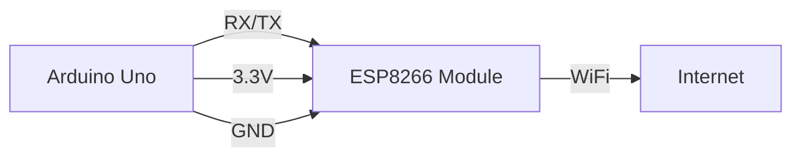

# Arduino WiFi

## Introduction

Connecting your Arduino to the internet opens up a world of possibilities for your projects. From remotely controlling devices to collecting and analyzing sensor data online, WiFi connectivity transforms a simple microcontroller into a powerful Internet of Things (IoT) device.

In this tutorial, we'll explore how to add WiFi capabilities to Arduino, covering different WiFi modules, basic connection methods, and practical applications that will help you create your own internet-connected projects.

## WiFi Options for Arduino

### Native WiFi vs. WiFi Modules

Traditional Arduino boards like the Uno or Nano don't have built-in WiFi capabilities. To connect these boards to WiFi, you'll need one of these solutions:

1. **WiFi Shields/Modules**: External components like the ESP8266 or Arduino WiFi Shield that connect to your Arduino
2. **WiFi-enabled Arduino Boards**: Newer boards with integrated WiFi, like the Arduino MKR WiFi 1010 or Arduino Nano 33 IoT
3. **ESP-based boards**: ESP8266 or ESP32 boards that can be programmed using the Arduino IDE

Let's explore each option in more detail.

### Option 1: Using ESP8266 with Arduino

The ESP8266 is an inexpensive WiFi module that has become extremely popular for adding WiFi to Arduino projects. Here's how to connect an ESP8266 module (like the ESP-01) to an Arduino Uno:



#### Hardware Connection

| Arduino Uno | ESP8266 (ESP-01) |
|-------------|------------------|
| 3.3V        | VCC             |
| 3.3V        | CH_PD           |
| GND         | GND             |
| TX (Pin 3)* | RX              |
| RX (Pin 2)* | TX              |

*We're using Software Serial to avoid conflicts with the Arduino's main serial port

#### Basic ESP8266 Communication Example

```cpp
#include <SoftwareSerial.h>

// Create software serial object to communicate with ESP8266
SoftwareSerial espSerial(2, 3); // RX, TX

void setup() {
  // Start serial communications
  Serial.begin(9600);     // Serial monitor
  espSerial.begin(115200); // ESP8266 default baud rate
  
  Serial.println("ESP8266 Communication Test");
  
  // Send AT command to test communication
  espSerial.println("AT");
  delay(1000);
  
  // Read and print ESP8266 response
  while (espSerial.available()) {
    Serial.write(espSerial.read());
  }
}

void loop() {
  // Forward data from ESP to Serial Monitor
  if (espSerial.available()) {
    Serial.write(espSerial.read());
  }
  
  // Forward data from Serial Monitor to ESP
  if (Serial.available()) {
    espSerial.write(Serial.read());
  }
}
```

When you upload this code, open the Serial Monitor and you should see "OK" returned from the ESP8266, indicating successful communication.

### Option 2: WiFi-Enabled Arduino Boards

Modern Arduino boards like the MKR WiFi 1010 or Nano 33 IoT come with built-in WiFi capabilities. These boards integrate WiFi directly, making them more compact and easier to use for IoT projects.

#### Example: Using Arduino MKR WiFi 1010

```cpp
#include <WiFiNINA.h>

char ssid[] = "YourNetworkName";  // Your network SSID
char pass[] = "YourPassword";     // Your network password

int status = WL_IDLE_STATUS;

void setup() {
  // Initialize serial
  Serial.begin(9600);
  
  // Wait for serial port to connect
  while (!Serial);
  
  // Check for WiFi module
  if (WiFi.status() == WL_NO_MODULE) {
    Serial.println("Communication with WiFi module failed!");
    // Don't continue
    while (true);
  }

  // Attempt to connect to WiFi network
  while (status != WL_CONNECTED) {
    Serial.print("Attempting to connect to SSID: ");
    Serial.println(ssid);
    status = WiFi.begin(ssid, pass);
    
    // Wait 10 seconds for connection
    delay(10000);
  }
  
  // Connection successful
  Serial.println("Connected to WiFi");
  printWiFiStatus();
}

void loop() {
  // Your code here
}

void printWiFiStatus() {
  // Print SSID
  Serial.print("SSID: ");
  Serial.println(WiFi.SSID());

  // Print IP address
  IPAddress ip = WiFi.localIP();
  Serial.print("IP Address: ");
  Serial.println(ip);

  // Print signal strength
  long rssi = WiFi.RSSI();
  Serial.print("Signal strength (RSSI):");
  Serial.print(rssi);
  Serial.println(" dBm");
}
```

### Option 3: ESP32/ESP8266 Boards with Arduino IDE

ESP32 and ESP8266 development boards can be programmed directly using the Arduino IDE, providing a powerful and cost-effective solution for WiFi projects.

#### Using an ESP32 Board

```cpp
#include <WiFi.h>

const char* ssid = "YourNetworkName";
const char* password = "YourPassword";

void setup() {
  Serial.begin(115200);
  delay(1000);
  
  // Connect to WiFi
  Serial.println("Connecting to WiFi...");
  WiFi.begin(ssid, password);
  
  while (WiFi.status() != WL_CONNECTED) {
    delay(500);
    Serial.print(".");
  }
  
  Serial.println("");
  Serial.println("WiFi connected");
  Serial.println("IP address: ");
  Serial.println(WiFi.localIP());
}

void loop() {
  // Your code here
}
```

## Common WiFi Operations

Now that we know how to connect to WiFi, let's look at common tasks you might want to perform.

### 1. Making HTTP Requests

This example shows how to send HTTP GET requests using an ESP8266:

```cpp
#include <ESP8266WiFi.h>
#include <ESP8266HTTPClient.h>
#include <WiFiClient.h>

const char* ssid = "YourNetworkName";
const char* password = "YourPassword";

void setup() {
  Serial.begin(115200);
  WiFi.begin(ssid, password);
  
  while (WiFi.status() != WL_CONNECTED) {
    delay(500);
    Serial.print(".");
  }
  
  Serial.println("");
  Serial.println("WiFi connected");
}

void loop() {
  // Check WiFi connection status
  if (WiFi.status() == WL_CONNECTED) {
    WiFiClient client;
    HTTPClient http;
    
    // Specify the URL
    http.begin(client, "http://example.com/data.json");
    
    // Start connection and send HTTP header
    int httpCode = http.GET();
    
    // httpCode will be negative on error
    if (httpCode > 0) {
      // HTTP header has been sent and Server response header has been handled
      Serial.printf("HTTP GET... code: %d
", httpCode);
      
      // File found at server
      if (httpCode == HTTP_CODE_OK) {
        String payload = http.getString();
        Serial.println("Received payload:");
        Serial.println(payload);
      }
    } else {
      Serial.printf("HTTP GET... failed, error: %s
", http.errorToString(httpCode).c_str());
    }
    
    http.end();
  }
  
  delay(60000); // Wait 1 minute before next check
}
```

### 2. Creating a Simple Web Server

This example sets up a basic web server on an ESP32:

```cpp
#include <WiFi.h>
#include <WebServer.h>

const char* ssid = "YourNetworkName";
const char* password = "YourPassword";

WebServer server(80);

void setup() {
  Serial.begin(115200);
  
  // Connect to WiFi
  WiFi.begin(ssid, password);
  while (WiFi.status() != WL_CONNECTED) {
    delay(1000);
    Serial.println("Connecting to WiFi...");
  }
  
  Serial.println("Connected to WiFi");
  Serial.print("IP Address: ");
  Serial.println(WiFi.localIP());
  
  // Define server routes
  server.on("/", handleRoot);
  server.on("/led/on", handleLedOn);
  server.on("/led/off", handleLedOff);
  
  // Start server
  server.begin();
  Serial.println("HTTP server started");
  
  // Set up LED pin
  pinMode(2, OUTPUT);
}

void loop() {
  server.handleClient();
}

// Route handlers
void handleRoot() {
  String html = "<html><body>";
  html += "<h1>ESP32 Web Server</h1>";
  html += "<p><a href=\"/led/on\">Turn LED ON</a></p>";
  html += "<p><a href=\"/led/off\">Turn LED OFF</a></p>";
  html += "</body></html>";
  
  server.send(200, "text/html", html);
}

void handleLedOn() {
  digitalWrite(2, HIGH);
  server.sendHeader("Location", "/");
  server.send(303);
}

void handleLedOff() {
  digitalWrite(2, LOW);
  server.sendHeader("Location", "/");
  server.send(303);
}
```

## Real-World Project: WiFi Weather Station

Let's create a simple weather station that measures temperature and humidity and displays the data on a web page.

### Components Needed:
- ESP32 or ESP8266 board
- DHT22 temperature and humidity sensor
- Breadboard and jumper wires

### Wiring:
- Connect DHT22 VCC to 3.3V
- Connect DHT22 GND to GND
- Connect DHT22 DATA to GPIO 4

### Code:

```cpp
#include <WiFi.h>
#include <WebServer.h>
#include <DHT.h>

// WiFi credentials
const char* ssid = "YourNetworkName";
const char* password = "YourPassword";

// DHT sensor setup
#define DHTPIN 4      // Digital pin connected to the DHT sensor
#define DHTTYPE DHT22 // DHT 22 sensor
DHT dht(DHTPIN, DHTTYPE);

// Server setup
WebServer server(80);

// Variables to store sensor readings
float temperature = 0.0;
float humidity = 0.0;
long lastReadingTime = 0;

void setup() {
  Serial.begin(115200);
  
  // Initialize DHT sensor
  dht.begin();
  
  // Connect to WiFi
  WiFi.begin(ssid, password);
  Serial.println("Connecting to WiFi");
  
  while (WiFi.status() != WL_CONNECTED) {
    delay(500);
    Serial.print(".");
  }
  
  Serial.println("");
  Serial.println("WiFi connected");
  Serial.print("IP address: ");
  Serial.println(WiFi.localIP());
  
  // Set up web server routes
  server.on("/", handleRoot);
  server.on("/data", handleData);
  server.begin();
  Serial.println("HTTP server started");
  
  // Initial sensor reading
  readSensorData();
}

void loop() {
  server.handleClient();
  
  // Update sensor readings every 30 seconds
  if (millis() - lastReadingTime > 30000) {
    readSensorData();
    lastReadingTime = millis();
  }
}

void readSensorData() {
  // Reading temperature and humidity
  humidity = dht.readHumidity();
  temperature = dht.readTemperature();
  
  // Check if any reads failed
  if (isnan(humidity) || isnan(temperature)) {
    Serial.println("Failed to read from DHT sensor!");
    return;
  }
  
  Serial.print("Temperature: ");
  Serial.print(temperature);
  Serial.print("°C, Humidity: ");
  Serial.print(humidity);
  Serial.println("%");
}

void handleRoot() {
  String html = "<!DOCTYPE html><html><head>";
  html += "<meta name='viewport' content='width=device-width, initial-scale=1.0'>";
  html += "<title>ESP32 Weather Station</title>";
  html += "<style>";
  html += "body { font-family: Arial, sans-serif; text-align: center; margin: 20px; }";
  html += ".container { max-width: 400px; margin: 0 auto; padding: 20px; border: 1px solid #ddd; border-radius: 10px; }";
  html += "h1 { color: #0066cc; }";
  html += ".reading { font-size: 24px; margin: 10px 0; }";
  html += ".temp { color: #cc3300; }";
  html += ".humidity { color: #006699; }";
  html += "button { background-color: #4CAF50; color: white; padding: 10px 15px; border: none; border-radius: 5px; cursor: pointer; }";
  html += "</style>";
  html += "<script>";
  html += "function updateData() {";
  html += "  fetch('/data')";
  html += "    .then(response => response.json())";
  html += "    .then(data => {";
  html += "      document.getElementById('temperature').textContent = data.temperature.toFixed(1) + '°C';";
  html += "      document.getElementById('humidity').textContent = data.humidity.toFixed(1) + '%';";
  html += "    });";
  html += "}";
  html += "setInterval(updateData, 10000);"; // Update every 10 seconds
  html += "</script>";
  html += "</head><body>";
  html += "<div class='container'>";
  html += "<h1>ESP32 Weather Station</h1>";
  html += "<div class='reading'>Temperature: <span id='temperature' class='temp'>" + String(temperature, 1) + "°C</span></div>";
  html += "<div class='reading'>Humidity: <span id='humidity' class='humidity'>" + String(humidity, 1) + "%</span></div>";
  html += "<button onclick='updateData()'>Refresh</button>";
  html += "</div></body></html>";
  
  server.send(200, "text/html", html);
}

void handleData() {
  String json = "{\"temperature\":" + String(temperature, 1) + ",\"humidity\":" + String(humidity, 1) + "}";
  server.send(200, "application/json", json);
}
```

When you upload this code, the ESP32 will connect to your WiFi network and serve a web page displaying temperature and humidity data. You can access this page by navigating to the ESP32's IP address in a web browser.

## WiFi Security Considerations

When creating WiFi projects, security is an important consideration:

1. **Don't hardcode credentials** in your final code. Consider using:
   - WiFi Manager library to create a configuration portal
   - EEPROM to store credentials securely
   - Environment variables or separate header files (excluded from version control)

2. **Use encryption** for sensitive data transmission (HTTPS instead of HTTP)

3. **Implement authentication** for web interfaces to prevent unauthorized access

## Troubleshooting WiFi Connections

Common issues and solutions when working with Arduino WiFi:

1. **Connection failures**:
   - Double-check SSID and password
   - Ensure the WiFi network is within range
   - Some networks may block certain MAC addresses

2. **Unstable connections**:
   - Add reconnection logic in your code
   - Check power supply stability (WiFi modules need stable power)

3. **Slow response times**:
   - Reduce the amount of data being transmitted
   - Optimize your code to avoid blocking operations

## Summary

Arduino WiFi capabilities open up endless possibilities for your projects, allowing them to connect to the internet, communicate with online services, and be controlled remotely. In this tutorial, we covered:

- Different WiFi options for Arduino projects (modules, WiFi-enabled boards, ESP boards)
- How to establish basic WiFi connections
- Creating a web server and making HTTP requests
- Building a real-world weather station project
- Security considerations and troubleshooting tips

## Exercises

1. Modify the weather station to include additional sensors (like a light sensor or barometric pressure sensor).
2. Create a home automation project that lets you control an LED or relay through a web interface.
3. Build a data logging system that sends sensor readings to a cloud service like ThingSpeak or Adafruit IO.
4. Implement a more secure version of the web server with user authentication.
5. Create a notification system that sends alerts via email or messaging services when sensor values exceed certain thresholds.

## Additional Resources

- [Arduino WiFi Library Documentation](https://www.arduino.cc/en/Reference/WiFi)
- [ESP8266 Arduino Core Documentation](https://arduino-esp8266.readthedocs.io/)
- [ESP32 Arduino Core Documentation](https://docs.espressif.com/projects/arduino-esp32/)
- [Arduino IoT Cloud](https://create.arduino.cc/iot/)
- [Introduction to HTTP in Arduino](https://www.arduino.cc/en/Tutorial/LibraryExamples/WiFiWebClient)