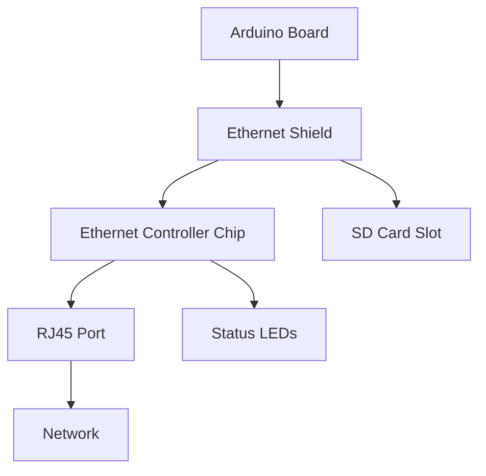

# Arduino Ethernet

## Introduction

Connecting your Arduino to a network opens up a world of possibilities for your projects. The Arduino Ethernet capability allows your microcontroller to communicate with other devices on a local network or even connect to the internet. This enables data exchange, remote monitoring, web server hosting, and much more.

In this tutorial, we'll explore how to use Ethernet with Arduino, from basic hardware setup to implementing various networking protocols. By the end, you'll be able to integrate network connectivity into your Arduino projects with confidence.

## Hardware Requirements

To follow along with this tutorial, you'll need:

- An Arduino board (UNO, Mega, or similar)
- An Arduino Ethernet Shield (or Arduino with built-in Ethernet like Arduino Ethernet)
- Ethernet cable
- Router or network switch
- USB cable for programming

## The Arduino Ethernet Shield

The Arduino Ethernet Shield is an expansion board that sits on top of your Arduino, providing network connectivity through a standard RJ45 Ethernet port.

### Key Components

- **Ethernet Controller**: Most shields use the Wiznet W5100 or W5500 chip that handles the networking protocols
- **RJ45 Connector**: For connecting a standard Ethernet cable
- **SD Card Slot** (on most models): For storing web pages or logging data
- **Status LEDs**: Indicators for connection status, data transfer, etc.



## Setting Up Your Arduino Ethernet

### Hardware Setup

1. Stack the Ethernet shield on top of your Arduino board, ensuring all pins align correctly
2. Connect the Ethernet cable from the shield to your router or network switch
3. Connect the Arduino to your computer via USB cable for programming

### Software Setup

Before writing any code, you need to include the Ethernet library:

```cpp
#include <SPI.h>
#include <Ethernet.h>
```

The SPI library is required for communication between the Arduino and the Ethernet controller chip.

### Basic Configuration

Every device on a network needs:

1. **MAC Address**: A unique identifier for your Arduino's Ethernet controller
2. **IP Address**: The network address for your Arduino

Here's how to configure these in your code:

```cpp
// MAC address for your Ethernet shield (should be unique on your network)
byte mac[] = { 0xDE, 0xAD, 0xBE, 0xEF, 0xFE, 0xED };

// IP address (if DHCP fails or isn't used)
IPAddress ip(192, 168, 1, 177);

void setup() {
  // Start serial for debugging
  Serial.begin(9600);
  
  // Initialize Ethernet with MAC and IP
  Ethernet.begin(mac, ip);
  
  // Print the IP address
  Serial.print("My IP address: ");
  Serial.println(Ethernet.localIP());
}

void loop() {
  // Your main code here
}
```

### Using DHCP

Instead of assigning a static IP, you can request an IP from your router using DHCP:

```cpp
void setup() {
  Serial.begin(9600);
  
  // Initialize Ethernet with just the MAC address
  // DHCP will assign the IP, gateway, and subnet
  if (Ethernet.begin(mac) == 0) {
    Serial.println("Failed to configure Ethernet using DHCP");
    // Try to configure using static IP if DHCP fails
    Ethernet.begin(mac, ip);
  }
  
  Serial.print("My IP address: ");
  Serial.println(Ethernet.localIP());
}
```

## Creating an Arduino Web Server

One of the most common applications for Arduino Ethernet is creating a simple web server. This allows you to serve web pages that can display data or control your Arduino remotely.

### Basic Web Server Example

```cpp
#include <SPI.h>
#include <Ethernet.h>

byte mac[] = { 0xDE, 0xAD, 0xBE, 0xEF, 0xFE, 0xED };
IPAddress ip(192, 168, 1, 177);

// Initialize the Ethernet server library
// with the IP address and port you want to use
// (port 80 is default for HTTP)
EthernetServer server(80);

void setup() {
  Serial.begin(9600);

  // Initialize Ethernet
  Ethernet.begin(mac, ip);
  
  // Start the server
  server.begin();
  
  Serial.print("Server is at ");
  Serial.println(Ethernet.localIP());
}

void loop() {
  // Listen for incoming clients
  EthernetClient client = server.available();
  
  if (client) {
    Serial.println("New client");
    
    // An HTTP request ends with a blank line
    boolean currentLineIsBlank = true;
    
    while (client.connected()) {
      if (client.available()) {
        char c = client.read();
        Serial.write(c);
        
        // If you've gotten to the end of the line (received a newline
        // character) and the line is blank, the HTTP request has ended,
        // so you can send a reply
        if (c == '
' && currentLineIsBlank) {
          // Send a standard HTTP response header
          client.println("HTTP/1.1 200 OK");
          client.println("Content-Type: text/html");
          client.println("Connection: close");  // the connection will be closed after completion of the response
          client.println();
          
          // Send the HTML page
          client.println("<!DOCTYPE HTML>");
          client.println("<html>");
          client.println("<head><title>Arduino Web Server</title></head>");
          client.println("<body>");
          client.println("<h1>Hello from Arduino!</h1>");
          client.println("<p>This is a basic web server.</p>");
          client.println("</body>");
          client.println("</html>");
          break;
        }
        
        if (c == '
') {
          // you're starting a new line
          currentLineIsBlank = true;
        } else if (c != '\r') {
          // you've gotten a character on the current line
          currentLineIsBlank = false;
        }
      }
    }
    
    // Give the web browser time to receive the data
    delay(1);
    
    // Close the connection
    client.stop();
    Serial.println("Client disconnected");
  }
}
```

### How It Works

1. The Arduino listens for incoming connections on port 80 (HTTP standard)
2. When a client connects (like a web browser), the Arduino processes the HTTP request
3. After receiving the request, it sends back an HTTP response with an HTML page
4. The connection is then closed

### Testing Your Web Server

1. Upload the code to your Arduino
2. Note the IP address displayed in the Serial Monitor
3. Open a web browser on a computer connected to the same network
4. Enter the Arduino's IP address in the address bar
5. You should see the "Hello from Arduino!" web page

## Reading Data with HTTP GET Requests

Your Arduino can also act as a client, fetching data from external servers using HTTP GET requests.

### Client Example: Getting Weather Data

```cpp
#include <SPI.h>
#include <Ethernet.h>

byte mac[] = { 0xDE, 0xAD, 0xBE, 0xEF, 0xFE, 0xED };
char server[] = "example.com";  // Server to connect to

EthernetClient client;

void setup() {
  Serial.begin(9600);
  
  // Initialize Ethernet
  if (Ethernet.begin(mac) == 0) {
    Serial.println("Failed to configure Ethernet using DHCP");
    // Try with a static IP
    IPAddress ip(192, 168, 1, 177);
    Ethernet.begin(mac, ip);
  }
  
  // Give the Ethernet shield a moment to initialize
  delay(1000);
  
  Serial.println("Connecting...");
  
  // If you get a connection, report back via serial
  if (client.connect(server, 80)) {
    Serial.println("Connected");
    // Make an HTTP request
    client.println("GET /path/to/data HTTP/1.1");
    client.println("Host: example.com");
    client.println("Connection: close");
    client.println();
  } 
  else {
    // If you didn't get a connection to the server
    Serial.println("Connection failed");
  }
}

void loop() {
  // If there are incoming bytes available
  // from the server, read them and print them
  if (client.available()) {
    char c = client.read();
    Serial.print(c);
  }
  
  // If the server's disconnected, stop the client
  if (!client.connected()) {
    Serial.println();
    Serial.println("Disconnecting.");
    client.stop();
    
    // Do nothing forevermore
    while (true);
  }
}
```

## Controlling Arduino Through the Web

Let's build a practical example: controlling an LED through a web interface.

### Web-Controlled LED Example

```cpp
#include <SPI.h>
#include <Ethernet.h>

byte mac[] = { 0xDE, 0xAD, 0xBE, 0xEF, 0xFE, 0xED };
IPAddress ip(192, 168, 1, 177);
EthernetServer server(80);

const int ledPin = 7;  // LED connected to digital pin 7

void setup() {
  // Initialize LED pin as output
  pinMode(ledPin, OUTPUT);
  
  // Start the serial communication
  Serial.begin(9600);
  
  // Initialize Ethernet
  Ethernet.begin(mac, ip);
  server.begin();
  
  Serial.print("Server is at ");
  Serial.println(Ethernet.localIP());
}

void loop() {
  // Listen for incoming clients
  EthernetClient client = server.available();
  
  if (client) {
    Serial.println("New client");
    
    // An HTTP request ends with a blank line
    boolean currentLineIsBlank = true;
    String receivedText = "";
    
    while (client.connected()) {
      if (client.available()) {
        char c = client.read();
        receivedText += c;
        
        // If you've gotten to the end of the line (received a newline
        // character) and the line is blank, the HTTP request has ended,
        // so you can send a reply
        if (c == '
' && currentLineIsBlank) {
          // Check if the request contains LED commands
          if (receivedText.indexOf("GET /led/on") != -1) {
            digitalWrite(ledPin, HIGH);
          } else if (receivedText.indexOf("GET /led/off") != -1) {
            digitalWrite(ledPin, LOW);
          }
          
          // Send a standard HTTP response header
          client.println("HTTP/1.1 200 OK");
          client.println("Content-Type: text/html");
          client.println("Connection: close");
          client.println();
          
          // Send the HTML page
          client.println("<!DOCTYPE HTML>");
          client.println("<html>");
          client.println("<head>");
          client.println("<title>Arduino LED Control</title>");
          client.println("<style>");
          client.println("body { font-family: Arial; text-align: center; margin-top: 50px; }");
          client.println(".button { display: inline-block; padding: 10px 20px; margin: 10px; font-size: 18px; cursor: pointer; }");
          client.println(".on { background-color: #4CAF50; color: white; }");
          client.println(".off { background-color: #f44336; color: white; }");
          client.println("</style>");
          client.println("</head>");
          client.println("<body>");
          client.println("<h1>Arduino LED Control</h1>");
          client.println("<p>Current state: ");
          
          // Print the current state
          if (digitalRead(ledPin) == HIGH) {
            client.println("ON");
          } else {
            client.println("OFF");
          }
          
          client.println("</p>");
          client.println("<a href=\"/led/on\"><button class=\"button on\">Turn ON</button></a>");
          client.println("<a href=\"/led/off\"><button class=\"button off\">Turn OFF</button></a>");
          client.println("</body>");
          client.println("</html>");
          
          break;
        }
        
        if (c == '
') {
          // you're starting a new line
          currentLineIsBlank = true;
        } else if (c != '\r') {
          // you've gotten a character on the current line
          currentLineIsBlank = false;
        }
      }
    }
    
    // Give the web browser time to receive the data
    delay(1);
    
    // Close the connection
    client.stop();
    Serial.println("Client disconnected");
  }
}
```

### How It Works

1. The web page includes two buttons: "Turn ON" and "Turn OFF"
2. Clicking a button sends a GET request to either `/led/on` or `/led/off`
3. The Arduino processes the request and turns the LED on or off accordingly
4. The page refreshes to show the current state

## Data Logging with SD Card

Many Ethernet shields include an SD card slot, allowing you to log data or serve files from the SD card.

### Reading and Writing to SD Card

```cpp
#include <SPI.h>
#include <Ethernet.h>
#include <SD.h>

byte mac[] = { 0xDE, 0xAD, 0xBE, 0xEF, 0xFE, 0xED };
IPAddress ip(192, 168, 1, 177);

const int chipSelect = 4;  // CS pin for the SD card

void setup() {
  Serial.begin(9600);
  
  // Initialize Ethernet
  Ethernet.begin(mac, ip);
  
  Serial.print("Initializing SD card...");
  
  // Initialize the SD card
  if (!SD.begin(chipSelect)) {
    Serial.println("SD card initialization failed!");
    return;
  }
  
  Serial.println("SD card initialized.");
  
  // Write to a file
  File dataFile = SD.open("log.txt", FILE_WRITE);
  
  if (dataFile) {
    dataFile.println("Arduino started at: " + String(millis()));
    dataFile.close();
    Serial.println("Wrote to log.txt");
  } else {
    Serial.println("Error opening log.txt");
  }
}

void loop() {
  // Log data every 10 seconds
  static unsigned long lastLog = 0;
  
  if (millis() - lastLog > 10000) {
    lastLog = millis();
    
    // Get some data to log (example: analog reading)
    int sensorValue = analogRead(A0);
    
    // Open the file
    File dataFile = SD.open("log.txt", FILE_WRITE);
    
    if (dataFile) {
      // Write the data
      dataFile.print(millis() / 1000);
      dataFile.print(",");
      dataFile.println(sensorValue);
      dataFile.close();
      
      Serial.println("Logged: " + String(sensorValue));
    } else {
      Serial.println("Error opening log.txt");
    }
  }
}
```

## Using MQTT for IoT Applications

MQTT (Message Queuing Telemetry Transport) is a lightweight messaging protocol ideal for IoT devices. It follows a publish-subscribe pattern, allowing devices to publish data to a topic and subscribe to receive updates.

```cpp
#include <SPI.h>
#include <Ethernet.h>
#include <PubSubClient.h>  // You'll need to install this library

byte mac[] = { 0xDE, 0xAD, 0xBE, 0xEF, 0xFE, 0xED };

// MQTT Broker details
const char* mqttServer = "broker.example.com";
const int mqttPort = 1883;
const char* mqttUser = "your_username";
const char* mqttPassword = "your_password";
const char* mqttClientId = "ArduinoClient";

// Topics
const char* subscribeTopic = "arduino/command";
const char* publishTopic = "arduino/status";

EthernetClient ethClient;
PubSubClient client(ethClient);

void setup() {
  Serial.begin(9600);
  
  // Initialize Ethernet
  if (Ethernet.begin(mac) == 0) {
    Serial.println("Failed to configure Ethernet using DHCP");
    // Try with a static IP
    IPAddress ip(192, 168, 1, 177);
    Ethernet.begin(mac, ip);
  }
  
  // Set MQTT server
  client.setServer(mqttServer, mqttPort);
  client.setCallback(callback);
  
  // Connect to MQTT
  connectMQTT();
}

void connectMQTT() {
  while (!client.connected()) {
    Serial.println("Connecting to MQTT...");
    
    if (client.connect(mqttClientId, mqttUser, mqttPassword)) {
      Serial.println("Connected to MQTT");
      
      // Subscribe to command topic
      client.subscribe(subscribeTopic);
      
      // Publish a connection message
      client.publish(publishTopic, "Arduino online");
    } else {
      Serial.print("Failed, rc=");
      Serial.print(client.state());
      Serial.println(" Retrying in 5 seconds...");
      delay(5000);
    }
  }
}

void callback(char* topic, byte* payload, unsigned int length) {
  // Handle incoming messages
  Serial.print("Message arrived [");
  Serial.print(topic);
  Serial.print("] ");
  
  String message = "";
  for (int i = 0; i < length; i++) {
    message += (char)payload[i];
  }
  
  Serial.println(message);
  
  // Example: Control an LED based on the message
  if (message == "on") {
    digitalWrite(7, HIGH);
    client.publish(publishTopic, "LED turned ON");
  } else if (message == "off") {
    digitalWrite(7, LOW);
    client.publish(publishTopic, "LED turned OFF");
  }
}

void loop() {
  // Maintain MQTT connection
  if (!client.connected()) {
    connectMQTT();
  }
  
  // Process MQTT messages
  client.loop();
  
  // Example: Publish sensor data every 30 seconds
  static unsigned long lastPublish = 0;
  if (millis() - lastPublish > 30000) {
    lastPublish = millis();
    
    // Read sensor
    int sensorValue = analogRead(A0);
    
    // Publish the value
    String payload = "sensor:" + String(sensorValue);
    client.publish(publishTopic, payload.c_str());
    
    Serial.println("Published: " + payload);
  }
}
```

## Real-World Application: Weather Station

Let's build a complete weather station that collects data from sensors, logs it to an SD card, and makes it available through a web interface.

### Hardware Requirements

- Arduino with Ethernet Shield
- Temperature and humidity sensor (DHT22 or similar)
- Barometric pressure sensor (BMP180 or similar)
- Light sensor (LDR or similar)
- SD card

### Weather Station Code

```cpp
#include <SPI.h>
#include <Ethernet.h>
#include <SD.h>
#include <DHT.h>
#include <Adafruit_BMP085.h>

// Network configuration
byte mac[] = { 0xDE, 0xAD, 0xBE, 0xEF, 0xFE, 0xED };
IPAddress ip(192, 168, 1, 177);
EthernetServer server(80);

// Sensor configuration
#define DHTPIN 2
#define DHTTYPE DHT22
DHT dht(DHTPIN, DHTTYPE);
Adafruit_BMP085 bmp;
const int lightPin = A0;

// SD card
const int chipSelect = 4;

// Data variables
float temperature = 0;
float humidity = 0;
float pressure = 0;
int light = 0;
unsigned long lastSensorRead = 0;
unsigned long lastDataLog = 0;

void setup() {
  Serial.begin(9600);
  
  // Initialize sensors
  dht.begin();
  if (!bmp.begin()) {
    Serial.println("Could not find BMP180 sensor!");
  }
  
  // Initialize Ethernet
  Ethernet.begin(mac, ip);
  server.begin();
  Serial.print("Server is at ");
  Serial.println(Ethernet.localIP());
  
  // Initialize SD card
  Serial.print("Initializing SD card...");
  if (!SD.begin(chipSelect)) {
    Serial.println("SD card initialization failed!");
  } else {
    Serial.println("SD card initialized.");
    
    // Create or open the data log file
    File dataFile = SD.open("weather.csv", FILE_WRITE);
    if (dataFile) {
      // If the file is new, write header
      if (dataFile.size() == 0) {
        dataFile.println("timestamp,temperature,humidity,pressure,light");
      }
      dataFile.close();
    }
  }
}

void loop() {
  // Read sensors every 10 seconds
  if (millis() - lastSensorRead > 10000) {
    lastSensorRead = millis();
    readSensors();
  }
  
  // Log data every minute
  if (millis() - lastDataLog > 60000) {
    lastDataLog = millis();
    logData();
  }
  
  // Handle web clients
  EthernetClient client = server.available();
  if (client) {
    handleWebRequest(client);
  }
}

void readSensors() {
  // Read DHT22
  humidity = dht.readHumidity();
  temperature = dht.readTemperature();
  
  // Read BMP180
  pressure = bmp.readPressure() / 100.0; // Convert Pa to hPa
  
  // Read light sensor
  light = analogRead(lightPin);
  
  Serial.println("Sensor readings:");
  Serial.print("Temperature: "); Serial.print(temperature); Serial.println(" °C");
  Serial.print("Humidity: "); Serial.print(humidity); Serial.println(" %");
  Serial.print("Pressure: "); Serial.print(pressure); Serial.println(" hPa");
  Serial.print("Light: "); Serial.println(light);
}

void logData() {
  File dataFile = SD.open("weather.csv", FILE_WRITE);
  
  if (dataFile) {
    // Format: timestamp,temperature,humidity,pressure,light
    dataFile.print(millis() / 1000); // timestamp in seconds
    dataFile.print(",");
    dataFile.print(temperature);
    dataFile.print(",");
    dataFile.print(humidity);
    dataFile.print(",");
    dataFile.print(pressure);
    dataFile.print(",");
    dataFile.println(light);
    dataFile.close();
    
    Serial.println("Data logged to SD card");
  } else {
    Serial.println("Error opening weather.csv");
  }
}

void handleWebRequest(EthernetClient client) {
  boolean currentLineIsBlank = true;
  String header = "";
  
  while (client.connected()) {
    if (client.available()) {
      char c = client.read();
      
      // Read HTTP request
      if (header.length() < 100) {
        header += c;
      }
      
      // If we've reached the end of the HTTP request
      if (c == '
' && currentLineIsBlank) {
        // Send HTTP response
        client.println("HTTP/1.1 200 OK");
        client.println("Content-Type: text/html");
        client.println("Connection: close");
        client.println();
        
        // Check if client is requesting data in JSON format
        if (header.indexOf("GET /data.json") >= 0) {
          // Send data in JSON format
          client.print("{");
          client.print("\"temperature\":");
          client.print(temperature);
          client.print(",\"humidity\":");
          client.print(humidity);
          client.print(",\"pressure\":");
          client.print(pressure);
          client.print(",\"light\":");
          client.print(light);
          client.print("}");
        } else {
          // Send HTML page
          client.println("<!DOCTYPE HTML>");
          client.println("<html>");
          client.println("<head>");
          client.println("<title>Arduino Weather Station</title>");
          client.println("<meta http-equiv='refresh' content='30'>");
          client.println("<style>");
          client.println("body { font-family: Arial; margin: 20px; }");
          client.println(".sensor { margin: 10px; padding: 10px; border: 1px solid #ddd; border-radius: 5px; }");
          client.println("h1 { color: #2c3e50; }");
          client.println("</style>");
          client.println("</head>");
          client.println("<body>");
          client.println("<h1>Arduino Weather Station</h1>");
          
          client.println("<div class='sensor'>");
          client.println("<h2>Temperature</h2>");
          client.print("<p>");
          client.print(temperature);
          client.println(" &deg;C</p>");
          client.println("</div>");
          
          client.println("<div class='sensor'>");
          client.println("<h2>Humidity</h2>");
          client.print("<p>");
          client.print(humidity);
          client.println(" %</p>");
          client.println("</div>");
          
          client.println("<div class='sensor'>");
          client.println("<h2>Pressure</h2>");
          client.print("<p>");
          client.print(pressure);
          client.println(" hPa</p>");
          client.println("</div>");
          
          client.println("<div class='sensor'>");
          client.println("<h2>Light Level</h2>");
          client.print("<p>");
          client.print(light);
          client.println("</p>");
          client.println("</div>");
          
          client.println("<p><small>Last update: ");
          client.print(millis() / 1000);
          client.println(" seconds since start</small></p>");
          client.println("</body>");
          client.println("</html>");
        }
        break;
      }
      
      if (c == '
') {
        currentLineIsBlank = true;
      } else if (c != '\r') {
        currentLineIsBlank = false;
      }
    }
  }
  
  delay(1);
  client.stop();
  Serial.println("Client disconnected");
}
```

## Troubleshooting Common Issues

### Connection Problems

1. **No IP Address Assigned**
   - Check if your router has DHCP enabled
   - Verify network cable connection
   - Try using a static IP address

2. **Can't Connect to Web Server**
   - Ensure you're using the correct IP address
   - Check if your firewall is blocking the connection
   - Verify the Arduino and client are on the same network

### Hardware Issues

1. **Shield Not Detected**
   - Make sure the shield is properly seated on the Arduino
   - Check for bent pins
   - Verify the SPI connections

2. **Communication Failures**
   - Reset the Ethernet shield by cycling power
   - Check for conflicting SPI devices
   - Try a different Ethernet cable

### Network Configuration

1. **IP Address Conflict**
   - Use a static IP outside your router's DHCP range
   - Check if another device is using the same IP

2. **DNS Failures**
   - Use IP addresses instead of domain names for testing
   - Check your DNS server configuration

## Summary

In this tutorial, you've learned how to:

- Set up an Arduino with an Ethernet shield
- Configure network parameters (MAC, IP, etc.)
- Create a basic web server that can display data
- Control your Arduino remotely through a web interface
- Make HTTP requests to fetch data from external servers
- Log data to an SD card
- Use MQTT for IoT applications
- Build a complete weather station project

Ethernet connectivity opens up endless possibilities for your Arduino projects, allowing them to communicate with other devices, access online resources, and be controlled remotely.

## Additional Resources

- [Arduino Ethernet Library Reference](https://www.arduino.cc/reference/en/libraries/ethernet/)
- [Arduino Web Server Tutorial](https://www.arduino.cc/en/Tutorial/WebServer)
- [More about MQTT Protocol](https://mqtt.org/)

## Exercises

1. **Basic Web Server**: Modify the web server example to display the values of all analog inputs.

2. **Data Logger**: Create a project that logs temperature readings to an SD card every hour and provides a web interface to view the history.

3. **Remote Control**: Expand the LED control example to manage multiple outputs (like a relay board) through a web interface.

4. **MQTT Integration**: Build a home automation system that uses MQTT to communicate between multiple Arduino devices.

5. **Weather API Client**: Program your Arduino to fetch weather data from a public API and display it on an LCD screen.