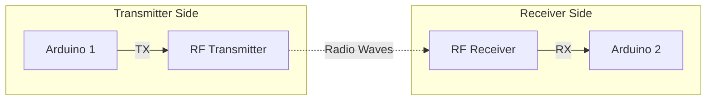

# Arduino RF Communication

## Introduction

Radio Frequency (RF) communication allows Arduino devices to wirelessly transmit and receive data over short to medium distances without requiring line-of-sight. This tutorial explores how to implement wireless communication using affordable RF modules with your Arduino projects.

RF communication provides a simple yet effective way to build wireless Arduino networks for home automation, remote sensing, robotics, and many other applications where connecting wires would be impractical.

## What is RF Communication?

RF communication uses radio waves to transmit information through the air. In the Arduino context, we typically work with:

- **RF Frequency**: Most common modules operate at 315MHz or 433MHz (unlicensed bands)
- **Range**: Typically 3-100 meters depending on module quality, antenna, and environment
- **Data Rate**: Usually between 1-10 kbps
- **Modulation**: Amplitude Shift Keying (ASK) or Frequency Shift Keying (FSK)

## Required Hardware

To follow along with this tutorial, you'll need:

1. Two Arduino boards (Uno, Nano, or similar)
2. 433MHz RF transmitter and receiver module pair
3. Jumper wires
4. Breadboard
5. Optional: External antenna for extended range

Common RF module pairs look like this:

- Transmitter: A small PCB with 3 pins (VCC, DATA, GND)
- Receiver: A slightly larger PCB with 4 pins (VCC, DATA, DATA, GND)

## Setting Up the Hardware

### Transmitter Connections

| Transmitter Pin | Arduino Pin |
|-----------------|-------------|
| VCC             | 5V          |
| DATA            | Digital Pin 12 |
| GND             | GND         |

### Receiver Connections

| Receiver Pin | Arduino Pin |
|--------------|-------------|
| VCC          | 5V          |
| DATA         | Digital Pin 11 |
| GND          | GND         |

Here's a diagram of the connections:



## Required Libraries

We'll use the `VirtualWire` library, which is one of the most popular libraries for basic RF communication with Arduino. You can install it via the Arduino Library Manager.

Alternatively, you can use the newer `RadioHead` library, which offers more features and better reliability.

To install via the Library Manager:

1. Open Arduino IDE
2. Go to Sketch > Include Library > Manage Libraries
3. Search for "VirtualWire" or "RadioHead"
4. Click Install

## Basic Communication Example

Let's implement a simple example where one Arduino sends a message and the other receives it.

### Transmitter Code

```cpp
#include <VirtualWire.h>

const int transmit_pin = 12;
const int led_pin = 13;

void setup() {
  pinMode(led_pin, OUTPUT);
  
  // Initialize the IO and ISR
  vw_set_tx_pin(transmit_pin);
  vw_setup(2000);  // Bits per second
}

void loop() {
  const char *msg = "Hello from Arduino";
  
  digitalWrite(led_pin, HIGH); // Flash LED to show transmitting
  vw_send((uint8_t *)msg, strlen(msg));
  vw_wait_tx(); // Wait until the whole message is gone
  digitalWrite(led_pin, LOW);
  
  delay(1000); // Send message every second
}
```

### Receiver Code

```cpp
#include <VirtualWire.h>

const int receive_pin = 11;
const int led_pin = 13;

void setup() {
  Serial.begin(9600); // Setup serial for debug
  pinMode(led_pin, OUTPUT);
  
  // Initialize the IO and ISR
  vw_set_rx_pin(receive_pin);
  vw_setup(2000);  // Bits per second
  
  vw_rx_start(); // Start the receiver
  
  Serial.println("Ready to receive messages...");
}

void loop() {
  uint8_t buf[VW_MAX_MESSAGE_LEN];
  uint8_t buflen = VW_MAX_MESSAGE_LEN;
  
  if (vw_get_message(buf, &buflen)) { // Non-blocking
    digitalWrite(led_pin, HIGH); // Flash LED to show received message
    
    // Message with a good checksum received, print it
    Serial.print("Message received: ");
    
    for (int i = 0; i < buflen; i++) {
      Serial.write(buf[i]);
    }
    Serial.println();
    
    digitalWrite(led_pin, LOW);
  }
}
```

### Expected Output

When you upload these sketches to your Arduinos:

1. The transmitter's LED will flash briefly every second as it sends messages
2. The receiver's LED will flash whenever it receives a message
3. In the Serial Monitor (9600 baud) connected to the receiver Arduino, you'll see:
   ```
   Ready to receive messages...
   Message received: Hello from Arduino
   Message received: Hello from Arduino
   Message received: Hello from Arduino
   ```

## Advanced Example: Sending Sensor Data

Let's create a more practical example where we send temperature and humidity data from one Arduino to another.

### Transmitter with DHT11 Sensor

```cpp
#include <VirtualWire.h>
#include <DHT.h>

#define DHTPIN 2      // DHT11 data pin
#define DHTTYPE DHT11 // DHT11 sensor type
#define TX_PIN 12     // RF transmitter data pin

DHT dht(DHTPIN, DHTTYPE);

void setup() {
  Serial.begin(9600);
  dht.begin();
  
  // Initialize transmitter
  vw_set_tx_pin(TX_PIN);
  vw_setup(2000); // 2000 bits per second
  
  Serial.println("DHT11 + RF Transmitter Test");
}

void loop() {
  // Wait between measurements
  delay(2000);
  
  // Read humidity and temperature
  float h = dht.readHumidity();
  float t = dht.readTemperature();
  
  // Check if any reads failed
  if (isnan(h) || isnan(t)) {
    Serial.println("Failed to read from DHT sensor!");
    return;
  }
  
  // Create message string with temperature and humidity
  char msg[32];
  sprintf(msg, "T:%.1f,H:%.1f", t, h);
  
  Serial.print("Sending: ");
  Serial.println(msg);
  
  // Send the message
  vw_send((uint8_t *)msg, strlen(msg));
  vw_wait_tx(); // Wait until the whole message is gone
  
  delay(5000); // Wait 5 seconds before next reading
}
```

### Receiver with Serial Display

```cpp
#include <VirtualWire.h>

#define RX_PIN 11     // RF receiver data pin

void setup() {
  Serial.begin(9600);
  
  // Initialize receiver
  vw_set_rx_pin(RX_PIN);
  vw_setup(2000); // 2000 bits per second
  
  // Start the receiver
  vw_rx_start();
  
  Serial.println("RF Receiver Ready");
}

void loop() {
  uint8_t buf[VW_MAX_MESSAGE_LEN];
  uint8_t buflen = VW_MAX_MESSAGE_LEN;
  
  // Check if a message was received
  if (vw_get_message(buf, &buflen)) {
    // Message received
    Serial.print("Received: ");
    
    // Convert received bytes to a string
    char message[buflen + 1];
    for (int i = 0; i < buflen; i++) {
      message[i] = (char)buf[i];
    }
    message[buflen] = '\0'; // Null terminate the string
    
    Serial.println(message);
    
    // Parse temperature and humidity
    float temperature = 0.0;
    float humidity = 0.0;
    
    // Basic parsing - assumes format "T:xx.x,H:xx.x"
    if (sscanf(message, "T:%f,H:%f", &temperature, &humidity) == 2) {
      Serial.print("Temperature: ");
      Serial.print(temperature);
      Serial.print(" °C, Humidity: ");
      Serial.print(humidity);
      Serial.println(" %");
    }
  }
}
```

## Improving RF Communication

### Adding an External Antenna

To extend the range of your RF modules:

1. Cut a piece of solid core wire to the appropriate length:
   - For 433 MHz: 16.5 cm (1/4 wavelength)
   - For 315 MHz: 23.9 cm (1/4 wavelength)

2. Solder the wire to the ANT pad or pin on both the transmitter and receiver modules.

### Dealing with Interference

RF communication can be affected by interference. Here are some tips to improve reliability:

1. **Use error checking**: Implement checksums or CRC in your messages
2. **Message acknowledgment**: Have the receiver send back confirmation
3. **Retry mechanism**: Resend messages if acknowledgment is not received
4. **Use the RadioHead library**: It has built-in reliability features

### Code Example with Error Checking

Here's how to implement a simple checksum with the VirtualWire library:

```cpp
// Transmitter side
void sendWithChecksum(const char* message) {
  int msgLength = strlen(message);
  char buffer[msgLength + 2]; // Original message + 1-byte checksum + null terminator
  
  // Copy original message
  strcpy(buffer, message);
  
  // Calculate simple checksum (XOR of all bytes)
  uint8_t checksum = 0;
  for (int i = 0; i < msgLength; i++) {
    checksum ^= message[i];
  }
  
  // Add checksum to end of message
  buffer[msgLength] = checksum;
  buffer[msgLength + 1] = '\0';
  
  // Send message with checksum
  vw_send((uint8_t *)buffer, msgLength + 1);
  vw_wait_tx();
}
```

```cpp
// Receiver side
bool receiveWithChecksum(char* message, uint8_t* msgLength) {
  uint8_t buf[VW_MAX_MESSAGE_LEN];
  uint8_t buflen = VW_MAX_MESSAGE_LEN;
  
  if (vw_get_message(buf, &buflen)) {
    if (buflen > 1) { // Need at least one byte of message + checksum
      // Calculate checksum of received message (excluding the last byte)
      uint8_t calculatedChecksum = 0;
      for (int i = 0; i < buflen - 1; i++) {
        calculatedChecksum ^= buf[i];
      }
      
      // Compare with received checksum (last byte)
      if (calculatedChecksum == buf[buflen - 1]) {
        // Checksum matches, copy message without checksum
        for (int i = 0; i < buflen - 1; i++) {
          message[i] = (char)buf[i];
        }
        message[buflen - 1] = '\0'; // Null terminate
        *msgLength = buflen - 1;
        return true;
      }
    }
  }
  return false;
}
```

## Real-World Application: Wireless Weather Station

Let's put everything together to build a simple wireless weather station:

### Transmitter Station (Outdoors)

```cpp
#include <VirtualWire.h>
#include <DHT.h>

#define DHTPIN 2
#define DHTTYPE DHT22  // Using DHT22 for better accuracy
#define TX_PIN 12
#define RAIN_SENSOR_PIN A0
#define LIGHT_SENSOR_PIN A1

DHT dht(DHTPIN, DHTTYPE);

void setup() {
  Serial.begin(9600);
  dht.begin();
  
  pinMode(RAIN_SENSOR_PIN, INPUT);
  pinMode(LIGHT_SENSOR_PIN, INPUT);
  
  vw_set_tx_pin(TX_PIN);
  vw_setup(2000);
  
  Serial.println("Weather Station Transmitter Initialized");
}

void loop() {
  float humidity = dht.readHumidity();
  float temperature = dht.readTemperature();
  int rainLevel = analogRead(RAIN_SENSOR_PIN);
  int lightLevel = analogRead(LIGHT_SENSOR_PIN);
  
  if (isnan(humidity) || isnan(temperature)) {
    Serial.println("Failed to read from DHT sensor!");
    return;
  }
  
  char msg[64];
  sprintf(msg, "T:%.1f,H:%.1f,R:%d,L:%d", temperature, humidity, rainLevel, lightLevel);
  
  Serial.print("Sending: ");
  Serial.println(msg);
  
  // Add checksum and send
  int msgLength = strlen(msg);
  uint8_t checksum = 0;
  
  for (int i = 0; i < msgLength; i++) {
    checksum ^= msg[i];
  }
  
  char buffer[msgLength + 2];
  strcpy(buffer, msg);
  buffer[msgLength] = checksum;
  buffer[msgLength + 1] = '\0';
  
  vw_send((uint8_t *)buffer, msgLength + 1);
  vw_wait_tx();
  
  // Wait 10 minutes before next reading for a real application
  // For testing, use a shorter interval
  delay(30000);
}
```

### Receiver Station (Indoors with LCD Display)

```cpp
#include <VirtualWire.h>
#include <LiquidCrystal_I2C.h>

#define RX_PIN 11

// Set the LCD address to 0x27 for a 16 chars and 2 line display
LiquidCrystal_I2C lcd(0x27, 16, 2);

unsigned long lastUpdateTime = 0;
const unsigned long UPDATE_INTERVAL = 60000; // 1 minute timeout

void setup() {
  Serial.begin(9600);
  
  // Initialize LCD
  lcd.init();
  lcd.backlight();
  lcd.print("Weather Station");
  lcd.setCursor(0, 1);
  lcd.print("Initializing...");
  
  // Initialize receiver
  vw_set_rx_pin(RX_PIN);
  vw_setup(2000);
  vw_rx_start();
  
  Serial.println("Weather Station Receiver Ready");
}

void loop() {
  uint8_t buf[VW_MAX_MESSAGE_LEN];
  uint8_t buflen = VW_MAX_MESSAGE_LEN;
  
  unsigned long currentTime = millis();
  
  // Check if we've received a message
  if (vw_get_message(buf, &buflen)) {
    if (buflen > 1) { // Need at least one byte of message + checksum
      // Verify checksum
      uint8_t calculatedChecksum = 0;
      for (int i = 0; i < buflen - 1; i++) {
        calculatedChecksum ^= buf[i];
      }
      
      if (calculatedChecksum == buf[buflen - 1]) {
        // Valid message received
        
        // Convert to null-terminated string (excluding checksum)
        char message[buflen];
        for (int i = 0; i < buflen - 1; i++) {
          message[i] = (char)buf[i];
        }
        message[buflen - 1] = '\0';
        
        Serial.print("Valid message: ");
        Serial.println(message);
        
        // Parse weather data
        float temperature = 0.0;
        float humidity = 0.0;
        int rainLevel = 0;
        int lightLevel = 0;
        
        if (sscanf(message, "T:%f,H:%f,R:%d,L:%d", &temperature, &humidity, &rainLevel, &lightLevel) == 4) {
          // Update LCD with new weather data
          lcd.clear();
          lcd.setCursor(0, 0);
          lcd.print("T:");
          lcd.print(temperature, 1);
          lcd.print("C H:");
          lcd.print(humidity, 0);
          lcd.print("%");
          
          lcd.setCursor(0, 1);
          lcd.print("Rain:");
          
          // Convert rain level to descriptive text
          if (rainLevel < 300) {
            lcd.print("Heavy");
          } else if (rainLevel < 500) {
            lcd.print("Light");
          } else {
            lcd.print("None");
          }
          
          // Update last update time
          lastUpdateTime = currentTime;
        }
      } else {
        Serial.println("Checksum error!");
      }
    }
  }
  
  // Check if we haven't received an update in a while
  if (currentTime - lastUpdateTime > UPDATE_INTERVAL && lastUpdateTime > 0) {
    lcd.setCursor(0, 1);
    lcd.print("No signal      ");
  }
}
```

## Common Issues and Troubleshooting

Here are some common issues you might encounter with RF communication:

### Limited Range

- **Solution**: Add an external antenna of the correct length (16.5cm for 433MHz)
- **Solution**: Place transmitter and receiver higher off the ground
- **Solution**: Remove obstacles between devices

### Intermittent Communication

- **Solution**: Add capacitors (0.1μF) between VCC and GND pins on both modules
- **Solution**: Implement error checking and retransmission
- **Solution**: Reduce transmission speed (bits per second)

### Data Corruption

- **Solution**: Implement checksums or CRC
- **Solution**: Use the RadioHead library instead of VirtualWire
- **Solution**: Ensure adequate power supply (RF modules can be power-hungry)

## Beyond Basic RF Modules

Once you're comfortable with basic RF modules, you might want to explore more advanced options:

1. **nRF24L01+**: 2.4GHz transceiver with higher data rates (up to 2Mbps)
2. **HC-12**: 433MHz transceiver with longer range (up to 1km)
3. **LoRa modules**: Very long range (kilometers) with low power usage

Each of these options offers different capabilities and trade-offs in terms of range, power consumption, and complexity.

## Summary

In this tutorial, we've learned:

- The basics of RF communication with Arduino
- How to connect and use 433MHz RF transmitter and receiver modules
- Writing code for basic wireless communication
- Implementing error checking for reliable data transfer
- Creating a practical wireless weather station project

RF communication opens up a world of possibilities for your Arduino projects, allowing you to create wireless networks, remote sensors, and control systems without complex or expensive hardware.

## Exercises

1. Modify the weather station example to also send battery voltage information
2. Implement a bidirectional communication system with acknowledgments
3. Create a multi-node network with three or more Arduino devices
4. Add a data logging feature to the receiver to track weather changes over time
5. Implement a remote control system using RF to control LEDs or motors

## Additional Resources

- [RadioHead Library Documentation](https://www.airspayce.com/mikem/arduino/RadioHead/)
- [Arduino RF Communication Tutorial (Arduino Official)](https://www.arduino.cc/reference/en/libraries/radiohead/)
- [RF Communication Physics and Theory](https://learn.sparkfun.com/tutorials/rf-communication-basics/all)