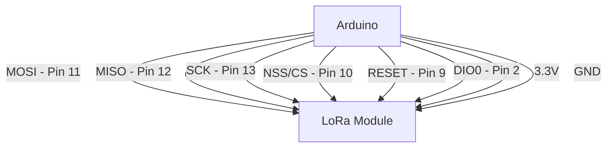
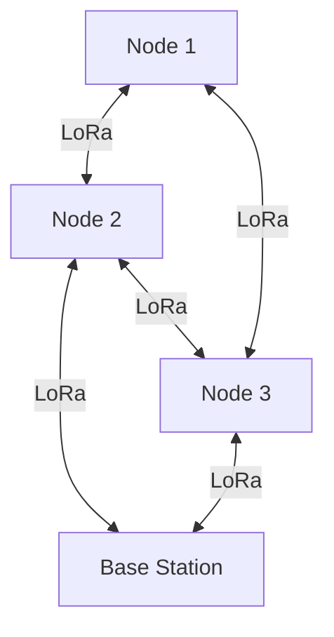

# Arduino LoRa Communication

## Introduction

LoRa (Long Range) is a low-power wireless communication technology designed for IoT (Internet of Things) applications that require long-range connectivity with minimal battery consumption. When combined with Arduino, LoRa enables makers and developers to create projects that can communicate over distances of several kilometers, even in urban environments.

In this tutorial, we'll explore how to implement LoRa communication between Arduino boards, understand the key concepts, and create practical applications that leverage this powerful technology.

## What is LoRa?

LoRa is a spread spectrum modulation technique derived from chirp spread spectrum (CSS) technology. It offers several key advantages for IoT and remote sensing applications:

- **Long-range communication**: Up to 10+ km in rural areas and 2-5 km in urban settings
- **Low power consumption**: Ideal for battery-powered devices
- **Small data packets**: Perfect for sensor data transmission
- **License-free operation**: Uses ISM (Industrial, Scientific, and Medical) radio bands
- **Resistance to interference**: Robust in noisy RF environments

## Hardware Requirements

To follow this tutorial, you'll need:

1. **Two Arduino boards** (Uno, Nano, or similar)
2. **Two LoRa modules** (e.g., RFM95, SX1276, or SX1278)
3. **Connecting wires**
4. **Breadboards**
5. **Antennas** (improves range significantly)

## LoRa Module Pinout and Connection

Most LoRa modules communicate with Arduino using the SPI (Serial Peripheral Interface) protocol. Here's a typical connection diagram:



Here's the connection table for Arduino Uno and a typical LoRa module:

| LoRa Module Pin | Arduino Pin |
|-----------------|-------------|
| VCC             | 3.3V        |
| GND             | GND         |
| MISO            | 12          |
| MOSI            | 11          |
| SCK             | 13          |
| NSS/CS          | 10          |
| RESET           | 9           |
| DIO0            | 2           |

:::caution
Most LoRa modules operate at 3.3V, while many Arduino boards use 5V logic. Make sure your LoRa module can handle 5V logic levels or use a level shifter to prevent damage.
:::

## Setting Up the Arduino Environment

Before we start coding, we need to install the appropriate library for LoRa communication.

1. Open the Arduino IDE
2. Go to **Sketch > Include Library > Manage Libraries**
3. Search for "LoRa" by Sandeep Mistry
4. Install the library

## Basic LoRa Sender Example

Let's start with a simple example that sends a message from one Arduino to another using LoRa. First, here's the code for the sender:

```cpp
#include <SPI.h>
#include <LoRa.h>

// LoRa pins
#define SS 10
#define RST 9
#define DIO0 2

int counter = 0;

void setup() {
  Serial.begin(9600);
  while (!Serial);

  Serial.println("LoRa Sender");

  // Setup LoRa module
  LoRa.setPins(SS, RST, DIO0);
  
  // Replace the frequency with your regional frequency (e.g., 915E6 for US, 868E6 for EU)
  if (!LoRa.begin(915E6)) {
    Serial.println("Starting LoRa failed!");
    while (1);
  }
  
  // Improve sensitivity at the cost of more current consumption
  LoRa.setSpreadingFactor(12);
  
  // Specify transmission power (can be 5-23 dBm)
  LoRa.setTxPower(20);
}

void loop() {
  Serial.print("Sending packet: ");
  Serial.println(counter);

  // Begin packet
  LoRa.beginPacket();
  
  // Add message content
  LoRa.print("Hello from Arduino ");
  LoRa.print(counter);
  
  // End and send packet
  LoRa.endPacket();

  counter++;
  
  delay(5000);  // Wait 5 seconds before sending the next message
}
```

## Basic LoRa Receiver Example

Now, here's the code for the receiver:

```cpp
#include <SPI.h>
#include <LoRa.h>

// LoRa pins
#define SS 10
#define RST 9
#define DIO0 2

void setup() {
  Serial.begin(9600);
  while (!Serial);

  Serial.println("LoRa Receiver");

  // Setup LoRa module
  LoRa.setPins(SS, RST, DIO0);
  
  // Replace the frequency with your regional frequency (e.g., 915E6 for US, 868E6 for EU)
  if (!LoRa.begin(915E6)) {
    Serial.println("Starting LoRa failed!");
    while (1);
  }
  
  // Use the same spreading factor as the sender
  LoRa.setSpreadingFactor(12);
}

void loop() {
  // Try to parse packet
  int packetSize = LoRa.parsePacket();
  
  if (packetSize) {
    // Received a packet
    Serial.print("Received packet '");

    // Read packet
    while (LoRa.available()) {
      Serial.print((char)LoRa.read());
    }

    // Print RSSI
    Serial.print("' with RSSI ");
    Serial.println(LoRa.packetRssi());
  }
}
```

### Expected Output

**Sender Serial Monitor:**
```
LoRa Sender
Sending packet: 0
Sending packet: 1
Sending packet: 2
...
```

**Receiver Serial Monitor:**
```
LoRa Receiver
Received packet 'Hello from Arduino 0' with RSSI -52
Received packet 'Hello from Arduino 1' with RSSI -54
Received packet 'Hello from Arduino 2' with RSSI -53
...
```

## Understanding Key LoRa Parameters

LoRa performance depends on several parameters that can be adjusted to optimize for range, power consumption, or data rate:

### Spreading Factor (SF)

The spreading factor (SF) determines how much the signal is spread in frequency. Higher values (7-12) provide:
- Longer range
- Better resistance to interference
- Lower data rate
- Higher power consumption

```cpp
// Set spreading factor (7-12)
LoRa.setSpreadingFactor(10);
```

### Bandwidth (BW)

Bandwidth affects how wide the transmission signal is:
- Narrower bandwidth (e.g., 125 kHz) provides longer range but slower data rate
- Wider bandwidth (e.g., 500 kHz) offers faster data rate but shorter range

```cpp
// Set bandwidth (options: 125E3, 250E3, 500E3)
LoRa.setSignalBandwidth(125E3);
```

### Coding Rate (CR)

The coding rate adds redundancy to improve error correction:
- Higher values (4/5 to 4/8) provide better error correction but reduce data rate

```cpp
// Set coding rate (5-8, representing 4/5 to 4/8)
LoRa.setCodingRate4(5);
```

### Transmit Power

Controls the power output of the transmitter:
- Higher values (up to 20-23 dBm) offer longer range but consume more power

```cpp
// Set transmit power (2-20 for RFM95, values in dBm)
LoRa.setTxPower(17);
```

## Advanced Example: Temperature Sensor Network

Let's build a more practical example: a temperature monitoring network where a sensor node sends temperature readings to a base station.

### Sensor Node (Sender)

```cpp
#include <SPI.h>
#include <LoRa.h>

// If using a temperature sensor like DHT11/DHT22
#include <DHT.h>
#define DHTPIN 7
#define DHTTYPE DHT22

// LoRa pins
#define SS 10
#define RST 9
#define DIO0 2

// Node ID
#define NODE_ID 1

DHT dht(DHTPIN, DHTTYPE);
unsigned long lastSendTime = 0;
const int sendInterval = 30000;  // Send every 30 seconds

void setup() {
  Serial.begin(9600);
  while (!Serial);

  Serial.println("LoRa Temperature Sensor Node");
  
  dht.begin();

  // Setup LoRa module
  LoRa.setPins(SS, RST, DIO0);
  
  if (!LoRa.begin(915E6)) {
    Serial.println("Starting LoRa failed!");
    while (1);
  }
  
  // Configure LoRa parameters for long range
  LoRa.setSpreadingFactor(10);     // Range 7-12
  LoRa.setSignalBandwidth(125E3);  // 125 kHz
  LoRa.setCodingRate4(5);          // 4/5
  LoRa.setTxPower(17);             // 17 dBm
  
  Serial.println("LoRa Sensor Node Initialized");
}

void loop() {
  unsigned long currentTime = millis();
  
  if (currentTime - lastSendTime > sendInterval) {
    lastSendTime = currentTime;
    
    // Read temperature and humidity
    float temperature = dht.readTemperature();
    float humidity = dht.readHumidity();
    
    // Check if readings are valid
    if (isnan(temperature) || isnan(humidity)) {
      Serial.println("Failed to read from DHT sensor!");
      return;
    }
    
    Serial.print("Temperature: ");
    Serial.print(temperature);
    Serial.println(" °C");
    
    // Create data packet
    String data = String(NODE_ID) + ":" + String(temperature, 1) + ":" + String(humidity, 1);
    
    // Send packet
    LoRa.beginPacket();
    LoRa.print(data);
    LoRa.endPacket();
    
    Serial.print("Sent data: ");
    Serial.println(data);
  }
}
```

### Base Station (Receiver)

```cpp
#include <SPI.h>
#include <LoRa.h>

// LoRa pins
#define SS 10
#define RST 9
#define DIO0 2

void setup() {
  Serial.begin(9600);
  while (!Serial);

  Serial.println("LoRa Base Station");

  // Setup LoRa module
  LoRa.setPins(SS, RST, DIO0);
  
  if (!LoRa.begin(915E6)) {
    Serial.println("Starting LoRa failed!");
    while (1);
  }
  
  // Use the same parameters as the sender
  LoRa.setSpreadingFactor(10);
  LoRa.setSignalBandwidth(125E3);
  LoRa.setCodingRate4(5);
  
  Serial.println("LoRa Base Station Initialized");
}

void loop() {
  // Try to parse packet
  int packetSize = LoRa.parsePacket();
  
  if (packetSize) {
    // Read packet
    String receivedData = "";
    while (LoRa.available()) {
      receivedData += (char)LoRa.read();
    }
    
    int rssi = LoRa.packetRssi();
    
    // Parse data (format: NODE_ID:TEMPERATURE:HUMIDITY)
    int separatorPos1 = receivedData.indexOf(':');
    int separatorPos2 = receivedData.indexOf(':', separatorPos1 + 1);
    
    if (separatorPos1 > 0 && separatorPos2 > 0) {
      int nodeId = receivedData.substring(0, separatorPos1).toInt();
      float temperature = receivedData.substring(separatorPos1 + 1, separatorPos2).toFloat();
      float humidity = receivedData.substring(separatorPos2 + 1).toFloat();
      
      // Print received data
      Serial.print("Node ");
      Serial.print(nodeId);
      Serial.print(" | Temp: ");
      Serial.print(temperature);
      Serial.print(" °C | Humidity: ");
      Serial.print(humidity);
      Serial.print("% | RSSI: ");
      Serial.print(rssi);
      Serial.println(" dBm");
    }
  }
}
```

## Creating a LoRa Mesh Network

For more complex projects, you might want to create a mesh network where multiple nodes can communicate with each other. Here's a simple concept for implementing a basic mesh network:



In a mesh network, each node:
1. Has a unique ID
2. Can receive and forward messages
3. Maintains a routing table (which nodes it can reach)

Implementing a full mesh network is beyond the scope of this tutorial, but libraries like RadioHead provide mesh networking capabilities for LoRa modules.

## LoRa vs. Other Wireless Technologies

Here's how LoRa compares to other popular wireless technologies:

| Feature | LoRa | WiFi | Bluetooth | ZigBee |
|---------|------|------|-----------|--------|
| Range | 2-15km | 50-100m | 10-100m | 10-100m |
| Power Consumption | Very Low | High | Low | Very Low |
| Data Rate | 0.3-50 kbps | Up to 1 Gbps | Up to 3 Mbps | 250 kbps |
| Network Topology | Star, Mesh | Star | Star, Mesh | Mesh |
| Use Case | IoT, Sensor Networks | Internet Access | Short Range Devices | Home Automation |

## Troubleshooting LoRa Communication

If you're having issues with your LoRa communication, check these common problems:

1. **No communication**:
   - Verify wiring connections
   - Ensure both devices use the same frequency
   - Check that antennas are properly connected
   - Verify power supply is adequate

2. **Short range**:
   - Increase transmit power (`setTxPower`)
   - Use higher spreading factor (`setSpreadingFactor`)
   - Improve antenna positioning
   - Reduce bandwidth (`setSignalBandwidth`)

3. **Data corruption**:
   - Increase coding rate (`setCodingRate4`)
   - Reduce interference by changing frequency slightly
   - Add error checking to your protocol

## Real-World Applications

LoRa technology is perfect for various real-world applications:

1. **Environmental Monitoring**
   - Weather stations
   - Air quality sensors
   - Water level monitoring

2. **Agriculture**
   - Soil moisture monitoring
   - Livestock tracking
   - Irrigation control

3. **Smart Cities**
   - Parking space monitoring
   - Waste management
   - Street lighting control

4. **Asset Tracking**
   - Vehicle tracking
   - Equipment monitoring
   - Supply chain management

## Summary

In this tutorial, we've explored Arduino LoRa communication and learned:

- The basics of LoRa technology and its advantages for long-range, low-power communication
- How to connect LoRa modules to Arduino boards
- Setting up simple sender and receiver examples
- Configuring key LoRa parameters for optimal performance
- Building a practical temperature monitoring system
- Concepts for creating mesh networks
- Comparing LoRa with other wireless technologies
- Troubleshooting common issues

LoRa opens up exciting possibilities for projects that need to communicate over long distances with minimal power consumption. With the knowledge from this tutorial, you're well-equipped to integrate LoRa into your Arduino projects.

## Exercises

1. **Basic**: Modify the sender code to include a button that triggers transmission only when pressed.
2. **Intermediate**: Create a bidirectional communication system where two Arduinos can both send and receive data.
3. **Advanced**: Implement a simple protocol that includes error checking and acknowledgments.
4. **Expert**: Build a small LoRa network with three or more nodes that can route messages between them.

## Additional Resources

- [LoRa Alliance Official Website](https://lora-alliance.org/)
- [Sandeep Mistry's LoRa Library Documentation](https://github.com/sandeepmistry/arduino-LoRa)
- [RadioHead Library for Advanced Features](https://www.airspayce.com/mikem/arduino/RadioHead/)
- [TTN (The Things Network) - Global LoRaWAN Network](https://www.thethingsnetwork.org/)