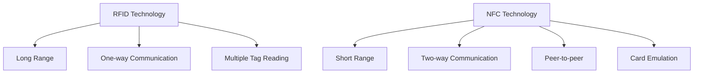
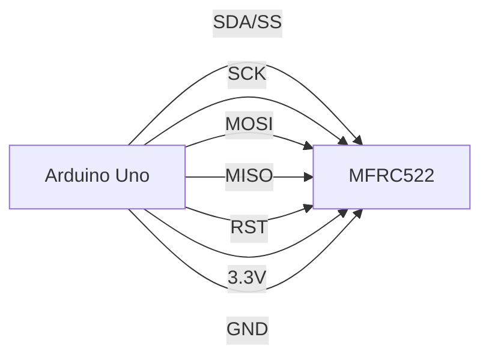

# Arduino NFC and RFID Communication

## Introduction

Near Field Communication (NFC) and Radio-Frequency Identification (RFID) are technologies that enable contactless communication between devices. These technologies are fundamental in many modern applications, from contactless payments to inventory tracking and access control systems.

In this tutorial, we'll explore how to integrate NFC and RFID capabilities with Arduino boards, allowing your projects to read and write to tags, cards, and other NFC-enabled devices. Whether you're building a smart door lock, an inventory system, or an interactive exhibit, these wireless communication technologies offer exciting possibilities.

## What is RFID and NFC?

### RFID Technology

RFID (Radio-Frequency Identification) uses electromagnetic fields to automatically identify and track tags attached to objects. An RFID system consists of:

1. **RFID Tags**: Passive or active devices containing electronically stored information
2. **RFID Reader**: A device that emits radio waves and receives signals back from the RFID tag
3. **Data Processing System**: Software that interprets the data

RFID systems typically operate at frequencies of 125 kHz (Low Frequency) or 13.56 MHz (High Frequency).

### NFC Technology

NFC (Near Field Communication) is a subset of RFID technology that operates at 13.56 MHz and allows two-way communication between devices. Unlike traditional RFID, NFC allows:

- **Peer-to-peer communication**: Two NFC devices can exchange data
- **Card emulation**: The NFC device can act like a contactless smart card
- **Reader/writer mode**: Similar to RFID reading and writing

NFC works at very close ranges (typically less than 4 cm/1.6 inches), which provides an inherent security advantage.



## Required Hardware

To follow this tutorial, you'll need:

1. An Arduino board (Uno, Nano, or Mega recommended)
2. An RFID or NFC module:
   - For RFID: MFRC522 module (most common and affordable)
   - For NFC: PN532 module (supports both RFID and NFC functions)
3. RFID cards/tags or NFC tags
4. Jumper wires
5. Breadboard
6. (Optional) LEDs, buzzers, or servos for creating responses

## Setting Up the MFRC522 RFID Module

The MFRC522 is a popular and affordable RFID module that works with 13.56 MHz cards and tags, perfect for beginners.

### Hardware Connections

Connect the MFRC522 to your Arduino as follows:

| MFRC522 Pin | Arduino Pin |
|-------------|-------------|
| SDA (SS)    | 10          |
| SCK         | 13          |
| MOSI        | 11          |
| MISO        | 12          |
| IRQ         | Not used    |
| GND         | GND         |
| RST         | 9           |
| 3.3V        | 3.3V        |

**Note**: The MFRC522 operates at 3.3V, not 5V. While most modules have onboard voltage regulators, connecting the 3.3V from the Arduino is safer.

Here's a visual representation of the connections:



### Software Setup

To work with the MFRC522 module, we'll use the `MFRC522` library, which can be installed via the Arduino Library Manager:

1. In Arduino IDE, go to **Sketch > Include Library > Manage Libraries**
2. Search for "MFRC522"
3. Install the library by Miguel Balboa

## Basic RFID Card Reading

Let's start with a basic example of reading an RFID card:

```cpp
#include <SPI.h>
#include <MFRC522.h>

#define SS_PIN 10
#define RST_PIN 9

MFRC522 rfid(SS_PIN, RST_PIN); // Create MFRC522 instance

void setup() {
  Serial.begin(9600);   // Initialize serial communication
  SPI.begin();          // Initialize SPI bus
  rfid.PCD_Init();      // Initialize MFRC522
  Serial.println("Tap an RFID card");
}

void loop() {
  // Look for new cards
  if (!rfid.PICC_IsNewCardPresent())
    return;

  // Select one of the cards
  if (!rfid.PICC_ReadCardSerial())
    return;

  // Show UID on serial monitor
  Serial.print("UID tag: ");
  String content = "";
  
  for (byte i = 0; i < rfid.uid.size; i++) {
    Serial.print(rfid.uid.uidByte[i] < 0x10 ? " 0" : " ");
    Serial.print(rfid.uid.uidByte[i], HEX);
    content.concat(String(rfid.uid.uidByte[i] < 0x10 ? " 0" : " "));
    content.concat(String(rfid.uid.uidByte[i], HEX));
  }
  
  Serial.println();
  Serial.print("Message: ");
  content.toUpperCase();
  Serial.println(content);
  
  delay(1000);
}
```

### Expected Output

When you run this code and scan an RFID card or tag, you'll see output similar to this:

```
Tap an RFID card
UID tag: 04 EA F2 2A 59 59 80
Message:  04 EA F2 2A 59 59 80
```

Each card has a unique identifier (UID), which is what we're reading and displaying.

## Access Control System Example

Now let's create a more practical example: an access control system that grants access when specific RFID cards are presented.

```cpp
#include <SPI.h>
#include <MFRC522.h>

#define SS_PIN 10
#define RST_PIN 9
#define LED_GREEN 3
#define LED_RED 4
#define BUZZER 5

MFRC522 rfid(SS_PIN, RST_PIN); // Create MFRC522 instance

// Authorized UIDs
byte authorizedUID1[4] = {0x04, 0xEA, 0xF2, 0x2A};
byte authorizedUID2[4] = {0x7C, 0x3F, 0xB1, 0x15};

void setup() {
  Serial.begin(9600);   // Initialize serial communication
  SPI.begin();          // Initialize SPI bus
  rfid.PCD_Init();      // Initialize MFRC522
  
  pinMode(LED_GREEN, OUTPUT);
  pinMode(LED_RED, OUTPUT);
  pinMode(BUZZER, OUTPUT);
  
  Serial.println("Access Control System");
  Serial.println("Tap your card to the reader...");
}

void loop() {
  // Look for new cards
  if (!rfid.PICC_IsNewCardPresent())
    return;

  // Select one of the cards
  if (!rfid.PICC_ReadCardSerial())
    return;

  Serial.print("UID tag: ");
  String content = "";
  byte* currentUID = rfid.uid.uidByte;
  
  for (byte i = 0; i < rfid.uid.size; i++) {
    Serial.print(rfid.uid.uidByte[i] < 0x10 ? " 0" : " ");
    Serial.print(rfid.uid.uidByte[i], HEX);
  }
  Serial.println();
  
  // Check if authorized
  if (compareUID(currentUID, authorizedUID1) || compareUID(currentUID, authorizedUID2)) {
    Serial.println("Access granted");
    grantAccess();
  } else {
    Serial.println("Access denied");
    denyAccess();
  }
  
  // Halt PICC
  rfid.PICC_HaltA();
  // Stop encryption on PCD
  rfid.PCD_StopCrypto1();
  
  delay(1000);
}

boolean compareUID(byte* uid1, byte* uid2) {
  for (byte i = 0; i < 4; i++) {
    if (uid1[i] != uid2[i]) {
      return false;
    }
  }
  return true;
}

void grantAccess() {
  digitalWrite(LED_GREEN, HIGH);
  tone(BUZZER, 2000, 300);
  delay(1000);
  digitalWrite(LED_GREEN, LOW);
}

void denyAccess() {
  digitalWrite(LED_RED, HIGH);
  tone(BUZZER, 300, 1000);
  delay(1000);
  digitalWrite(LED_RED, LOW);
}
```

**Note:** Replace the values in `authorizedUID1` and `authorizedUID2` with the UIDs of your own RFID cards, which you can find by running the previous basic card reading example.

### System Explanation

1. We define two authorized UIDs (replace them with your own card UIDs)
2. When a card is presented, we read its UID
3. We compare the scanned UID with our authorized UIDs
4. Depending on the result, we either grant or deny access:
   - Access granted: Green LED lights up, high-pitched beep
   - Access denied: Red LED lights up, low-pitched beep

## Working with NFC: The PN532 Module

While the MFRC522 is great for RFID, the PN532 module offers more advanced NFC capabilities, including phone interaction and data exchange.

### Hardware Connections (SPI Mode)

Connect the PN532 to your Arduino as follows:

| PN532 Pin | Arduino Pin |
|-----------|-------------|
| SCK       | 13          |
| MISO      | 12          |
| MOSI      | 11          |
| SS        | 10          |
| VCC       | 5V          |
| GND       | GND         |
| IRQ       | Not used    |
| RSTPDN    | Not used    |

### Software Setup

To use the PN532 module, we'll use the Adafruit PN532 library:

1. In Arduino IDE, go to **Sketch > Include Library > Manage Libraries**
2. Search for "Adafruit PN532"
3. Install the library by Adafruit

### Reading an NFC Tag with PN532

Here's a basic example to read an NFC tag's NDEF (NFC Data Exchange Format) message:

```cpp
#include <Wire.h>
#include <SPI.h>
#include <Adafruit_PN532.h>

#define PN532_SS 10

Adafruit_PN532 nfc(PN532_SS); // Create PN532 instance using SPI

void setup() {
  Serial.begin(115200);
  Serial.println("Looking for PN532...");

  nfc.begin();

  uint32_t versiondata = nfc.getFirmwareVersion();
  if (!versiondata) {
    Serial.println("Didn't find PN532 board");
    while (1); // halt
  }
  
  // Found PN532
  Serial.print("Found chip PN5"); Serial.println((versiondata >> 24) & 0xFF, HEX);
  Serial.print("Firmware ver. "); Serial.print((versiondata >> 16) & 0xFF, DEC);
  Serial.print('.'); Serial.println((versiondata >> 8) & 0xFF, DEC);
  
  // Configure board to read RFID tags
  nfc.SAMConfig();
  
  Serial.println("Waiting for an NFC tag...");
}

void loop() {
  uint8_t success;
  uint8_t uid[] = { 0, 0, 0, 0, 0, 0, 0 };  // Buffer to store the returned UID
  uint8_t uidLength;                         // Length of the UID
  
  // Wait for an ISO14443A type card (Mifare, etc.)
  success = nfc.readPassiveTargetID(PN532_MIFARE_ISO14443A, uid, &uidLength);
  
  if (success) {
    // Display UID
    Serial.println("Found an NFC tag!");
    Serial.print("UID Length: "); Serial.print(uidLength, DEC); Serial.println(" bytes");
    Serial.print("UID Value: ");
    nfc.PrintHex(uid, uidLength);
    
    // Try to read NDEF data
    uint8_t data[32];
    success = nfc.mifareultralight_ReadPage(4, data);
    if (success) {
      Serial.println("Reading page 4:");
      nfc.PrintHexChar(data, 4);
    }
    
    Serial.println("");
    delay(1000);
  }
}
```

## Writing to an NFC Tag

One advantage of NFC over basic RFID is the ability to write data to tags. Here's how to write a URL to an NFC tag:

```cpp
#include <Wire.h>
#include <SPI.h>
#include <Adafruit_PN532.h>

#define PN532_SS 10

Adafruit_PN532 nfc(PN532_SS); // Create PN532 instance using SPI

void setup() {
  Serial.begin(115200);
  Serial.println("PN532 NFC Tag Writer");

  nfc.begin();

  uint32_t versiondata = nfc.getFirmwareVersion();
  if (!versiondata) {
    Serial.println("Didn't find PN532 board");
    while (1); // halt
  }
  
  // Configure board to read/write RFID tags
  nfc.SAMConfig();
  
  Serial.println("Place a blank NFC tag on the reader...");
}

void loop() {
  uint8_t success;
  uint8_t uid[] = { 0, 0, 0, 0, 0, 0, 0 };  // Buffer to store the returned UID
  uint8_t uidLength;                         // Length of the UID
  
  // Wait for an NTAG203 card
  success = nfc.readPassiveTargetID(PN532_MIFARE_ISO14443A, uid, &uidLength);
  
  if (success) {
    Serial.println("Found a tag!");
    Serial.print("UID Length: "); Serial.print(uidLength, DEC); Serial.println(" bytes");
    Serial.print("UID Value: ");
    nfc.PrintHex(uid, uidLength);
    
    // Write URL to the tag
    if (uidLength == 7) { // NTAG203 cards have 7 byte UIDs
      // Data to write (URL in NDEF format)
      uint8_t ndefPrefix = NDEF_URIPREFIX_HTTP_WWW; // Prefix for "http://www."
      char url[] = "arduino.cc";
      
      Serial.println("Writing URL to tag...");
      success = nfc.ntag203_ndefturl(ndefPrefix, url);
      
      if (success) {
        Serial.println("NDEF URL Record written to tag!");
      } else {
        Serial.println("Error writing URL to tag!");
      }
    }
    
    Serial.println("Done! Remove tag and place a new one to write.");
    delay(3000);
  }
}
```

### Expected Behavior

1. When you run this code and place a compatible NFC tag (like an NTAG203) on the reader, the Arduino will write a URL to it.
2. After writing is complete, you can scan the tag with an NFC-enabled smartphone, which should prompt you to open the website (arduino.cc in this example).

## Real-World Applications

Here are some practical applications you can build with Arduino and NFC/RFID technology:

### 1. Smart Door Lock

Combine an RFID reader with a servo motor or electric lock to create an access control system for your home or workspace.

### 2. Attendance System

Create a system that records attendance when students or employees scan their ID cards or tags.

### 3. Interactive Exhibits

Build interactive museum exhibits that provide information when visitors tap NFC-enabled objects.

### 4. Inventory Management

Track inventory items with RFID tags and create a system that updates a database when items are scanned.

### 5. Payment Systems

Simulate or prototype contactless payment systems (without handling real financial data, of course).

### 6. Smart IoT Device Control

Use NFC tags to trigger specific actions on your Arduino-based IoT devices, like changing operating modes or user preferences.

## Troubleshooting Tips

1. **Reading issues**:
   - Keep metal objects away from the reader
   - Ensure proper power supply (3.3V for MFRC522)
   - Check all connections, especially SPI pins

2. **Writing issues**:
   - Make sure your tag is writable (some tags are read-only)
   - Check that the tag is compatible with your reader
   - Keep the tag steady during writing operations

3. **Library conflicts**:
   - If using multiple SPI devices, ensure proper SS pin management
   - Try different library versions if experiencing compatibility issues

## Summary

In this tutorial, we've explored how to use RFID and NFC technologies with Arduino. We've covered:

1. The differences between RFID and NFC technologies
2. Setting up the MFRC522 RFID module
3. Reading RFID cards and tags
4. Building a simple access control system
5. Working with more advanced NFC features using the PN532 module
6. Writing data to NFC tags
7. Real-world applications and troubleshooting tips

These wireless identification technologies open up a world of possibilities for your Arduino projects, enabling secure authentication, data exchange, and interactive experiences.

## Additional Resources

- Explore the [MFRC522 Library Documentation](https://github.com/miguelbalboa/rfid) for more advanced features
- Check out the [Adafruit PN532 Library](https://github.com/adafruit/Adafruit-PN532) for additional NFC capabilities
- Learn about [NDEF message formatting](https://learn.adafruit.com/adafruit-pn532-rfid-nfc/ndef) for more complex NFC data structures

## Exercises

1. **Basic Reading**: Modify the basic RFID reading example to display the tag type in addition to the UID.

2. **Multi-Card System**: Expand the access control system to support up to 5 different authorized cards, with a different action for each one (e.g., different LED patterns).

3. **Data Logger**: Create a system that logs the time and UID whenever a card is scanned, storing the data in EEPROM or SD card.

4. **Two-Factor Authentication**: Combine RFID with a keypad entry system for enhanced security that requires both a card and a PIN.

5. **NFC Command System**: Program multiple NFC tags with different commands and create an Arduino system that performs different actions based on which tag is scanned.