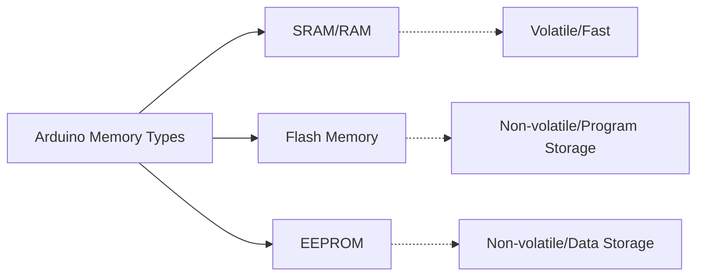

# Arduino EEPROM

## Introduction

When working with Arduino projects, you'll often need to save data that persists even when the device loses power. The Arduino's built-in EEPROM (Electrically Erasable Programmable Read-Only Memory) provides a simple solution for this need. Unlike RAM, which loses its contents when power is removed, EEPROM retains data even when the Arduino is powered off.

In this tutorial, you'll learn:
- What EEPROM is and why it's useful
- How to read from and write to EEPROM
- How to work with different data types in EEPROM
- Best practices for using EEPROM efficiently
- Real-world applications of EEPROM in Arduino projects

## What is EEPROM?

EEPROM is a type of non-volatile memory built into the microcontroller on your Arduino board. Here are the key characteristics:

| Feature | Description |
|---------|-------------|
| Size | 512 bytes to 4KB (depending on Arduino model) |
| Lifespan | ~100,000 write cycles per memory location |
| Data retention | ~10-100 years |
| Access speed | Slower than RAM, but persistent |

Different Arduino boards have different EEPROM capacities:
- Arduino Uno, Nano, Mini: 1KB (1024 bytes)
- Arduino Mega: 4KB (4096 bytes)
- Arduino Leonardo: 1KB (1024 bytes)



## The EEPROM Library

Arduino provides a built-in library for EEPROM operations. Let's start by including it:

```cpp
#include <EEPROM.h>
```

## Basic EEPROM Operations

### Reading from EEPROM

To read a byte from EEPROM, use the `EEPROM.read()` function:

```cpp
#include <EEPROM.h>

void setup() {
  Serial.begin(9600);
  
  // Read a byte from address 0
  byte value = EEPROM.read(0);
  
  Serial.print("Value at address 0: ");
  Serial.println(value);
}

void loop() {
  // Empty
}
```

### Writing to EEPROM

To write a byte to EEPROM, use the `EEPROM.write()` function:

```cpp
#include <EEPROM.h>

void setup() {
  Serial.begin(9600);
  
  // Current value
  byte oldValue = EEPROM.read(0);
  Serial.print("Old value at address 0: ");
  Serial.println(oldValue);
  
  // Write new value
  byte newValue = 42;
  EEPROM.write(0, newValue);
  Serial.print("Wrote value to address 0: ");
  Serial.println(newValue);
  
  // Verify the write
  byte verifiedValue = EEPROM.read(0);
  Serial.print("New value at address 0: ");
  Serial.println(verifiedValue);
}

void loop() {
  // Empty
}
```

**Output:**
```
Old value at address 0: 255 (or whatever was previously stored)
Wrote value to address 0: 42
New value at address 0: 42
```

### Updating EEPROM

The `EEPROM.update()` function is more efficient than `write()` because it only writes to EEPROM if the value is different from what's already stored. This helps extend the EEPROM's lifespan:

```cpp
#include <EEPROM.h>

void setup() {
  Serial.begin(9600);
  
  byte currentValue = EEPROM.read(0);
  Serial.print("Current value: ");
  Serial.println(currentValue);
  
  // Update with the same value
  EEPROM.update(0, currentValue);
  Serial.println("Updated with same value (no actual write occurred)");
  
  // Update with a different value
  EEPROM.update(0, currentValue + 1);
  Serial.print("Updated with new value: ");
  Serial.println(currentValue + 1);
}

void loop() {
  // Empty
}
```

## Working with Different Data Types

### Storing Integers (2 bytes)

EEPROM.read() and EEPROM.write() only work with single bytes (0-255). To store larger values, you need to split them into bytes:

```cpp
#include <EEPROM.h>

void setup() {
  Serial.begin(9600);
  
  // Store an integer (16-bit value)
  int valueToStore = 12345;
  
  // Split the int into two bytes
  byte lowByte = valueToStore & 0xFF;
  byte highByte = (valueToStore >> 8) & 0xFF;
  
  // Write the bytes to consecutive EEPROM addresses
  EEPROM.write(0, lowByte);
  EEPROM.write(1, highByte);
  
  Serial.println("Integer stored in EEPROM");
  
  // Read the integer back from EEPROM
  byte readLowByte = EEPROM.read(0);
  byte readHighByte = EEPROM.read(1);
  
  // Combine the bytes back into an integer
  int readValue = (readHighByte << 8) | readLowByte;
  
  Serial.print("Read integer from EEPROM: ");
  Serial.println(readValue);
}

void loop() {
  // Empty
}
```

**Output:**
```
Integer stored in EEPROM
Read integer from EEPROM: 12345
```

### Using EEPROM.put() and EEPROM.get()

For Arduino boards with more recent versions of the EEPROM library, you can use `.put()` and `.get()` to store and retrieve variables of any type:

```cpp
#include <EEPROM.h>

struct Settings {
  int threshold;
  float calibration;
  bool enableFeature;
};

void setup() {
  Serial.begin(9600);
  
  // Create a settings object
  Settings mySettings = {
    threshold: 500,
    calibration: 1.23,
    enableFeature: true
  };
  
  // Store the entire structure
  EEPROM.put(0, mySettings);
  Serial.println("Settings stored in EEPROM");
  
  // Create an empty object to read into
  Settings retrievedSettings;
  
  // Read the structure from EEPROM
  EEPROM.get(0, retrievedSettings);
  
  // Print the retrieved values
  Serial.println("Retrieved settings:");
  Serial.print("Threshold: ");
  Serial.println(retrievedSettings.threshold);
  Serial.print("Calibration: ");
  Serial.println(retrievedSettings.calibration, 2);
  Serial.print("Feature enabled: ");
  Serial.println(retrievedSettings.enableFeature ? "Yes" : "No");
}

void loop() {
  // Empty
}
```

**Output:**
```
Settings stored in EEPROM
Retrieved settings:
Threshold: 500
Calibration: 1.23
Feature enabled: Yes
```

## Best Practices for EEPROM Usage

### 1. Address Management

Keep track of which EEPROM addresses are used for what:

```cpp
// Constants for EEPROM addresses
const int ADDR_SETTINGS_VERSION = 0;
const int ADDR_BRIGHTNESS = 1;
const int ADDR_THRESHOLD = 2;
const int ADDR_TEMPERATURE_OFFSET = 4; // 2 bytes for a float
```

### 2. EEPROM Wear Leveling

Remember that EEPROM has a limited number of write cycles. For values that change frequently, consider implementing wear leveling by rotating through multiple addresses:

```cpp
#include <EEPROM.h>

const int NUM_SLOTS = 5;
const int START_ADDR = 0;

int findLatestSlot() {
  byte maxCounter = 0;
  int latestSlot = 0;
  
  for (int i = 0; i < NUM_SLOTS; i++) {
    byte counter = EEPROM.read(START_ADDR + i);
    if (counter > maxCounter) {
      maxCounter = counter;
      latestSlot = i;
    }
  }
  
  return latestSlot;
}

void writeValue(byte value) {
  int latestSlot = findLatestSlot();
  int nextSlot = (latestSlot + 1) % NUM_SLOTS;
  byte counter = EEPROM.read(START_ADDR + latestSlot) + 1;
  
  EEPROM.write(START_ADDR + nextSlot, counter);
  EEPROM.write(START_ADDR + NUM_SLOTS + nextSlot, value);
  
  Serial.print("Wrote value to slot ");
  Serial.println(nextSlot);
}

byte readValue() {
  int latestSlot = findLatestSlot();
  return EEPROM.read(START_ADDR + NUM_SLOTS + latestSlot);
}

void setup() {
  Serial.begin(9600);
  
  // Example usage
  writeValue(42);
  byte value = readValue();
  
  Serial.print("Read value: ");
  Serial.println(value);
}

void loop() {
  // Empty
}
```

### 3. Version Control

Include a version number at the beginning of your EEPROM data to handle format changes:

```cpp
#include <EEPROM.h>

const byte CURRENT_VERSION = 2;
const int VERSION_ADDR = 0;

void setup() {
  Serial.begin(9600);
  
  // Check if stored data is compatible
  byte storedVersion = EEPROM.read(VERSION_ADDR);
  
  if (storedVersion != CURRENT_VERSION) {
    Serial.println("EEPROM data format has changed. Initializing with defaults.");
    
    // Initialize with defaults for version 2
    EEPROM.write(VERSION_ADDR, CURRENT_VERSION);
    EEPROM.write(1, 128); // Default brightness
    EEPROM.put(2, 25.5f); // Default temperature
    
    Serial.println("Defaults stored.");
  } else {
    Serial.println("EEPROM data format is current.");
  }
  
  // Read stored values
  byte brightness = EEPROM.read(1);
  float temperature;
  EEPROM.get(2, temperature);
  
  Serial.print("Brightness: ");
  Serial.println(brightness);
  Serial.print("Temperature: ");
  Serial.println(temperature);
}

void loop() {
  // Empty
}
```

## Practical Applications

### 1. Saving Configuration Settings

One of the most common uses of EEPROM is storing user configuration:

```cpp
#include <EEPROM.h>

// EEPROM addresses
const int ADDR_BRIGHTNESS = 0;
const int ADDR_MODE = 1;

void saveSettings(byte brightness, byte mode) {
  EEPROM.update(ADDR_BRIGHTNESS, brightness);
  EEPROM.update(ADDR_MODE, mode);
  Serial.println("Settings saved!");
}

void loadSettings(byte &brightness, byte &mode) {
  brightness = EEPROM.read(ADDR_BRIGHTNESS);
  mode = EEPROM.read(ADDR_MODE);
}

void setup() {
  Serial.begin(9600);
  
  byte brightness = 128; // Default
  byte mode = 1; // Default
  
  // Load saved settings
  loadSettings(brightness, mode);
  
  Serial.print("Loaded brightness: ");
  Serial.println(brightness);
  Serial.print("Loaded mode: ");
  Serial.println(mode);
  
  // Simulate changing settings
  brightness = 200;
  mode = 2;
  
  // Save new settings
  saveSettings(brightness, mode);
}

void loop() {
  // Empty
}
```

### 2. Usage Counter

Track how many times a device has been powered on:

```cpp
#include <EEPROM.h>

const int BOOT_COUNT_ADDR = 0;

void setup() {
  Serial.begin(9600);
  
  // Read the current boot count
  unsigned int bootCount;
  EEPROM.get(BOOT_COUNT_ADDR, bootCount);
  
  // Increment and store the new count
  bootCount++;
  EEPROM.put(BOOT_COUNT_ADDR, bootCount);
  
  Serial.print("Device has been powered on ");
  Serial.print(bootCount);
  Serial.println(" times");
}

void loop() {
  // Empty
}
```

### 3. Data Logger with Power Failure Recovery

Use EEPROM to remember the last logged position:

```cpp
#include <EEPROM.h>

const int LAST_RECORD_ADDR = 0;
const int DATA_START_ADDR = 2;
const int MAX_RECORDS = 50;

void setup() {
  Serial.begin(9600);
  
  // Read the last saved record index
  int lastRecord;
  EEPROM.get(LAST_RECORD_ADDR, lastRecord);
  
  Serial.print("Last saved record position: ");
  Serial.println(lastRecord);
  
  if (lastRecord >= MAX_RECORDS) {
    // Reset if we've reached the maximum
    lastRecord = 0;
    EEPROM.put(LAST_RECORD_ADDR, lastRecord);
    Serial.println("Maximum records reached, resetting to 0");
  }
  
  // Simulate logging a new sensor reading
  int sensorValue = analogRead(A0);
  int recordAddr = DATA_START_ADDR + (lastRecord * sizeof(int));
  
  EEPROM.put(recordAddr, sensorValue);
  
  // Update the last record position
  lastRecord++;
  EEPROM.put(LAST_RECORD_ADDR, lastRecord);
  
  Serial.print("Saved sensor value: ");
  Serial.println(sensorValue);
  Serial.print("New record position: ");
  Serial.println(lastRecord);
  
  // Print all stored records
  Serial.println("All stored records:");
  for (int i = 0; i < lastRecord; i++) {
    int value;
    EEPROM.get(DATA_START_ADDR + (i * sizeof(int)), value);
    Serial.print("Record ");
    Serial.print(i);
    Serial.print(": ");
    Serial.println(value);
  }
}

void loop() {
  // Empty
}
```

## EEPROM Clear and Management

Sometimes you need to clear or initialize the EEPROM:

```cpp
#include <EEPROM.h>

void clearEEPROM() {
  Serial.println("Clearing EEPROM...");
  
  for (int i = 0; i < EEPROM.length(); i++) {
    EEPROM.write(i, 0);
  }
  
  Serial.println("EEPROM cleared!");
}

void setup() {
  Serial.begin(9600);
  
  // Only call this when you want to reset all EEPROM data
  // clearEEPROM();
  
  Serial.println("EEPROM content (first 16 bytes):");
  for (int i = 0; i < 16; i++) {
    byte value = EEPROM.read(i);
    Serial.print(i);
    Serial.print(": ");
    Serial.print(value);
    Serial.print(" (0x");
    if (value < 16) Serial.print("0");
    Serial.print(value, HEX);
    Serial.println(")");
  }
}

void loop() {
  // Empty
}
```

## Summary

EEPROM is a valuable resource in Arduino projects that allows you to:

1. Store configuration settings that persist when power is lost
2. Track usage statistics across power cycles
3. Create data loggers with power failure recovery
4. Build devices with user-customizable preferences

Remember these key points:
- EEPROM has limited write cycles (about 100,000 per address)
- Use `update()` instead of `write()` when possible
- Implement wear leveling for frequently changed values
- Include version control for your EEPROM data format
- Keep track of which addresses store what data

## Exercises

1. Create a program that uses EEPROM to remember the highest value read from an analog sensor.
2. Build a simple "favorites" system that stores three user-favorite modes in EEPROM.
3. Make a program that uses EEPROM to implement a "secret knock" detector that remembers a sequence of knocks.
4. Create a data logger that stores temperature readings in EEPROM and can be accessed via the Serial Monitor.
5. Implement a wear-leveled counter that can survive trillions of updates by rotating through the entire EEPROM space.

## Additional Resources

- [Arduino EEPROM Library Reference](https://www.arduino.cc/reference/en/libraries/eeprom/)
- [Arduino More Advanced EEPROM Usage](https://roboticsbackend.com/arduino-store-in-eeprom/)
- [EEPROM.h Source Code](https://github.com/arduino/ArduinoCore-avr/blob/master/libraries/EEPROM/src/EEPROM.h)