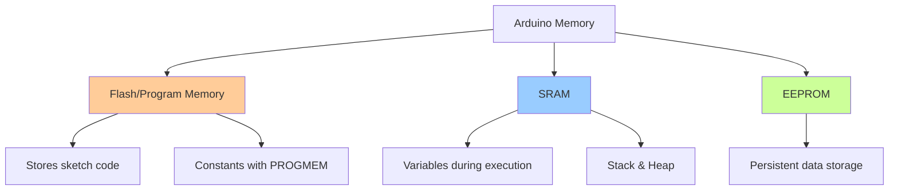

# Arduino Flash Memory

## Introduction

Flash memory is a critical component of Arduino's memory architecture that allows you to store program code and constant data. Understanding how Flash memory works and how to use it efficiently can significantly improve your Arduino projects, especially when working with limited RAM.

In Arduino, Flash memory (also called program memory) is non-volatile, which means it retains data even when power is turned off. This memory primarily stores your compiled program code, but you can also use it to store constant data like lookup tables, large strings, or arrays that would otherwise consume valuable RAM.

## Understanding Arduino Memory Architecture

Before diving into Flash memory specifically, let's understand Arduino's memory architecture:



On a typical Arduino Uno:
- **Flash Memory**: 32KB (program storage)
- **SRAM**: 2KB (variables storage)
- **EEPROM**: 1KB (long-term data storage)

## The PROGMEM Directive

To store data in Flash memory instead of SRAM, Arduino provides the `PROGMEM` keyword. Here's how to use it:

### Basic Usage of PROGMEM

```cpp
#include <avr/pgmspace.h>  // Required for PROGMEM

// Storing a single value
const int myConstant PROGMEM = 42;

// Storing an array
const int myArray[] PROGMEM = {1, 2, 3, 4, 5, 6, 7, 8, 9, 10};

// Storing a string
const char myString[] PROGMEM = "This string is stored in Flash memory";
```

### Reading from PROGMEM

When you store data in Flash memory, you need special functions to read it:

```cpp
#include <avr/pgmspace.h>

// Define data in flash memory
const char message[] PROGMEM = "This is stored in flash memory";
const int dataTable[] PROGMEM = {11, 22, 33, 44, 55};

void setup() {
  Serial.begin(9600);
  
  // Reading a single byte from a string
  char c = pgm_read_byte(&message[0]);
  Serial.println(c);  // Output: T
  
  // Reading an integer
  int value = pgm_read_word(&dataTable[2]);
  Serial.println(value);  // Output: 33
  
  // Reading entire string
  char buffer[50];
  strcpy_P(buffer, message);  // Copy from PROGMEM to buffer
  Serial.println(buffer);     // Output: This is stored in flash memory
}

void loop() {
  // Nothing here
}
```

### Available PROGMEM Read Functions

- `pgm_read_byte(address)` - for 8-bit values
- `pgm_read_word(address)` - for 16-bit values
- `pgm_read_dword(address)` - for 32-bit values
- `pgm_read_float(address)` - for float values
- `strcpy_P(destination, source)` - copy a string from PROGMEM

## Storing Strings in Flash Memory

Strings can consume a lot of RAM. Here are techniques to store them in Flash:

### Using F() Macro

The simplest way to store string literals in Flash:

```cpp
void setup() {
  Serial.begin(9600);
  
  // This string uses RAM
  Serial.println("This string uses SRAM");
  
  // This string uses Flash
  Serial.println(F("This string uses Flash memory"));
}
```

### Output:
```
This string uses SRAM
This string uses Flash memory
```

The output looks identical, but the memory usage is different! The second approach saves precious RAM.

### String Tables in PROGMEM

For multiple strings, you can create a table:

```cpp
#include <avr/pgmspace.h>

// Array of strings stored in Flash
const char string0[] PROGMEM = "First string";
const char string1[] PROGMEM = "Second string";
const char string2[] PROGMEM = "Third string";
const char string3[] PROGMEM = "Fourth string";

// Table of pointers to strings
const char* const stringTable[] PROGMEM = {
  string0, string1, string2, string3
};

void setup() {
  Serial.begin(9600);
  
  // Buffer to hold the string from Flash
  char buffer[20];
  
  // Read each string from the table
  for (int i = 0; i < 4; i++) {
    // Get pointer to the string
    char* stringAddress = (char*)pgm_read_word(&(stringTable[i]));
    // Copy string from Flash to buffer
    strcpy_P(buffer, stringAddress);
    // Print the string
    Serial.println(buffer);
  }
}
```

### Output:
```
First string
Second string
Third string
Fourth string
```

## Practical Example: LCD Menu System

Here's a real-world example of using Flash memory to store menu items for an LCD display:

```cpp
#include <avr/pgmspace.h>
#include <LiquidCrystal.h>

// Initialize LCD
LiquidCrystal lcd(12, 11, 5, 4, 3, 2);

// Menu items stored in Flash
const char menuItem0[] PROGMEM = "Temperature";
const char menuItem1[] PROGMEM = "Humidity";
const char menuItem2[] PROGMEM = "Pressure";
const char menuItem3[] PROGMEM = "Wind Speed";
const char menuItem4[] PROGMEM = "Settings";

// Table of menu items
const char* const menuItems[] PROGMEM = {
  menuItem0, menuItem1, menuItem2, menuItem3, menuItem4
};

const int buttonPin = 8;
int currentMenu = 0;
int menuSize = 5;
char buffer[20];

void setup() {
  pinMode(buttonPin, INPUT_PULLUP);
  lcd.begin(16, 2);
  displayCurrentMenuItem();
}

void loop() {
  // If button is pressed, go to next menu item
  if (digitalRead(buttonPin) == LOW) {
    currentMenu = (currentMenu + 1) % menuSize;
    displayCurrentMenuItem();
    delay(300);  // Debounce
  }
}

void displayCurrentMenuItem() {
  lcd.clear();
  lcd.setCursor(0, 0);
  lcd.print("Menu:");
  lcd.setCursor(0, 1);
  
  // Get address of current menu item
  char* menuAddress = (char*)pgm_read_word(&(menuItems[currentMenu]));
  // Copy string from Flash to buffer
  strcpy_P(buffer, menuAddress);
  // Display the menu item
  lcd.print(buffer);
}
```

This menu system stores all text in Flash memory, saving RAM for other operations.

## Storing and Using Data Tables in Flash

For applications requiring lookup tables, storing them in Flash is efficient:

```cpp
#include <avr/pgmspace.h>

// Sine table with 90 degree values (0-90 degrees)
const PROGMEM uint16_t sineTable[] = {
  0, 175, 349, 523, 698, 872, 1045, 1219, 1392, 1564, 
  1736, 1908, 2079, 2250, 2419, 2588, 2756, 2924, 3090, 3256, 
  3420, 3584, 3746, 3907, 4067, 4226, 4384, 4540, 4695, 4848, 
  5000, 5150, 5299, 5446, 5592, 5736, 5878, 6018, 6157, 6293, 
  6428, 6561, 6691, 6820, 6947, 7071, 7193, 7314, 7431, 7547, 
  7660, 7771, 7880, 7986, 8090, 8191, 8290, 8387, 8480, 8572, 
  8660, 8746, 8829, 8910, 8988, 9063, 9135, 9205, 9272, 9336, 
  9397, 9455, 9511, 9563, 9613, 9659, 9703, 9744, 9781, 9816, 
  9848, 9877, 9903, 9925, 9945, 9962, 9976, 9986, 9994, 9998, 
  10000
};

int getSine(int angle) {
  // Normalize angle to 0-359 range
  angle = angle % 360;
  if (angle < 0) angle += 360;
  
  // Handle different quadrants
  if (angle <= 90) {
    return pgm_read_word(&sineTable[angle]);
  } else if (angle <= 180) {
    return pgm_read_word(&sineTable[180 - angle]);
  } else if (angle <= 270) {
    return -pgm_read_word(&sineTable[angle - 180]);
  } else {
    return -pgm_read_word(&sineTable[360 - angle]);
  }
}

void setup() {
  Serial.begin(9600);
  
  // Display sine values for various angles
  Serial.println("Angle | Sine value (x10000)");
  Serial.println("------------------------");
  
  for (int angle = 0; angle < 360; angle += 30) {
    int sineValue = getSine(angle);
    Serial.print(angle);
    Serial.print(" | ");
    Serial.println(sineValue);
  }
}

void loop() {
  // Nothing here
}
```

### Output:
```
Angle | Sine value (x10000)
------------------------
0 | 0
30 | 5000
60 | 8660
90 | 10000
120 | 8660
150 | 5000
180 | 0
210 | -5000
240 | -8660
270 | -10000
300 | -8660
330 | -5000
```

This example stores a sine lookup table in Flash, saving significant RAM while still providing fast access to trigonometric values.

## Memory Usage Comparison

Let's see how using PROGMEM affects memory usage:

### Without PROGMEM
```cpp
const char message[] = "This is a very long message that will be used in our Arduino project multiple times";

void setup() {
  Serial.begin(9600);
  Serial.println(message);
}
```

### With PROGMEM
```cpp
#include <avr/pgmspace.h>

const char message[] PROGMEM = "This is a very long message that will be used in our Arduino project multiple times";

void setup() {
  Serial.begin(9600);
  
  char buffer[100];
  strcpy_P(buffer, message);
  Serial.println(buffer);
}
```

While both sketches appear similar, the first one stores the string in SRAM, while the second one stores it in Flash memory, freeing up valuable SRAM for other operations.

## Best Practices and Considerations

1. **When to use PROGMEM:**
   - Large constant arrays or tables
   - String literals that don't change
   - Lookup tables
   - Any constant data that would consume significant RAM

2. **When not to use PROGMEM:**
   - Variables that change during execution
   - Small amounts of data (overhead might not be worth it)
   - Data that needs frequent, fast access (Flash is slower than RAM)

3. **Performance considerations:**
   - Reading from Flash is slower than reading from SRAM
   - Use buffers to copy Flash data to SRAM when needed for frequent access

4. **Compatibility:**
   - PROGMEM is specific to AVR-based Arduinos (Uno, Nano, Mega)
   - For ESP8266/ESP32, use different approaches (PROGMEM works differently)
   - ARM-based Arduinos like Due handle constant data differently

## Finding Your Sketch's Memory Usage

To see how much memory your sketch uses, check the compilation output in the Arduino IDE. At the end of compilation, you'll see something like:

```
Sketch uses 4,328 bytes (13%) of program storage space. Maximum is 32,256 bytes.
Global variables use 632 bytes (30%) of dynamic memory, leaving 1,416 bytes for local variables. Maximum is 2,048 bytes.
```

This tells you:
- How much Flash memory (program storage) your sketch uses
- How much SRAM (dynamic memory) your global variables use

## Common Pitfalls

1. **Not including the necessary header:**
   ```cpp
   #include <avr/pgmspace.h>  // Required for PROGMEM
   ```

2. **Trying to access PROGMEM data directly:**
   ```cpp
   // WRONG
   char c = myString[0];  // This won't work with PROGMEM strings
   
   // RIGHT
   char c = pgm_read_byte(&myString[0]);
   ```

3. **Forgetting string termination:**
   When copying strings from PROGMEM, ensure your buffer is large enough for the entire string, including the null terminator.

## Summary

Flash memory in Arduino provides a valuable resource for storing constant data without consuming precious SRAM. By using the `PROGMEM` directive and related functions, you can optimize your Arduino projects to store strings, arrays, and lookup tables in program memory.

Key takeaways:
- Flash memory is non-volatile and primarily stores your program code
- Use `PROGMEM` to store constant data in Flash
- Use appropriate functions like `pgm_read_byte()` to read from Flash
- The `F()` macro provides an easy way to store string literals in Flash
- Consider performance tradeoffs as reading from Flash is slower than SRAM

## Exercises

1. Create a project that stores 10 of your favorite quotes in Flash memory and displays a random one on an LCD when a button is pressed.

2. Modify the sine table example to include cosine values as well, and create a function to read both sine and cosine values from the table.

3. Create a temperature conversion table stored in Flash that converts between Celsius and Fahrenheit.

4. Build a multi-language menu system for an LCD display where all text strings are stored in Flash memory.

5. Implement a data logger that uses Flash memory to store sensor configuration data and EEPROM to store the actual logged values.

## Additional Resources

- [AVR Libc PROGMEM Documentation](https://www.nongnu.org/avr-libc/user-manual/group__avr__pgmspace.html)
- [Arduino PROGMEM Reference](https://www.arduino.cc/reference/en/language/variables/utilities/progmem/)
- [Arduino F() Macro Reference](https://www.arduino.cc/reference/en/language/variables/utilities/progmem/#_the_f_macro)
- [Arduino Memory Guide](https://docs.arduino.cc/learn/programming/memory-guide)