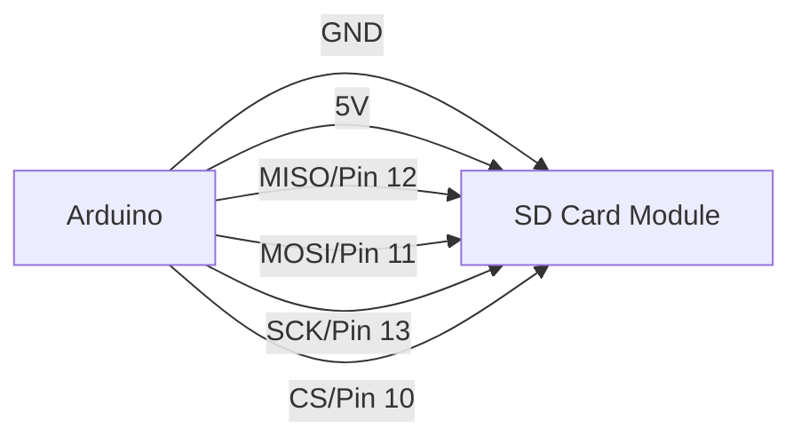

# Arduino SD Card

## Introduction

SD (Secure Digital) cards provide Arduino projects with expanded storage capabilities, allowing you to read and write large amounts of data that would otherwise exceed the limited internal memory of an Arduino board. This makes SD cards perfect for data logging, storing configuration settings, or managing files for projects like music players, weather stations, and more.

In this tutorial, you'll learn how to connect an SD card to your Arduino, read and write data, and create practical projects that utilize SD card storage.

## What You'll Need

- An Arduino board (Uno, Mega, Nano, etc.)
- SD card module or shield
- Micro SD card (formatted as FAT16 or FAT32)
- Jumper wires
- Breadboard (optional)

## Hardware Setup

The connection between your Arduino and SD card module typically uses the SPI (Serial Peripheral Interface) protocol. Here's how to connect the standard SD card module:

| SD Card Module | Arduino Pin |
|----------------|------------|
| GND            | GND        |
| VCC            | 5V         |
| MISO           | 12         |
| MOSI           | 11         |
| SCK            | 13         |
| CS             | 10 (customizable) |

> **Note:** The CS (Chip Select) pin can be changed in your code, but pin 10 is most commonly used.

Here's a visual diagram of the connections:



## Required Libraries

Arduino provides an SD library that handles all the communication with the SD card. To use it, you'll need to:

1. Include the SD library at the beginning of your sketch:
```cpp
#include <SD.h>
#include <SPI.h>
```

2. Initialize the SD card in your `setup()` function:
```cpp
const int chipSelect = 10;

void setup() {
  Serial.begin(9600);
  Serial.print("Initializing SD card...");

  if (!SD.begin(chipSelect)) {
    Serial.println("Initialization failed!");
    return;
  }
  Serial.println("Initialization done.");
}
```

## Basic File Operations

### Writing to a File

Here's a simple example that creates a file and writes data to it:

```cpp
#include <SD.h>
#include <SPI.h>

const int chipSelect = 10;

void setup() {
  Serial.begin(9600);
  Serial.print("Initializing SD card...");

  if (!SD.begin(chipSelect)) {
    Serial.println("Initialization failed!");
    return;
  }
  Serial.println("Initialization done.");

  // Open a new file
  File dataFile = SD.open("test.txt", FILE_WRITE);

  // If the file opened successfully, write to it
  if (dataFile) {
    dataFile.println("Hello, Arduino SD card!");
    dataFile.println("This is a test file.");
    dataFile.println("Created on: " + String(__DATE__) + " " + String(__TIME__));
    
    // Close the file
    dataFile.close();
    Serial.println("Write successful.");
  } else {
    // If the file didn't open, print an error
    Serial.println("Error opening test.txt");
  }
}

void loop() {
  // Nothing here
}
```

**Output:**
```
Initializing SD card...
Initialization done.
Write successful.
```

### Reading from a File

This example reads and displays the contents of a file:

```cpp
#include <SD.h>
#include <SPI.h>

const int chipSelect = 10;

void setup() {
  Serial.begin(9600);
  Serial.print("Initializing SD card...");

  if (!SD.begin(chipSelect)) {
    Serial.println("Initialization failed!");
    return;
  }
  Serial.println("Initialization done.");

  // Open the file for reading
  File dataFile = SD.open("test.txt");

  // If the file opened successfully, read from it
  if (dataFile) {
    Serial.println("Contents of test.txt:");
    
    // Read from the file until there's nothing else in it
    while (dataFile.available()) {
      Serial.write(dataFile.read());
    }
    
    // Close the file
    dataFile.close();
  } else {
    // If the file didn't open, print an error
    Serial.println("Error opening test.txt");
  }
}

void loop() {
  // Nothing here
}
```

**Output:**
```
Initializing SD card...
Initialization done.
Contents of test.txt:
Hello, Arduino SD card!
This is a test file.
Created on: Mar 12 2025 15:30:45
```

## Advanced Operations

### Checking If a File Exists

Before creating a file, you might want to check if it already exists:

```cpp
if (SD.exists("example.txt")) {
  Serial.println("example.txt exists.");
} else {
  Serial.println("example.txt doesn't exist.");
}
```

### Removing a File

You can delete files from the SD card:

```cpp
if (SD.remove("oldfile.txt")) {
  Serial.println("oldfile.txt removed successfully.");
} else {
  Serial.println("Error removing oldfile.txt");
}
```

### Working with Directories

The SD library also allows you to create and navigate directories:

```cpp
// Create a directory
if (SD.mkdir("/data")) {
  Serial.println("Directory created");
} else {
  Serial.println("Directory creation failed");
}

// Open a file in a subdirectory
File dataFile = SD.open("/data/log.txt", FILE_WRITE);
```

## Practical Example: Data Logger

Here's a practical example of a temperature data logger that saves readings to an SD card:

```cpp
#include <SD.h>
#include <SPI.h>

const int chipSelect = 10;
const int temperaturePin = A0;
unsigned long previousMillis = 0;
const long interval = 60000; // Log data every minute

void setup() {
  Serial.begin(9600);
  Serial.print("Initializing SD card...");

  if (!SD.begin(chipSelect)) {
    Serial.println("Initialization failed!");
    return;
  }
  Serial.println("Initialization done.");

  // Create a header for our data file
  File dataFile = SD.open("templog.csv", FILE_WRITE);
  if (dataFile) {
    // If the file is new, write a header row
    if (dataFile.size() == 0) {
      dataFile.println("Time (ms),Temperature (C)");
    }
    dataFile.close();
  } else {
    Serial.println("Error opening templog.csv");
  }
}

void loop() {
  unsigned long currentMillis = millis();
  
  // Check if it's time to log data
  if (currentMillis - previousMillis >= interval) {
    previousMillis = currentMillis;
    
    // Read the temperature
    int sensorValue = analogRead(temperaturePin);
    float voltage = sensorValue * (5.0 / 1023.0);
    float temperatureC = (voltage - 0.5) * 100;
    
    // Open the data file
    File dataFile = SD.open("templog.csv", FILE_WRITE);
    
    // If the file is available, write to it
    if (dataFile) {
      dataFile.print(currentMillis);
      dataFile.print(",");
      dataFile.println(temperatureC);
      dataFile.close();
      
      // Print to serial as well
      Serial.print("Time: ");
      Serial.print(currentMillis);
      Serial.print(" ms, Temp: ");
      Serial.print(temperatureC);
      Serial.println(" °C");
    } else {
      Serial.println("Error opening templog.csv");
    }
  }
}
```

This program logs temperature readings to a CSV file every minute. You can later remove the SD card and analyze the data on your computer.

## Practical Example: Music Player

Here's a simplified example of how you could create a music player that reads WAV files from an SD card:

```cpp
#include <SD.h>
#include <SPI.h>
#include <TMRpcm.h>

const int chipSelect = 10;
const int speakerPin = 9;

TMRpcm tmrpcm;

void setup() {
  Serial.begin(9600);
  Serial.print("Initializing SD card...");

  if (!SD.begin(chipSelect)) {
    Serial.println("Initialization failed!");
    return;
  }
  Serial.println("Initialization done.");
  
  tmrpcm.speakerPin = speakerPin;
  
  // List files in the root directory
  Serial.println("Files on SD card:");
  File root = SD.open("/");
  printDirectory(root, 0);
  root.close();
  
  // Play a WAV file from the SD card
  tmrpcm.play("song.wav");
}

void loop() {
  // Check if a command is available from serial
  if (Serial.available()) {
    char command = Serial.read();
    
    if (command == 'p') {
      tmrpcm.pause(); // Toggle pause
      Serial.println("Playback toggled");
    }
    else if (command == 's') {
      tmrpcm.stopPlayback();
      Serial.println("Playback stopped");
    }
    else if (command == '1') {
      tmrpcm.play("song1.wav");
      Serial.println("Playing song1.wav");
    }
    else if (command == '2') {
      tmrpcm.play("song2.wav");
      Serial.println("Playing song2.wav");
    }
  }
}

void printDirectory(File dir, int numTabs) {
  while (true) {
    File entry = dir.openNextFile();
    if (!entry) {
      // No more files
      break;
    }
    
    // Print file or directory name with tabs for indentation
    for (uint8_t i = 0; i < numTabs; i++) {
      Serial.print('\t');
    }
    Serial.print(entry.name());
    
    if (entry.isDirectory()) {
      Serial.println("/");
      printDirectory(entry, numTabs + 1);
    } else {
      // Print file size
      Serial.print("\t\t");
      Serial.println(entry.size(), DEC);
    }
    entry.close();
  }
}
```

> **Note:** This example requires the TMRpcm library, which you'll need to install separately.

## Performance Considerations

When working with SD cards on Arduino, keep these performance considerations in mind:

1. **Speed Limitations**: The Arduino SPI interface operates at a relatively low speed, so read/write operations won't be as fast as on a computer.

2. **Buffer Size**: Arduino has limited RAM, so work with small buffer sizes when reading or writing large files.

3. **File Fragmentation**: Frequent write operations can lead to file fragmentation, slowing down access times.

4. **Power Consumption**: SD card operations consume significant power, which is important for battery-powered projects.

5. **Card Quality**: Use high-quality SD cards for better reliability and performance.

## Troubleshooting

### Common Issues and Solutions

1. **SD Card Not Recognized**
   - Check connections, especially the CS pin
   - Ensure the SD card is formatted as FAT16 or FAT32
   - Try a different SD card

2. **Write Failures**
   - Check if the card is write-protected
   - Make sure the file isn't already open elsewhere in your code

3. **Read Issues**
   - Ensure file names are 8.3 format (8 characters, 3 character extension)
   - Verify file permissions

4. **Slow Performance**
   - Use larger buffer sizes for reading/writing
   - Minimize the frequency of opening and closing files

## Summary

SD cards provide Arduino projects with expanded storage capabilities, perfect for data logging, configuration settings, or managing files for bigger projects. By using the SD library, you can easily read and write data to SD cards, create and navigate directories, and build complex projects that require persistent storage.

The examples in this tutorial covered basic operations like reading and writing files, as well as practical applications like a temperature logger and a simple music player. With these fundamentals, you can expand your Arduino projects beyond the limitations of the internal memory.

## Exercises

1. **Basic**: Create a program that logs the values from a potentiometer to an SD card every 5 seconds.

2. **Intermediate**: Build a digital diary that saves text entries with timestamps to an SD card, with the ability to read past entries.

3. **Advanced**: Develop a data visualization system that reads sensor data from an SD card and displays it on an LCD screen, with options to scroll through historical data.

## Additional Resources

- **Arduino SD Library Reference**: The official documentation for the SD library.
- **SD Card Specifications**: Learn more about different SD card types and their capabilities.
- **File Systems**: Understand FAT16 and FAT32 file systems and their limitations.
- **Data Logging Projects**: Find inspiration from other Arduino data logging projects.