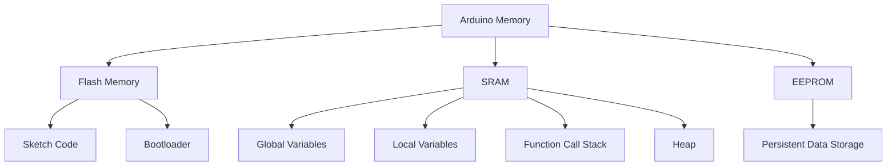

# Arduino Memory Management

Memory management is a crucial aspect of Arduino programming that can make or break your projects. As an embedded system with limited resources, understanding how to efficiently use the available memory will help you build more complex, stable, and responsive applications.

## Introduction to Arduino Memory Types

Arduino boards have three main types of memory, each with different characteristics and purposes:

1. **Flash Memory (Program Memory)** - Where your code is stored
2. **SRAM (Static Random Access Memory)** - Where variables are created and manipulated
3. **EEPROM (Electrically Erasable Programmable Read-Only Memory)** - For long-term data storage

Let's visualize the memory structure:



## Memory Limitations on Common Arduino Boards

Different Arduino boards have different memory capacities. Here's a quick comparison:

| Board | Flash Memory | SRAM | EEPROM |
|-------|--------------|------|--------|
| Arduino Uno | 32 KB | 2 KB | 1 KB |
| Arduino Mega | 256 KB | 8 KB | 4 KB |
| Arduino Nano | 32 KB | 2 KB | 1 KB |
| Arduino Zero | 256 KB | 32 KB | 0* |
| Arduino Due | 512 KB | 96 KB | 0* |

*These boards use flash memory emulation for EEPROM-like functionality.

## Working with SRAM

SRAM is where your variables are stored during program execution and is typically the most constrained resource.

### Understanding How Variables Use SRAM

Different variable types consume different amounts of memory:

| Variable Type | Size (bytes) |
|---------------|--------------|
| boolean | 1 |
| char | 1 |
| byte | 1 |
| int | 2 |
| word | 2 |
| long | 4 |
| float | 4 |
| double | 4 |
| String | 2 + string length |
| array | element size × number of elements |

### Checking Available SRAM

You can check how much SRAM is available during runtime with this code:

```cpp
void setup() {
  Serial.begin(9600);
  Serial.print("Free SRAM: ");
  Serial.println(freeMemory());
}

void loop() {
  // Your code here
}

// Function to calculate free memory
int freeMemory() {
  extern int __heap_start, *__brkval;
  int v;
  return (int) &v - (__brkval == 0 ? (int) &__heap_start : (int) __brkval);
}
```

**Output Example:**
```
Free SRAM: 1672
```

## Common Memory Issues and Solutions

### Problem 1: Running Out of SRAM

When your program uses more SRAM than available, you'll experience unpredictable behavior or crashes.

#### Symptoms:
- Program freezes or resets randomly
- Serial communication stops working
- Random, unexplained errors

#### Solutions:

1. **Use static instead of dynamic memory allocation**

```cpp
// Avoid this:
char* message = new char[100];

// Prefer this:
char message[100];
```

2. **Use the `F()` macro for string literals**

The `F()` macro stores string literals in flash memory instead of SRAM.

```cpp
// Uses SRAM:
Serial.println("This is a long message that takes up valuable SRAM");

// Uses Flash memory:
Serial.println(F("This is a long message stored in Flash memory instead"));
```

3. **Use PROGMEM for constant data**

```cpp
#include <avr/pgmspace.h>

// Store array in flash memory
const int PROGMEM bigArray[] = {1, 2, 3, 4, 5, 6, 7, 8, 9, 10, 11, 12, 13, 14, 15};

void setup() {
  Serial.begin(9600);
  
  // Access data from PROGMEM
  for (int i = 0; i < 15; i++) {
    int value = pgm_read_word_near(bigArray + i);
    Serial.println(value);
  }
}
```

4. **Minimize String usage**

The Arduino `String` class can cause memory fragmentation. Use character arrays instead when possible.

```cpp
// Avoid this if memory is tight:
String message = "Hello";
message += " World";

// Prefer this:
char message[12];
strcpy(message, "Hello");
strcat(message, " World");
```

### Problem 2: Memory Fragmentation

When memory gets divided into small, unusable chunks due to dynamic allocation and deallocation.

#### Solution: Avoid dynamic memory allocation

```cpp
// This can lead to fragmentation:
void loop() {
  String data = getData();  // Creates new String
  processData(data);        // Uses String
  // String goes out of scope, memory is freed but may cause fragmentation
}

// Better approach:
char buffer[64];  // Fixed buffer
void loop() {
  getDataIntoBuffer(buffer, 64);
  processData(buffer);
}
```

## Working with EEPROM

EEPROM is useful for storing data that needs to persist between power cycles.

### Basic EEPROM Read/Write

```cpp
#include <EEPROM.h>

void setup() {
  Serial.begin(9600);
  
  // Write a value to EEPROM address 0
  EEPROM.write(0, 42);
  
  // Read value from EEPROM address 0
  byte value = EEPROM.read(0);
  
  Serial.print("Value read from EEPROM: ");
  Serial.println(value);
}

void loop() {
  // Nothing to do here
}
```

**Output:**
```
Value read from EEPROM: 42
```

### Storing Larger Data Types

To store larger data types like floats or structs, use EEPROM.put() and EEPROM.get():

```cpp
#include <EEPROM.h>

struct Settings {
  float sensorCalibration;
  int threshold;
  bool featureEnabled;
};

void setup() {
  Serial.begin(9600);

  // Create and initialize a settings structure
  Settings mySettings = {
    1.23,     // sensorCalibration
    500,      // threshold
    true      // featureEnabled
  };
  
  // Save settings to EEPROM at address 0
  EEPROM.put(0, mySettings);
  
  // Create a new structure to hold the read data
  Settings loadedSettings;
  
  // Read settings from EEPROM
  EEPROM.get(0, loadedSettings);
  
  // Print the loaded settings
  Serial.print("Sensor calibration: ");
  Serial.println(loadedSettings.sensorCalibration, 2);
  
  Serial.print("Threshold: ");
  Serial.println(loadedSettings.threshold);
  
  Serial.print("Feature enabled: ");
  Serial.println(loadedSettings.featureEnabled ? "Yes" : "No");
}

void loop() {
  // Nothing to do here
}
```

**Output:**
```
Sensor calibration: 1.23
Threshold: 500
Feature enabled: Yes
```

## Real-World Application: Data Logger with Memory Optimization

Here's an example of a temperature data logger that efficiently uses memory:

```cpp
#include <EEPROM.h>

// Use PROGMEM for constant strings
const char PROGMEM tempMessage[] = "Temperature: ";
const char PROGMEM degCelsius[] = " °C";
const char PROGMEM memoryMsg[] = "Free memory: ";
const char PROGMEM bytesMsg[] = " bytes";

// Data structure for temporary readings (in SRAM)
struct TempReading {
  int temperature;
  unsigned long timestamp;
};

// Address where the next reading should be stored
int eepromAddr = 0;
// Maximum number of readings (adjust based on EEPROM size)
const int MAX_READINGS = 10;  // On an Uno this would be ~100, but keeping small for example

void setup() {
  Serial.begin(9600);
  Serial.println(F("Temperature Logger Starting"));
  
  // Initialize EEPROM address - normally you'd check for existing data here
  eepromAddr = 0;
  
  Serial.print(F("Logger can store "));
  Serial.print(MAX_READINGS);
  Serial.println(F(" readings"));
  
  // Print available memory
  Serial.print(readStringFromProgmem(memoryMsg));
  Serial.print(freeMemory());
  Serial.println(readStringFromProgmem(bytesMsg));
}

void loop() {
  // Only log if we haven't reached maximum
  if (eepromAddr < MAX_READINGS * sizeof(TempReading)) {
    // Read temperature (simulated here)
    int temperature = analogRead(A0) / 9.31;  // Convert to approximate Celsius
    
    // Create reading struct
    TempReading reading = {
      temperature,
      millis()
    };
    
    // Store in EEPROM
    EEPROM.put(eepromAddr, reading);
    eepromAddr += sizeof(TempReading);
    
    // Print the reading using memory-efficient methods
    Serial.print(readStringFromProgmem(tempMessage));
    Serial.print(reading.temperature);
    Serial.println(readStringFromProgmem(degCelsius));
  }
  
  delay(5000);  // Wait 5 seconds between readings
  
  // If we've reached the maximum, print all readings and stop
  if (eepromAddr >= MAX_READINGS * sizeof(TempReading)) {
    printAllReadings();
    while(1); // Stop program (in real application, you might reset or take other action)
  }
}

// Print all recorded temperature readings
void printAllReadings() {
  Serial.println(F("All Temperature Readings:"));
  
  for (int addr = 0; addr < MAX_READINGS * sizeof(TempReading); addr += sizeof(TempReading)) {
    TempReading reading;
    EEPROM.get(addr, reading);
    
    Serial.print(F("Time: "));
    Serial.print(reading.timestamp / 1000);
    Serial.print(F("s, Temp: "));
    Serial.print(reading.temperature);
    Serial.println(F("°C"));
  }
}

// Helper function to read strings from PROGMEM
String readStringFromProgmem(const char* progmemStr) {
  return String((__FlashStringHelper*)progmemStr);
}

// Function to check free memory
int freeMemory() {
  extern int __heap_start, *__brkval;
  int v;
  return (int) &v - (__brkval == 0 ? (int) &__heap_start : (int) __brkval);
}
```

## Advanced Techniques

### Using External Memory

For projects requiring more memory, consider using external memory like:

1. **SD cards** - For storing large datasets using the SD library
2. **External EEPROM chips** - Expand non-volatile memory using I2C interface
3. **External SRAM chips** - Add additional runtime memory

Example with external EEPROM:

```cpp
#include <Wire.h>

// Define AT24C256 EEPROM address (typically 0x50)
#define EEPROM_ADDR 0x50

void writeToExternalEEPROM(unsigned int address, byte data) {
  Wire.beginTransmission(EEPROM_ADDR);
  // Send address high byte then low byte
  Wire.write((int)(address >> 8));   // High byte
  Wire.write((int)(address & 0xFF)); // Low byte
  Wire.write(data);
  Wire.endTransmission();
  delay(5);  // Write cycle delay
}

byte readFromExternalEEPROM(unsigned int address) {
  byte data = 0;
  
  Wire.beginTransmission(EEPROM_ADDR);
  // Send address high byte then low byte
  Wire.write((int)(address >> 8));   // High byte
  Wire.write((int)(address & 0xFF)); // Low byte
  Wire.endTransmission();
  
  Wire.requestFrom(EEPROM_ADDR, 1);
  if (Wire.available()) {
    data = Wire.read();
  }
  
  return data;
}

void setup() {
  Wire.begin();
  Serial.begin(9600);
  
  // Write data to external EEPROM
  writeToExternalEEPROM(0, 123);
  
  // Read data back
  byte value = readFromExternalEEPROM(0);
  
  Serial.print(F("Value read from external EEPROM: "));
  Serial.println(value);
}

void loop() {
  // Nothing to do here
}
```

## Memory Optimization Best Practices

1. **Measure first** - Use the `freeMemory()` function to identify issues
2. **Use appropriate data types** - Don't use `int` (2 bytes) when `byte` (1 byte) will do
3. **Avoid dynamic memory allocation** - Pre-allocate fixed-size buffers
4. **Store constants in Flash** - Use `PROGMEM` and `F()` macros
5. **Minimize String objects** - Use character arrays when possible
6. **Buffer only what you need** - Don't store more data than necessary
7. **Reuse variables** - Reuse buffers and variables for different purposes
8. **Consider memory in design phase** - Plan memory usage from the start
9. **Release unused resources** - Close files and connections when done
10. **Prefer static allocation** - Use fixed-size arrays over dynamic ones

## Summary

Effective memory management is essential for creating reliable Arduino projects. By understanding the different types of memory (Flash, SRAM, and EEPROM) and applying the techniques described in this guide, you can optimize your code to prevent memory-related issues and create more complex applications.

Remember that Arduino platforms are resource-constrained environments, and even small optimizations can make a significant difference in program stability and performance.

## Exercises

1. Modify the temperature logger example to store additional sensor data (e.g., humidity) while remaining memory-efficient.
2. Write a program that intentionally causes memory fragmentation, then modify it to prevent the issue.
3. Create a project that uses all three memory types: Flash for constants, SRAM for variables, and EEPROM for persistent data.
4. Compare memory usage between using `String` objects and character arrays for string manipulation.
5. Implement a circular buffer in EEPROM to create a continuous data logger that overwrites the oldest data when memory is full.

## Additional Resources

- [Arduino Memory Reference](https://www.arduino.cc/reference/en/language/variables/utilities/progmem/)
- [AVR Libc Memory Documentation](https://www.nongnu.org/avr-libc/user-manual/group__avr__pgmspace.html)
- [Arduino EEPROM Library Reference](https://www.arduino.cc/en/Reference/EEPROM)
- The book "Making Embedded Systems" by Elecia White provides excellent coverage of memory management for embedded systems